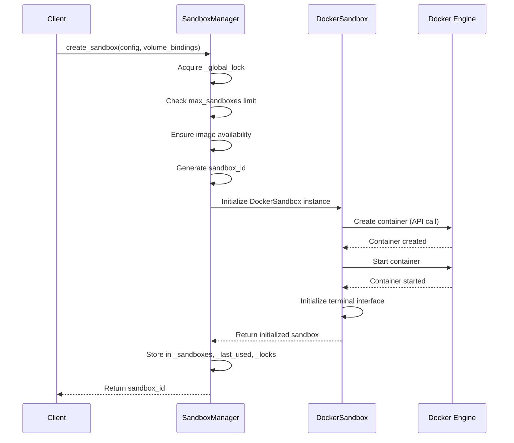
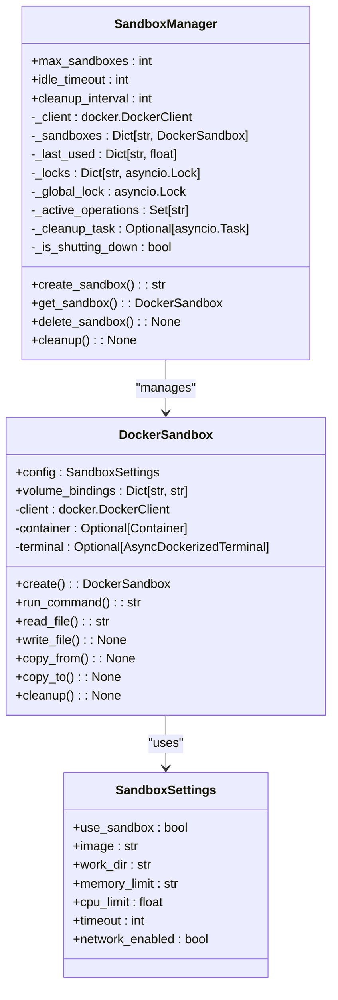
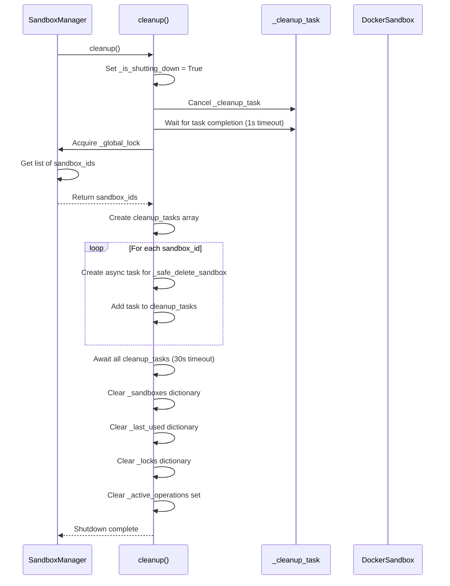
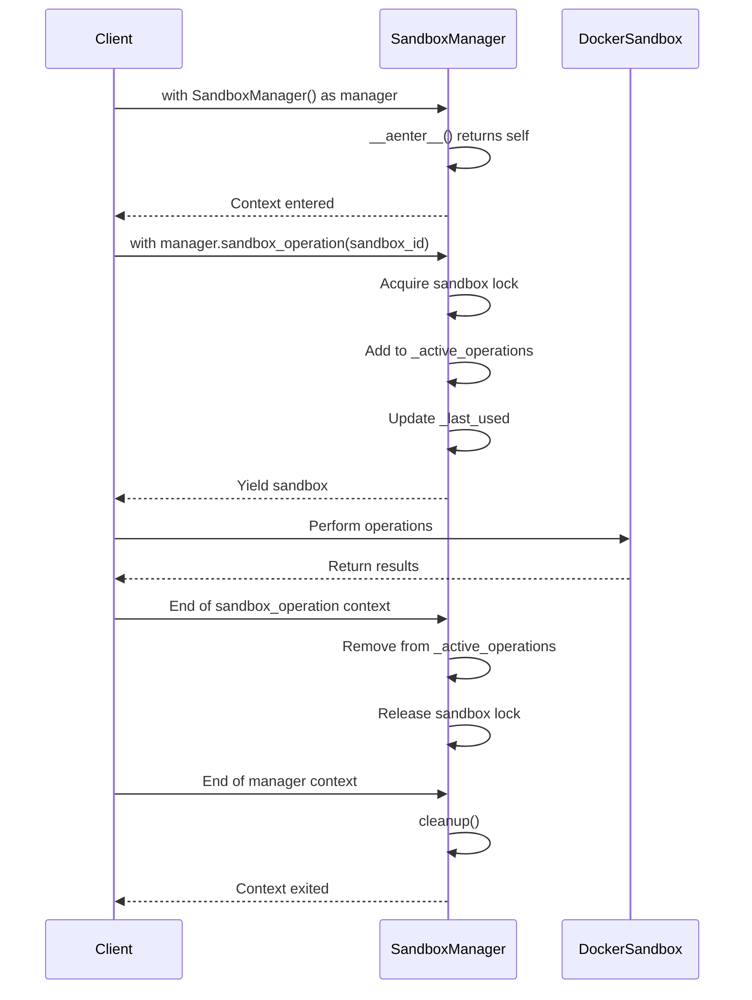

# Lifecycle Management

<cite>
**Referenced Files in This Document**   
- [SandboxManager](file://app/sandbox/core/manager.py)
- [DockerSandbox](file://app/sandbox/core/sandbox.py)
- [SandboxSettings](file://app/config.py)
- [create_sandbox](file://app/daytona/sandbox.py)
- [delete_sandbox](file://app/daytona/sandbox.py)
- [SandboxManus](file://app/agent/sandbox_agent.py)
</cite>

## Table of Contents
1. [Introduction](#introduction)
2. [Sandbox Creation Process](#sandbox-creation-process)
3. [Sandbox Management and Tracking](#sandbox-management-and-tracking)
4. [Sandbox Termination and Cleanup](#sandbox-termination-and-cleanup)
5. [Graceful Shutdown Procedure](#graceful-shutdown-procedure)
6. [Safe Deletion Pattern](#safe-deletion-pattern)
7. [Context Manager Integration](#context-manager-integration)
8. [Configuration and Resource Limits](#configuration-and-resource-limits)
9. [Error Handling and Common Issues](#error-handling-and-common-issues)
10. [Performance and Production Considerations](#performance-and-production-considerations)

## Introduction
The Lifecycle Management system in OpenManus provides a comprehensive framework for managing Docker-based sandbox environments throughout their entire lifecycle. This system enables the creation, monitoring, and cleanup of isolated execution environments that can run code, execute commands, and manage files in a secure and controlled manner. The core of this system is the SandboxManager class, which orchestrates the creation and destruction of DockerSandbox instances, tracks their state, and ensures proper resource cleanup. The lifecycle begins with sandbox creation via the create_sandbox method, progresses through active usage, and concludes with termination through delete_sandbox and final cleanup in _safe_delete_sandbox. This documentation details the complete workflow, including how the _sandboxes dictionary maintains active instances, how volume_bindings and SandboxSettings are applied during initialization, and the various mechanisms in place for graceful shutdown, error handling, and resource management.

**Section sources**
- [SandboxManager](file://app/sandbox/core/manager.py#L13-L312)
- [DockerSandbox](file://app/sandbox/core/sandbox.py#L17-L461)

## Sandbox Creation Process
The sandbox creation process begins with the create_sandbox method of the SandboxManager class, which serves as the primary entry point for creating new sandbox instances. This method first checks whether the maximum number of allowed sandboxes has been reached by comparing the current count in the _sandboxes dictionary against the max_sandboxes configuration limit. If the limit has been reached, a RuntimeError is raised with an appropriate message. When the limit check passes, the method ensures that the required Docker image specified in the SandboxSettings is available by calling the ensure_image method. This method attempts to retrieve the image locally and, if not found, pulls it from the registry asynchronously. Once the image is confirmed to be available, a new UUID is generated as the sandbox identifier, and a DockerSandbox instance is created with the provided configuration and volume bindings. The sandbox is then initialized by calling its create method, which sets up the Docker container with the specified resource limits, network configuration, and working directory. Upon successful creation, references to the sandbox are stored in the _sandboxes dictionary, the last used timestamp is recorded in _last_used, and a dedicated asyncio.Lock is created in _locks to manage concurrent access. The entire creation process is protected by a global lock (_global_lock) to prevent race conditions during concurrent creation requests.



**Diagram sources**
- [SandboxManager](file://app/sandbox/core/manager.py#L113-L156)
- [DockerSandbox](file://app/sandbox/core/sandbox.py#L48-L102)

**Section sources**
- [SandboxManager](file://app/sandbox/core/manager.py#L113-L156)
- [DockerSandbox](file://app/sandbox/core/sandbox.py#L48-L102)

## Sandbox Management and Tracking
The SandboxManager maintains active sandbox instances through several key data structures that track state, usage, and concurrency. The primary storage mechanism is the _sandboxes dictionary, which maps unique sandbox identifiers (UUID strings) to their corresponding DockerSandbox instances. This dictionary serves as the central registry of all active sandboxes and is used for retrieval, management, and cleanup operations. Complementing this is the _last_used dictionary, which records the timestamp of the last operation for each sandbox, enabling the system to identify and clean up idle sandboxes that have exceeded the configured idle_timeout period. To manage concurrent access to individual sandboxes, the system employs a _locks dictionary that maintains an asyncio.Lock for each sandbox ID, preventing race conditions when multiple operations attempt to access the same sandbox simultaneously. Additionally, the _active_operations set tracks sandbox IDs that are currently undergoing operations, which is crucial for the safe deletion process that waits for active operations to complete before removing a sandbox. The manager also maintains a _global_lock for operations that affect the entire manager state, such as creating new sandboxes or performing bulk cleanup. These data structures work together to provide a robust system for tracking sandbox state, enforcing concurrency control, and enabling automated cleanup of idle resources.



**Diagram sources**
- [SandboxManager](file://app/sandbox/core/manager.py#L13-L312)
- [DockerSandbox](file://app/sandbox/core/sandbox.py#L17-L461)
- [SandboxSettings](file://app/config.py#L93-L104)

**Section sources**
- [SandboxManager](file://app/sandbox/core/manager.py#L13-L312)
- [DockerSandbox](file://app/sandbox/core/sandbox.py#L17-L461)

## Sandbox Termination and Cleanup
The sandbox termination process in OpenManus follows a two-step approach that separates the deletion request from the actual cleanup operation to ensure safety and proper resource management. The primary method for terminating a sandbox is delete_sandbox, which serves as the public interface for removal. This method first verifies that the requested sandbox ID exists in the _sandboxes dictionary and then delegates to the _safe_delete_sandbox method for the actual cleanup process. The _safe_delete_sandbox method implements the core safety mechanisms that prevent premature deletion of sandboxes currently in use. It first checks if the sandbox has active operations by looking up its ID in the _active_operations set. If active operations are detected, the method enters a waiting phase where it polls every 500 milliseconds for up to 5 seconds (10 attempts) to see if the operations have completed. During this waiting period, a warning message is logged to indicate that deletion is pending completion of active operations. After the waiting period (whether operations completed or timeout occurred), the method proceeds to clean up the sandbox resources by calling the cleanup method on the DockerSandbox instance. This triggers the Docker container stop and removal process, along with terminal interface cleanup. Finally, the sandbox references are removed from all tracking dictionaries (_sandboxes, _last_used, and _locks) within a global lock to ensure data structure consistency. This two-phase approach ensures that sandboxes are not abruptly terminated during active use, preventing potential data corruption or incomplete operations.

```mermaid
flowchart TD
A[delete_sandbox] --> B{Sandbox exists?}
B --> |No| C[Return immediately]
B --> |Yes| D[_safe_delete_sandbox]
D --> E{Active operations?}
E --> |No| F[Proceed to cleanup]
E --> |Yes| G[Wait for completion]
G --> H{Timeout after 5s?}
H --> |No| I[Operations completed]
H --> |Yes| J[Log timeout warning]
I --> F
J --> F
F --> K[Call sandbox.cleanup()]
K --> L[Remove from _sandboxes]
L --> M[Remove from _last_used]
M --> N[Remove from _locks]
N --> O[Log deletion complete]
```

**Diagram sources**
- [SandboxManager](file://app/sandbox/core/manager.py#L277-L289)
- [SandboxManager](file://app/sandbox/core/manager.py#L243-L275)

**Section sources**
- [SandboxManager](file://app/sandbox/core/manager.py#L277-L289)
- [SandboxManager](file://app/sandbox/core/manager.py#L243-L275)

## Graceful Shutdown Procedure
The graceful shutdown procedure in OpenManus is implemented through the cleanup method of the SandboxManager class, which provides a comprehensive mechanism for terminating all sandbox resources in an orderly fashion. This process is typically invoked when the application is shutting down or when a context manager exits, ensuring that no Docker containers are left orphaned. The procedure begins by setting the _is_shutting_down flag to True, which prevents new operations from starting and signals the background cleanup task to terminate. The method then cancels the automatic cleanup task (_cleanup_task) that periodically checks for idle sandboxes, waiting up to 1 second for the task to complete gracefully. Following this, the method retrieves a snapshot of all active sandbox IDs from the _sandboxes dictionary while holding the _global_lock to prevent modifications during the enumeration. It then creates asynchronous tasks for the _safe_delete_sandbox method for each sandbox, allowing for concurrent cleanup of multiple sandboxes to improve efficiency. These cleanup tasks are awaited with a 30-second timeout to prevent the shutdown process from hanging indefinitely if sandboxes are unresponsive. After the cleanup tasks complete (or timeout), the method clears all remaining references by emptying the _sandboxes, _last_used, _locks, and _active_operations collections, effectively resetting the manager state. This comprehensive approach ensures that all resources are properly released, containers are stopped and removed, and the manager is left in a clean state, ready for potential reuse or final destruction.



**Diagram sources**
- [SandboxManager](file://app/sandbox/core/manager.py#L205-L241)

**Section sources**
- [SandboxManager](file://app/sandbox/core/manager.py#L205-L241)

## Safe Deletion Pattern
The safe deletion pattern in OpenManus is implemented in the _safe_delete_sandbox method and represents a critical safety mechanism that prevents the premature removal of sandboxes currently in use. This pattern addresses the potential race condition where a sandbox might be deleted while operations are still actively executing within it, which could lead to data corruption, incomplete file operations, or other undefined behavior. The pattern begins by checking if the sandbox ID exists in the _active_operations set, which tracks all sandboxes currently undergoing operations through the sandbox_operation context manager. If active operations are detected, the method enters a waiting phase where it polls the _active_operations set every 500 milliseconds for up to 10 iterations (5 seconds total). This polling approach allows the deletion process to proceed as soon as operations complete without requiring complex coordination between the operation and deletion threads. If the operations complete within the timeout period, the method proceeds with the cleanup. If the timeout is reached, a warning is logged, but the cleanup process continues, acknowledging that some operations may be hung or taking longer than expected. After the waiting period, the method retrieves the sandbox reference and calls its cleanup method to stop and remove the Docker container and release associated resources. Finally, the sandbox references are removed from all tracking dictionaries within a global lock to ensure atomicity of the removal operation. This pattern effectively balances safety (waiting for active operations) with reliability (not hanging indefinitely) and data integrity (ensuring proper cleanup).

**Section sources**
- [SandboxManager](file://app/sandbox/core/manager.py#L243-L275)

## Context Manager Integration
The Lifecycle Management system in OpenManus integrates seamlessly with Python's context manager protocol through the implementation of __aenter__ and __aexit__ methods in both the SandboxManager and DockerSandbox classes. This integration enables the use of the with statement for automatic resource management, ensuring that cleanup operations are performed even if exceptions occur during execution. The DockerSandbox class implements __aenter__ to return the result of its create method, effectively setting up the sandbox environment when the context is entered, and __aexit__ to call its cleanup method, ensuring proper resource release when the context is exited. Similarly, the SandboxManager class implements __aenter__ to return itself, allowing the manager to be used as a context manager, and __aexit__ to call its cleanup method, which performs the comprehensive shutdown procedure described earlier. Additionally, the sandbox_operation method is decorated with @asynccontextmanager, providing a context manager for individual sandbox operations that handles concurrency control and usage tracking. When a sandbox operation context is entered, the method acquires the sandbox-specific lock, adds the sandbox ID to the _active_operations set, updates the last used timestamp, and yields the sandbox instance for use. When the context is exited, whether normally or due to an exception, the method removes the sandbox ID from _active_operations, ensuring that the safe deletion process can detect active operations. This context manager integration creates a robust resource management system that automatically handles setup and teardown, prevents resource leaks, and coordinates access to shared resources.



**Diagram sources**
- [SandboxManager](file://app/sandbox/core/manager.py#L291-L293)
- [SandboxManager](file://app/sandbox/core/manager.py#L295-L297)
- [DockerSandbox](file://app/sandbox/core/sandbox.py#L455-L457)
- [DockerSandbox](file://app/sandbox/core/sandbox.py#L459-L461)
- [SandboxManager](file://app/sandbox/core/manager.py#L88-L111)

**Section sources**
- [SandboxManager](file://app/sandbox/core/manager.py#L291-L297)
- [DockerSandbox](file://app/sandbox/core/sandbox.py#L455-L461)
- [SandboxManager](file://app/sandbox/core/manager.py#L88-L111)

## Configuration and Resource Limits
The Lifecycle Management system in OpenManus supports extensive configuration options for resource limits, which are enforced during various lifecycle events to ensure system stability and prevent resource exhaustion. These configuration options are defined in the SandboxSettings class and include parameters for CPU and memory limits, command timeouts, network access, and container image selection. The memory_limit parameter specifies the maximum amount of RAM available to the sandbox container (defaulting to "512m"), while the cpu_limit parameter controls CPU allocation as a fraction of a core (defaulting to 1.0). These resource limits are enforced during sandbox creation when the Docker container is configured with the appropriate host configuration. The timeout parameter (defaulting to 300 seconds) defines the default execution timeout for commands run within the sandbox, preventing infinite loops or hung processes. This timeout is applied in the run_command method of DockerSandbox, which raises a SandboxTimeoutError if execution exceeds the limit. The network_enabled parameter (defaulting to False) controls whether the sandbox has network access, with network_mode set to "none" when disabled and "bridge" when enabled. The image parameter specifies the base Docker image to use (defaulting to "python:3.12-slim"), which is validated during creation through the ensure_image method. These configuration options can be customized in the application's configuration file and are applied during the initialization of each sandbox, ensuring consistent resource enforcement across all lifecycle events. The SandboxManager itself also has configurable parameters including max_sandboxes (maximum concurrent sandboxes), idle_timeout (time before idle sandboxes are cleaned up), and cleanup_interval (frequency of idle cleanup checks).

**Section sources**
- [SandboxSettings](file://app/config.py#L93-L104)
- [SandboxManager](file://app/sandbox/core/manager.py#L28-L62)
- [DockerSandbox](file://app/sandbox/core/sandbox.py#L31-L46)

## Error Handling and Common Issues
The Lifecycle Management system in OpenManus incorporates comprehensive error handling mechanisms to address various failure scenarios that may occur during the sandbox lifecycle. During creation, the create_sandbox method includes a try-except block that catches any exceptions occurring during sandbox initialization. If an exception occurs after the sandbox ID has been generated and potentially added to the _sandboxes dictionary, the method attempts to clean up the partially created sandbox by calling delete_sandbox, preventing resource leaks. This cleanup-on-failure pattern ensures that failed creation attempts do not leave orphaned containers. The system also handles Docker-specific errors such as ImageNotFound when the required image is not available locally and cannot be pulled from the registry, and APIError for general Docker API failures. For command execution within sandboxes, the run_command method raises a SandboxTimeoutError when operations exceed the configured timeout, allowing higher-level code to handle timeouts appropriately. The safe deletion process includes error handling for scenarios where cleanup operations fail, logging errors without propagating them to prevent the deletion process from being blocked by individual failures. Common issues that may arise include orphaned containers when the application crashes before cleanup can occur, which can be mitigated by external monitoring or Docker's built-in cleanup mechanisms. Incomplete cleanup may occur if the Docker daemon is unresponsive, and startup failures can happen due to missing Docker images, insufficient system resources, or network connectivity issues preventing image pulls. The system logs detailed error messages for troubleshooting, including the specific sandbox ID involved, which aids in diagnosing and resolving issues.

**Section sources**
- [SandboxManager](file://app/sandbox/core/manager.py#L113-L156)
- [DockerSandbox](file://app/sandbox/core/sandbox.py#L424-L453)
- [SandboxManager](file://app/sandbox/core/manager.py#L243-L275)
- [SandboxManager](file://app/sandbox/core/manager.py#L64-L85)

## Performance and Production Considerations
When deploying the Lifecycle Management system in production environments, several performance optimization and operational considerations should be addressed to ensure efficient and reliable operation. For batch operations involving the creation or deletion of multiple sandboxes, the system can leverage the concurrent cleanup mechanism used in the manager's cleanup method, applying similar parallelization to creation operations when appropriate. However, care should be taken to avoid overwhelming the Docker daemon with too many simultaneous operations, as this can lead to performance degradation or timeouts. Production deployments should carefully tune the resource limits in SandboxSettings based on the specific workload requirements, balancing performance needs with system stability. The max_sandboxes parameter should be set according to available system resources, and the idle_timeout should be configured based on expected usage patterns to optimize resource utilization. Monitoring the manager's statistics through the get_stats method can provide valuable insights into sandbox usage patterns and help identify potential bottlenecks. For large-scale deployments managing thousands of sandboxes, consideration should be given to implementing a distributed architecture with multiple SandboxManager instances or integrating with container orchestration platforms. Regular maintenance should include monitoring for orphaned containers and implementing automated cleanup scripts as a safety net. Additionally, pre-pulling commonly used Docker images can significantly reduce sandbox creation latency, and using lightweight base images can improve startup performance. The cleanup_interval should be tuned based on the expected frequency of sandbox creation and deletion to balance cleanup responsiveness with system overhead.

**Section sources**
- [SandboxManager](file://app/sandbox/core/manager.py#L299-L312)
- [SandboxManager](file://app/sandbox/core/manager.py#L28-L62)
- [SandboxSettings](file://app/config.py#L93-L104)