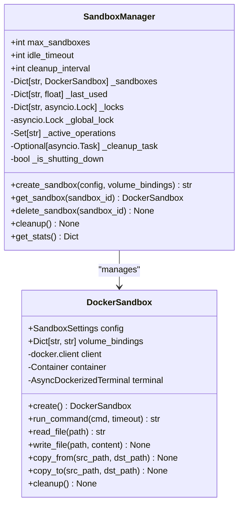
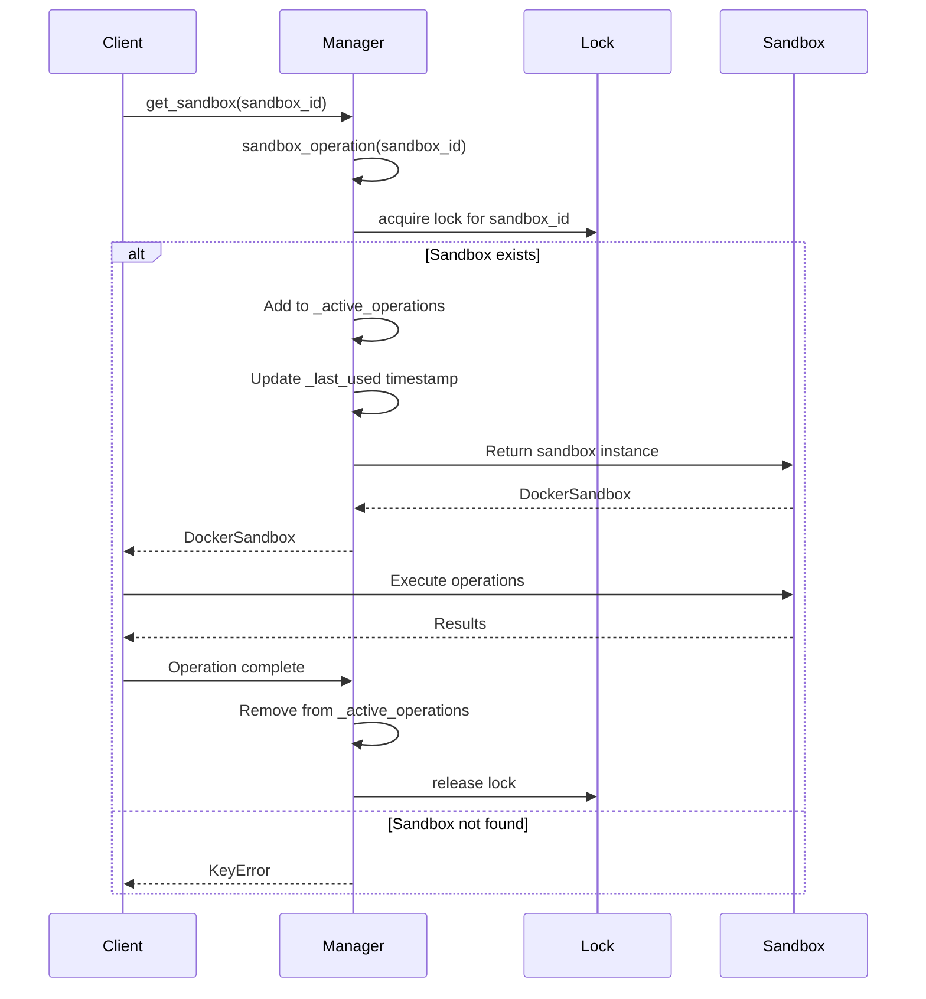
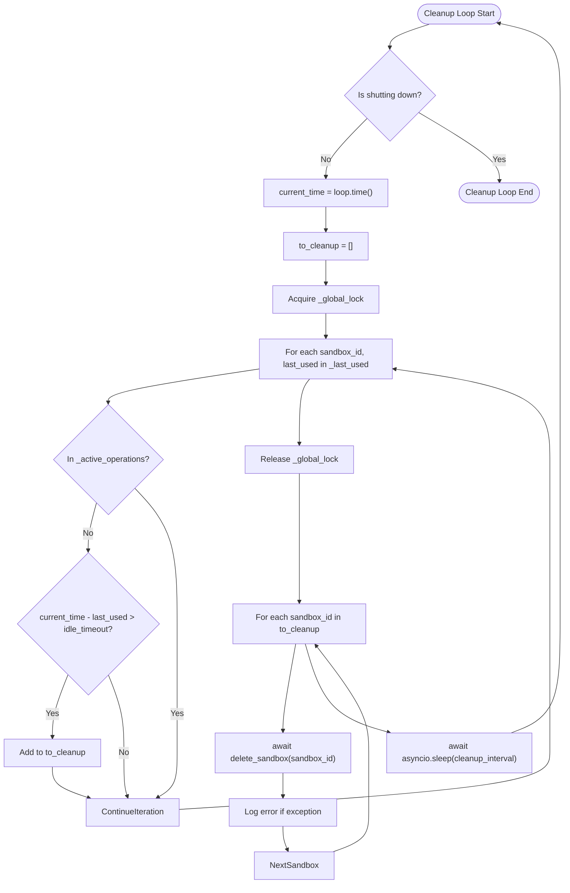
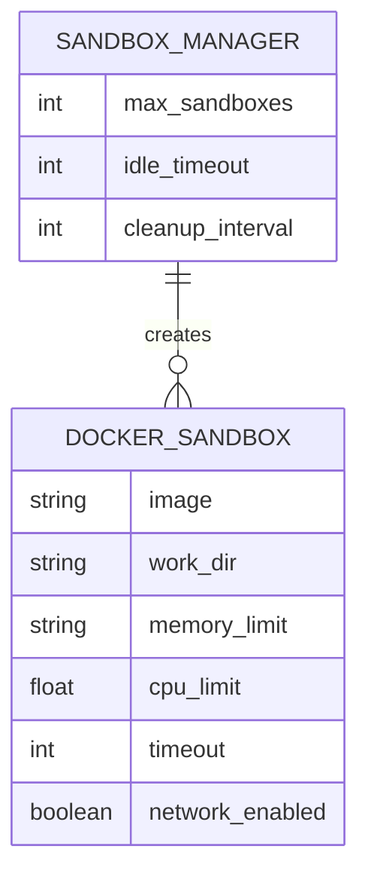

# Resource Management

<cite>
**Referenced Files in This Document**   
- [manager.py](file://app/sandbox/core/manager.py)
- [sandbox.py](file://app/sandbox/core/sandbox.py)
- [config.example.toml](file://config/config.example.toml)
- [test_sandbox_manager.py](file://tests/sandbox/test_sandbox_manager.py)
</cite>

## Table of Contents
1. [Introduction](#introduction)
2. [SandboxManager Architecture](#sandboxmanager-architecture)
3. [Concurrency Control Mechanisms](#concurrency-control-mechanisms)
4. [Automatic Cleanup System](#automatic-cleanup-system)
5. [Resource Limit Enforcement](#resource-limit-enforcement)
6. [Configuration Options](#configuration-options)
7. [Error Handling and Race Condition Prevention](#error-handling-and-race-condition-prevention)
8. [Performance Optimization](#performance-optimization)
9. [Production Deployment Considerations](#production-deployment-considerations)
10. [Conclusion](#conclusion)

## Introduction

The Resource Management system in OpenManus provides a robust framework for managing isolated execution environments through the SandboxManager class. This component handles the lifecycle of multiple sandbox instances, ensuring proper resource allocation, concurrency control, and automatic cleanup. The system is designed to support high-concurrency scenarios while maintaining strict resource boundaries and preventing resource exhaustion. The SandboxManager works in conjunction with DockerSandbox instances to provide secure, containerized execution environments for running untrusted code with configurable resource limits.

**Section sources**
- [manager.py](file://app/sandbox/core/manager.py#L1-L50)
- [sandbox.py](file://app/sandbox/core/sandbox.py#L1-L50)

## SandboxManager Architecture

The SandboxManager class serves as the central coordinator for managing multiple DockerSandbox instances. It maintains several key data structures to track sandbox state and operations. The architecture includes resource mappings for active sandboxes and their last used timestamps, concurrency control mechanisms using asyncio locks, and a cleanup task for automatic resource management.



**Diagram sources**
- [manager.py](file://app/sandbox/core/manager.py#L13-L312)
- [sandbox.py](file://app/sandbox/core/sandbox.py#L13-L462)

**Section sources**
- [manager.py](file://app/sandbox/core/manager.py#L13-L312)
- [sandbox.py](file://app/sandbox/core/sandbox.py#L13-L462)

## Concurrency Control Mechanisms

The SandboxManager implements a sophisticated concurrency control system using asyncio.Lock to prevent race conditions during sandbox operations. Each sandbox instance has its own dedicated lock stored in the _locks dictionary, ensuring that concurrent operations on the same sandbox are properly serialized. The system also employs a global lock (_global_lock) for operations that affect the entire manager state, such as sandbox creation and cleanup.

The sandbox_operation context manager provides a comprehensive solution for managing concurrent access. When a sandbox operation begins, it acquires the sandbox-specific lock and adds the sandbox ID to the _active_operations set. This tracking mechanism allows the system to determine whether a sandbox is currently in use, which is critical for the cleanup process. The context manager also updates the last_used timestamp for the sandbox, which is used by the idle timeout mechanism.



**Diagram sources**
- [manager.py](file://app/sandbox/core/manager.py#L88-L111)
- [manager.py](file://app/sandbox/core/manager.py#L158-L171)

**Section sources**
- [manager.py](file://app/sandbox/core/manager.py#L88-L111)
- [manager.py](file://app/sandbox/core/manager.py#L158-L171)

## Automatic Cleanup System

The automatic cleanup system in SandboxManager monitors idle sandboxes based on their last used time and enforces idle timeout policies. The system starts a background cleanup task during initialization, which runs at regular intervals defined by the cleanup_interval parameter. This task periodically checks all sandboxes and removes those that have been idle for longer than the specified idle_timeout.

The cleanup process uses a two-phase approach to ensure safe removal of idle sandboxes. First, it identifies sandboxes that are not currently in active operations and have exceeded the idle timeout. Then, it attempts to delete each identified sandbox through the delete_sandbox method. The system includes error handling to log any issues that occur during cleanup, ensuring that one failed cleanup operation does not prevent others from proceeding.



**Diagram sources**
- [manager.py](file://app/sandbox/core/manager.py#L173-L184)
- [manager.py](file://app/sandbox/core/manager.py#L186-L203)

**Section sources**
- [manager.py](file://app/sandbox/core/manager.py#L173-L203)
- [test_sandbox_manager.py](file://tests/sandbox/test_sandbox_manager.py#L100-L115)

## Resource Limit Enforcement

The SandboxManager enforces the max_sandboxes limit to prevent resource exhaustion. When creating a new sandbox, the system checks the current count of active sandboxes against the configured maximum. If the limit would be exceeded, the creation request is rejected with a RuntimeError. This enforcement occurs within a critical section protected by the _global_lock to prevent race conditions in high-concurrency scenarios.

The system also implements graceful shutdown procedures to ensure proper cleanup of all resources. When the cleanup method is called, it sets the _is_shutting_down flag to prevent new operations, cancels the background cleanup task, and initiates concurrent cleanup of all active sandboxes. The shutdown process uses a timeout mechanism to prevent indefinite waiting during cleanup, logging an error if the process exceeds the configured timeout.

```mermaid
sequenceDiagram
participant Client
participant Manager
participant GlobalLock
participant CleanupTask
Client->>Manager : create_sandbox()
Manager->>GlobalLock : Acquire _global_lock
Manager->>Manager : Check len(_sandboxes) >= max_sandboxes
alt Exceeds limit
Manager-->>Client : RuntimeError
deactivate GlobalLock
else Within limit
Manager->>Manager : Create new sandbox
Manager->>Manager : Add to _sandboxes and _last_used
Manager->>Manager : Create new lock
Manager-->>Client : sandbox_id
deactivate GlobalLock
end
Client->>Manager : cleanup()
Manager->>Manager : Set _is_shutting_down = True
Manager->>CleanupTask : Cancel _cleanup_task
Manager->>GlobalLock : Acquire _global_lock
Manager->>Manager : Get all sandbox_ids
Manager->>Manager : Create cleanup_tasks list
loop For each sandbox_id
Manager->>Manager : Create _safe_delete_sandbox task
Manager->>Manager : Add task to cleanup_tasks
end
Manager->>Manager : Wait for cleanup_tasks with timeout
alt Timeout
Manager->>Manager : Log "Sandbox cleanup timed out"
end
Manager->>Manager : Clear all resource mappings
Manager-->>Client : Cleanup complete
```

**Diagram sources**
- [manager.py](file://app/sandbox/core/manager.py#L113-L156)
- [manager.py](file://app/sandbox/core/manager.py#L205-L241)

**Section sources**
- [manager.py](file://app/sandbox/core/manager.py#L113-L156)
- [manager.py](file://app/sandbox/core/manager.py#L205-L241)
- [test_sandbox_manager.py](file://tests/sandbox/test_sandbox_manager.py#L52-L88)

## Configuration Options

The SandboxManager provides several configurable parameters to control its behavior. These options can be set during initialization and include max_sandboxes (default: 100), idle_timeout (default: 3600 seconds), and cleanup_interval (default: 300 seconds). These parameters allow administrators to tune the resource management behavior based on their specific requirements and system capabilities.

The configuration is also reflected in the config.example.toml file, which provides commented examples of sandbox settings including image, work directory, memory limit, CPU limit, timeout, and network access. These settings are passed to individual DockerSandbox instances and control the container's resource allocation and behavior.



**Diagram sources**
- [manager.py](file://app/sandbox/core/manager.py#L28-L62)
- [config.example.toml](file://config/config.example.toml#L80-L87)

**Section sources**
- [manager.py](file://app/sandbox/core/manager.py#L28-L62)
- [config.example.toml](file://config/config.example.toml#L80-L87)

## Error Handling and Race Condition Prevention

The SandboxManager implements comprehensive error handling to address common issues such as resource exhaustion, cleanup task failures, and race conditions. The system uses multiple strategies to prevent race conditions, including the use of asyncio locks at both the global and per-sandbox levels. The _active_operations set tracks currently executing operations, allowing the cleanup system to avoid removing sandboxes that are in use.

For cleanup task failures, the system includes try-except blocks around critical sections and logs any exceptions that occur. The _safe_delete_sandbox method includes a waiting mechanism that checks for active operations before attempting deletion, with a timeout to prevent indefinite waiting. If an operation is still active after the maximum wait time, the system logs a warning but proceeds with the deletion attempt.

The system also handles resource exhaustion by enforcing the max_sandboxes limit and providing clear error messages when the limit is reached. During shutdown, the cleanup process uses a timeout to prevent indefinite waiting, ensuring that the application can terminate even if some sandboxes are unresponsive.

**Section sources**
- [manager.py](file://app/sandbox/core/manager.py#L243-L275)
- [manager.py](file://app/sandbox/core/manager.py#L277-L289)
- [manager.py](file://app/sandbox/core/manager.py#L205-L241)

## Performance Optimization

For high-concurrency scenarios, several performance optimization strategies can be applied. The current implementation already uses concurrent cleanup of multiple sandboxes during shutdown, which significantly reduces cleanup time compared to sequential processing. However, additional optimizations could include implementing a connection pool for Docker client operations and adding caching for frequently accessed sandbox metadata.

Production deployment considerations include proper resource budgeting based on the expected workload. Administrators should monitor the actual resource usage of sandboxes and adjust the max_sandboxes limit accordingly to prevent system overload. The idle_timeout and cleanup_interval parameters should be tuned based on the typical usage patterns of the application to balance resource efficiency with user experience.

Additional performance considerations include ensuring that the Docker daemon has sufficient resources and is properly configured for high-concurrency workloads. Network configuration should be optimized, particularly if sandboxes require external connectivity. Monitoring and alerting should be implemented to detect resource exhaustion or performance degradation.

**Section sources**
- [manager.py](file://app/sandbox/core/manager.py#L205-L241)
- [manager.py](file://app/sandbox/core/manager.py#L243-L275)

## Production Deployment Considerations

When deploying the Resource Management system in production, several considerations must be addressed. Resource budgeting is critical, as each sandbox consumes system resources including memory, CPU, and storage. The max_sandboxes limit should be set based on the available system resources and the expected peak load. Monitoring should be implemented to track sandbox creation rates, resource usage, and cleanup efficiency.

The system should be deployed with appropriate logging and monitoring to detect issues such as cleanup task failures or resource exhaustion. Alerting should be configured for critical events like the max_sandboxes limit being reached or cleanup tasks timing out. Regular maintenance should include reviewing and adjusting the configuration parameters based on actual usage patterns and performance metrics.

Security considerations include ensuring that the Docker daemon is properly secured and that sandbox containers are configured with appropriate security settings. The network_enabled parameter should be set to false unless external connectivity is required, reducing the attack surface. Volume bindings should be carefully configured to prevent unauthorized access to host system files.

**Section sources**
- [manager.py](file://app/sandbox/core/manager.py#L205-L241)
- [config.example.toml](file://config/config.example.toml#L80-L87)

## Conclusion

The Resource Management system in OpenManus provides a comprehensive solution for managing isolated execution environments through the SandboxManager class. The system effectively handles the lifecycle of multiple sandbox instances with robust concurrency control, automatic cleanup, and resource limit enforcement. The architecture is designed to support high-concurrency scenarios while maintaining system stability and preventing resource exhaustion.

Key strengths of the system include its comprehensive error handling, race condition prevention, and graceful shutdown procedures. The configurable parameters allow administrators to tune the behavior to their specific requirements. For production deployment, careful resource budgeting and monitoring are essential to ensure optimal performance and reliability.

The system could be further enhanced with additional monitoring metrics, more sophisticated load balancing across sandboxes, and improved error recovery mechanisms. However, the current implementation provides a solid foundation for secure and efficient resource management in containerized environments.