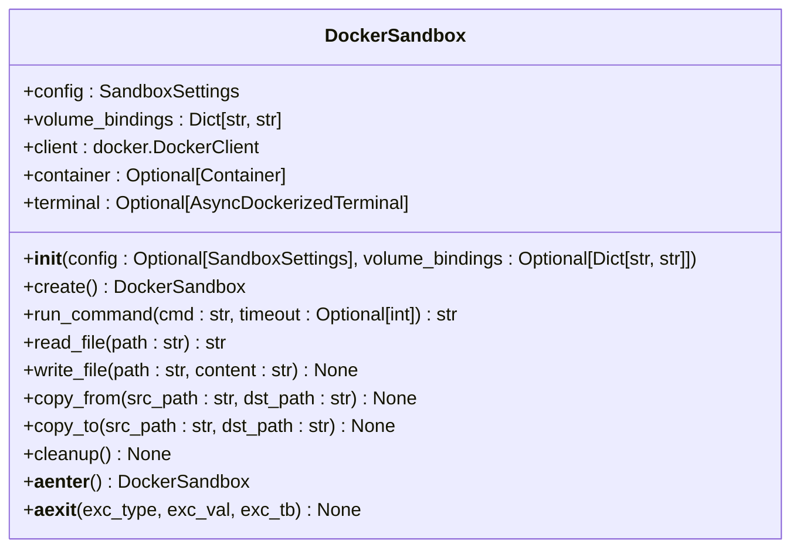
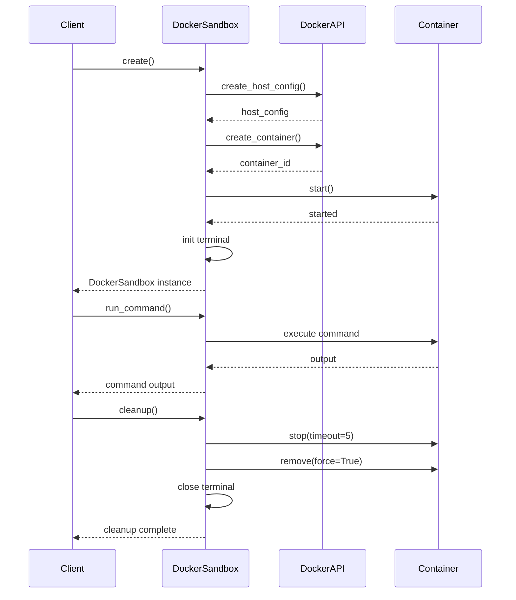
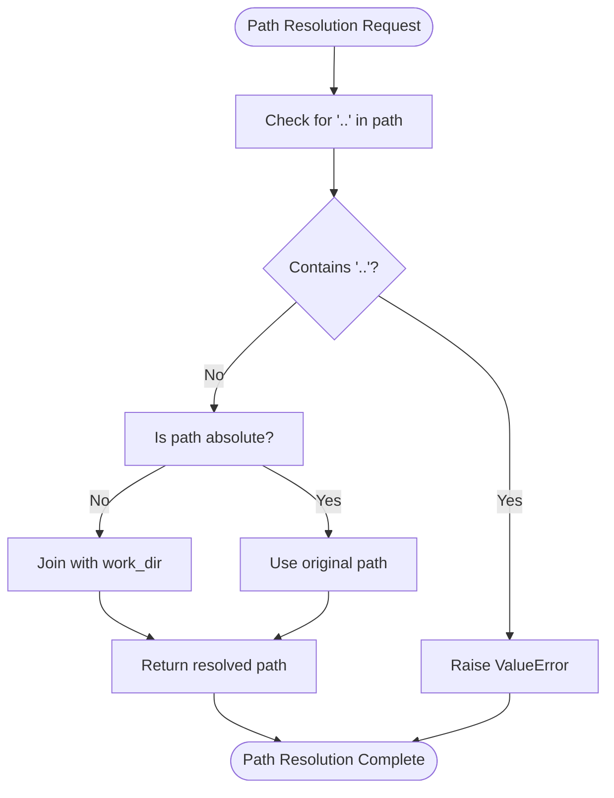
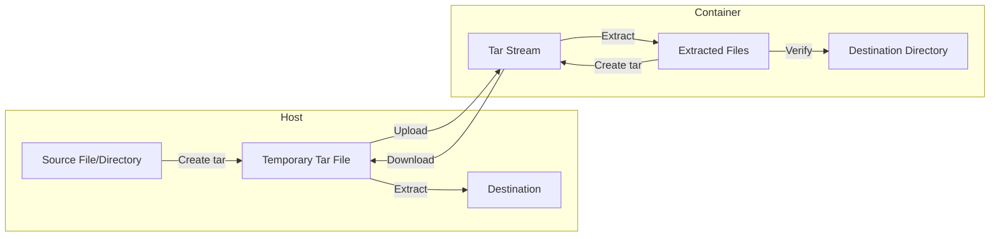
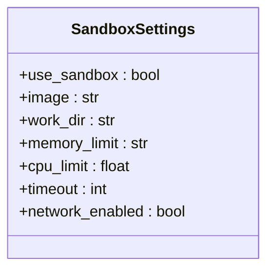
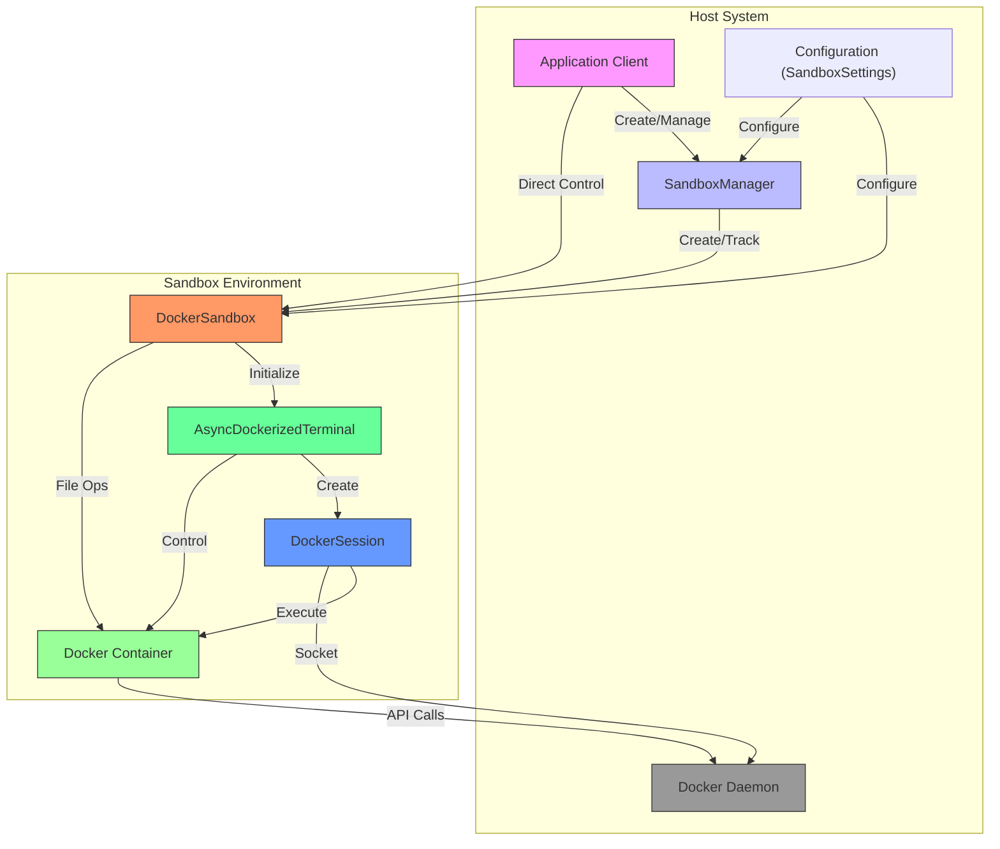

# Core Sandbox Implementation

<cite>
**Referenced Files in This Document**   
- [app/sandbox/core/sandbox.py](file://app/sandbox/core/sandbox.py)
- [app/sandbox/core/manager.py](file://app/sandbox/core/manager.py)
- [app/sandbox/core/terminal.py](file://app/sandbox/core/terminal.py)
- [app/config.py](file://app/config.py)
- [app/sandbox/core/exceptions.py](file://app/sandbox/core/exceptions.py)
</cite>

## Table of Contents
1. [Introduction](#introduction)
2. [DockerSandbox Class Overview](#dockersandbox-class-overview)
3. [Container Lifecycle Management](#container-lifecycle-management)
4. [Secure Path Resolution](#secure-path-resolution)
5. [Tar-based File Transfer System](#tar-based-file-transfer-system)
6. [Configuration Options](#configuration-options)
7. [Practical Usage Examples](#practical-usage-examples)
8. [Common Issues and Troubleshooting](#common-issues-and-troubleshooting)
9. [Performance Optimization](#performance-optimization)
10. [Security Best Practices](#security-best-practices)
11. [Architecture Diagram](#architecture-diagram)

## Introduction
The OpenManus sandbox implementation provides a secure, isolated execution environment using Docker containers. This system enables safe code execution, file operations, and command execution within controlled resource limits. The core component, DockerSandbox, manages the complete container lifecycle from creation to cleanup, ensuring robust isolation and security for executing untrusted code. The implementation includes sophisticated file transfer mechanisms, secure path resolution to prevent directory traversal attacks, and comprehensive configuration options for tailoring sandbox behavior to specific requirements.

## DockerSandbox Class Overview
The DockerSandbox class serves as the primary interface for managing isolated execution environments in OpenManus. This class encapsulates the complete functionality for creating, configuring, and interacting with Docker containers as secure sandboxes. The implementation provides a comprehensive API for container lifecycle management, file operations, and command execution while maintaining strict security controls.

The class is initialized with optional SandboxSettings and volume bindings, allowing for flexible configuration of the sandbox environment. Key attributes include the configuration object, volume bindings dictionary, Docker client instance, container reference, and terminal interface. The design follows an async-first approach, enabling non-blocking operations for improved performance in concurrent scenarios.



**Diagram sources**
- [app/sandbox/core/sandbox.py](file://app/sandbox/core/sandbox.py#L17-L46)

**Section sources**
- [app/sandbox/core/sandbox.py](file://app/sandbox/core/sandbox.py#L17-L46)

## Container Lifecycle Management
The DockerSandbox class implements a comprehensive container lifecycle management system that handles creation, startup, command execution, and cleanup operations. The lifecycle begins with the `create()` method, which orchestrates container creation and initialization. This method prepares the host configuration with specified resource limits, generates a unique container name, creates the container with appropriate settings, starts the container, and initializes the terminal interface.

Container creation involves several critical steps. First, the host configuration is prepared with memory limits, CPU quotas, network settings, and volume bindings. The container is created with a tail command to keep it running, configured with the specified working directory, and started in detached mode. After successful container startup, the AsyncDockerizedTerminal is initialized to provide an interactive shell interface for command execution.

The cleanup process is equally comprehensive, ensuring proper resource deallocation. The `cleanup()` method gracefully stops the container with a timeout, removes it forcefully if necessary, and closes the terminal session. Error handling is implemented throughout the cleanup process to ensure that partial failures don't leave resources in an inconsistent state. The implementation also includes context manager support through `__aenter__` and `__aexit__` methods, enabling proper resource management through async with statements.



**Diagram sources**
- [app/sandbox/core/sandbox.py](file://app/sandbox/core/sandbox.py#L48-L102)
- [app/sandbox/core/sandbox.py](file://app/sandbox/core/sandbox.py#L424-L453)

**Section sources**
- [app/sandbox/core/sandbox.py](file://app/sandbox/core/sandbox.py#L48-L102)
- [app/sandbox/core/sandbox.py](file://app/sandbox/core/sandbox.py#L424-L453)

## Secure Path Resolution
The sandbox implementation includes a robust secure path resolution mechanism designed to prevent directory traversal attacks during file operations. The `_safe_resolve_path()` method is central to this security feature, validating and normalizing file paths before any file system operations are performed.

The method implements multiple layers of protection against path traversal vulnerabilities. First, it explicitly checks for the presence of ".." in the path components, rejecting any path that contains this pattern which could be used to escape the sandbox directory. Then, it resolves relative paths by joining them with the configured working directory, while preserving absolute paths. This ensures that all file operations are constrained within the designated workspace unless explicitly allowed through absolute paths.

The implementation also includes additional security measures in related file operations. When writing files, the system automatically creates parent directories as needed, but only within the resolved path space. The path validation occurs before any file system interaction, preventing malicious paths from reaching the underlying Docker API. This defense-in-depth approach ensures that even if an attacker attempts to exploit path traversal vulnerabilities, the sandbox will reject the operation before any damage can occur.



**Diagram sources**
- [app/sandbox/core/sandbox.py](file://app/sandbox/core/sandbox.py#L231-L252)

**Section sources**
- [app/sandbox/core/sandbox.py](file://app/sandbox/core/sandbox.py#L231-L252)

## Tar-based File Transfer System
The sandbox implements a sophisticated tar-based file transfer system for securely copying files between the host and container environments. This system ensures proper ownership, permissions, and integrity during file operations while working within Docker's API constraints.

For copying files from the container to the host (`copy_from`), the system uses Docker's `get_archive` API to retrieve a tar stream of the requested file or directory. The implementation creates a temporary directory, writes the tar stream to a temporary file, and then extracts the contents to the destination. Special handling is provided for different destination types: when copying to a directory, the relative path structure is preserved, while copying to a file extracts only the content of the source file.

The reverse operation (`copy_to`) follows a similar pattern but in reverse. The system first verifies the source file exists on the host, creates the destination directory in the container if needed, and then packages the file(s) into a tar archive. For directory sources, the entire directory structure is preserved in the tar archive with appropriate relative paths. The tar data is then uploaded to the container using Docker's `put_archive` API, and a verification step ensures the file was created successfully.

Both operations include comprehensive error handling and validation. The system checks for file existence, handles empty archives, and validates the number of members in the archive to prevent unexpected behavior. Temporary resources are properly cleaned up using context managers, preventing resource leaks even in error conditions.



**Diagram sources**
- [app/sandbox/core/sandbox.py](file://app/sandbox/core/sandbox.py#L254-L374)

**Section sources**
- [app/sandbox/core/sandbox.py](file://app/sandbox/core/sandbox.py#L254-L374)

## Configuration Options
The sandbox system provides extensive configuration options through the SandboxSettings class, allowing fine-grained control over the execution environment. These configuration parameters can be customized to meet specific security, performance, and functional requirements.

Key configuration options include:
- **Base Image Selection**: The `image` parameter specifies the Docker image to use as the base for the sandbox container. The default is "python:3.12-slim", providing a lightweight Python environment.
- **Resource Limits**: CPU and memory limits can be configured using `cpu_limit` (as a float representing CPU cores) and `memory_limit` (as a string like "512m" for 512MB).
- **Network Settings**: The `network_enabled` boolean controls whether the container has network access. When disabled, the container runs in isolated mode with no network connectivity.
- **Working Directory**: The `work_dir` parameter sets the container's working directory, defaulting to "/workspace".
- **Command Timeout**: The `timeout` parameter defines the default execution timeout for commands in seconds.

These configuration options are implemented as Pydantic model fields with appropriate validation and defaults. The settings can be loaded from configuration files or programmatically set, providing flexibility for different deployment scenarios. The SandboxManager class also provides additional configuration for managing multiple sandboxes, including maximum sandbox count, idle timeout, and cleanup interval.



**Diagram sources**
- [app/config.py](file://app/config.py#L145-L157)

**Section sources**
- [app/config.py](file://app/config.py#L145-L157)

## Practical Usage Examples
The sandbox implementation provides several practical examples demonstrating common usage patterns. These examples illustrate how to initialize the sandbox, execute Python scripts with timeout handling, and retrieve output files.

For sandbox initialization, the typical pattern involves creating a DockerSandbox instance with desired configuration and calling the `create()` method:

```python
config = SandboxSettings(image="python:3.12-slim", memory_limit="1g", cpu_limit=2.0)
sandbox = DockerSandbox(config)
await sandbox.create()
```

Executing Python scripts with timeout handling leverages the `run_command()` method with a specified timeout parameter:

```python
python_code = '''
import time
print("Starting long operation...")
time.sleep(2)
print("Operation completed!")
'''

await sandbox.write_file("/workspace/script.py", python_code)
try:
    result = await sandbox.run_command("python3 /workspace/script.py", timeout=5)
    print(f"Script output: {result}")
except SandboxTimeoutError:
    print("Script execution timed out")
```

Retrieving output files involves using the `copy_from()` method to transfer files from the container to the host:

```python
# Execute analysis that generates output
await sandbox.run_command("python3 /workspace/analysis.py")

# Copy results to host
await sandbox.copy_from("/workspace/results.csv", "/local/results.csv")
await sandbox.copy_from("/workspace/plots/", "/local/plots/")
```

The system also supports context manager usage for automatic resource cleanup:

```python
async with DockerSandbox(config) as sandbox:
    await sandbox.write_file("/workspace/data.txt", "sample data")
    result = await sandbox.run_command("cat /workspace/data.txt")
    print(result)
# Sandbox automatically cleaned up
```

**Section sources**
- [app/sandbox/core/sandbox.py](file://app/sandbox/core/sandbox.py#L139-L163)
- [app/sandbox/core/sandbox.py](file://app/sandbox/core/sandbox.py#L165-L195)
- [app/sandbox/core/sandbox.py](file://app/sandbox/core/sandbox.py#L254-L374)

## Common Issues and Troubleshooting
The sandbox implementation addresses several common issues that may arise during operation, with specific error handling and troubleshooting guidance.

**Image Pull Failures**: When the specified Docker image is not available locally, the system attempts to pull it automatically. If the pull fails due to network issues or invalid image names, a RuntimeError is raised with descriptive information. To resolve this issue, verify the image name and tag, ensure Docker daemon is running, and check network connectivity. Pre-pulling required images can prevent this issue in production environments.

**Container Startup Timeouts**: While the current implementation doesn't explicitly handle container startup timeouts, the `create()` method includes comprehensive error handling that will raise a RuntimeError if container creation or startup fails. Monitoring Docker daemon performance and ensuring adequate system resources can help prevent startup issues. The 5-second timeout during container stop operations provides some protection against hanging containers.

**Permission Denied Errors**: These typically occur when attempting to access files or directories without proper permissions. The sandbox runs with root privileges by default, but file operations respect the container's file system permissions. When copying files, ensure the destination directories exist and have appropriate write permissions. Using the `write_file()` method automatically creates parent directories, reducing the likelihood of permission issues.

Other common issues include:
- **Resource Exhaustion**: Monitor memory and CPU usage, and adjust limits in SandboxSettings as needed.
- **Network Access Denied**: Ensure `network_enabled` is set to True when internet access is required.
- **File Not Found**: Verify file paths and use the secure path resolution system to prevent traversal issues.
- **Command Execution Failures**: Check command syntax and ensure required packages are available in the base image.

**Section sources**
- [app/sandbox/core/sandbox.py](file://app/sandbox/core/sandbox.py#L48-L102)
- [app/sandbox/core/exceptions.py](file://app/sandbox/core/exceptions.py#L7-L12)
- [app/sandbox/core/manager.py](file://app/sandbox/core/manager.py#L96-L134)

## Performance Optimization
Several performance optimization strategies can be applied to improve the efficiency of the sandbox implementation, particularly for scenarios requiring rapid container initialization.

**Image Optimization**: Using lightweight base images like "python:3.12-slim" reduces download and startup times. Pre-pulling images before they are needed eliminates network latency during sandbox creation. Creating custom base images with frequently used packages pre-installed can dramatically reduce initialization time for specific workloads.

**Resource Configuration**: Properly sizing CPU and memory limits prevents resource contention while avoiding over-allocation. Setting appropriate values based on workload requirements ensures optimal performance without wasting resources. For CPU-intensive tasks, allocating sufficient CPU quota prevents throttling.

**Connection Reuse**: The implementation uses asyncio and thread pooling for Docker API calls, but further optimization could involve maintaining persistent connections to the Docker daemon. Reducing the overhead of establishing new connections for each operation can improve performance in high-throughput scenarios.

**Caching Strategies**: Implementing a pool of pre-created sandboxes that can be quickly allocated to requests reduces initialization latency. The SandboxManager already provides some pooling functionality with its automatic cleanup of idle sandboxes, but tuning the idle timeout and maximum pool size can optimize performance for specific usage patterns.

**File Transfer Optimization**: For large file transfers, consider compressing data before transfer or using more efficient serialization formats. Batch multiple file operations when possible to reduce the overhead of creating and processing tar archives.

**Section sources**
- [app/sandbox/core/sandbox.py](file://app/sandbox/core/sandbox.py#L48-L102)
- [app/sandbox/core/manager.py](file://app/sandbox/core/manager.py#L0-L46)

## Security Best Practices
Deploying the sandbox system in production environments requires adherence to several security best practices to maintain the integrity of the isolation model.

**Read-only Filesystems**: Configure containers with read-only filesystems where possible, allowing writes only to specific temporary directories. This prevents malicious code from modifying system files or installing persistent malware. The current implementation could be enhanced to support read-only mounts for system directories while allowing writes to the workspace.

**Non-root Execution**: While the current implementation runs containers as root for maximum flexibility, production deployments should consider running as non-root users. This can be achieved by creating a dedicated user in the base image and configuring the container to run as that user, limiting the potential damage from privilege escalation attacks.

**Network Isolation**: Disable network access (`network_enabled=False`) unless absolutely necessary. When network access is required, consider using Docker's network policies to restrict connections to specific endpoints or implementing a proxy for monitoring and filtering traffic.

**Resource Limits**: Always set appropriate CPU and memory limits to prevent denial-of-service attacks through resource exhaustion. The current implementation provides these controls through the SandboxSettings configuration.

**Input Validation**: Implement strict validation of all inputs, including file paths, command strings, and configuration parameters. The existing path resolution system provides good protection against directory traversal, but additional validation of command content could prevent shell injection attacks.

**Regular Updates**: Keep the base images and Docker daemon updated with the latest security patches. Regularly rebuild custom images to incorporate security updates for installed packages.

**Monitoring and Logging**: Enable comprehensive logging of sandbox operations and monitor for suspicious activity. The current implementation includes basic logging through the logger module, but could be enhanced with more detailed audit trails.

**Section sources**
- [app/sandbox/core/sandbox.py](file://app/sandbox/core/sandbox.py#L48-L102)
- [app/sandbox/core/terminal.py](file://app/sandbox/core/terminal.py#L301-L313)
- [app/config.py](file://app/config.py#L145-L157)

## Architecture Diagram
The following diagram illustrates the overall architecture of the sandbox system, showing the relationships between key components and their interactions.



**Diagram sources**
- [app/sandbox/core/sandbox.py](file://app/sandbox/core/sandbox.py)
- [app/sandbox/core/manager.py](file://app/sandbox/core/manager.py)
- [app/sandbox/core/terminal.py](file://app/sandbox/core/terminal.py)

**Section sources**
- [app/sandbox/core/sandbox.py](file://app/sandbox/core/sandbox.py)
- [app/sandbox/core/manager.py](file://app/sandbox/core/manager.py)
- [app/sandbox/core/terminal.py](file://app/sandbox/core/terminal.py)