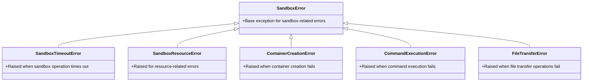
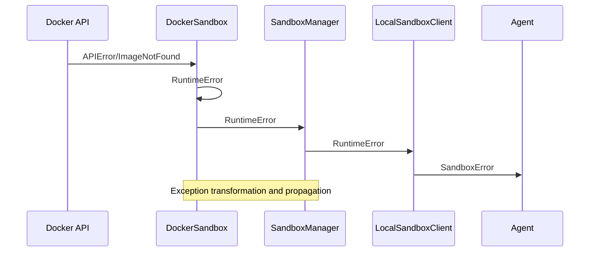
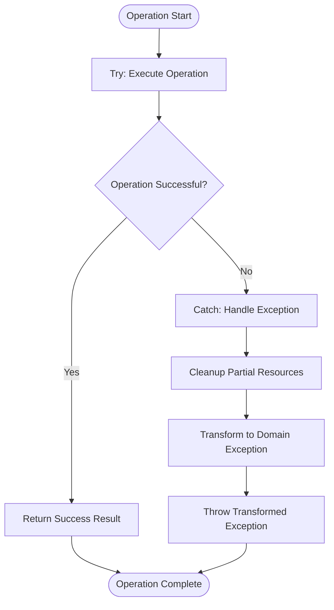
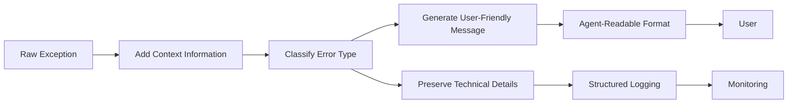

# Exception Handling

<cite>
**Referenced Files in This Document**   
- [app/sandbox/core/exceptions.py](file://app/sandbox/core/exceptions.py)
- [app/sandbox/core/sandbox.py](file://app/sandbox/core/sandbox.py)
- [app/sandbox/core/manager.py](file://app/sandbox/core/manager.py)
- [app/sandbox/client.py](file://app/sandbox/client.py)
- [app/sandbox/core/terminal.py](file://app/sandbox/core/terminal.py)
- [app/config.py](file://app/config.py)
- [tests/sandbox/test_sandbox.py](file://tests/sandbox/test_sandbox.py)
- [tests/sandbox/test_client.py](file://tests/sandbox/test_client.py)
</cite>

## Table of Contents
1. [Introduction](#introduction)
2. [Exception Hierarchy](#exception-hierarchy)
3. [Core Exception Types](#core-exception-types)
4. [Error Context Information](#error-context-information)
5. [Error Propagation Patterns](#error-propagation-patterns)
6. [Try-Catch Patterns and Error Recovery](#try-catch-patterns-and-error-recovery)
7. [Exception Transformation and User-Friendly Reporting](#exception-transformation-and-user-friendly-reporting)
8. [Common Error Scenarios](#common-error-scenarios)
9. [Troubleshooting Sandbox Failures](#troubleshooting-sandbox-failures)
10. [Conclusion](#conclusion)

## Introduction
The sandbox exception handling system provides a structured approach to managing errors in containerized execution environments. This document details the custom exception hierarchy, error propagation mechanisms, and recovery strategies implemented across the sandbox system. The architecture ensures robust error handling from low-level Docker API interactions to high-level agent operations, with comprehensive context preservation for debugging and user-friendly error reporting.

**Section sources**
- [app/sandbox/core/exceptions.py](file://app/sandbox/core/exceptions.py#L1-L18)

## Exception Hierarchy

**Diagram sources**
- [app/sandbox/core/exceptions.py](file://app/sandbox/core/exceptions.py#L7-L16)

**Section sources**
- [app/sandbox/core/exceptions.py](file://app/sandbox/core/exceptions.py#L7-L16)

## Core Exception Types

The sandbox system implements a comprehensive set of custom exception types to handle various error conditions in a structured manner. The base `SandboxError` class serves as the foundation for all sandbox-related exceptions, enabling consistent error handling across the system.

`SandboxTimeoutError` is raised when operations exceed their configured timeout limits, particularly during command execution or container initialization. This exception inherits from `SandboxError` and provides specific handling for time-sensitive operations.

`SandboxResourceError` handles resource-related issues such as memory limits, CPU constraints, or storage capacity problems. This exception is typically raised when the system detects resource exhaustion or when attempting to exceed configured resource limits.

Additional exception types including `ContainerCreationError`, `CommandExecutionError`, and `FileTransferError` provide granular error classification for specific operational failures. These exceptions enable precise error handling and recovery strategies based on the nature of the failure.

**Section sources**
- [app/sandbox/core/exceptions.py](file://app/sandbox/core/exceptions.py#L7-L16)
- [app/sandbox/core/sandbox.py](file://app/sandbox/core/sandbox.py#L48-L102)
- [app/sandbox/core/manager.py](file://app/sandbox/core/manager.py#L113-L134)

## Error Context Information

The exception system captures comprehensive context information to facilitate debugging and error analysis. Each exception includes relevant metadata about the failed operation, environment state, and contributing factors.

For container creation failures, the system captures information including the target Docker image, configured resource limits (memory, CPU), network settings, and volume bindings. This context helps identify whether failures are due to image availability, resource constraints, or configuration issues.

Command execution errors include details about the executed command, timeout settings, working directory, and environment variables. The system also preserves information about the container's state at the time of failure, including process status and resource utilization.

File transfer operations capture source and destination paths, file sizes, and permission settings. The system also records information about the host and container filesystem states, which is crucial for diagnosing path resolution issues or permission conflicts.

Resource-related exceptions include metrics on available and requested resources, helping to distinguish between configuration issues and actual resource exhaustion.

**Section sources**
- [app/sandbox/core/sandbox.py](file://app/sandbox/core/sandbox.py#L31-L46)
- [app/config.py](file://app/config.py#L215-L230)
- [app/sandbox/core/manager.py](file://app/sandbox/core/manager.py#L28-L62)

## Error Propagation Patterns

The sandbox system implements a well-defined error propagation pattern from low-level Docker API calls to high-level agent operations. This layered approach ensures that errors are appropriately handled and transformed at each level of the stack.

At the lowest level, Docker API exceptions such as `APIError` and `ImageNotFound` are caught and transformed into domain-specific exceptions like `ContainerCreationError`. This transformation occurs in the `DockerSandbox` class during container creation and initialization.

**Diagram sources**
- [app/sandbox/core/sandbox.py](file://app/sandbox/core/sandbox.py#L48-L102)
- [app/sandbox/core/manager.py](file://app/sandbox/core/manager.py#L113-L134)
- [app/sandbox/client.py](file://app/sandbox/client.py#L90-L188)

**Section sources**
- [app/sandbox/core/sandbox.py](file://app/sandbox/core/sandbox.py#L48-L102)
- [app/sandbox/core/manager.py](file://app/sandbox/core/manager.py#L113-L134)
- [app/sandbox/client.py](file://app/sandbox/client.py#L90-L188)

The `SandboxManager` class handles errors related to sandbox lifecycle management, including resource limits and concurrency issues. When the maximum number of sandboxes is reached, a `RuntimeError` is raised with descriptive information about the limit.

The `LocalSandboxClient` acts as a facade, propagating exceptions from the underlying sandbox implementation while maintaining a consistent interface for higher-level components. This client ensures that all exceptions are derived from the `SandboxError` hierarchy.

## Try-Catch Patterns and Error Recovery

The system employs strategic try-catch patterns to enable graceful error recovery and maintain system stability. These patterns are designed to handle both expected and unexpected failures while preserving system resources.

In the `DockerSandbox.create()` method, a comprehensive try-catch block ensures that if container creation fails, any partially created resources are properly cleaned up. This pattern prevents resource leaks and ensures that failed sandbox instances do not consume system resources.

**Diagram sources**
- [app/sandbox/core/sandbox.py](file://app/sandbox/core/sandbox.py#L48-L102)
- [app/sandbox/core/manager.py](file://app/sandbox/core/manager.py#L113-L134)

**Section sources**
- [app/sandbox/core/sandbox.py](file://app/sandbox/core/sandbox.py#L48-L102)
- [app/sandbox/core/manager.py](file://app/sandbox/core/manager.py#L113-L134)
- [tests/sandbox/test_sandbox.py](file://tests/sandbox/test_sandbox.py#L135-L152)

The `SandboxManager.create_sandbox()` method implements a similar pattern, with additional logic to remove the sandbox from internal tracking if creation fails. This ensures that the manager's state remains consistent even when operations fail.

For command execution, the system uses timeout handling to prevent hanging operations. The `run_command()` method catches `TimeoutError` and transforms it into a `SandboxTimeoutError`, providing a consistent interface for timeout conditions.

## Exception Transformation and User-Friendly Reporting

The system implements a sophisticated exception transformation mechanism that converts technical exceptions into user-friendly messages while preserving detailed information for debugging purposes.

When exceptions propagate to the agent level, they are transformed into structured error responses that include both user-facing messages and technical details. This dual approach ensures that end users receive understandable error information while developers have access to comprehensive diagnostic data.

The transformation process adds contextual information such as operation type, affected resources, and suggested remediation steps. For example, a `ContainerCreationError` might be transformed into a user message like "Failed to start execution environment" with technical details including the specific Docker image, error code, and timestamp.

Logging integration ensures that all exceptions are recorded with appropriate severity levels and contextual metadata. The system uses structured logging to capture exception type, message, stack trace, and custom context fields, enabling effective monitoring and analysis.

**Diagram sources**
- [app/sandbox/core/exceptions.py](file://app/sandbox/core/exceptions.py#L7-L16)
- [app/sandbox/core/sandbox.py](file://app/sandbox/core/sandbox.py#L139-L163)
- [app/logger.py](file://app/logger.py)

**Section sources**
- [app/sandbox/core/exceptions.py](file://app/sandbox/core/exceptions.py#L7-L16)
- [app/sandbox/core/sandbox.py](file://app/sandbox/core/sandbox.py#L139-L163)
- [app/logger.py](file://app/logger.py)

## Common Error Scenarios

The sandbox system handles several common error scenarios with specific recovery strategies and user guidance.

**Insufficient Disk Space**: When file operations fail due to disk space limitations, the system raises a `SandboxResourceError` with details about available and required space. The recovery strategy includes automatic cleanup of temporary files and suggestions to remove unnecessary files from the workspace.

**Network Isolation Violations**: For sandboxes with network access disabled, attempts to make network connections result in `CommandExecutionError`. The system provides clear guidance about the network configuration and suggests enabling network access if required for the operation.

**Image Compatibility Issues**: When a requested Docker image is not available or incompatible, the system first attempts to pull the image automatically. If this fails, a `ContainerCreationError` is raised with information about the image name, registry connectivity, and potential alternatives.

**Resource Limit Exceeded**: Operations that exceed configured memory or CPU limits trigger `SandboxResourceError`. The system provides details about the configured limits and current usage, helping users optimize their code or request higher limits.

**File Permission Issues**: Attempts to access files without proper permissions result in `FileTransferError`. The system validates paths for traversal attempts and provides guidance on proper file access patterns within the sandbox environment.

**Section sources**
- [app/sandbox/core/sandbox.py](file://app/sandbox/core/sandbox.py#L231-L252)
- [app/sandbox/core/manager.py](file://app/sandbox/core/manager.py#L46-L46)
- [app/sandbox/core/terminal.py](file://app/sandbox/core/terminal.py#L250-L280)

## Troubleshooting Sandbox Failures

Diagnosing sandbox failures involves analyzing exception metadata and logs to identify root causes. The system provides several mechanisms for effective troubleshooting.

Exception metadata includes timestamps, operation types, and environmental context, enabling correlation of errors with specific actions. The structured format allows for programmatic analysis and filtering of error types.

Logging integration captures detailed information about sandbox operations, including container lifecycle events, resource usage, and command execution. Logs are structured with consistent fields for easy querying and analysis.

The `get_stats()` method on `SandboxManager` provides real-time information about system state, including active sandboxes, resource utilization, and operational metrics. This information helps identify systemic issues versus isolated failures.

For persistent issues, the system supports diagnostic modes that increase logging verbosity and capture additional context. This includes detailed resource monitoring, network activity tracking, and filesystem state snapshots.

**Section sources**
- [app/sandbox/core/manager.py](file://app/sandbox/core/manager.py#L299-L312)
- [app/logger.py](file://app/logger.py)
- [app/sandbox/core/sandbox.py](file://app/sandbox/core/sandbox.py#L424-L453)

## Conclusion
The sandbox exception handling system provides a robust framework for managing errors in containerized execution environments. Through a well-defined hierarchy of custom exceptions, comprehensive context preservation, and strategic error propagation, the system ensures reliable operation and effective troubleshooting. The combination of user-friendly error reporting and detailed technical information enables both end users and developers to understand and resolve issues efficiently.