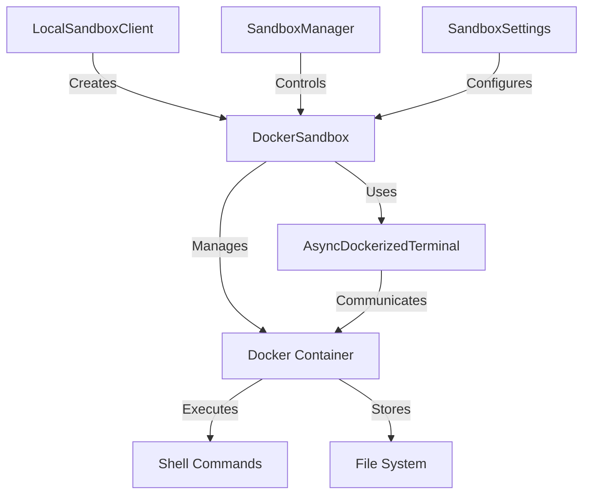
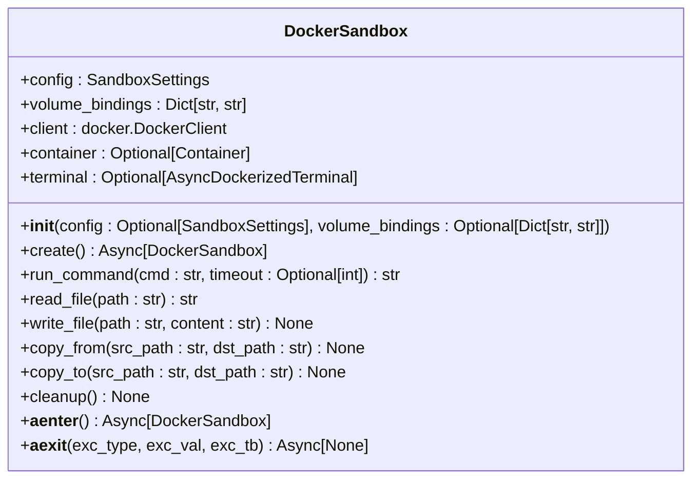
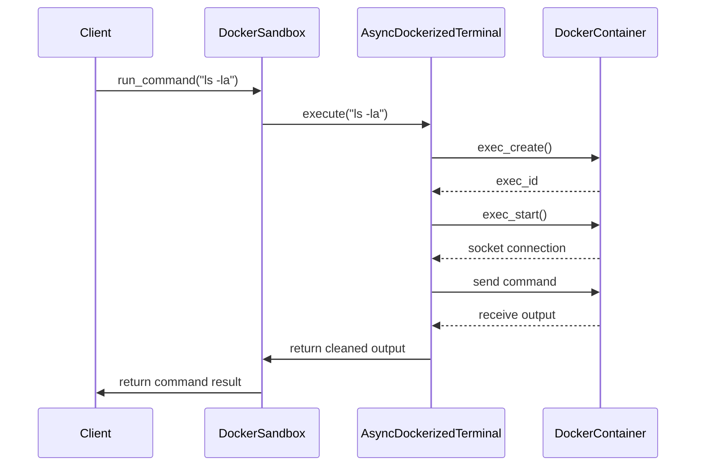
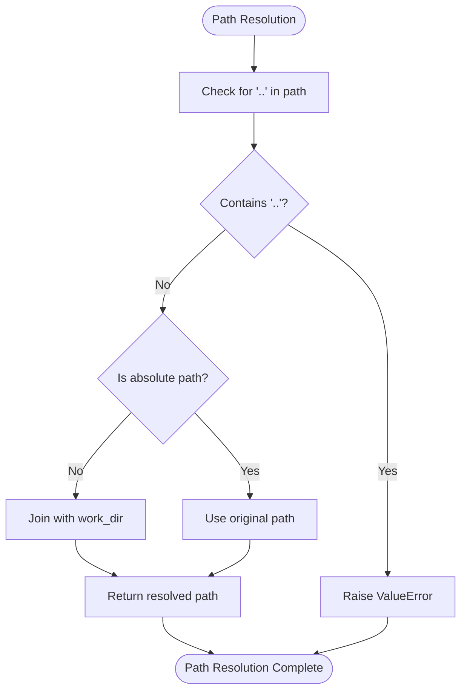
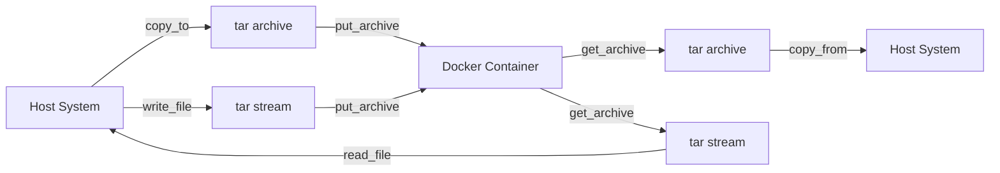
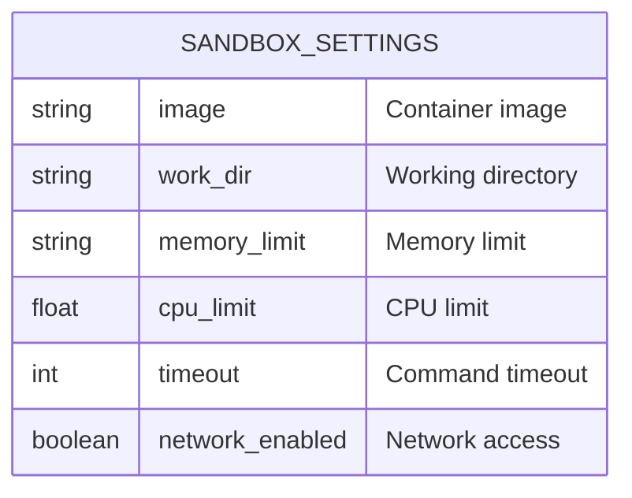

# Sandbox System

<cite>
**Referenced Files in This Document**   
- [DockerSandbox](file://app/sandbox/core/sandbox.py)
- [AsyncDockerizedTerminal](file://app/sandbox/core/terminal.py)
- [SandboxSettings](file://app/config.py)
- [SandboxManager](file://app/sandbox/core/manager.py)
- [LocalSandboxClient](file://app/sandbox/client.py)
</cite>

## Table of Contents
1. [Introduction](#introduction)
2. [Docker-Based Sandbox Architecture](#docker-based-sandbox-architecture)
3. [DockerSandbox Implementation](#dockersandbox-implementation)
4. [AsyncDockerizedTerminal Integration](#asyncdockerizedterminal-integration)
5. [Secure Path Resolution](#secure-path-resolution)
6. [File I/O Operations](#file-io-operations)
7. [Configuration Options](#configuration-options)
8. [Common Issues and Troubleshooting](#common-issues-and-troubleshooting)
9. [Security Best Practices](#security-best-practices)
10. [Conclusion](#conclusion)

## Introduction
The Sandbox System in OpenManus provides a secure, isolated environment for code execution using Docker containerization. This system enables safe execution of potentially untrusted code by leveraging container isolation, resource constraints, and network controls. The architecture is designed to prevent security breaches while allowing necessary functionality for development and testing purposes. The core components include the DockerSandbox class for container lifecycle management, AsyncDockerizedTerminal for interactive shell access, and various utility methods for file operations and security enforcement.

**Section sources**
- [DockerSandbox](file://app/sandbox/core/sandbox.py#L17-L461)

## Docker-Based Sandbox Architecture
The sandbox system implements a multi-layered architecture using Docker containers to provide secure code execution. Each sandbox instance runs in an isolated container with specific resource constraints and security configurations. The architecture follows a client-server pattern where the LocalSandboxClient acts as the interface to the DockerSandbox implementation. The system uses the Docker SDK for Python to manage container lifecycle operations including creation, execution, and cleanup. Containers are configured with limited memory and CPU resources, optional network isolation, and restricted working directories to minimize potential security risks. The sandbox manager component provides centralized control over multiple sandbox instances, enforcing limits on concurrent sandboxes and automatically cleaning up idle instances.

**Diagram sources**
- [DockerSandbox](file://app/sandbox/core/sandbox.py#L17-L461)
- [LocalSandboxClient](file://app/sandbox/client.py#L45-L201)
- [SandboxManager](file://app/sandbox/core/manager.py#L15-L313)
- [SandboxSettings](file://app/config.py#L93-L104)

**Section sources**
- [DockerSandbox](file://app/sandbox/core/sandbox.py#L17-L461)
- [LocalSandboxClient](file://app/sandbox/client.py#L45-L201)
- [SandboxManager](file://app/sandbox/core/manager.py#L15-L313)

## DockerSandbox Implementation
The DockerSandbox class provides comprehensive container lifecycle management for secure code execution. The implementation handles container creation, command execution, file operations, and resource cleanup. During initialization, the sandbox configures container settings based on provided SandboxSettings, including memory limits, CPU constraints, and network configuration. The create method orchestrates container creation by preparing host configuration, generating unique container names, and starting the container with a persistent process. The run_command method executes shell commands within the container through the AsyncDockerizedTerminal interface, with configurable timeout handling. The cleanup method ensures proper resource deallocation by stopping and removing containers while handling potential errors gracefully. The class implements async context manager protocols (__aenter__ and __aexit__) to ensure proper resource management.

**Diagram sources**
- [DockerSandbox](file://app/sandbox/core/sandbox.py#L17-L461)

**Section sources**
- [DockerSandbox](file://app/sandbox/core/sandbox.py#L17-L461)

## AsyncDockerizedTerminal Integration
The AsyncDockerizedTerminal class enables interactive shell access to Docker containers with asynchronous execution capabilities. This component provides a persistent terminal session within the container, allowing for command execution with timeout control and proper output handling. The integration works by creating an interactive bash session within the container, setting up environment variables, and establishing a socket connection for bidirectional communication. The terminal initialization process ensures the working directory exists and configures the shell environment with unbuffered Python output. Command execution is handled through the Docker exec API, with output parsing that removes prompt markers and exit status indicators. The implementation includes proper sanitization of commands to prevent shell injection attacks and handles various edge cases such as network timeouts and connection failures.

**Diagram sources**
- [DockerSandbox](file://app/sandbox/core/sandbox.py#L139-L163)
- [AsyncDockerizedTerminal](file://app/sandbox/core/terminal.py#L315-L331)

**Section sources**
- [AsyncDockerizedTerminal](file://app/sandbox/core/terminal.py#L251-L345)
- [DockerSandbox](file://app/sandbox/core/sandbox.py#L139-L163)

## Secure Path Resolution
The sandbox system implements a robust path resolution mechanism to prevent directory traversal attacks and ensure file operations remain within designated boundaries. The _safe_resolve_path method validates and resolves file paths by checking for potentially unsafe patterns such as ".." in path components. The implementation prevents path traversal by rejecting any path containing parent directory references. For relative paths, the method resolves them relative to the configured working directory, while absolute paths are allowed but still subject to container-level restrictions. This security measure ensures that file operations cannot escape the sandbox environment or access sensitive host system files. The path resolution is integrated into all file I/O operations, including read_file, write_file, copy_from, and copy_to methods, providing consistent protection across the entire file system interface.

**Diagram sources**
- [DockerSandbox](file://app/sandbox/core/sandbox.py#L231-L252)

**Section sources**
- [DockerSandbox](file://app/sandbox/core/sandbox.py#L231-L252)

## File I/O Operations
The sandbox system provides comprehensive file I/O operations through a tar-based transfer mechanism that ensures reliable data exchange between the host and container environments. File operations are implemented using Docker's archive functionality, which allows for efficient transfer of files and directories in tar format. The write_file method creates a tar archive containing the specified file and uploads it to the container using put_archive, while read_file extracts file content from a tar archive retrieved from the container. The copy_to and copy_from methods extend this functionality to handle file transfers between host and container file systems, supporting both individual files and directories. Binary stream handling is implemented through temporary file storage and proper encoding/decoding of data, ensuring that file contents are preserved exactly as provided. The implementation includes error handling for common issues such as missing files, permission errors, and archive corruption.

**Diagram sources**
- [DockerSandbox](file://app/sandbox/core/sandbox.py#L165-L195)
- [DockerSandbox](file://app/sandbox/core/sandbox.py#L197-L229)
- [DockerSandbox](file://app/sandbox/core/sandbox.py#L254-L312)
- [DockerSandbox](file://app/sandbox/core/sandbox.py#L314-L374)

**Section sources**
- [DockerSandbox](file://app/sandbox/core/sandbox.py#L165-L195)
- [DockerSandbox](file://app/sandbox/core/sandbox.py#L197-L229)
- [DockerSandbox](file://app/sandbox/core/sandbox.py#L254-L312)
- [DockerSandbox](file://app/sandbox/core/sandbox.py#L314-L374)

## Configuration Options
The sandbox system offers extensive configuration options through the SandboxSettings class, allowing fine-grained control over container behavior and resource allocation. The configuration includes settings for the container image, working directory, memory and CPU limits, command timeout, and network access. The image parameter specifies the base Docker image to use, with a default of "python:3.12-slim" for Python execution environments. Memory limits are configured using Docker's memory constraint syntax (e.g., "512m" for 512 megabytes), while CPU limits are specified as a floating-point value representing the proportion of available CPU resources. The timeout setting controls the maximum execution time for commands, preventing infinite loops or long-running processes. Network isolation is controlled by the network_enabled flag, which when disabled sets the container's network mode to "none" for complete network lockdown. These configuration options can be customized per sandbox instance or set globally through the application configuration.

**Diagram sources**
- [SandboxSettings](file://app/config.py#L93-L104)

**Section sources**
- [SandboxSettings](file://app/config.py#L93-L104)

## Common Issues and Troubleshooting
The sandbox system may encounter several common issues during operation, including container startup failures, image pull errors, and permission issues. Container startup failures typically occur when the specified Docker image is not available locally and cannot be pulled from the registry. The system handles this by attempting to pull the image automatically, but network connectivity issues or authentication problems may prevent successful pulls. Permission issues can arise when file operations attempt to access directories without proper permissions or when the container's user lacks necessary privileges. The SandboxManager component helps mitigate resource exhaustion by limiting the maximum number of concurrent sandboxes and automatically cleaning up idle instances. Error handling is implemented throughout the system, with specific exceptions like SandboxTimeoutError for command execution timeouts and FileNotFoundError for missing files. The cleanup process includes comprehensive error handling to ensure resources are properly released even when errors occur during container removal.

**Section sources**
- [SandboxManager](file://app/sandbox/core/manager.py#L15-L313)
- [DockerSandbox](file://app/sandbox/core/sandbox.py#L424-L453)
- [exceptions.py](file://app/sandbox/core/exceptions.py#L1-L17)

## Security Best Practices
For production deployment, several security best practices should be followed to minimize risks associated with the sandbox system. Network lockdown should be enabled by default (network_enabled=False) to prevent containers from accessing external networks unless explicitly required. Resource constraints should be set appropriately to prevent denial-of-service attacks through excessive memory or CPU consumption. The container image should be kept minimal and regularly updated to reduce the attack surface. Volume bindings should be carefully controlled to prevent access to sensitive host directories. Command execution should be monitored for potentially dangerous operations, and input validation should be performed on all user-provided data. The sandbox manager's automatic cleanup functionality should be configured with appropriate idle timeouts to ensure inactive containers are promptly removed. Additionally, the system should run with the minimum necessary privileges, avoiding root access when possible, and container logs should be monitored for suspicious activity.

**Section sources**
- [DockerSandbox](file://app/sandbox/core/sandbox.py#L48-L102)
- [SandboxSettings](file://app/config.py#L93-L104)
- [SandboxManager](file://app/sandbox/core/manager.py#L15-L313)

## Conclusion
The Sandbox System in OpenManus provides a robust and secure environment for isolated code execution through Docker containerization. The architecture combines container lifecycle management, interactive terminal access, and secure file operations to create a comprehensive sandbox solution. Key features include resource isolation, network control, secure path resolution, and comprehensive error handling. The system is designed with security as a primary concern, implementing multiple layers of protection against common attack vectors. Configuration options allow for flexible deployment in various environments, from development to production. The integration of async context managers ensures proper resource cleanup, while the sandbox manager provides centralized control over multiple instances. This implementation enables safe execution of untrusted code while maintaining performance and reliability.