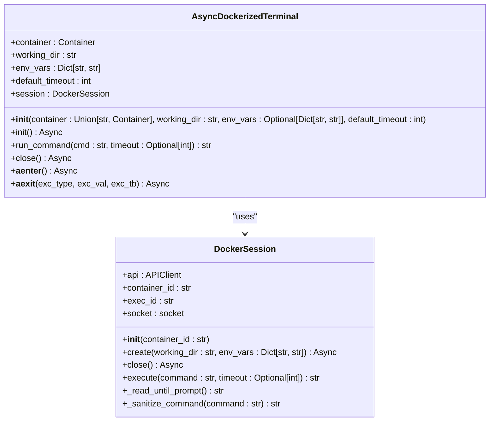
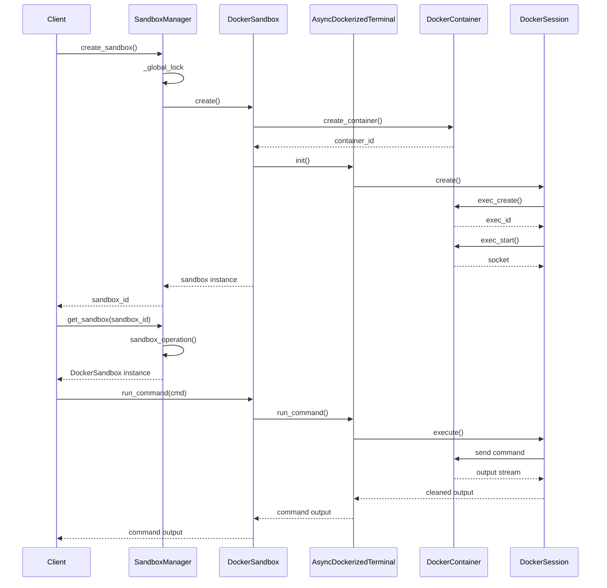
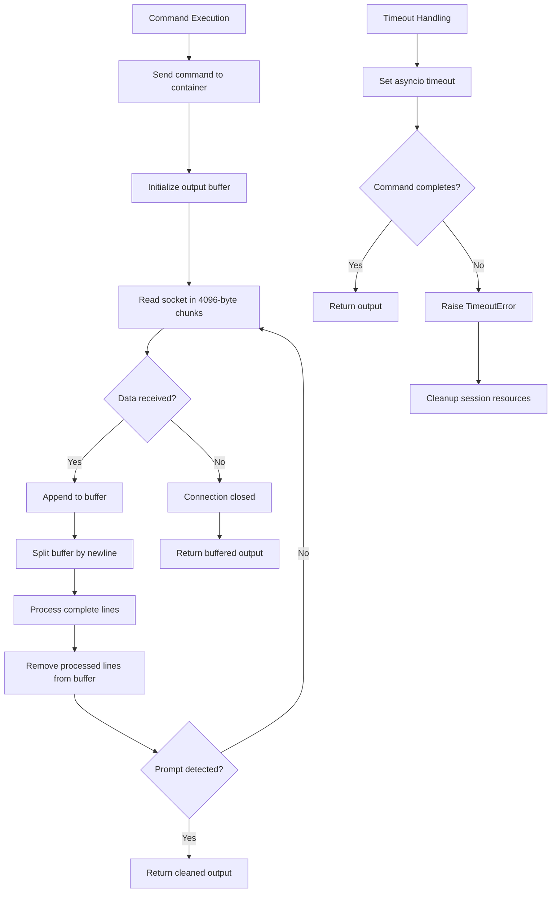
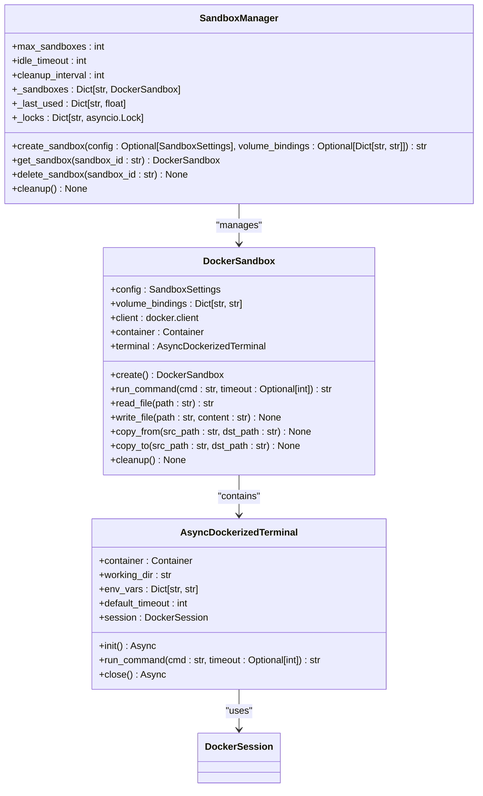

# Terminal Integration

<cite>
**Referenced Files in This Document**   
- [terminal.py](file://app/sandbox/core/terminal.py)
- [sandbox.py](file://app/sandbox/core/sandbox.py)
- [manager.py](file://app/sandbox/core/manager.py)
- [client.py](file://app/sandbox/client.py)
- [test_docker_terminal.py](file://tests/sandbox/test_docker_terminal.py)
</cite>

## Table of Contents
1. [Introduction](#introduction)
2. [Core Components](#core-components)
3. [AsyncDockerizedTerminal Class](#asyncdockerizedterminal-class)
4. [Terminal Manager and Session Coordination](#terminal-manager-and-session-coordination)
5. [Input/Output Buffering and Timeout Handling](#inputoutput-buffering-and-timeout-handling)
6. [Practical Usage Examples](#practical-usage-examples)
7. [Integration with Core Sandbox](#integration-with-core-sandbox)
8. [Common Issues and Troubleshooting](#common-issues-and-troubleshooting)
9. [Configuration and Use Case Guidance](#configuration-and-use-case-guidance)

## Introduction
The terminal integration component of the sandbox system provides interactive shell access within Docker containers through the `AsyncDockerizedTerminal` class. This component enables asynchronous command execution, real-time output streaming, and proper signal handling for process interruption. It serves as the primary interface for executing shell commands, debugging applications, and monitoring processes within isolated sandbox environments. The system is designed to support both interactive debugging sessions and automated scripting workflows while maintaining security and resource isolation.

## Core Components

The terminal integration system consists of several key components that work together to provide a robust interactive shell experience within Docker containers. The `AsyncDockerizedTerminal` class serves as the main interface for terminal operations, while the `DockerSession` class handles the low-level communication with the Docker container. These components are integrated with the `DockerSandbox` class, which manages the container lifecycle, and the `SandboxManager` class, which coordinates multiple sandbox instances. The `LocalSandboxClient` provides a high-level interface for interacting with the sandbox environment.

**Section sources**
- [terminal.py](file://app/sandbox/core/terminal.py#L1-L346)
- [sandbox.py](file://app/sandbox/core/sandbox.py#L1-L462)
- [manager.py](file://app/sandbox/core/manager.py#L1-L313)
- [client.py](file://app/sandbox/client.py#L1-L201)

## AsyncDockerizedTerminal Class

The `AsyncDockerizedTerminal` class provides asynchronous terminal functionality for Docker containers, enabling interactive command execution with timeout control. This class serves as the primary interface for executing shell commands within the sandbox environment.

**Diagram sources **
- [terminal.py](file://app/sandbox/core/terminal.py#L250-L345)
- [terminal.py](file://app/sandbox/core/terminal.py#L18-L247)

**Section sources**
- [terminal.py](file://app/sandbox/core/terminal.py#L250-L345)
- [terminal.py](file://app/sandbox/core/terminal.py#L18-L247)

## Terminal Manager and Session Coordination

The terminal manager component, implemented through the `SandboxManager` class, coordinates multiple terminal sessions and handles concurrent access to sandbox resources. This component ensures proper resource management, prevents race conditions, and provides automatic cleanup of idle sandboxes. The manager uses asyncio locks to control concurrent access to individual sandboxes and maintains a record of last used times to identify idle instances for cleanup.

**Diagram sources **
- [manager.py](file://app/sandbox/core/manager.py#L13-L312)
- [sandbox.py](file://app/sandbox/core/sandbox.py#L17-L461)
- [terminal.py](file://app/sandbox/core/terminal.py#L250-L345)

**Section sources**
- [manager.py](file://app/sandbox/core/manager.py#L13-L312)
- [sandbox.py](file://app/sandbox/core/sandbox.py#L17-L461)

## Input/Output Buffering and Timeout Handling

The terminal integration system implements a sophisticated input/output buffering mechanism to handle real-time output streaming from long-running commands. The `DockerSession` class manages a non-blocking socket connection to the container's execution environment, reading output in chunks and buffering the data until complete lines are received. This approach prevents blocking operations and allows for efficient processing of streaming output.

**Diagram sources **
- [terminal.py](file://app/sandbox/core/terminal.py#L18-L247)
- [terminal.py](file://app/sandbox/core/terminal.py#L250-L345)

**Section sources**
- [terminal.py](file://app/sandbox/core/terminal.py#L18-L247)
- [terminal.py](file://app/sandbox/core/terminal.py#L250-L345)

## Practical Usage Examples

### Interactive Python Debugging
The terminal integration supports interactive Python debugging sessions within the sandbox environment. Users can start a Python interpreter, execute code line by line, and inspect variables in real-time. The asynchronous nature of the terminal allows for non-blocking interaction, enabling the system to handle user input while maintaining the Python session.

### Shell Command Chaining
The system supports complex shell command chaining using standard Unix pipe operators. Commands can be chained together to process data through multiple filters, with output from one command serving as input to the next. This enables sophisticated data processing workflows within the sandbox environment.

### Real-time Log Monitoring
Long-running processes can be monitored in real-time using commands like `tail -f`. The terminal's streaming output capabilities allow users to view log entries as they are generated, making it possible to monitor application behavior and troubleshoot issues as they occur.

**Section sources**
- [test_docker_terminal.py](file://tests/sandbox/test_docker_terminal.py#L1-L104)
- [terminal.py](file://app/sandbox/core/terminal.py#L250-L345)

## Integration with Core Sandbox

The terminal component is tightly integrated with the core sandbox system, sharing environment variables and working directories between the terminal session and the sandbox environment. When a `DockerSandbox` instance is created, it initializes an `AsyncDockerizedTerminal` with the same working directory and environment variables, ensuring consistency across the execution environment.

**Diagram sources **
- [sandbox.py](file://app/sandbox/core/sandbox.py#L17-L461)
- [terminal.py](file://app/sandbox/core/terminal.py#L250-L345)
- [manager.py](file://app/sandbox/core/manager.py#L13-L312)

**Section sources**
- [sandbox.py](file://app/sandbox/core/sandbox.py#L17-L461)
- [terminal.py](file://app/sandbox/core/terminal.py#L250-L345)

## Common Issues and Troubleshooting

### Terminal Session Deadlocks
Terminal session deadlocks can occur when a command produces output faster than it can be processed, filling the socket buffer and causing the session to hang. This can be mitigated by implementing proper timeout handling and ensuring that output is regularly consumed from the buffer.

### Output Truncation
Output truncation may happen when large amounts of data are generated by a command, exceeding the buffer capacity. The system addresses this by using a streaming approach that processes output in chunks, but extremely large outputs may still be truncated if not handled properly.

### Signal Propagation Failures
Signal propagation failures can occur when attempting to interrupt long-running processes. The system implements a cleanup mechanism that sends an exit command to the bash session and properly closes the socket connection, but some processes may ignore these signals or require additional handling.

**Section sources**
- [terminal.py](file://app/sandbox/core/terminal.py#L18-L247)
- [test_docker_terminal.py](file://tests/sandbox/test_docker_terminal.py#L1-L104)

## Configuration and Use Case Guidance

### Automated Scripting
For automated scripting use cases, configure the terminal with appropriate timeout values to prevent scripts from hanging indefinitely. Use non-interactive commands and redirect output to files when processing large amounts of data. The default timeout of 60 seconds can be adjusted based on the expected execution time of commands.

### Interactive Debugging
For interactive debugging scenarios, consider increasing the timeout value to accommodate longer debugging sessions. Enable real-time output streaming to view command results immediately, and use the context manager interface (`async with`) to ensure proper resource cleanup after debugging sessions.

### Security Considerations
The system includes command sanitization to prevent shell injection attacks by blocking potentially dangerous commands like `rm -rf /` and `chmod -R 777 /`. Environment variables are properly isolated between sandbox instances to prevent information leakage.

**Section sources**
- [terminal.py](file://app/sandbox/core/terminal.py#L250-L345)
- [sandbox.py](file://app/sandbox/core/sandbox.py#L17-L461)
- [test_docker_terminal.py](file://tests/sandbox/test_docker_terminal.py#L1-L104)