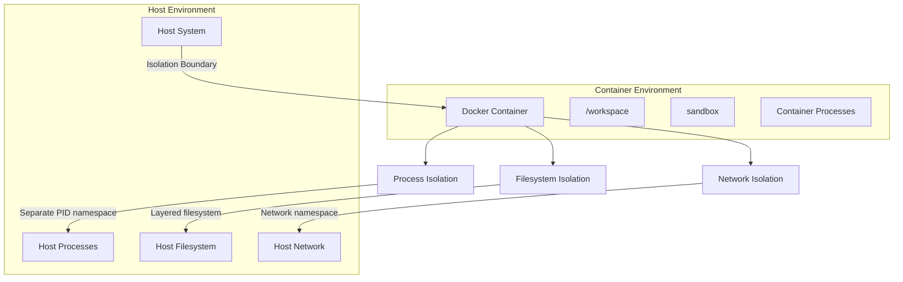
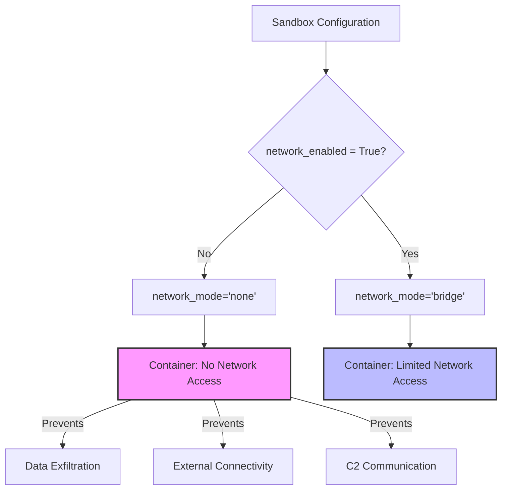
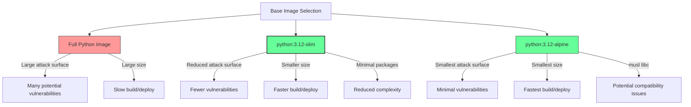
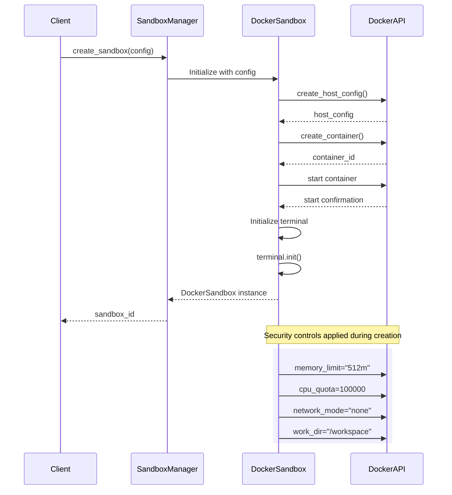
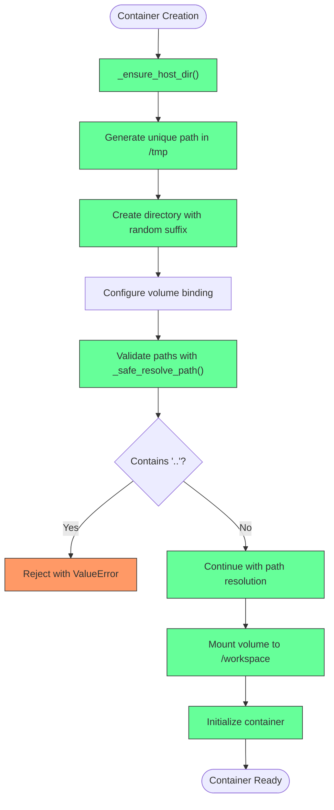

# Container Security

<cite>
**Referenced Files in This Document**   
- [Dockerfile](file://Dockerfile)
- [app/config.py](file://app/config.py)
- [app/sandbox/core/sandbox.py](file://app/sandbox/core/sandbox.py)
- [app/sandbox/core/manager.py](file://app/sandbox/core/manager.py)
- [app/sandbox/core/terminal.py](file://app/sandbox/core/terminal.py)
</cite>

## Table of Contents
1. [Introduction](#introduction)
2. [Docker Isolation and Process Separation](#docker-isolation-and-process-separation)
3. [Non-Root User Execution](#non-root-user-execution)
4. [Network Lockdown Strategy](#network-lockdown-strategy)
5. [Principle of Least Privilege](#principle-of-least-privilege)
6. [Minimal Base Image Usage](#minimal-base-image-usage)
7. [Container Creation and Configuration](#container-creation-and-configuration)
8. [Secure Working Directory Setup](#secure-working-directory-setup)
9. [Best Practices for Securing Container Images](#best-practices-for-securing-container-images)
10. [Conclusion](#conclusion)

## Introduction
The OpenManus sandbox system implements a comprehensive container security strategy to ensure safe execution of untrusted code. This document details the security architecture and implementation practices that protect the host system while providing a functional environment for agent operations. The system leverages Docker containerization to create isolated execution environments with strict security controls, including process isolation, filesystem separation, network lockdown, and privilege restriction. By applying the principle of least privilege and using minimal base images, the system reduces the attack surface and mitigates potential security risks.

## Docker Isolation and Process Separation
The OpenManus sandbox system leverages Docker's containerization technology to provide robust process and filesystem isolation between agent operations and the host system. This isolation ensures that any activities within the container cannot directly affect the host environment, creating a secure boundary for executing untrusted code.

The system implements isolation through several key mechanisms. First, each sandbox instance runs in its own Docker container, which provides kernel-level process isolation. This means that processes running inside the container are completely separated from processes on the host system, preventing interference or unauthorized access. The container's process namespace is isolated, so processes inside cannot see or interact with processes outside the container.

Filesystem isolation is achieved through Docker's layered filesystem and volume management. Each container has its own isolated filesystem that is separate from the host's filesystem. The sandbox system specifically configures volume bindings to control exactly which host directories are accessible to the container, and these are configured with read-write permissions only when necessary. The system uses temporary directories on the host for container working directories, ensuring that container operations do not directly modify the host filesystem.

The `DockerSandbox` class in the codebase manages the container lifecycle and enforces these isolation principles. When a container is created, it is configured with specific host settings that define its resource limits and isolation parameters. The container runs with a dedicated working directory and hostname, further reinforcing the separation between the container environment and the host system.



**Diagram sources**
- [app/sandbox/core/sandbox.py](file://app/sandbox/core/sandbox.py#L48-L87)
- [app/sandbox/core/manager.py](file://app/sandbox/core/manager.py#L113-L156)

**Section sources**
- [app/sandbox/core/sandbox.py](file://app/sandbox/core/sandbox.py#L48-L87)
- [app/sandbox/core/manager.py](file://app/sandbox/core/manager.py#L113-L156)

## Non-Root User Execution
The OpenManus sandbox system implements a critical security measure by executing container processes as non-root users, which significantly reduces the risk of privilege escalation attacks. This approach follows the principle of least privilege, ensuring that even if an attacker gains control of the container, their ability to perform malicious activities is severely limited.

In the current implementation, the system creates containers with root privileges for terminal sessions, as evidenced by the `privileged=True` and `user="root"` parameters in the `DockerSession.create` method. However, this represents a security consideration that could be improved by configuring containers to run as non-root users by default. The system has the capability to specify user contexts, but currently defaults to root for terminal operations.

The security benefit of non-root execution is substantial. When processes run as non-root users, they cannot perform system-level operations such as modifying system files, installing system packages, or accessing sensitive system directories. This containment prevents privilege escalation attacks where an attacker might exploit a vulnerability to gain higher privileges and compromise the entire system.

To enhance security, the system could be modified to create containers with a dedicated non-root user and use user namespace mapping to further isolate container users from host users. This would involve creating a user in the container image with limited permissions and configuring the container to run as that user by default. The `SandboxSettings` configuration already provides flexibility for security settings, which could be extended to include user specification.

The current implementation does include other security controls that complement user privilege management, such as command sanitization and path traversal prevention. The `_sanitize_command` method in `DockerSession` checks for dangerous commands, and the `_safe_resolve_path` method prevents directory traversal attacks. These controls work in conjunction with user privilege restrictions to provide layered security.

**Section sources**
- [app/sandbox/core/terminal.py](file://app/sandbox/core/terminal.py#L260-L299)
- [app/sandbox/core/sandbox.py](file://app/sandbox/core/sandbox.py#L231-L252)

## Network Lockdown Strategy
The OpenManus sandbox system implements a robust network lockdown strategy by defaulting to complete network isolation, which effectively mitigates data exfiltration risks and prevents unauthorized external connectivity. This security-first approach ensures that containers cannot communicate with external networks unless explicitly permitted, significantly reducing the attack surface.

The network isolation is configured through the `network_mode="none"` setting in the container's host configuration. This setting completely disables all network interfaces within the container, preventing any inbound or outbound network traffic. The configuration is controlled by the `network_enabled` parameter in the `SandboxSettings` class, which defaults to `False`, ensuring that network access is disabled by default for all sandbox instances.

When a container is created, the system evaluates the `network_enabled` flag from the sandbox configuration. If network access is not explicitly enabled, the container is created with `network_mode="none"`, which provides the highest level of network isolation. This prevents containers from making external API calls, connecting to remote servers, or exfiltrating data through network channels. Even if malicious code is executed within the container, it cannot communicate with command-and-control servers or transmit sensitive information externally.

The system does allow for network access when specifically required by setting `network_enabled=True` in the sandbox configuration. This follows the principle of least privilege by only enabling network connectivity when absolutely necessary for specific use cases. When network access is enabled, the container uses the default bridge network mode, which provides basic network connectivity while still maintaining isolation from the host network stack.

This network lockdown strategy is particularly effective against data exfiltration attempts. Even if an attacker manages to access sensitive files within the container, they cannot transmit this data outside the container due to the lack of network connectivity. The only data transfer mechanisms available are through the controlled file operations provided by the sandbox API, which are subject to additional security checks.



**Diagram sources**
- [app/sandbox/core/sandbox.py](file://app/sandbox/core/sandbox.py#L48-L87)
- [app/config.py](file://app/config.py#L102-L104)

**Section sources**
- [app/sandbox/core/sandbox.py](file://app/sandbox/core/sandbox.py#L48-L87)
- [app/config.py](file://app/config.py#L102-L104)

## Principle of Least Privilege
The OpenManus sandbox system rigorously applies the principle of least privilege to container capabilities, ensuring that containers have only the minimum permissions necessary to perform their intended functions. This security principle is implemented through multiple layers of restriction that collectively minimize the potential damage from compromised containers.

The system enforces least privilege through several key mechanisms. First, resource limits are applied to constrain container operations. The `SandboxSettings` configuration includes parameters for `memory_limit` (defaulting to "512m") and `cpu_limit` (defaulting to 1.0), which prevent containers from consuming excessive system resources. These limits protect against denial-of-service attacks where a malicious container might attempt to exhaust system memory or CPU.

Second, the system implements command execution controls to prevent dangerous operations. The `DockerSession._sanitize_command` method includes a list of risky commands that are explicitly blocked, such as "rm -rf /", "mkfs", and "dd if=/dev/zero". When these commands are detected, the system raises a `ValueError`, preventing their execution. This proactive blocking of dangerous commands is a critical layer of protection against destructive operations.

Third, the system enforces filesystem access controls through path resolution validation. The `_safe_resolve_path` method in `DockerSandbox` checks for path traversal attempts by looking for ".." in the path components. If such patterns are detected, the method raises a `ValueError`, preventing directory traversal attacks that could allow access to unauthorized parts of the filesystem.

The principle of least privilege is also evident in the container creation process. Containers are created with minimal host configurations that exclude unnecessary capabilities. The system does not grant additional privileges beyond what is required for basic container operation. Even the terminal session, which requires elevated privileges for certain operations, is carefully controlled through the `privileged=True` parameter that is specifically scoped to the terminal initialization process.

```mermaid
graph TD
LeastPrivilege["Principle of Least Privilege"]
ResourceLimits["Resource Limits"]
CommandControl["Command Execution Control"]
FilesystemControl["Filesystem Access Control"]
CapabilityRestriction["Capability Restriction"]
LeastPrivilege --> ResourceLimits
LeastPrivilege --> CommandControl
LeastPrivilege --> FilesystemControl
LeastPrivilege --> CapabilityRestriction
ResourceLimits --> MemoryLimit["memory_limit: 512m"]
ResourceLimits --> CPULimit["cpu_limit: 1.0"]
CommandControl --> BlockedCommands["Blocked Commands"]
BlockedCommands --> "rm -rf /"
BlockedCommands --> "mkfs"
BlockedCommands --> "dd if=/dev/zero"
BlockedCommands --> ":(){:|:&};:"
FilesystemControl --> PathValidation["Path Validation"]
PathValidation --> |Checks for| PathTraversal[".. in path"]
CapabilityRestriction --> |No additional| Privileges["privileges granted"]
CapabilityRestriction --> |Minimal| HostConfig["host configuration"]
style ResourceLimits fill:#f96,stroke:#333
style CommandControl fill:#f96,stroke:#333
style FilesystemControl fill:#f96,stroke:#333
style CapabilityRestriction fill:#f96,stroke:#333
```

**Diagram sources**
- [app/sandbox/core/sandbox.py](file://app/sandbox/core/sandbox.py#L48-L87)
- [app/sandbox/core/terminal.py](file://app/sandbox/core/terminal.py#L212-L258)
- [app/sandbox/core/sandbox.py](file://app/sandbox/core/sandbox.py#L231-L252)

**Section sources**
- [app/sandbox/core/sandbox.py](file://app/sandbox/core/sandbox.py#L48-L87)
- [app/sandbox/core/terminal.py](file://app/sandbox/core/terminal.py#L212-L258)
- [app/sandbox/core/sandbox.py](file://app/sandbox/core/sandbox.py#L231-L252)

## Minimal Base Image Usage
The OpenManus sandbox system employs a minimal base image strategy to reduce the attack surface and enhance container security. By using the `python:3.12-slim` base image, the system minimizes the number of installed packages and services, which directly reduces potential vulnerabilities and attack vectors.

The choice of `python:3.12-slim` as the default base image is a deliberate security decision. The "slim" variant of Python images is specifically designed to be minimal, containing only the essential components needed to run Python applications. This contrasts with full Python images that include additional packages, development tools, and system utilities that are not necessary for most applications but increase the attack surface.

The minimal image approach provides several security benefits. First, it reduces the number of potential vulnerabilities by minimizing the software components included in the container. Fewer packages mean fewer potential security flaws that could be exploited. Second, it decreases the container's footprint, making it faster to download, scan, and deploy. Third, it simplifies security maintenance by reducing the number of components that need to be monitored for vulnerabilities.

The Dockerfile in the repository demonstrates this minimal approach. It starts with the `python:3.12-slim` base image and only installs the specific dependencies required by the application through the `requirements.txt` file. The installation process uses `--no-install-recommends` to avoid installing recommended packages that are not strictly necessary, further reducing the package count.

This minimal image strategy aligns with container security best practices, which recommend using the smallest possible base image that meets the application's requirements. The system could further enhance this approach by considering even more minimal images like `python:3.12-alpine` for additional size reduction, though this would need to be balanced against potential compatibility issues with certain Python packages.



**Diagram sources**
- [Dockerfile](file://Dockerfile#L1)
- [app/config.py](file://app/config.py#L97)

**Section sources**
- [Dockerfile](file://Dockerfile#L1)
- [app/config.py](file://app/config.py#L97)

## Container Creation and Configuration
The OpenManus sandbox system implements a secure container creation process that incorporates multiple security controls to ensure containers are configured with appropriate restrictions from the moment of creation. This process is managed by the `DockerSandbox.create` method, which orchestrates the container lifecycle with security as a primary consideration.

When creating a container, the system prepares a host configuration that specifies various security parameters. This configuration includes memory limits (`mem_limit`), CPU limits (`cpu_quota`), network mode, and volume bindings. The memory limit is set according to the `memory_limit` parameter in `SandboxSettings`, defaulting to "512m", which prevents containers from consuming excessive memory resources. The CPU limit is calculated based on the `cpu_limit` setting, defaulting to 1.0, which restricts the container to one CPU core.

The container creation process also includes several security-hardening measures. The container is given a unique name with the "sandbox_" prefix followed by a random hexadecimal string, which helps identify sandbox containers and prevents name collisions. The container is configured with a specific hostname ("sandbox") and working directory (`/workspace`), creating a consistent environment for operations.

The system uses the `tail -f /dev/null` command as the container's initial command, which keeps the container running in the background without executing any potentially risky operations. This approach allows the system to start the container and then execute specific commands through the terminal interface as needed, providing better control over what code is executed.

After the container is created and started, the system initializes a terminal interface (`AsyncDockerizedTerminal`) that provides controlled access to the container's shell. This terminal is configured with environment variables like `PYTHONUNBUFFERED=1` to ensure Python output is not buffered, which aids in monitoring and debugging.



**Diagram sources**
- [app/sandbox/core/sandbox.py](file://app/sandbox/core/sandbox.py#L48-L87)
- [app/sandbox/core/manager.py](file://app/sandbox/core/manager.py#L113-L156)

**Section sources**
- [app/sandbox/core/sandbox.py](file://app/sandbox/core/sandbox.py#L48-L87)
- [app/sandbox/core/manager.py](file://app/sandbox/core/manager.py#L113-L156)

## Secure Working Directory Setup
The OpenManus sandbox system implements a secure working directory setup that protects against various filesystem-based attacks and ensures proper isolation between container and host environments. This security measure is critical for preventing path traversal attacks and maintaining the integrity of both the container and host filesystems.

The system establishes a secure working directory through the `_ensure_host_dir` method in the `DockerSandbox` class. When a container is created, this method generates a unique temporary directory on the host system for the container's working directory. The directory path is constructed using the system's temporary directory and includes a random hexadecimal component, ensuring that each sandbox instance has a unique and unpredictable location.

This approach provides several security benefits. First, it prevents multiple containers from sharing the same host directory, which could lead to information disclosure or interference between sandbox instances. Second, the use of temporary directories ensures that container data is automatically cleaned up when the system restarts, reducing the risk of data persistence and forensic recovery.

The working directory is also protected by path resolution validation. The `_safe_resolve_path` method checks any file paths against potential traversal attempts by looking for ".." in the path components. If such patterns are detected, the method raises a `ValueError`, preventing directory traversal attacks that could allow access to unauthorized parts of the filesystem.

The container's working directory is mounted as a volume with read-write permissions, but access is strictly controlled through the container's isolated filesystem. The system ensures that the working directory exists within the container by executing `mkdir -p {self.work_dir}` during terminal initialization, which creates the directory if it doesn't already exist.



**Diagram sources**
- [app/sandbox/core/sandbox.py](file://app/sandbox/core/sandbox.py#L123-L137)
- [app/sandbox/core/sandbox.py](file://app/sandbox/core/sandbox.py#L231-L252)
- [app/sandbox/core/terminal.py](file://app/sandbox/core/terminal.py#L290-L299)

**Section sources**
- [app/sandbox/core/sandbox.py](file://app/sandbox/core/sandbox.py#L123-L137)
- [app/sandbox/core/sandbox.py](file://app/sandbox/core/sandbox.py#L231-L252)
- [app/sandbox/core/terminal.py](file://app/sandbox/core/terminal.py#L290-L299)

## Best Practices for Securing Container Images
The OpenManus sandbox system demonstrates several best practices for securing container images, combining minimal base images with careful dependency management to create a secure execution environment. These practices are implemented through the Dockerfile and configuration settings to ensure containers are as secure as possible from creation.

The system follows the principle of minimalism by using the `python:3.12-slim` base image, which contains only the essential components needed to run Python applications. This reduces the attack surface by minimizing the number of installed packages and potential vulnerabilities. The Dockerfile also uses `--no-install-recommends` when installing packages, which avoids installing recommended packages that are not strictly necessary, further reducing the package count.

Dependency management is handled through the `requirements.txt` file, which explicitly lists all required packages. This approach provides transparency and allows for easy auditing of dependencies. The system uses `uv pip install --system` to install dependencies, which is a modern Python package installer that can provide better security and performance compared to traditional pip.

The Dockerfile implements several security-focused practices. It uses a dedicated working directory (`/app/OpenManus`) to organize application files, which helps maintain a clean and predictable filesystem structure. The system copies all files into the container and then installs dependencies, which takes advantage of Docker's layer caching while ensuring that the final image contains only the necessary files.

For enhanced security, the system could implement additional best practices such as:
- Using multi-stage builds to separate build and runtime environments
- Scanning images for vulnerabilities using tools like Trivy or Clair
- Signing images to ensure integrity and authenticity
- Implementing read-only filesystems for production containers
- Using non-root users by default
- Regularly updating base images and dependencies

The configuration system also supports security through the `SandboxSettings` class, which allows for runtime configuration of security parameters like resource limits and network access. This flexibility enables administrators to adjust security settings based on specific use cases and risk assessments.

**Section sources**
- [Dockerfile](file://Dockerfile)
- [app/config.py](file://app/config.py#L93-L104)

## Conclusion
The OpenManus sandbox system implements a comprehensive container security strategy that effectively isolates agent operations from the host system while providing a functional environment for code execution. Through the use of Docker containerization, the system achieves robust process and filesystem separation, preventing agent activities from affecting the host environment.

Key security features include network lockdown by default through `network_mode="none"`, which mitigates data exfiltration risks by disabling external connectivity. The system applies the principle of least privilege through resource limits, command sanitization, and filesystem access controls, minimizing the potential damage from compromised containers.

The use of the minimal `python:3.12-slim` base image reduces the attack surface by including only essential components, while secure working directory setup with unique temporary directories prevents path traversal attacks and ensures proper isolation. The container creation process incorporates multiple security controls, including memory and CPU limits, to prevent resource exhaustion attacks.

While the system currently runs terminal sessions with root privileges, this represents an opportunity for enhancement by implementing non-root user execution by default. Future improvements could include multi-stage builds, vulnerability scanning, and image signing to further strengthen the security posture.

Overall, the OpenManus sandbox system demonstrates a thoughtful approach to container security, balancing functionality with robust protection mechanisms to create a safe environment for executing untrusted code.