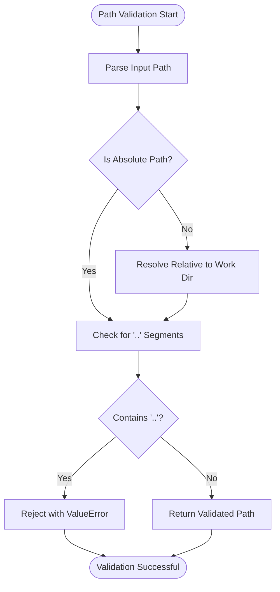
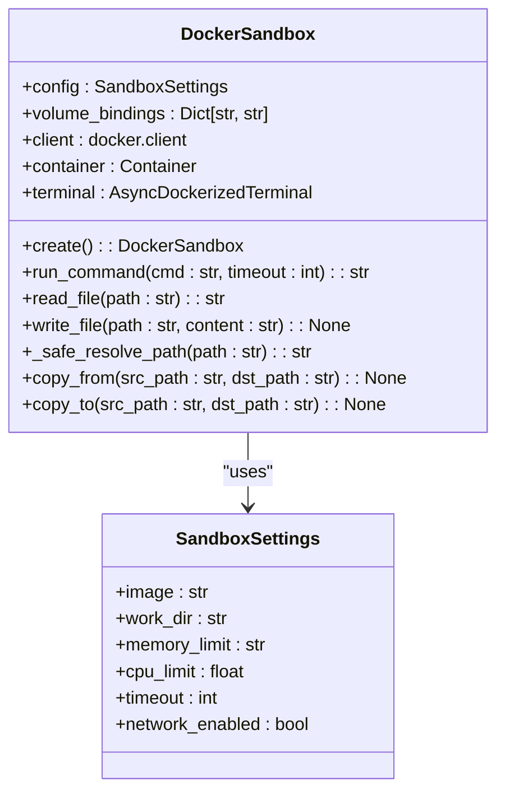
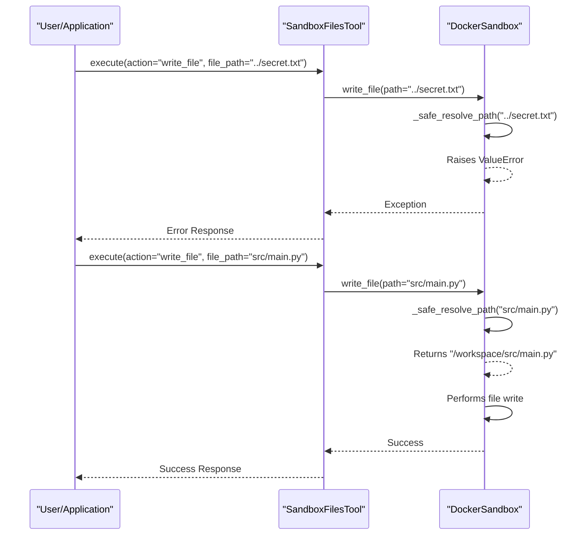
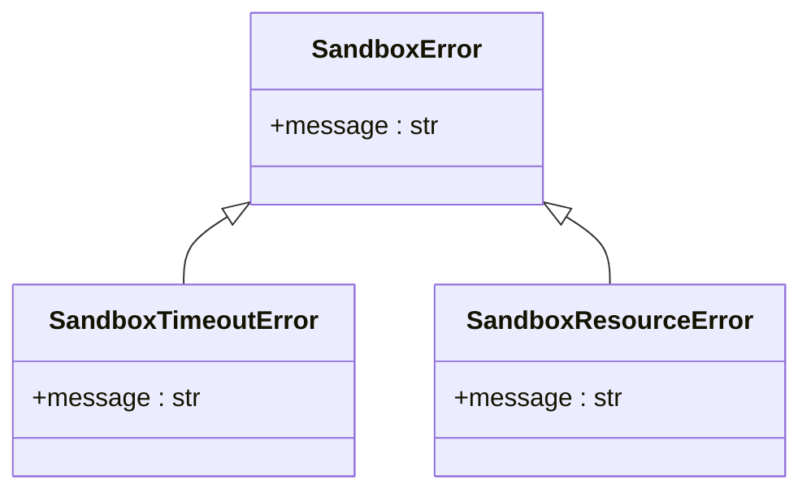

# Path Validation

<cite>
**Referenced Files in This Document**   
- [sandbox.py](file://app/sandbox/core/sandbox.py)
- [exceptions.py](file://app/sandbox/core/exceptions.py)
- [sb_files_tool.py](file://app/tool/sandbox/sb_files_tool.py)
</cite>

## Table of Contents
1. [Introduction](#introduction)
2. [Path Validation Mechanism](#path-validation-mechanism)
3. [Core Implementation](#core-implementation)
4. [File Operations Integration](#file-operations-integration)
5. [Error Handling](#error-handling)
6. [Security Considerations](#security-considerations)
7. [Best Practices](#best-practices)

## Introduction

The OpenManus sandbox system implements a robust path validation mechanism to prevent directory traversal attacks and ensure all file operations remain within the designated sandbox environment. This document details the implementation of the `_safe_resolve_path` method, which serves as the cornerstone of the system's security model by validating input paths against the working directory boundary. The mechanism protects against common security threats such as path traversal attacks using '..' sequences and ensures that all file operations are properly scoped within the sandboxed environment.

**Section sources**
- [sandbox.py](file://app/sandbox/core/sandbox.py#L231-L252)

## Path Validation Mechanism

The path validation mechanism in OpenManus is designed to prevent directory traversal attacks by strictly validating all user-provided paths before any file operations are performed. The system ensures that all file access remains confined within the sandbox's working directory, preventing unauthorized access to files outside the designated workspace.

The validation process handles both absolute and relative paths differently. For relative paths, the system resolves them relative to the configured working directory. For absolute paths, the system accepts them directly but still subjects them to the same security checks. This dual approach provides flexibility while maintaining security.

The core security principle is that no file operation should be able to access files outside the sandbox environment. This is achieved through the `_safe_resolve_path` method, which acts as a gatekeeper for all file operations, ensuring that any attempt to traverse outside the working directory is immediately rejected.

**Diagram sources**
- [sandbox.py](file://app/sandbox/core/sandbox.py#L231-L252)

**Section sources**
- [sandbox.py](file://app/sandbox/core/sandbox.py#L231-L252)

## Core Implementation

The core implementation of path validation is centered around the `_safe_resolve_path` method in the `DockerSandbox` class. This method is responsible for safely resolving container paths while preventing path traversal attacks.

The method first checks for the presence of '..' segments in the path by splitting the path on '/' and examining each component. If any segment equals '..', the method immediately raises a `ValueError` with a descriptive message. This simple but effective check prevents directory traversal attacks by rejecting any path that attempts to move up the directory tree.

For valid paths, the method then resolves the path appropriately. If the input path is relative, it joins the path with the sandbox's configured working directory using `os.path.join`. If the path is absolute, it returns the path unchanged. This ensures that all resolved paths are properly normalized and anchored within the sandbox environment.

The implementation is designed to be simple and auditable, with minimal complexity to reduce the attack surface. By focusing on the critical security check (presence of '..') and using standard library functions for path resolution, the method provides strong security guarantees without unnecessary complexity.

**Diagram sources**
- [sandbox.py](file://app/sandbox/core/sandbox.py#L17-L461)

**Section sources**
- [sandbox.py](file://app/sandbox/core/sandbox.py#L231-L252)

## File Operations Integration

The path validation mechanism is integrated into all file operations within the sandbox system, ensuring consistent security across different types of file access. The `_safe_resolve_path` method is called by various file operation methods before performing any actual file I/O.

In the `read_file` and `write_file` methods, the input path is passed through `_safe_resolve_path` to obtain a validated path before any file operations are performed. Similarly, the `copy_from` and `copy_to` methods use the same validation mechanism when handling file paths for copy operations.

The `SandboxFilesTool` class, which provides a higher-level interface for file operations, also integrates with this validation system. When users perform file operations through this tool, the paths are ultimately validated by the underlying sandbox's path resolution mechanism. This layered approach ensures that security is enforced at both the API level and the implementation level.

The integration is seamless from the user's perspective - they simply provide file paths as usual, and the system automatically handles the validation. This design allows for secure file operations without requiring users to understand the underlying security mechanisms.

**Diagram sources**
- [sandbox.py](file://app/sandbox/core/sandbox.py#L183)
- [sandbox.py](file://app/sandbox/core/sandbox.py#L211)
- [sb_files_tool.py](file://app/tool/sandbox/sb_files_tool.py#L27)

**Section sources**
- [sandbox.py](file://app/sandbox/core/sandbox.py#L180-L220)
- [sb_files_tool.py](file://app/tool/sandbox/sb_files_tool.py#L27-L360)

## Error Handling

The path validation system uses a clear and consistent error handling approach. When an invalid path is detected, the `_safe_resolve_path` method raises a `ValueError` with a descriptive message indicating that the path contains potentially unsafe patterns.

This error is then propagated through the call stack, ultimately resulting in appropriate error responses to the user or calling application. The error handling is designed to provide enough information for debugging while not revealing sensitive system details.

The system also defines a hierarchy of sandbox-related exceptions in the `exceptions.py` file, with `SandboxError` as the base class. While the path validation itself raises a standard `ValueError`, other sandbox operations may raise more specific exceptions that inherit from `SandboxError`, providing a consistent error handling framework across the entire sandbox system.

The error handling approach prioritizes security by failing fast when invalid paths are detected, rather than attempting to sanitize or correct potentially malicious input. This "fail-fast" principle ensures that any attempt to bypass the security controls is immediately stopped.

**Diagram sources**
- [exceptions.py](file://app/sandbox/core/exceptions.py#L7-L17)

**Section sources**
- [exceptions.py](file://app/sandbox/core/exceptions.py#L7-L17)
- [sandbox.py](file://app/sandbox/core/sandbox.py#L231-L252)

## Security Considerations

The path validation mechanism addresses several important security considerations beyond basic directory traversal prevention. While the current implementation effectively blocks paths containing '..' segments, there are additional security aspects to consider.

One consideration is symlink traversal attacks, where an attacker might create symbolic links that point outside the sandbox directory. The current implementation does not explicitly handle this scenario, as it relies on Docker's container isolation to prevent access to files outside the mounted volumes. However, additional validation could be implemented to resolve symlinks and ensure they don't lead outside the allowed directory tree.

Another consideration is the use of other path manipulation techniques, such as using multiple consecutive slashes ('//') or encoded characters. The current implementation relies on Python's `os.path` functions, which typically normalize these patterns, but explicit validation could provide additional assurance.

The system also needs to consider timing attacks and other side-channel vulnerabilities, though the simple nature of the path validation check makes this less likely. The validation is performed synchronously and quickly, minimizing the potential for timing-based attacks.

Overall, the security model relies on defense in depth, combining the path validation at the application level with Docker's container isolation at the system level to provide robust protection against file system access violations.

**Section sources**
- [sandbox.py](file://app/sandbox/core/sandbox.py#L231-L252)
- [exceptions.py](file://app/sandbox/core/exceptions.py#L7-L17)

## Best Practices

When implementing custom tools that handle user-provided file paths in the OpenManus system, several best practices should be followed to maintain security:

1. Always use the sandbox's path validation mechanism rather than implementing custom path handling logic. This ensures consistency and leverages the tested security controls.

2. Prefer relative paths over absolute paths when possible, as they are automatically resolved relative to the working directory and provide an additional layer of protection.

3. Validate file paths early in the processing pipeline, following the "fail-fast" principle. Reject invalid paths immediately rather than attempting to sanitize them.

4. Use the provided file operation methods (read_file, write_file, etc.) rather than direct file system access, as these methods automatically apply the path validation.

5. Be cautious with path concatenation operations, as they can inadvertently create invalid paths. Use `os.path.join` or similar functions to properly handle path components.

6. Consider the principle of least privilege when designing file operations - only allow access to the minimum set of files necessary for the operation.

7. Log path validation failures for monitoring and auditing purposes, but avoid logging the full path to prevent potential information leakage.

Following these best practices ensures that custom tool implementations maintain the same high security standards as the core sandbox system.

**Section sources**
- [sandbox.py](file://app/sandbox/core/sandbox.py#L231-L252)
- [sb_files_tool.py](file://app/tool/sandbox/sb_files_tool.py#L27-L360)