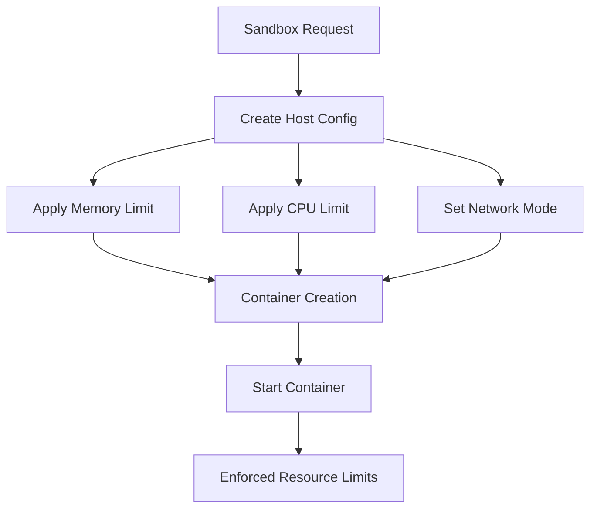
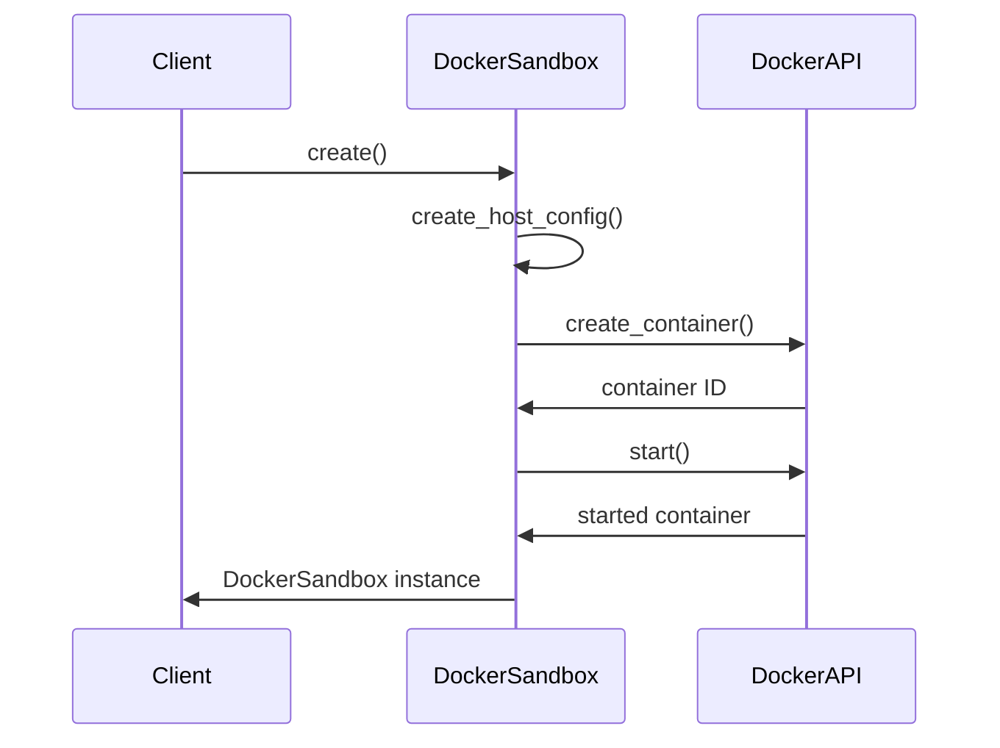
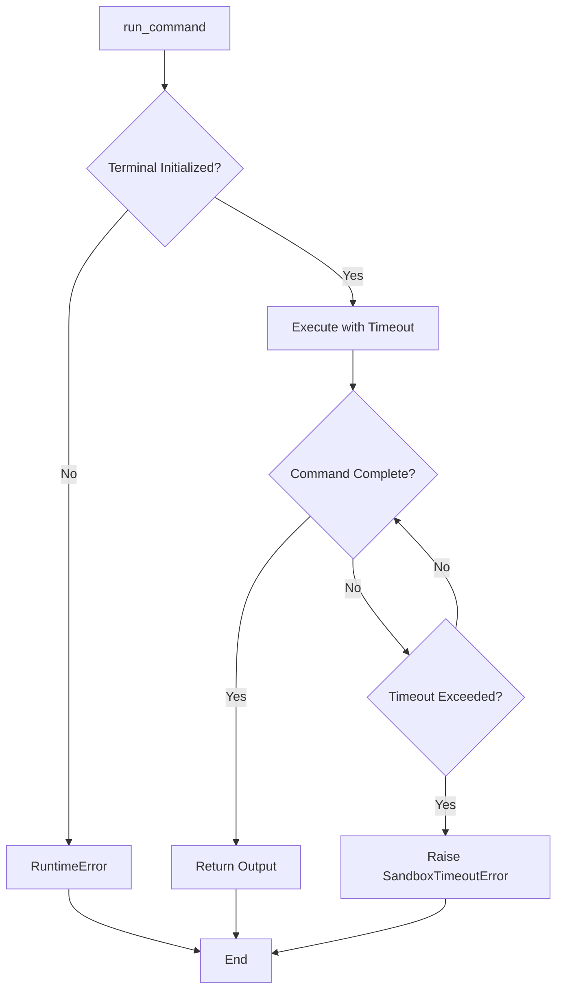

# Resource Limits

<cite>
**Referenced Files in This Document**   
- [SandboxSettings](file://app/config.py#L93-L104)
- [DockerSandbox](file://app/sandbox/core/sandbox.py#L17-L461)
- [AsyncDockerizedTerminal](file://app/sandbox/core/terminal.py#L250-L345)
- [SandboxTimeoutError](file://app/sandbox/core/exceptions.py#L11-L12)
- [config.example.toml](file://config/config.example.toml#L85-L92)
</cite>

## Table of Contents
1. [Introduction](#introduction)
2. [Resource Enforcement Mechanism](#resource-enforcement-mechanism)
3. [Configuration Parameters](#configuration-parameters)
4. [Container Creation Process](#container-creation-process)
5. [Command Execution and Timeout](#command-execution-and-timeout)
6. [Practical Implementation Examples](#practical-implementation-examples)
7. [Best Practices for Resource Tuning](#best-practices-for-resource-tuning)
8. [Common Issues and Troubleshooting](#common-issues-and-troubleshooting)
9. [Conclusion](#conclusion)

## Introduction
The OpenManus sandbox system implements robust resource limits to prevent denial-of-service attacks and ensure stable execution of untrusted code. By leveraging Docker's built-in resource management capabilities, the system enforces strict CPU and memory quotas while providing configurable timeout mechanisms for command execution. This documentation details how these resource limits are configured, applied, and enforced throughout the sandbox lifecycle.

**Section sources**
- [DockerSandbox](file://app/sandbox/core/sandbox.py#L17-L461)
- [SandboxSettings](file://app/config.py#L93-L104)

## Resource Enforcement Mechanism
The OpenManus sandbox system enforces resource limits through Docker's host configuration system, which provides kernel-level isolation and quota enforcement. When a sandbox container is created, resource constraints are applied at the container level using Docker's API, ensuring that processes cannot exceed their allocated CPU and memory resources.

The system uses cgroups (control groups) to enforce these limits, which are a Linux kernel feature that limits, accounts for, and isolates the resource usage of a collection of processes. Memory limits prevent containers from consuming excessive RAM that could destabilize the host system, while CPU limits ensure fair distribution of processing time among competing containers.

**Diagram sources**
- [DockerSandbox](file://app/sandbox/core/sandbox.py#L48-L87)
- [DockerSandbox](file://app/sandbox/core/sandbox.py#L89-L127)

**Section sources**
- [DockerSandbox](file://app/sandbox/core/sandbox.py#L48-L87)

## Configuration Parameters
Resource limits are controlled through the `SandboxSettings` configuration class, which defines the default constraints applied to all sandbox containers. These settings can be customized in the application's configuration file and provide fine-grained control over resource allocation.

The key configuration parameters include:

| Parameter | Default Value | Description |
|---------|-------------|-------------|
| memory_limit | "512m" | Maximum memory allocation for the container |
| cpu_limit | 1.0 | CPU time allocation as a fraction of total CPU capacity |
| timeout | 300 | Default command execution timeout in seconds |
| use_sandbox | false | Whether to enable sandboxing |
| image | "python:3.12-slim" | Base Docker image for the sandbox |
| work_dir | "/workspace" | Working directory inside the container |
| network_enabled | false | Whether to allow network access |

These parameters are defined in the `SandboxSettings` Pydantic model and can be overridden in the application's configuration file. The memory limit follows Docker's format, accepting values like "512m", "1g", or "2048m" to specify memory allocation in megabytes or gigabytes.

**Section sources**
- [SandboxSettings](file://app/config.py#L93-L104)
- [config.example.toml](file://config/config.example.toml#L85-L92)

## Container Creation Process
During container creation, the OpenManus system applies resource limits through Docker's `create_host_config` method, which generates the host configuration object containing all resource constraints. This configuration is then passed to the container creation API, ensuring that limits are enforced from the moment the container starts.

The CPU limit is implemented using Docker's cpu_quota and cpu_period parameters. With a fixed cpu_period of 100,000 microseconds, the cpu_quota is calculated as 100,000 multiplied by the cpu_limit value. For example, a cpu_limit of 1.0 allows the container to use 100% of one CPU core, while a limit of 0.5 restricts it to 50% of a core's processing time.

**Diagram sources**
- [DockerSandbox](file://app/sandbox/core/sandbox.py#L48-L87)
- [DockerSandbox](file://app/sandbox/core/sandbox.py#L89-L127)

**Section sources**
- [DockerSandbox](file://app/sandbox/core/sandbox.py#L48-L87)

## Command Execution and Timeout
The sandbox system implements a comprehensive timeout mechanism to prevent infinite loops and long-running operations. Each command execution is subject to a configurable timeout period, with the default set to 300 seconds (5 minutes). This timeout can be overridden on a per-command basis when calling the `run_command` method.

When a command execution exceeds its timeout limit, the system raises a `SandboxTimeoutError`, which is caught and handled appropriately by the calling code. The timeout is enforced at the terminal session level, where the `AsyncDockerizedTerminal` class uses asyncio's `wait_for` function to monitor command execution duration.

The timeout mechanism works in conjunction with Docker's resource limits to provide layered protection against resource exhaustion. While CPU and memory limits prevent excessive resource consumption, the timeout mechanism ensures that processes cannot run indefinitely, even if they remain within their resource quotas.

**Diagram sources**
- [DockerSandbox](file://app/sandbox/core/sandbox.py#L129-L172)
- [AsyncDockerizedTerminal](file://app/sandbox/core/terminal.py#L315-L331)

**Section sources**
- [DockerSandbox](file://app/sandbox/core/sandbox.py#L129-L172)
- [SandboxTimeoutError](file://app/sandbox/core/exceptions.py#L11-L12)

## Practical Implementation Examples
The resource limit implementation can be observed in several key components of the OpenManus system. The `DockerSandbox` class applies resource constraints during container creation by calling `create_host_config` with the configured memory and CPU limits. This ensures that all containers are created with the appropriate resource quotas.

In the `run_command` method, the system enforces execution timeouts by passing the configured timeout value to the terminal session. If no timeout is specified for a particular command, the default timeout from the `SandboxSettings` is used. This provides flexibility while maintaining safety defaults.

The `SandboxManager` class works in conjunction with these resource limits by managing the lifecycle of sandbox instances and ensuring that resource cleanup occurs properly when sandboxes are destroyed. This prevents resource leaks and ensures that system resources are freed when no longer needed.

**Section sources**
- [DockerSandbox](file://app/sandbox/core/sandbox.py#L17-L461)
- [AsyncDockerizedTerminal](file://app/sandbox/core/terminal.py#L250-L345)
- [SandboxManager](file://app/sandbox/core/manager.py#L0-L313)

## Best Practices for Resource Tuning
When configuring resource limits for production deployments, several best practices should be followed to balance security, performance, and reliability:

1. **Start with conservative limits**: Begin with lower resource allocations and gradually increase based on observed workload requirements.

2. **Monitor resource usage**: Implement monitoring to track actual resource consumption and adjust limits accordingly.

3. **Consider workload characteristics**: CPU-intensive tasks may require higher CPU limits, while memory-intensive operations need increased memory allocation.

4. **Balance timeout values**: Set timeouts long enough to allow legitimate operations to complete, but short enough to prevent resource exhaustion.

5. **Test with realistic workloads**: Validate resource limits using representative workloads to ensure they meet performance requirements.

6. **Plan for peak loads**: Account for temporary spikes in resource usage by setting limits that accommodate expected peaks.

7. **Document configuration rationale**: Maintain documentation explaining the reasoning behind specific limit values for future reference and troubleshooting.

**Section sources**
- [SandboxSettings](file://app/config.py#L93-L104)
- [config.example.toml](file://config/config.example.toml#L85-L92)

## Common Issues and Troubleshooting
Several common issues may arise when working with resource-limited sandboxes, particularly related to insufficient memory allocation for Python operations. Python's memory management can be unpredictable, especially when dealing with large data structures or complex computations, potentially causing containers to hit memory limits unexpectedly.

To address insufficient memory allocation:
- Increase the memory_limit parameter in SandboxSettings
- Optimize code to use memory more efficiently
- Process large datasets in smaller chunks
- Use streaming operations instead of loading entire datasets into memory

For timeout-related issues:
- Increase the timeout value for long-running operations
- Break complex operations into smaller, discrete steps
- Implement progress reporting to monitor execution
- Use asynchronous processing where appropriate

When troubleshooting resource limit issues, examine the error messages and logs to determine whether the problem is related to memory, CPU, or timeout constraints, then adjust the corresponding configuration parameter accordingly.

**Section sources**
- [SandboxSettings](file://app/config.py#L93-L104)
- [SandboxTimeoutError](file://app/sandbox/core/exceptions.py#L11-L12)

## Conclusion
The OpenManus sandbox system provides a robust framework for enforcing resource limits through Docker's containerization technology. By implementing strict CPU and memory quotas along with configurable timeout mechanisms, the system effectively prevents denial-of-service attacks and ensures stable execution of untrusted code. The configuration-driven approach allows for flexible tuning of resource limits based on specific workload requirements and system capacity, making it suitable for both development and production environments. Proper configuration and monitoring of these resource limits are essential for maintaining system stability and security.