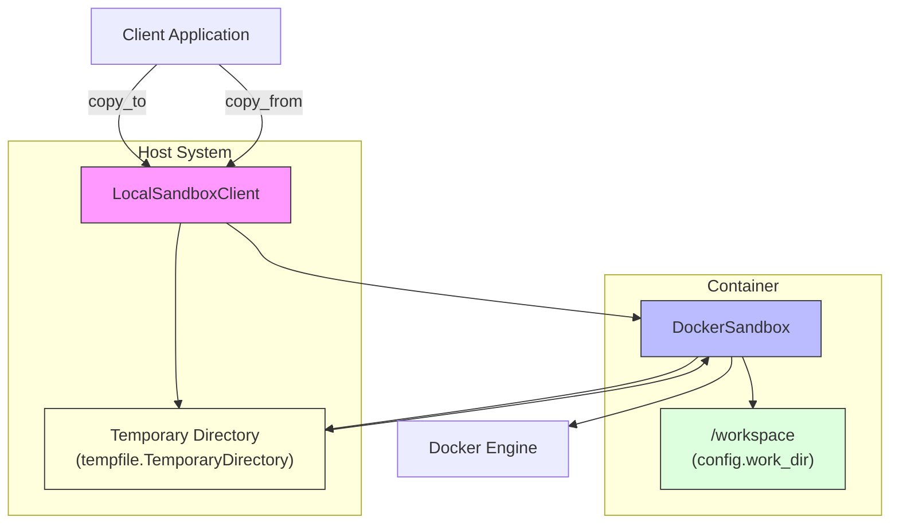
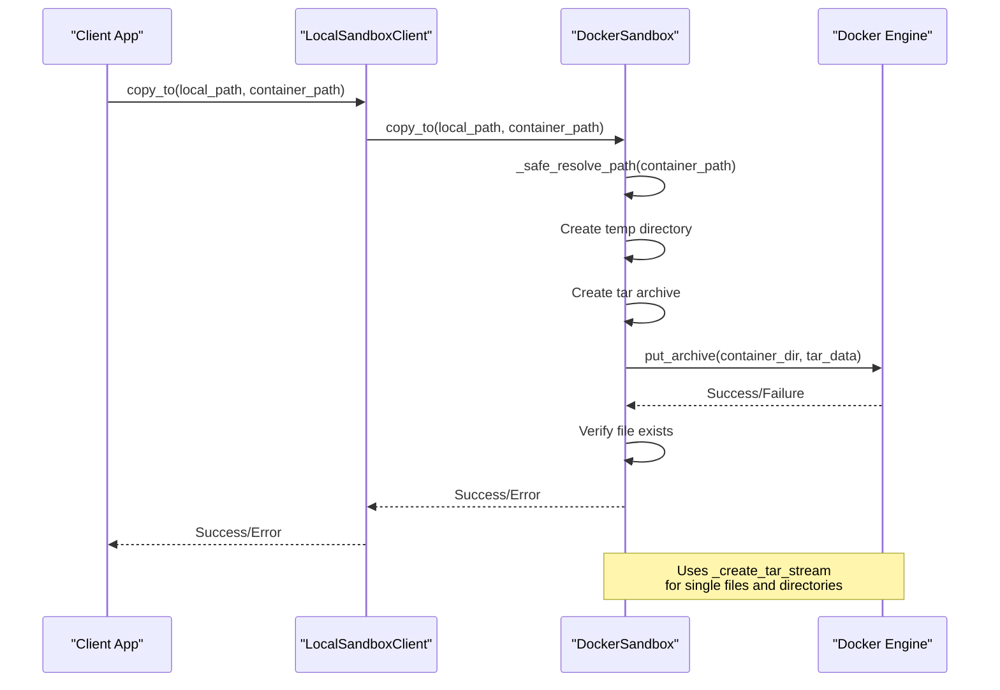
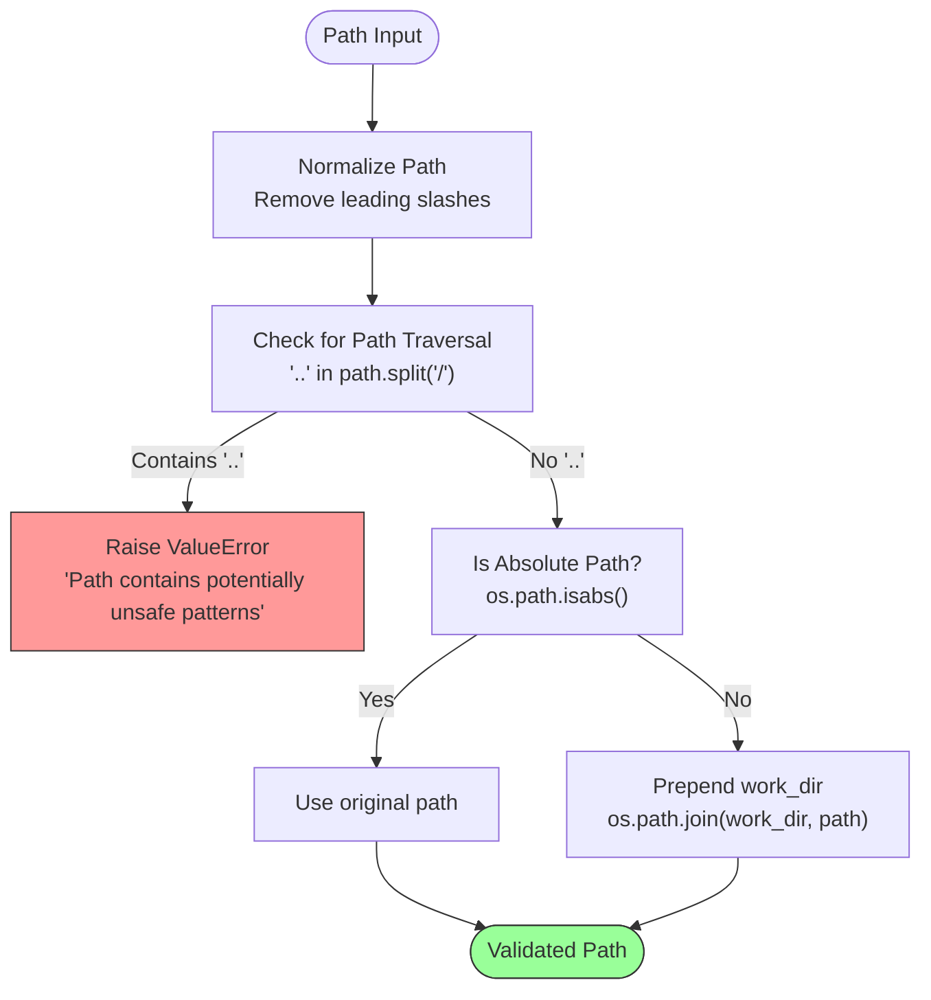
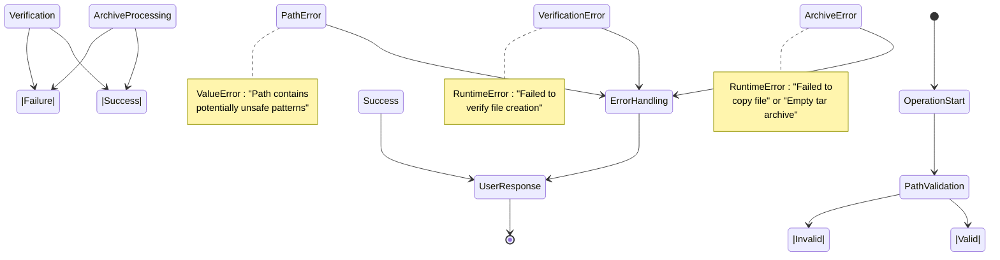
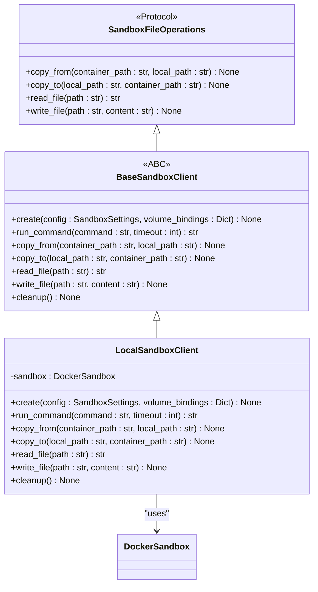

# Secure File Operations

<cite>
**Referenced Files in This Document**   
- [sb_files_tool.py](file://app/tool/sandbox/sb_files_tool.py)
- [sandbox.py](file://app/sandbox/core/sandbox.py)
- [client.py](file://app/sandbox/client.py)
- [files_utils.py](file://app/utils/files_utils.py)
- [exceptions.py](file://app/sandbox/core/exceptions.py)
</cite>

## Table of Contents
1. [Introduction](#introduction)
2. [Secure File Transfer Architecture](#secure-file-transfer-architecture)
3. [Tar Streaming Implementation](#tar-streaming-implementation)
4. [Path Validation and Security](#path-validation-and-security)
5. [Copy Operations and Validation](#copy-operations-and-validation)
6. [Temporary File Handling](#temporary-file-handling)
7. [Error Handling and Security Considerations](#error-handling-and-security-considerations)
8. [Practical Usage Examples](#practical-usage-examples)
9. [Security Best Practices](#security-best-practices)

## Introduction
The OpenManus sandbox system implements secure file operations through a comprehensive architecture designed to prevent common vulnerabilities associated with file handling in containerized environments. This document details the implementation of secure file transfer using tar streaming for both upload (put_archive) and download (get_archive) operations, focusing on the mechanisms that protect against archive extraction vulnerabilities, path traversal attacks, and race conditions. The system provides a robust foundation for handling untrusted file content while maintaining operational integrity.

## Secure File Transfer Architecture

**Diagram sources**
- [client.py](file://app/sandbox/client.py#L85-L188)
- [sandbox.py](file://app/sandbox/core/sandbox.py#L17-L461)

**Section sources**
- [client.py](file://app/sandbox/client.py#L85-L188)
- [sandbox.py](file://app/sandbox/core/sandbox.py#L17-L461)

## Tar Streaming Implementation

The secure file transfer mechanism relies on tar streaming for both upload and download operations, ensuring binary data is handled safely while preventing archive extraction vulnerabilities like zip bombs or malicious file paths. The `_create_tar_stream` and `_read_from_tar` methods form the core of this implementation.

**Diagram sources**
- [sandbox.py](file://app/sandbox/core/sandbox.py#L377-L393)
- [sandbox.py](file://app/sandbox/core/sandbox.py#L396-L422)
- [sandbox.py](file://app/sandbox/core/sandbox.py#L314-L374)

### Tar Stream Creation
The `_create_tar_stream` method safely packages file content into a tar format for transmission to the container. This static method creates an in-memory tar stream using `io.BytesIO`, ensuring that no temporary files are written to disk during the creation process. The method sets explicit file size metadata in the TarInfo object, which helps prevent zip bomb attacks by ensuring the container's extraction process knows the exact size of the content beforehand.

**Section sources**
- [sandbox.py](file://app/sandbox/core/sandbox.py#L377-L393)

### Tar Stream Reading
The `_read_from_tar` method handles the extraction of file content from tar streams received from the container. It uses a temporary named file to buffer the incoming stream, which is then processed using Python's tarfile module. The method includes validation checks for empty archives and failed file extraction, raising appropriate runtime errors when issues are detected. This approach ensures that corrupted or malicious archives are detected before any content is returned to the client.

**Section sources**
- [sandbox.py](file://app/sandbox/core/sandbox.py#L396-L422)

## Path Validation and Security

**Diagram sources**
- [sandbox.py](file://app/sandbox/core/sandbox.py#L231-L252)

**Section sources**
- [sandbox.py](file://app/sandbox/core/sandbox.py#L231-L252)
- [files_utils.py](file://app/utils/files_utils.py#L40-L87)

The `_safe_resolve_path` method implements critical path validation to prevent directory traversal attacks. The method first checks for the presence of ".." components in the path, which could be used to escape the sandboxed environment. If no traversal patterns are detected, the method resolves relative paths by prepending the configured working directory (`/workspace` by default), while preserving absolute paths. This dual approach ensures that all file operations are constrained within the designated sandbox area.

Additionally, the `clean_path` function in `files_utils.py` provides supplementary path normalization by removing workspace prefixes and leading slashes, further reducing the risk of malformed paths being processed by the system.

## Copy Operations and Validation

The `copy_from` and `copy_to` methods implement secure file transfer between the host and container environments with comprehensive validation at each step.

### Copy to Container (Upload)
The `copy_to` operation includes multiple validation steps:
1. Source file existence check on the host system
2. Destination directory creation in the container using `mkdir -p`
3. Temporary directory creation for tar archive generation
4. Post-copy verification using the `test -e` command

When handling directory uploads, the method preserves the relative path structure by using `os.path.relpath` to calculate archive member names. This ensures that directory hierarchies are maintained during transfer while preventing absolute path injection.

**Section sources**
- [sandbox.py](file://app/sandbox/core/sandbox.py#L314-L374)

### Copy from Container (Download)
The `copy_from` operation implements similar security measures:
1. Destination parent directory creation on the host
2. Temporary directory usage for archive extraction
3. Empty archive detection
4. Type consistency validation (preventing directory-to-file conflicts)

The method distinguishes between file and directory destinations, extracting all members when the destination is a directory, or only the first member when the destination is a file. This prevents accidental overwrites and ensures predictable behavior.

**Section sources**
- [sandbox.py](file://app/sandbox/core/sandbox.py#L254-L312)

## Temporary File Handling

```mermaid
flowchart TD
subgraph "copy_to Operation"
CreateTempDir["Create TemporaryDirectory"]
CreateTar["Create temp.tar in tmp_dir"]
ReadTar["Read tar data into memory"]
DeleteTemp["Automatically delete tmp_dir"]
end
subgraph "copy_from Operation"
CreateTempDir2["Create TemporaryDirectory"]
WriteStream["Write stream to temp.tar"]
ExtractFile["Extract from temp.tar"]
DeleteTemp2["Automatically delete tmp_dir"]
end
CreateTempDir --> CreateTar --> ReadTar --> DeleteTemp
CreateTempDir2 --> WriteStream --> ExtractFile --> DeleteTemp2
style CreateTempDir fill:#ffd,stroke:#333
style CreateTempDir2 fill:#ffd,stroke:#333
style DeleteTemp fill:#dfd,stroke:#333
style DeleteTemp2 fill:#dfd,stroke:#333
```

**Diagram sources**
- [sandbox.py](file://app/sandbox/core/sandbox.py#L254-L312)
- [sandbox.py](file://app/sandbox/core/sandbox.py#L314-L374)

Both `copy_from` and `copy_to` operations use Python's `tempfile.TemporaryDirectory` context manager to create isolated temporary spaces for tar archive processing. This approach prevents race conditions by ensuring each operation has its own unique temporary directory, automatically cleaned up when the context exits. The use of context managers guarantees cleanup even if exceptions occur during processing.

For `copy_to`, the temporary directory holds the tar archive before upload, while for `copy_from`, it stores the downloaded archive before extraction. This separation of concerns ensures that temporary files never interfere with the main workspace or with concurrent operations.

**Section sources**
- [sandbox.py](file://app/sandbox/core/sandbox.py#L254-L312)
- [sandbox.py](file://app/sandbox/core/sandbox.py#L314-L374)

## Error Handling and Security Considerations

The system implements comprehensive error handling to address various failure scenarios:

**Diagram sources**
- [sandbox.py](file://app/sandbox/core/sandbox.py#L254-L312)
- [sandbox.py](file://app/sandbox/core/sandbox.py#L314-L374)
- [exceptions.py](file://app/sandbox/core/exceptions.py#L1-L17)

The system raises specific exceptions for different error conditions:
- `ValueError` for path traversal attempts
- `FileNotFoundError` for missing source files
- `RuntimeError` for general file operation failures
- `SandboxTimeoutError` for command execution timeouts

The `should_exclude_file` function in `files_utils.py` provides an additional security layer by filtering out potentially problematic files based on name, directory, or extension. This prevents operations on system files, configuration files, and binary assets that could pose security risks.

**Section sources**
- [sandbox.py](file://app/sandbox/core/sandbox.py#L254-L312)
- [sandbox.py](file://app/sandbox/core/sandbox.py#L314-L374)
- [exceptions.py](file://app/sandbox/core/exceptions.py#L1-L17)
- [files_utils.py](file://app/utils/files_utils.py#L40-L75)

## Practical Usage Examples

The secure file operations are accessible through the `LocalSandboxClient` interface, which provides a clean API for file transfers:

**Diagram sources**
- [client.py](file://app/sandbox/client.py#L7-L46)
- [client.py](file://app/sandbox/client.py#L49-L82)
- [client.py](file://app/sandbox/client.py#L85-L188)

Typical usage patterns include uploading source code to the sandbox, downloading generated files, and reading configuration files. The client automatically handles sandbox initialization and cleanup, ensuring resources are properly managed.

**Section sources**
- [client.py](file://app/sandbox/client.py#L7-L46)
- [client.py](file://app/sandbox/client.py#L49-L82)
- [client.py](file://app/sandbox/client.py#L85-L188)

## Security Best Practices

Based on the implementation analysis, the following security best practices should be observed when implementing custom file-handling tools:

1. **Always validate paths** using `_safe_resolve_path` or similar mechanisms to prevent directory traversal
2. **Use temporary directories** for all intermediate file operations to prevent race conditions
3. **Verify operations** through post-execution checks (e.g., file existence verification)
4. **Handle binary data safely** by using proper encoding/decoding and avoiding string operations on binary content
5. **Implement comprehensive error handling** to gracefully handle corrupted archives and missing files
6. **Filter excluded files** using the `should_exclude_file` function to avoid processing potentially dangerous files
7. **Limit archive size** through configuration to prevent zip bomb attacks
8. **Use context managers** for resource cleanup to ensure temporary files are always removed

These practices ensure that file operations remain secure even when handling untrusted content, maintaining the integrity of the sandboxed environment.

**Section sources**
- [sandbox.py](file://app/sandbox/core/sandbox.py#L231-L252)
- [sandbox.py](file://app/sandbox/core/sandbox.py#L254-L312)
- [sandbox.py](file://app/sandbox/core/sandbox.py#L314-L374)
- [files_utils.py](file://app/utils/files_utils.py#L40-L75)