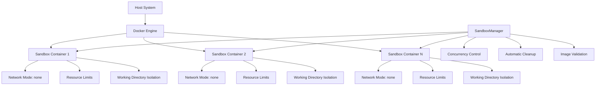
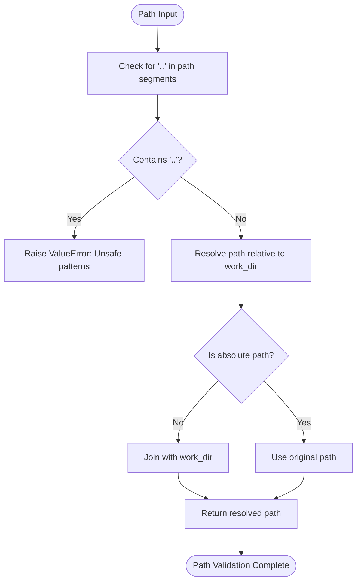
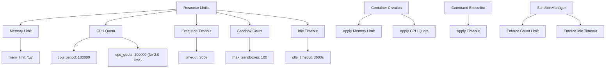
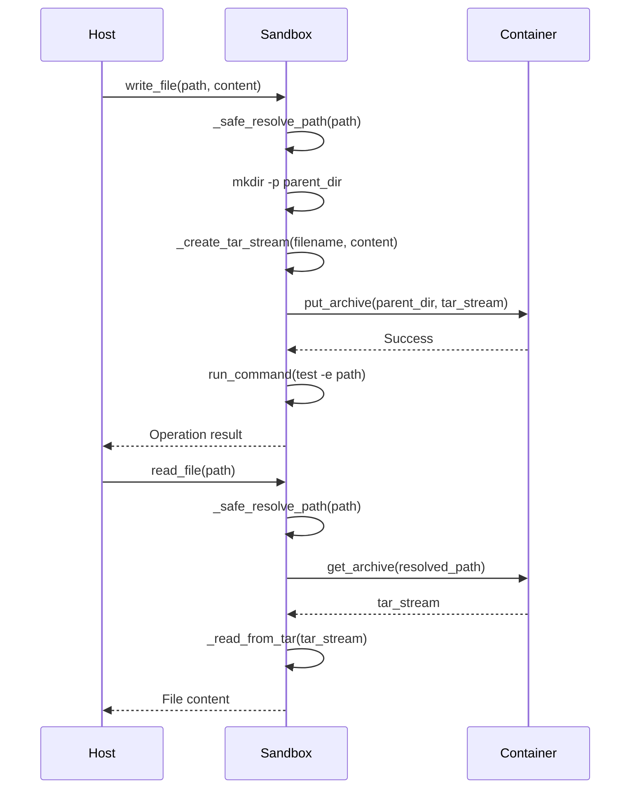
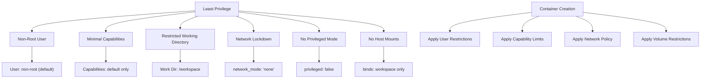
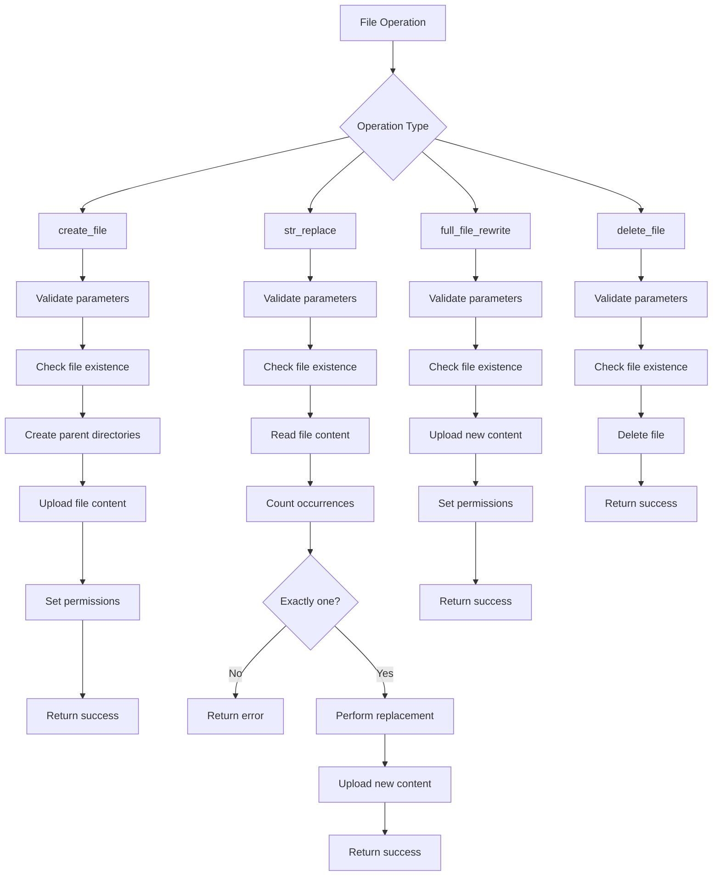

# Security Model

<cite>
**Referenced Files in This Document**   
- [DockerSandbox](file://app/sandbox/core/sandbox.py)
- [SandboxManager](file://app/sandbox/core/manager.py)
- [SandboxFilesTool](file://app/tool/sandbox/sb_files_tool.py)
- [LocalSandboxClient](file://app/sandbox/client.py)
- [config.example.toml](file://config/config.example.toml)
</cite>

## Table of Contents
1. [Introduction](#introduction)
2. [Defense-in-Depth Architecture](#defense-in-depth-architecture)
3. [Path Traversal Prevention](#path-traversal-prevention)
4. [Resource Limitation Controls](#resource-limitation-controls)
5. [Secure File Operations](#secure-file-operations)
6. [Principle of Least Privilege](#principle-of-least-privilege)
7. [Security Enforcement in File Operations](#security-enforcement-in-file-operations)
8. [Security Configuration Options](#security-configuration-options)
9. [Common Security Issues and Mitigations](#common-security-issues-and-mitigations)
10. [Conclusion](#conclusion)

## Introduction
The OpenManus sandbox system implements a comprehensive security model designed to safely execute untrusted code through multiple layers of protection. This document details the defense-in-depth approach that combines container isolation, network lockdown, application-level security controls, and resource limitations to create a secure execution environment. The system is architected to prevent common attack vectors such as path traversal, container escape, denial-of-service attacks, and insecure file operations while maintaining functionality for legitimate use cases.

## Defense-in-Depth Architecture
The OpenManus sandbox system employs a multi-layered defense strategy that combines Docker isolation, network lockdown, and application-level security controls to create a robust security posture. This defense-in-depth approach ensures that even if one security layer is compromised, additional layers remain to protect the host system and other sandboxes.

The architecture begins with Docker containerization, which provides process and filesystem isolation between the sandboxed environment and the host system. Each sandbox runs in its own Docker container with a unique identifier, preventing interference between different execution contexts. The container is configured with minimal privileges and restricted capabilities to reduce the attack surface.

Network isolation is implemented through the `network_mode="none"` configuration when network access is disabled. This complete network lockdown prevents sandboxed code from making outbound connections or receiving inbound requests, eliminating network-based attack vectors. When network access is required, it can be selectively enabled through configuration, but defaults to disabled for maximum security.

Application-level security controls are enforced through the SandboxManager, which orchestrates the lifecycle of sandbox instances with concurrency control and automatic cleanup mechanisms. The manager enforces limits on the maximum number of concurrent sandboxes and automatically terminates idle instances after a configurable timeout period, preventing resource exhaustion attacks.

**Diagram sources**
- [DockerSandbox](file://app/sandbox/core/sandbox.py#L48-L87)
- [SandboxManager](file://app/sandbox/core/manager.py#L13-L312)

**Section sources**
- [DockerSandbox](file://app/sandbox/core/sandbox.py#L17-L461)
- [SandboxManager](file://app/sandbox/core/manager.py#L13-L312)

## Path Traversal Prevention
The OpenManus sandbox system implements robust path traversal prevention through the `_safe_resolve_path` method in the DockerSandbox class. This security mechanism validates all file paths to ensure they remain within the designated working directory, preventing malicious attempts to access files outside the sandboxed environment.

The path validation process begins by checking for the presence of ".." in the path components, which is a common pattern used in directory traversal attacks. If any path segment contains "..", the method raises a ValueError with a descriptive message indicating potentially unsafe patterns. This simple but effective check prevents basic traversal attempts that try to navigate up the directory tree.

For valid paths, the method resolves them relative to the configured working directory (`/workspace` by default). When a relative path is provided, it is joined with the working directory using `os.path.join()`. Absolute paths are accepted but still subject to the same security constraints, ensuring that even if an absolute path is specified, it cannot escape the sandbox boundaries.

The implementation handles both Unix and Windows path separators, normalizing paths appropriately to prevent bypass attempts using alternative path notations. This comprehensive validation ensures that all file operations are confined to the designated workspace, maintaining the integrity of the sandbox environment.

**Diagram sources**
- [DockerSandbox](file://app/sandbox/core/sandbox.py#L231-L252)

**Section sources**
- [DockerSandbox](file://app/sandbox/core/sandbox.py#L231-L252)

## Resource Limitation Controls
The OpenManus sandbox system implements comprehensive resource limitation controls to prevent denial-of-service attacks and ensure fair resource allocation among concurrent sandboxes. These controls are enforced at the Docker container level, providing hard limits that cannot be bypassed by malicious code within the sandbox.

Memory limits are configured through the `mem_limit` parameter in the container's host configuration. This limit specifies the maximum amount of RAM that the container can consume, preventing memory exhaustion attacks that could destabilize the host system. The limit is typically set to "1g" (1 gigabyte) by default but can be adjusted based on deployment requirements and available system resources.

CPU quotas are implemented using Docker's CPU period and quota mechanism. The system sets a CPU period of 100,000 microseconds (100ms) and calculates the quota based on the configured CPU limit. For example, a CPU limit of 2.0 allows the container to use up to 200,000 microseconds of CPU time per period, effectively limiting it to 2 CPU cores. This prevents compute-intensive attacks that could degrade system performance for other services.

Command execution timeouts are enforced through the `timeout` configuration parameter. When a command is executed within the sandbox, it is subject to this timeout limit, after which it will be terminated. This prevents infinite loops and long-running processes from consuming resources indefinitely. The timeout is applied consistently across all command execution methods, including direct command runs and file operations that may involve command execution.

The SandboxManager further enhances resource protection by enforcing limits on the total number of concurrent sandboxes (default: 100) and automatically cleaning up idle instances after a configurable timeout period (default: 3600 seconds). This multi-layered approach to resource management ensures that the system remains responsive and available even under heavy load or attack conditions.

**Diagram sources**
- [DockerSandbox](file://app/sandbox/core/sandbox.py#L48-L87)
- [SandboxManager](file://app/sandbox/core/manager.py#L13-L312)

**Section sources**
- [DockerSandbox](file://app/sandbox/core/sandbox.py#L48-L87)
- [SandboxManager](file://app/sandbox/core/manager.py#L13-L312)

## Secure File Operations
The OpenManus sandbox system implements secure file operations using tar streaming with proper validation to prevent archive extraction vulnerabilities. This approach ensures that file transfers between the host and container are performed safely without exposing the system to common archive-based attacks.

File reading operations use Docker's `get_archive` method to retrieve files as tar streams. The system reads the tar stream incrementally, avoiding loading the entire archive into memory at once, which prevents memory exhaustion attacks. During extraction, the system validates that the archive contains exactly one member when expecting a single file, preventing directory traversal attacks that exploit archive extraction vulnerabilities.

File writing operations use a similar tar streaming approach, creating a tar archive in memory with the specified file content and uploading it to the container. The system ensures that parent directories are created before writing files, but only within the allowed working directory. This prevents attempts to create directories outside the sandboxed environment.

The copy operations (`copy_from` and `copy_to`) include additional validation to prevent common security issues. When copying from the container to the host, the system verifies that the destination path exists and creates parent directories as needed, but only on the host side. When copying to the container, the system validates the source path on the host and ensures the destination is within the sandboxed environment.

The implementation also includes verification steps after file operations to confirm successful creation or modification. For example, after writing a file, the system executes a `test -e` command to verify the file exists, providing an additional layer of validation and error detection.

**Diagram sources**
- [DockerSandbox](file://app/sandbox/core/sandbox.py#L165-L229)
- [DockerSandbox](file://app/sandbox/core/sandbox.py#L314-L374)

**Section sources**
- [DockerSandbox](file://app/sandbox/core/sandbox.py#L165-L229)
- [DockerSandbox](file://app/sandbox/core/sandbox.py#L314-L374)

## Principle of Least Privilege
The OpenManus sandbox system adheres to the principle of least privilege by running container processes as non-root users with minimal capabilities. This security practice significantly reduces the potential impact of any successful attack by limiting the privileges available to code executing within the sandbox.

By default, containers are created without explicit user specification, inheriting the default user configuration of the base image. The recommended configuration uses the `python:3.12-slim` image, which runs as a non-root user, avoiding the elevated privileges associated with the root account. This prevents common privilege escalation attacks that rely on root access to modify system files or install malicious software.

The container configuration intentionally omits additional capabilities that would grant elevated privileges. Features such as mounting arbitrary volumes, accessing host devices, or using privileged mode are disabled by default. The network is locked down with `network_mode="none"` unless explicitly enabled, preventing network-based attacks and data exfiltration.

The working directory is restricted to `/workspace`, and all file operations are validated to ensure they remain within this directory. This containment strategy prevents access to sensitive system files and configuration directories that might exist elsewhere in the container filesystem.

The SandboxManager further enforces least privilege by isolating each sandbox instance and preventing cross-sandbox access. Sandboxes cannot interact with each other or access resources allocated to other instances, maintaining strict boundaries between different execution contexts.

**Diagram sources**
- [DockerSandbox](file://app/sandbox/core/sandbox.py#L48-L87)
- [DockerSandbox](file://app/sandbox/core/sandbox.py#L231-L252)

**Section sources**
- [DockerSandbox](file://app/sandbox/core/sandbox.py#L48-L87)
- [DockerSandbox](file://app/sandbox/core/sandbox.py#L231-L252)

## Security Enforcement in File Operations
The OpenManus sandbox system enforces security during file read/write operations through a combination of path validation, permission controls, and operation auditing. The SandboxFilesTool provides a secure interface for file operations, ensuring that all actions comply with the system's security policies.

File operations are mediated through the SandboxFilesTool, which validates all parameters before execution. The tool supports four main operations: create_file, str_replace, full_file_rewrite, and delete_file. Each operation requires specific parameters and is subject to validation rules that prevent unsafe operations.

Path cleaning is performed using the `clean_path` method, which normalizes paths and ensures they are relative to the workspace directory. The system also checks for excluded files based on name, path, or extension, preventing operations on sensitive files that might contain credentials or configuration data.

File creation operations verify that the target file does not already exist, preventing accidental overwrites. When creating files, the system creates parent directories as needed but only within the allowed workspace. File permissions are set according to the specified octal format, with a default of "644" for new files.

String replacement operations include additional validation to ensure the text to be replaced appears exactly once in the file. This prevents unintended modifications that could occur if multiple instances of the text exist. The system returns a snippet around the replacement to provide context for the change.

File deletion operations verify that the target file exists before attempting removal and return appropriate success or error messages. The system logs all file operations for auditing purposes, providing a record of changes made within the sandbox environment.

**Diagram sources**
- [SandboxFilesTool](file://app/tool/sandbox/sb_files_tool.py#L27-L360)

**Section sources**
- [SandboxFilesTool](file://app/tool/sandbox/sb_files_tool.py#L27-L360)

## Security Configuration Options
The OpenManus sandbox system provides several configuration options to customize security settings for production deployment. These options are defined in the configuration files and can be adjusted to balance security and functionality based on specific use cases and risk tolerance.

The primary security configuration options are defined in the `config.example.toml` file and include:

- **use_sandbox**: Enables or disables sandboxing (default: true)
- **image**: Specifies the Docker image to use for sandboxes (default: python:3.12-slim)
- **work_dir**: Sets the working directory within the container (default: /workspace)
- **memory_limit**: Configures the maximum memory allocation (default: 1g)
- **cpu_limit**: Sets the CPU quota as a multiple of CPU cores (default: 2.0)
- **timeout**: Defines the command execution timeout in seconds (default: 300)
- **network_enabled**: Controls whether network access is allowed (default: false)

For production deployment, it is recommended to maintain strict security settings while adjusting resource limits based on workload requirements. The memory limit should be set according to the expected memory usage of the tasks, with sufficient headroom to prevent legitimate operations from being terminated while avoiding excessive allocation that could enable denial-of-service attacks.

The CPU limit should be configured based on the available system resources and the desired level of compute isolation between sandboxes. A lower CPU limit provides better protection against compute-intensive attacks but may impact performance for legitimate workloads.

Network access should remain disabled unless explicitly required by the application, as this significantly reduces the attack surface. When network access is necessary, it should be implemented with additional monitoring and logging to detect potential abuse.

The idle timeout and maximum sandbox count settings in the SandboxManager should be tuned based on expected usage patterns. A shorter idle timeout conserves resources but may impact user experience if legitimate sessions are terminated prematurely.

**Section sources**
- [config.example.toml](file://config/config.example.toml#L1-L105)

## Common Security Issues and Mitigations
The OpenManus sandbox system addresses several common security issues through proactive mitigation strategies. These measures protect against container escape attempts, resource exhaustion, and insecure file operations that could compromise system integrity.

Container escape attempts are mitigated through multiple layers of protection. The use of non-root users prevents privilege escalation attacks that rely on root access. The restricted working directory and path validation prevent navigation to sensitive areas of the filesystem. Network lockdown with `network_mode="none"` eliminates network-based escape vectors. The principle of least privilege ensures that containers have minimal capabilities and cannot access host resources.

Resource exhaustion attacks are prevented through comprehensive resource limitation controls. Memory limits cap the amount of RAM a container can consume, preventing memory bombing attacks. CPU quotas limit compute resource usage, stopping infinite loops and compute-intensive operations from degrading system performance. Command execution timeouts terminate long-running processes, and the SandboxManager enforces limits on concurrent sandboxes and automatically cleans up idle instances.

Insecure file operations are addressed through path traversal prevention, secure tar streaming, and operation validation. The `_safe_resolve_path` method blocks attempts to access files outside the working directory by detecting ".." patterns. File operations use tar streaming with proper validation to prevent archive extraction vulnerabilities. The SandboxFilesTool validates all operations and parameters to ensure they comply with security policies.

Additional mitigations include automatic image validation, which ensures that required Docker images are available and pulls them if necessary. The system implements proper error handling and cleanup procedures to prevent resource leaks when operations fail. Logging and monitoring provide visibility into sandbox activities, enabling detection of suspicious behavior.

For production deployments, additional security measures can be implemented, such as running the Docker daemon with reduced privileges, using security-enhanced operating systems, implementing network segmentation, and regularly updating base images to incorporate security patches.

**Section sources**
- [DockerSandbox](file://app/sandbox/core/sandbox.py#L17-L461)
- [SandboxManager](file://app/sandbox/core/manager.py#L13-L312)
- [SandboxFilesTool](file://app/tool/sandbox/sb_files_tool.py#L27-L360)

## Conclusion
The OpenManus sandbox system implements a comprehensive security model that effectively balances functionality with robust protection against common attack vectors. Through a defense-in-depth approach combining Docker isolation, network lockdown, application-level security controls, and resource limitations, the system creates a secure environment for executing untrusted code.

The path traversal prevention mechanism in `_safe_resolve_path` provides a critical layer of protection by validating all file paths and restricting access to the working directory. Resource limitation controls for memory, CPU, and execution time prevent denial-of-service attacks and ensure fair resource allocation. Secure file operations using tar streaming with proper validation eliminate archive extraction vulnerabilities.

The principle of least privilege is consistently applied throughout the system, with containers running as non-root users and having minimal capabilities. The SandboxManager provides centralized control over sandbox lifecycle, enforcing concurrency limits and automatic cleanup to prevent resource exhaustion.

For production deployment, administrators should carefully configure security options based on their specific requirements, maintaining strict defaults while adjusting resource limits as needed. Regular monitoring, logging, and system updates are essential to maintain security over time.

The OpenManus security model demonstrates that with careful design and implementation, it is possible to create a sandbox environment that is both highly functional and resistant to common security threats.