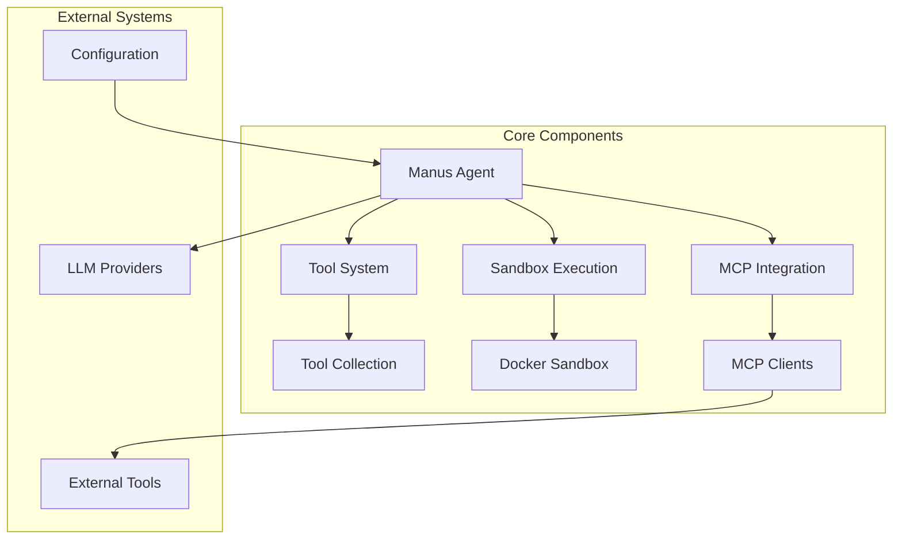
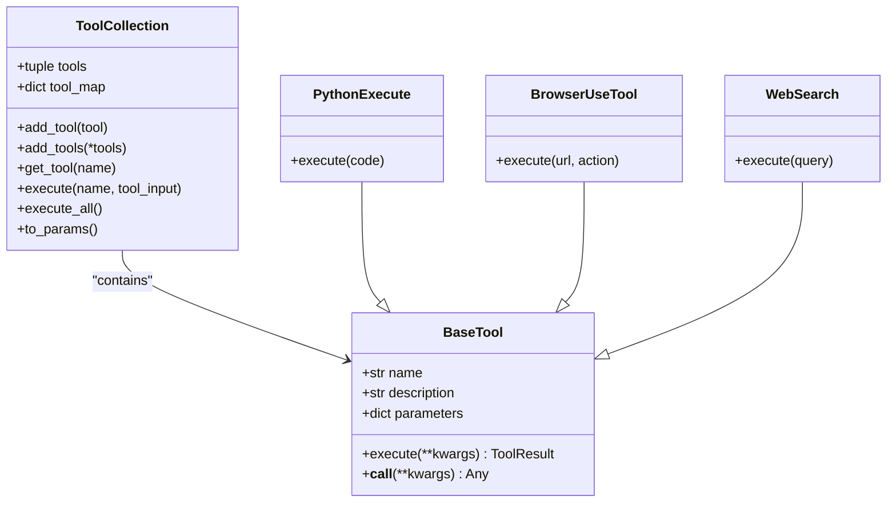
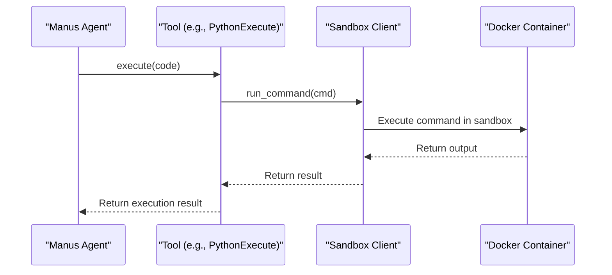
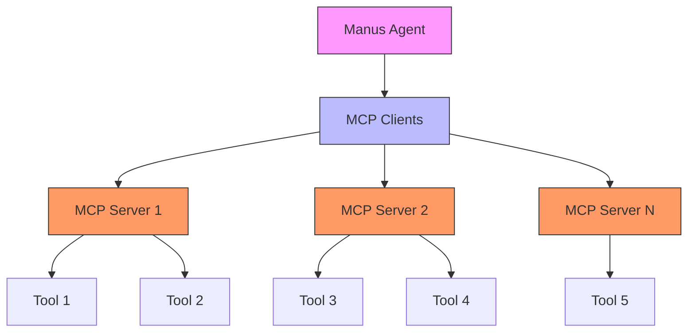
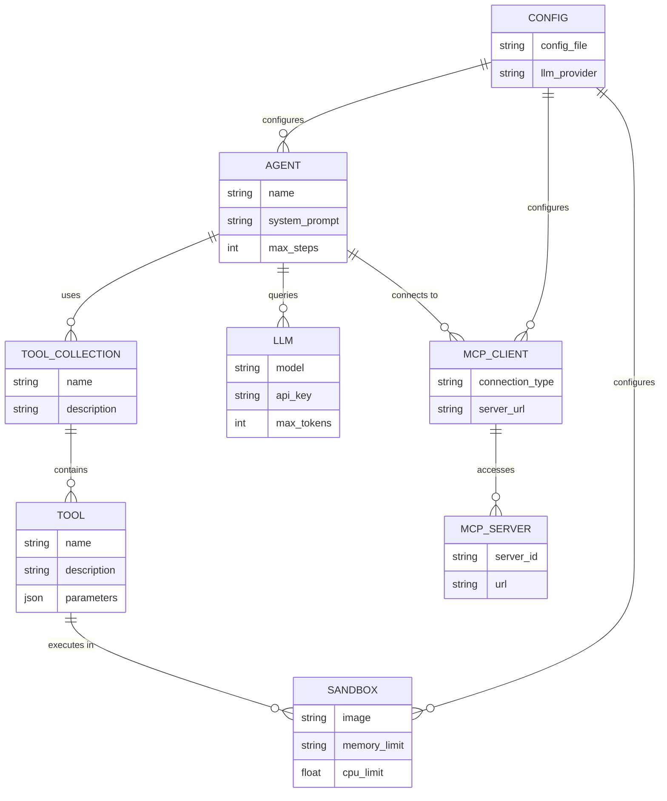

# Project Overview

<cite>
**Referenced Files in This Document**   
- [main.py](file://main.py)
- [app/agent/manus.py](file://app/agent/manus.py)
- [app/tool/tool_collection.py](file://app/tool/tool_collection.py)
- [app/sandbox/core/sandbox.py](file://app/sandbox/core/sandbox.py)
- [app/config.py](file://app/config.py)
- [app/llm.py](file://app/llm.py)
- [app/tool/mcp.py](file://app/tool/mcp.py)
- [app/mcp/server.py](file://app/mcp/server.py)
- [protocol/a2a/app/agent.py](file://protocol/a2a/app/agent.py)
- [config/config.example.toml](file://config/config.example.toml)
</cite>

## Table of Contents
1. [Introduction](#introduction)
2. [Core Architecture](#core-architecture)
3. [Manus Agent](#manus-agent)
4. [Tool System](#tool-system)
5. [Sandbox Execution](#sandbox-execution)
6. [MCP Integration](#mcp-integration)
7. [A2A Protocol Support](#a2a-protocol-support)
8. [Configuration System](#configuration-system)
9. [Key Features](#key-features)
10. [Use Cases](#use-cases)
11. [Component Relationships](#component-relationships)

## Introduction

OpenManus is an open-source framework designed for building general AI agents with advanced capabilities including tool integration, sandboxed execution, and multi-LLM support. The framework enables AI agents to perform complex tasks by orchestrating various tools while maintaining security through isolated execution environments. OpenManus supports multiple Large Language Models (LLMs) and provides a flexible architecture for extending agent capabilities through the Model Context Protocol (MCP) and A2A protocol integration. The system is designed to handle diverse use cases such as task automation, data analysis, and code generation, making it a versatile platform for developing intelligent agents.

## Core Architecture

The OpenManus framework follows a modular architecture with clearly defined components that work together to enable intelligent agent behavior. The core architecture consists of four main components: the Manus agent, the tool system, the sandbox execution environment, and MCP integration. These components interact through well-defined interfaces, allowing for flexible configuration and extension. The architecture is designed to be extensible, supporting the addition of new tools and capabilities without modifying the core agent logic. The system uses a configuration-driven approach, allowing users to customize agent behavior through TOML configuration files. This modular design enables the framework to support various use cases while maintaining a clean separation of concerns between components.

**Diagram sources**
- [app/agent/manus.py](file://app/agent/manus.py#L1-L165)
- [app/tool/tool_collection.py](file://app/tool/tool_collection.py#L1-L71)
- [app/sandbox/core/sandbox.py](file://app/sandbox/core/sandbox.py#L1-L462)

## Manus Agent

The Manus agent serves as the central component of the OpenManus framework, acting as the primary interface for task execution and orchestration. Implemented in the `Manus` class, this agent inherits from `ToolCallAgent` and extends its capabilities with support for both local and MCP-based tools. The agent is initialized through the `create()` class method, which handles asynchronous setup including MCP server connections. The Manus agent maintains a collection of available tools through the `ToolCollection` class and manages its state through a memory system that tracks conversation history and tool calls. The agent's behavior is controlled by system and next-step prompts that guide its decision-making process. Special tool names like "terminate" are used to signal task completion, allowing the agent to gracefully end interactions when appropriate.

**Section sources**
- [app/agent/manus.py](file://app/agent/manus.py#L1-L165)
- [main.py](file://main.py#L1-L36)

## Tool System

The tool system in OpenManus provides a flexible mechanism for extending agent capabilities through various tools. Tools are implemented as classes that inherit from the `BaseTool` class and are managed through the `ToolCollection` class. The tool collection maintains a registry of available tools, allowing for dynamic addition and execution of tools during agent operation. Each tool is defined with a name, description, and parameters schema, enabling the agent to understand and utilize the tool appropriately. The system supports various tool types including browser automation, code execution, web search, and file operations. Tools can be executed individually or in sequence through the tool collection's execution methods. The tool system is designed to be extensible, allowing developers to create new tools by implementing the base tool interface and adding them to the collection.

**Diagram sources**
- [app/tool/base.py](file://app/tool/base.py#L80-L117)
- [app/tool/tool_collection.py](file://app/tool/tool_collection.py#L1-L71)

## Sandbox Execution

The sandbox execution system in OpenManus provides a secure environment for running untrusted code through Docker containerization. Implemented in the `DockerSandbox` class, this system creates isolated containers with configurable resource limits for CPU, memory, and execution time. The sandbox allows for file operations, command execution, and data transfer between the host and container environments. Security features include network isolation (disabled by default), path traversal protection, and resource constraints to prevent denial-of-service attacks. The sandbox client interface provides methods for running commands, reading and writing files, and copying data between environments. This execution model enables safe code execution for tasks like data analysis and code generation while protecting the host system from potential security risks. The sandbox can be configured through the `SandboxSettings` class, allowing users to customize the container image, working directory, and resource limits.

**Diagram sources**
- [app/sandbox/core/sandbox.py](file://app/sandbox/core/sandbox.py#L1-L462)
- [app/tool/python_execute.py](file://app/tool/python_execute.py)

## MCP Integration

MCP (Model Context Protocol) integration enables OpenManus agents to access external tools and services through standardized interfaces. The framework implements MCP client functionality through the `MCPClients` class, which manages connections to MCP servers using either SSE (Server-Sent Events) or stdio transport. The `MCPClientTool` class acts as a proxy for remote tools, allowing the agent to call functions on external servers as if they were local tools. MCP servers are configured in the `mcp.json` file, specifying connection details such as URL, command, and arguments. The agent automatically discovers available tools on connected MCP servers and adds them to its tool collection. This integration allows OpenManus to extend its capabilities by connecting to specialized services for tasks like code execution, data processing, or API access. The system periodically refreshes the list of available tools to detect changes in the server's tool registry.

**Diagram sources**
- [app/agent/mcp.py](file://app/agent/mcp.py#L1-L104)
- [app/tool/mcp.py](file://app/tool/mcp.py#L1-L33)
- [app/mcp/server.py](file://app/mcp/server.py#L1-L179)

## A2A Protocol Support

OpenManus includes experimental support for the A2A (Agent-to-Agent) protocol, enabling integration with the A2A ecosystem. The A2A integration is implemented through the `A2AManus` class, which extends the base Manus agent with A2A-specific functionality. This implementation allows OpenManus to act as an A2A agent server, receiving tasks from A2A clients and returning results in the A2A format. The integration supports non-streaming mode, with the agent converting its responses to the A2A response format that includes status, message, and task completion information. The A2A server can be started using the `protocol/a2a/app/main.py` script, making the agent available on localhost:10000 by default. This integration enables OpenManus agents to participate in A2A workflows and interact with other A2A-compliant agents and services, expanding their potential use cases in multi-agent systems.

**Section sources**
- [protocol/a2a/app/agent.py](file://protocol/a2a/app/agent.py#L1-L32)
- [protocol/a2a/app/main.py](file://protocol/a2a/app/main.py#L102-L130)

## Configuration System

The configuration system in OpenManus provides a flexible way to customize agent behavior through TOML configuration files. The main configuration is managed by the `Config` class, which loads settings from `config.toml` or `config.example.toml` files in the config directory. The configuration supports various sections including LLM settings, sandbox parameters, browser options, search engine preferences, and MCP server definitions. LLM configuration allows users to specify different models, API endpoints, and authentication keys for various providers including OpenAI, Anthropic, Azure, and Ollama. The system supports multiple LLM configurations that can be referenced by name, enabling the use of different models for different tasks. MCP server configurations are loaded from a separate `mcp.json` file, allowing for dynamic discovery of external tools. The configuration system uses a singleton pattern to ensure consistent access to settings throughout the application.

**Section sources**
- [app/config.py](file://app/config.py#L1-L372)
- [config/config.example.toml](file://config/config.example.toml#L1-L105)

## Key Features

OpenManus offers several key features that enhance its capabilities as a general AI agent framework. Browser automation allows the agent to interact with web pages through the `BrowserUseTool`, enabling tasks like web navigation, form filling, and content extraction. Code execution is supported through the `PythonExecute` tool, which runs Python code in a secure sandbox environment for tasks like data analysis and computation. Web search functionality is provided through multiple search engine integrations including Google, Bing, Baidu, and DuckDuckGo, allowing the agent to retrieve current information from the internet. The framework supports multiple LLM providers through its configuration system, enabling users to switch between different models and providers based on their needs. The tool orchestration system allows the agent to combine multiple tools in sequence to accomplish complex tasks, with the ability to chain tool outputs as inputs for subsequent operations.

## Use Cases

OpenManus is designed to handle various practical use cases through its flexible architecture and tool system. Task automation is a primary use case, where the agent can perform sequences of actions like data collection, processing, and reporting with minimal human intervention. Data analysis tasks can be accomplished by combining code execution with data visualization tools, allowing the agent to process datasets, generate insights, and create visual representations. Code generation and execution enable the agent to write, test, and debug code in various programming languages, making it useful for software development tasks. Research and information gathering are supported through web search integration, allowing the agent to find and synthesize information from multiple sources. The framework can also be used for content creation, where the agent generates text, analyzes data, and produces reports or visualizations based on user requests. These use cases demonstrate the versatility of OpenManus in handling complex, multi-step tasks that require coordination between different capabilities.

## Component Relationships

The components of OpenManus are interconnected through well-defined relationships that enable seamless operation. The Manus agent serves as the central orchestrator, coordinating between the tool system, sandbox execution, and MCP integration. The `ToolCollection` acts as an intermediary between the agent and individual tools, providing a unified interface for tool discovery and execution. When a tool requires code execution, it interacts with the sandbox system through the `SandboxClient` interface, ensuring that potentially unsafe operations are performed in an isolated environment. MCP integration extends the tool system by adding remote tools from external servers to the local tool collection, making them available to the agent without additional configuration. The configuration system provides settings to all components, ensuring consistent behavior across the framework. The LLM integration connects to the agent, providing the reasoning and decision-making capabilities that drive tool selection and task execution. These relationships create a cohesive system where components work together to enable intelligent agent behavior.

**Diagram sources**
- [app/agent/manus.py](file://app/agent/manus.py#L1-L165)
- [app/tool/tool_collection.py](file://app/tool/tool_collection.py#L1-L71)
- [app/llm.py](file://app/llm.py#L156-L213)
- [app/sandbox/core/sandbox.py](file://app/sandbox/core/sandbox.py#L1-L462)
- [app/tool/mcp.py](file://app/tool/mcp.py#L1-L33)
- [app/config.py](file://app/config.py#L1-L372)