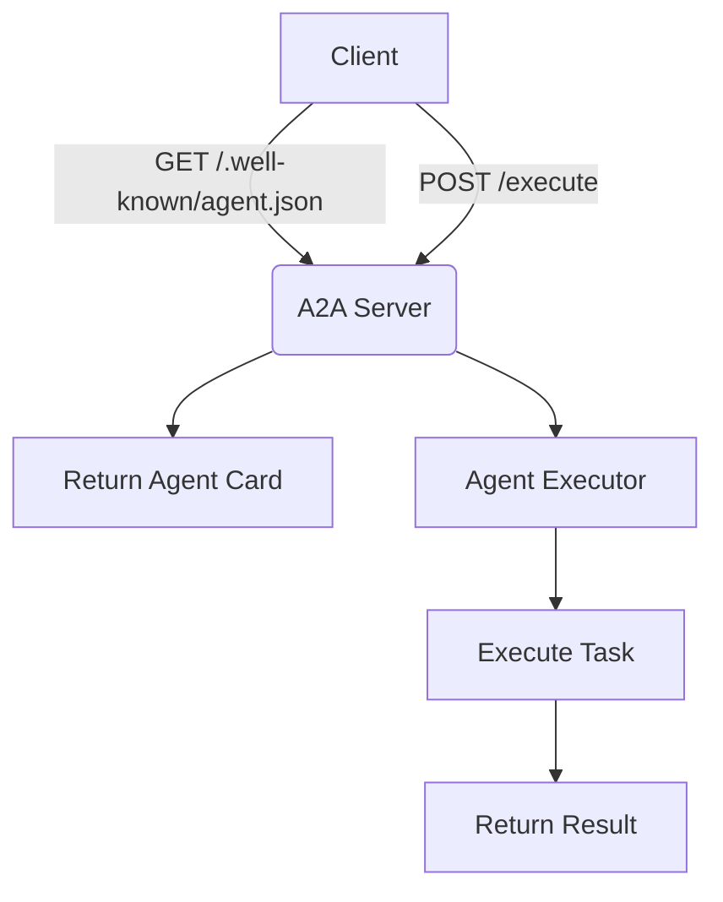
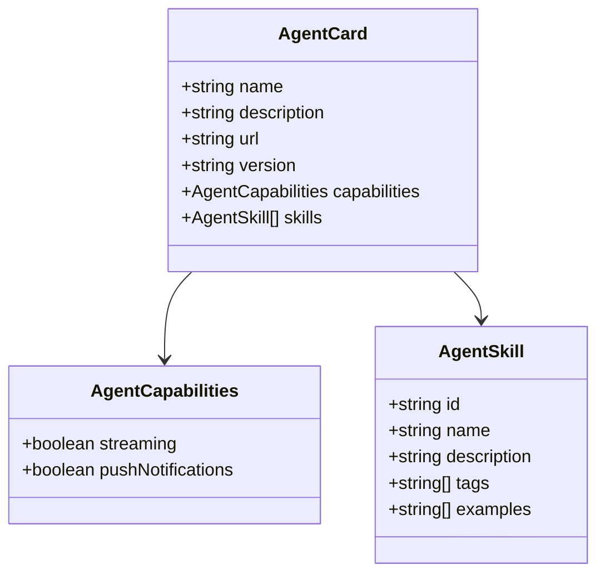
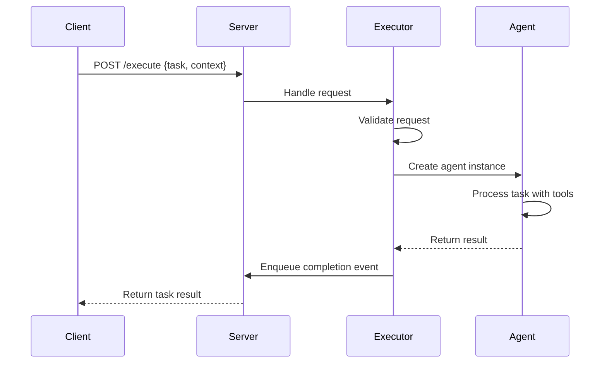

# A2A Protocol

<cite>
**Referenced Files in This Document**   
- [agent.py](file://protocol/a2a/app/agent.py)
- [agent_executor.py](file://protocol/a2a/app/agent_executor.py)
- [main.py](file://protocol/a2a/app/main.py)
- [manus.py](file://app/agent/manus.py)
- [browser_use_tool.py](file://app/tool/browser_use_tool.py)
- [str_replace_editor.py](file://app/tool/str_replace_editor.py)
- [terminate.py](file://app/tool/terminate.py)
</cite>

## Table of Contents
1. [Introduction](#introduction)
2. [A2A Protocol Overview](#a2a-protocol-overview)
3. [Agent Discovery and Capability Advertisement](#agent-discovery-and-capability-advertisement)
4. [Agent Card Structure](#agent-card-structure)
5. [Request-Response Flow for Task Execution](#request-response-flow-for-task-execution)
6. [Server Implementation with FastAPI](#server-implementation-with-fastapi)
7. [Security Considerations](#security-considerations)
8. [Common Integration Issues and Debugging Strategies](#common-integration-issues-and-debugging-strategies)
9. [Compatibility and Versioning Practices](#compatibility-and-versioning-practices)
10. [Conclusion](#conclusion)

## Introduction

The A2A (Agent-to-Agent) Protocol in OpenManus enables standardized communication between AI agents, facilitating interoperability and task delegation across diverse agent implementations. This document provides a comprehensive overview of the A2A protocol's design, implementation, and integration within the OpenManus framework. It details the core components, including agent discovery via the `/.well-known/agent.json` endpoint, the structure of agent cards, and the execution flow for task processing. The documentation also covers security practices, common integration challenges, and strategies for ensuring compatibility across different agent versions.

**Section sources**
- [main.py](file://protocol/a2a/app/main.py#L1-L131)
- [agent.py](file://protocol/a2a/app/agent.py#L1-L32)

## A2A Protocol Overview

The A2A Protocol is designed to standardize interactions between AI agents by defining a common interface for agent discovery, capability advertisement, and task execution. In OpenManus, this protocol allows external clients to discover available agents, understand their capabilities, and delegate tasks in a structured manner. The protocol operates over HTTP and uses JSON for data exchange, making it accessible and easy to integrate with various systems.

The core of the A2A implementation in OpenManus revolves around three main components: the agent card, which describes an agent's identity and capabilities; the `/.well-known/agent.json` endpoint, which serves as the discovery mechanism; and the agent executor, which handles incoming task requests and coordinates execution. This architecture ensures that agents can be dynamically discovered and utilized without prior configuration.

**Diagram sources**
- [main.py](file://protocol/a2a/app/main.py#L1-L131)
- [agent_executor.py](file://protocol/a2a/app/agent_executor.py#L1-L72)

**Section sources**
- [main.py](file://protocol/a2a/app/main.py#L1-L131)
- [agent_executor.py](file://protocol/a2a/app/agent_executor.py#L1-L72)

## Agent Discovery and Capability Advertisement

Agent discovery in the A2A Protocol is facilitated through the well-known URI `/.well-known/agent.json`, which returns a standardized JSON document describing the agent's capabilities and metadata. This endpoint allows clients to automatically discover and understand what an agent can do without requiring prior knowledge or configuration.

When a client sends a GET request to `http://localhost:10000/.well-known/agent.json`, the server responds with an `AgentCard` object containing essential information such as the agent's name, description, supported protocols, and available skills. This mechanism enables dynamic agent integration, where clients can query multiple agents and select the most appropriate one based on their capabilities.

The discovery process is crucial for building flexible multi-agent systems, as it allows for runtime composition of agent teams based on task requirements. For example, a client might query several agents to find one that supports both web browsing and code execution capabilities before delegating a complex research task.

**Section sources**
- [main.py](file://protocol/a2a/app/main.py#L45-L131)
- [agent.py](file://protocol/a2a/app/agent.py#L1-L32)

## Agent Card Structure

The agent card is a JSON document that describes an agent's identity, capabilities, and available skills. It follows a standardized schema defined by the A2A Protocol, ensuring interoperability across different implementations. The card contains several required fields that provide essential information for agent discovery and task delegation.

Key fields in the agent card include:
- **name**: The human-readable name of the agent
- **description**: A brief description of the agent's purpose and capabilities
- **url**: The base URL where the agent is hosted
- **version**: The version of the agent implementation
- **capabilities**: A list of supported features such as streaming and push notifications
- **skills**: An array of available tools and functions the agent can perform

Each skill in the agent card includes an ID, name, description, tags, and usage examples. This structured format allows clients to understand how to interact with each capability and what parameters are required. For instance, the Python Execute skill includes an example showing how to execute Python code with proper formatting.

**Diagram sources**
- [main.py](file://protocol/a2a/app/main.py#L45-L131)

**Section sources**
- [main.py](file://protocol/a2a/app/main.py#L45-L131)

## Request-Response Flow for Task Execution

The request-response flow for task execution in the A2A Protocol follows a well-defined sequence that ensures reliable task processing and result delivery. When a client wants to delegate a task, it sends a POST request to the execution endpoint with the task details. The server then processes this request through the agent executor, which coordinates the actual task execution.

The flow begins with the client sending a task request containing the user input and context information. The `ManusExecutor` class in `agent_executor.py` handles this request by first validating the input parameters. If validation passes, it creates an instance of the `A2AManus` agent and invokes its `invoke` method with the query and session ID.

During execution, the agent processes the task using its available tools and returns a structured response. The executor then packages this response into a standardized format and enqueues a completion event with the result. This event-driven approach allows for asynchronous task processing and status updates.

**Diagram sources**
- [agent_executor.py](file://protocol/a2a/app/agent_executor.py#L22-L71)
- [agent.py](file://protocol/a2a/app/agent.py#L14-L31)

**Section sources**
- [agent_executor.py](file://protocol/a2a/app/agent_executor.py#L1-L72)
- [agent.py](file://protocol/a2a/app/agent.py#L1-L32)

## Server Implementation with FastAPI

The A2A server in OpenManus is implemented using FastAPI, providing a robust and efficient foundation for handling HTTP requests and JSON serialization. The server setup in `main.py` configures the application with the necessary components for agent discovery and task execution.

The implementation uses the `A2AStarletteApplication` class to create the server instance, which integrates with the FastAPI framework. It sets up the `/.well-known/agent.json` endpoint for agent discovery and the execution endpoint for task processing. The server configuration includes error handling, logging, and command-line argument parsing for host and port settings.

Key aspects of the server implementation include:
- Configuration of the agent card with supported skills and capabilities
- Integration of the `ManusExecutor` for task execution
- Setup of in-memory task storage and push notification services
- Proper error handling and logging throughout the request lifecycle

The server can be started with customizable host and port parameters, making it easy to deploy in different environments. The use of asynchronous programming with asyncio ensures that the server can handle multiple concurrent requests efficiently.

**Section sources**
- [main.py](file://protocol/a2a/app/main.py#L1-L131)

## Security Considerations

Security in the A2A Protocol implementation focuses on input validation, error handling, and resource protection. The system includes several safeguards to prevent misuse and ensure reliable operation.

Input validation is performed at multiple levels, starting with the request context validation in the `ManusExecutor` class. Although the current implementation has a placeholder validation method that always returns false, the framework is designed to support comprehensive input checking. This includes validating task parameters, context information, and user input to prevent injection attacks and other security vulnerabilities.

Rate limiting is not explicitly implemented in the current codebase but is an important consideration for production deployments. Without rate limiting, the server could be vulnerable to denial-of-service attacks from clients sending excessive requests. Implementing rate limiting at the FastAPI middleware level would help protect server resources and ensure fair usage.

Additional security considerations include:
- Proper error handling that doesn't expose sensitive information
- Validation of tool parameters to prevent unintended system access
- Secure handling of credentials and API keys
- Protection against infinite loops or resource exhaustion in agent execution

**Section sources**
- [agent_executor.py](file://protocol/a2a/app/agent_executor.py#L50-L52)
- [main.py](file://protocol/a2a/app/main.py#L1-L131)

## Common Integration Issues and Debugging Strategies

Integrating with the A2A Protocol can present several challenges, particularly around agent card formatting, endpoint accessibility, and task execution errors. Understanding these common issues and their solutions is essential for successful implementation.

One frequent issue is malformed agent cards, where required fields are missing or incorrectly formatted. This can prevent clients from properly discovering or utilizing the agent. To debug this issue, developers should verify that all required fields are present and correctly structured according to the A2A specification. Using JSON validation tools can help identify formatting errors.

Another common problem is unreachable endpoints, which can occur due to incorrect server configuration or network issues. When this happens, clients cannot access the `/.well-known/agent.json` endpoint or submit tasks. Debugging strategies include checking server logs, verifying host and port settings, and testing endpoint accessibility with tools like curl.

Task execution failures may occur due to invalid parameters, missing dependencies, or errors in the agent's tool execution. The logging system in OpenManus provides valuable information for diagnosing these issues. Developers should examine the server logs for error messages and stack traces to identify the root cause.

Other integration challenges include:
- Version compatibility issues between client and server
- Network connectivity problems in distributed environments
- Configuration errors in tool dependencies
- Resource limitations affecting agent performance

**Section sources**
- [main.py](file://protocol/a2a/app/main.py#L1-L131)
- [agent_executor.py](file://protocol/a2a/app/agent_executor.py#L1-L72)
- [manus.py](file://app/agent/manus.py#L1-L165)

## Compatibility and Versioning Practices

Ensuring compatibility across different agent implementations is critical for the success of the A2A Protocol. The versioning system in the agent card plays a key role in managing compatibility and enabling smooth upgrades.

The agent card includes a version field that follows semantic versioning principles (MAJOR.MINOR.PATCH). This allows clients to make informed decisions about which agents to use based on their version requirements. Backward compatibility is maintained by ensuring that minor and patch updates do not introduce breaking changes to the API or agent capabilities.

When introducing new features or making breaking changes, developers should increment the appropriate version number and provide clear documentation about the changes. This helps clients prepare for updates and understand any required modifications to their integration code.

Best practices for maintaining compatibility include:
- Thorough testing of new versions against existing clients
- Providing migration guides for breaking changes
- Maintaining multiple versions during transition periods
- Using feature flags to gradually roll out new capabilities
- Documenting deprecation schedules for obsolete features

The modular design of the A2A implementation in OpenManus facilitates version management by separating concerns between the protocol interface and the underlying agent logic. This separation allows for independent evolution of the agent's capabilities while maintaining a stable protocol interface.

**Section sources**
- [main.py](file://protocol/a2a/app/main.py#L45-L131)
- [agent.py](file://protocol/a2a/app/agent.py#L1-L32)

## Conclusion

The A2A Protocol implementation in OpenManus provides a robust framework for standardized communication between AI agents. By following the documented patterns for agent discovery, capability advertisement, and task execution, developers can create interoperable agent systems that work seamlessly together. The combination of well-defined interfaces, structured data formats, and clear error handling makes the protocol suitable for both simple and complex agent interactions.

Key takeaways from this documentation include the importance of proper agent card formatting, the request-response flow for task execution, and the security considerations necessary for production deployment. By addressing common integration issues and following compatibility best practices, developers can ensure reliable and maintainable agent systems.

As the A2A ecosystem continues to evolve, maintaining adherence to the protocol specification while innovating on agent capabilities will be essential for building powerful, collaborative AI systems.