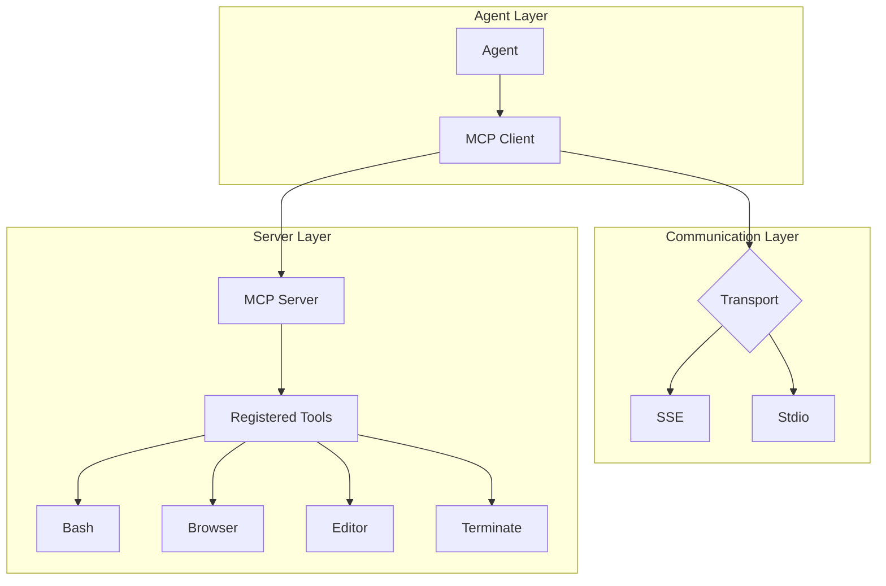
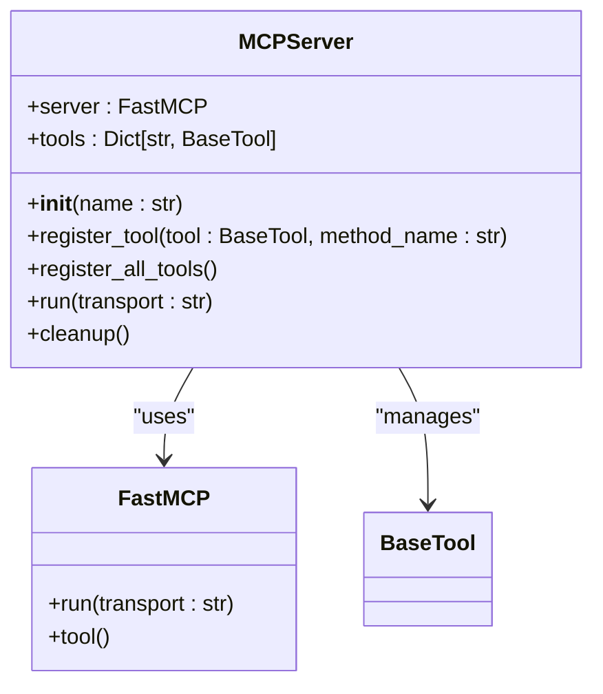
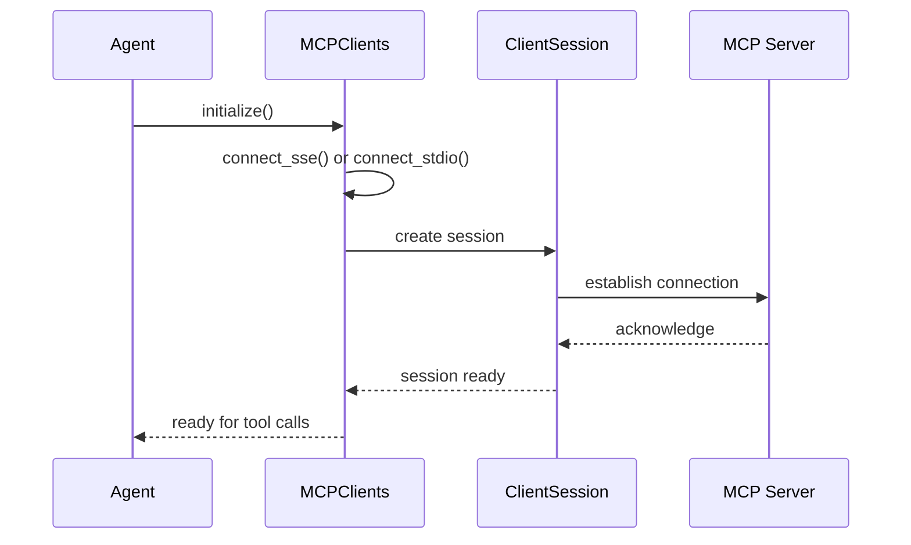
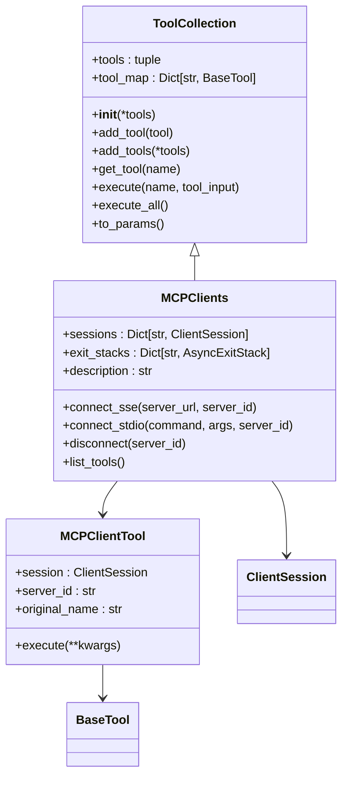
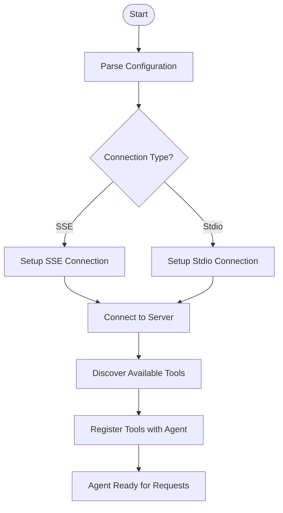
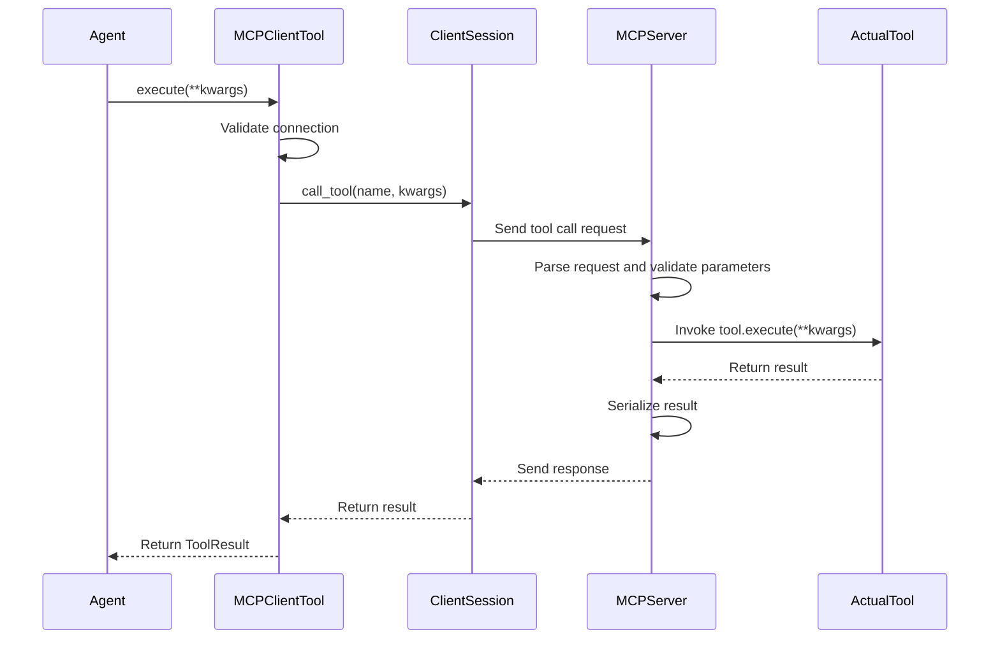

# MCP Protocol

<cite>
**Referenced Files in This Document**   
- [app/mcp/server.py](file://app/mcp/server.py)
- [config/mcp.example.json](file://config/mcp.example.json)
- [app/tool/mcp.py](file://app/tool/mcp.py)
- [app/tool/tool_collection.py](file://app/tool/tool_collection.py)
- [app/agent/mcp.py](file://app/agent/mcp.py)
- [run_mcp_server.py](file://run_mcp_server.py)
- [run_mcp.py](file://run_mcp.py)
- [app/config.py](file://app/config.py)
</cite>

## Table of Contents
1. [Introduction](#introduction)
2. [MCP Architecture Overview](#mcp-architecture-overview)
3. [Server Implementation](#server-implementation)
4. [Client-Server Communication](#client-server-communication)
5. [Tool Registration and Management](#tool-registration-and-management)
6. [Configuration and Connection Setup](#configuration-and-connection-setup)
7. [Tool Discovery and Execution Workflow](#tool-discovery-and-execution-workflow)
8. [Security Considerations](#security-considerations)
9. [Troubleshooting Guide](#troubleshooting-guide)
10. [Best Practices](#best-practices)

## Introduction

The Model Context Protocol (MCP) in OpenManus enables seamless communication between agents and external services through remote tool access and dynamic tool registration. This protocol facilitates the integration of various tools and services into the agent ecosystem, allowing for flexible and extensible functionality. MCP supports multiple communication interfaces, including Server-Sent Events (SSE) and stdio, providing versatility in deployment scenarios. The architecture is designed to support both local and remote tool execution, enabling agents to leverage external capabilities while maintaining a consistent interface for tool invocation.

## MCP Architecture Overview

The MCP architecture in OpenManus consists of three main components: the MCP server, the MCP client, and the agent that utilizes these components. The server exposes tools through standardized interfaces, while the client connects to these servers and makes their tools available to agents. This separation allows for dynamic tool discovery and execution without requiring recompilation or redeployment of the agent system.

**Diagram sources**
- [app/mcp/server.py](file://app/mcp/server.py#L23-L159)
- [app/tool/mcp.py](file://app/tool/mcp.py#L36-L193)
- [app/agent/mcp.py](file://app/agent/mcp.py#L1-L185)

**Section sources**
- [app/mcp/server.py](file://app/mcp/server.py#L23-L159)
- [app/tool/mcp.py](file://app/tool/mcp.py#L36-L193)

## Server Implementation

The MCP server implementation in `app/mcp/server.py` provides a robust foundation for exposing tools to external agents. The `MCPServer` class serves as the central component, managing tool registration and communication interfaces. The server supports stdio transport by default, with potential for SSE extension. When initialized, the server automatically registers standard tools including bash execution, browser interaction, text editing, and termination capabilities.

The server's `run` method orchestrates the startup process, registering all available tools and establishing the communication transport. The `register_tool` method handles the conversion of tool objects into callable functions with proper parameter validation and documentation. This method creates async wrapper functions that maintain the original tool's execution context while adding logging and result serialization capabilities.

**Diagram sources**
- [app/mcp/server.py](file://app/mcp/server.py#L23-L159)
- [run_mcp_server.py](file://run_mcp_server.py#L1-L11)

**Section sources**
- [app/mcp/server.py](file://app/mcp/server.py#L23-L159)
- [run_mcp_server.py](file://run_mcp_server.py#L1-L11)

## Client-Server Communication

MCP supports two primary communication interfaces: SSE (Server-Sent Events) and stdio. The choice of interface depends on the deployment scenario and performance requirements. SSE is suitable for network-based communication, allowing servers to be hosted remotely, while stdio is optimized for local process communication with lower overhead.

The client implementation in `app/tool/mcp.py` provides the `MCPClients` class, which manages connections to one or more MCP servers. For SSE connections, the client uses the `connect_sse` method to establish a persistent HTTP connection to the server endpoint. For stdio connections, the `connect_stdio` method spawns a subprocess and communicates through its standard input and output streams.

**Diagram sources**
- [app/tool/mcp.py](file://app/tool/mcp.py#L49-L68)
- [app/tool/mcp.py](file://app/tool/mcp.py#L70-L94)
- [app/agent/mcp.py](file://app/agent/mcp.py#L1-L185)

**Section sources**
- [app/tool/mcp.py](file://app/tool/mcp.py#L49-L94)
- [app/agent/mcp.py](file://app/agent/mcp.py#L1-L185)

## Tool Registration and Management

The MCP protocol implements a comprehensive system for tool registration and management through the `ToolCollection` class. This class serves as a container for tools, providing methods for adding, retrieving, and executing tools. The `MCPClients` class extends `ToolCollection`, adding MCP-specific functionality for remote tool management.

When a client connects to an MCP server, it performs tool discovery by calling the server's `list_tools` method. The client then creates local proxy objects for each discovered tool, using the `MCPClientTool` class. These proxy objects handle the remote execution of tools by forwarding calls to the server and returning the results. The tool names are sanitized and prefixed with the server identifier to prevent naming conflicts when multiple servers are connected.

**Diagram sources**
- [app/tool/tool_collection.py](file://app/tool/tool_collection.py#L8-L70)
- [app/tool/mcp.py](file://app/tool/mcp.py#L13-L33)
- [app/tool/mcp.py](file://app/tool/mcp.py#L36-L193)

**Section sources**
- [app/tool/tool_collection.py](file://app/tool/tool_collection.py#L8-L70)
- [app/tool/mcp.py](file://app/tool/mcp.py#L13-L193)

## Configuration and Connection Setup

MCP configuration is managed through the `mcp.example.json` file and the application's configuration system. The JSON configuration file defines the servers that the client can connect to, specifying their type (SSE or stdio), URL, and other connection parameters. This configuration is loaded by the `MCPSettings` class in `app/config.py`, which provides a structured interface for accessing the configuration data.

The `run_mcp.py` script demonstrates how to initialize an MCP agent with different connection types. It supports both interactive mode and single-prompt execution, allowing users to choose between stdio and SSE connections. The script parses command-line arguments to determine the connection type and server URL, then initializes the MCP agent accordingly.

**Diagram sources**
- [config/mcp.example.json](file://config/mcp.example.json#L1-L8)
- [app/config.py](file://app/config.py#L1-L372)
- [run_mcp.py](file://run_mcp.py#L1-L116)

**Section sources**
- [config/mcp.example.json](file://config/mcp.example.json#L1-L8)
- [app/config.py](file://app/config.py#L1-L372)
- [run_mcp.py](file://run_mcp.py#L1-L116)

## Tool Discovery and Execution Workflow

The tool discovery and execution workflow in MCP follows a systematic process that ensures reliable communication between agents and external services. When an agent initializes, it establishes a connection to the MCP server and retrieves a list of available tools through the `list_tools` method. This information is used to create local proxy objects that represent the remote tools.

When a tool is invoked, the agent calls the proxy object's `execute` method, which forwards the request to the MCP server through the established communication channel. The server parses the request, validates the parameters, and invokes the appropriate tool function. The results are then serialized and streamed back to the client, where they are processed and returned to the agent.

The workflow includes several key steps:
1. Connection establishment and session initialization
2. Tool discovery and proxy creation
3. Request parsing and parameter validation
4. Tool invocation and execution
5. Result serialization and response streaming
6. Error handling and recovery

**Diagram sources**
- [app/tool/mcp.py](file://app/tool/mcp.py#L20-L33)
- [app/mcp/server.py](file://app/mcp/server.py#L36-L75)
- [app/tool/base.py](file://app/tool/base.py#L77-L172)

**Section sources**
- [app/tool/mcp.py](file://app/tool/mcp.py#L20-L33)
- [app/mcp/server.py](file://app/mcp/server.py#L36-L75)

## Security Considerations

MCP incorporates several security measures to protect against potential vulnerabilities in remote tool execution. The protocol includes input validation and parameter checking to prevent injection attacks and ensure data integrity. When tools return results, the server handles serialization carefully, supporting both Pydantic model dumping and direct JSON serialization while maintaining type safety.

The architecture includes cleanup mechanisms to properly release resources when connections are terminated. The `cleanup` method in the `MCPServer` class ensures that tools with cleanup requirements, such as the browser tool, properly release their resources. The client-side `disconnect` method in `MCPClients` ensures that all connections are properly closed and resources are released.

Authentication mechanisms are not explicitly implemented in the current MCP design, relying instead on network-level security and process isolation. For production deployments, additional security layers such as TLS encryption, API keys, or OAuth tokens should be implemented to protect against unauthorized access.

## Troubleshooting Guide

Common issues with MCP implementation include connection timeouts, invalid manifests, and serialization errors. For connection timeouts, verify that the server is running and accessible at the specified URL or that the stdio command can be executed properly. Check firewall settings and network connectivity when using SSE connections.

Invalid manifest errors typically occur when there is a mismatch between the expected and actual tool parameters. Ensure that the tool's parameter schema is correctly defined and matches the expected format. Serialization errors may occur when tools return complex objects that cannot be easily serialized to JSON. In such cases, ensure that the tool's result can be properly converted to a JSON-serializable format.

When debugging MCP issues, enable verbose logging to trace the communication flow between client and server. The logging statements in both the client and server code provide valuable insights into the request and response processing. For persistent issues, consider using a simpler tool implementation to isolate whether the problem lies in the MCP infrastructure or in the specific tool logic.

**Section sources**
- [app/mcp/server.py](file://app/mcp/server.py#L137-L142)
- [app/tool/mcp.py](file://app/tool/mcp.py#L154-L193)
- [app/agent/mcp.py](file://app/agent/mcp.py#L1-L185)

## Best Practices

When developing custom MCP servers, follow these best practices to ensure protocol compliance and optimal performance:

1. Implement proper error handling in tool execution methods to provide meaningful error messages
2. Use descriptive names and clear documentation for all tools and parameters
3. Validate input parameters thoroughly to prevent injection attacks and ensure data integrity
4. Implement resource cleanup methods for tools that use external resources
5. Use consistent data formats for tool inputs and outputs
6. Test tools thoroughly in isolation before integrating them into the MCP server
7. Monitor server performance and implement rate limiting if necessary
8. Document all available tools and their usage patterns

For client implementations, ensure proper connection management by always disconnecting from servers when finished. Implement retry logic for transient network errors, but avoid excessive retry attempts that could overwhelm the server. When connecting to multiple servers, use meaningful server identifiers to distinguish between tools from different sources.