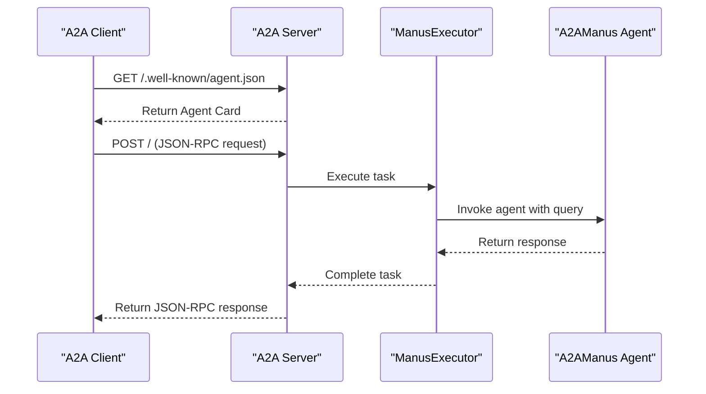
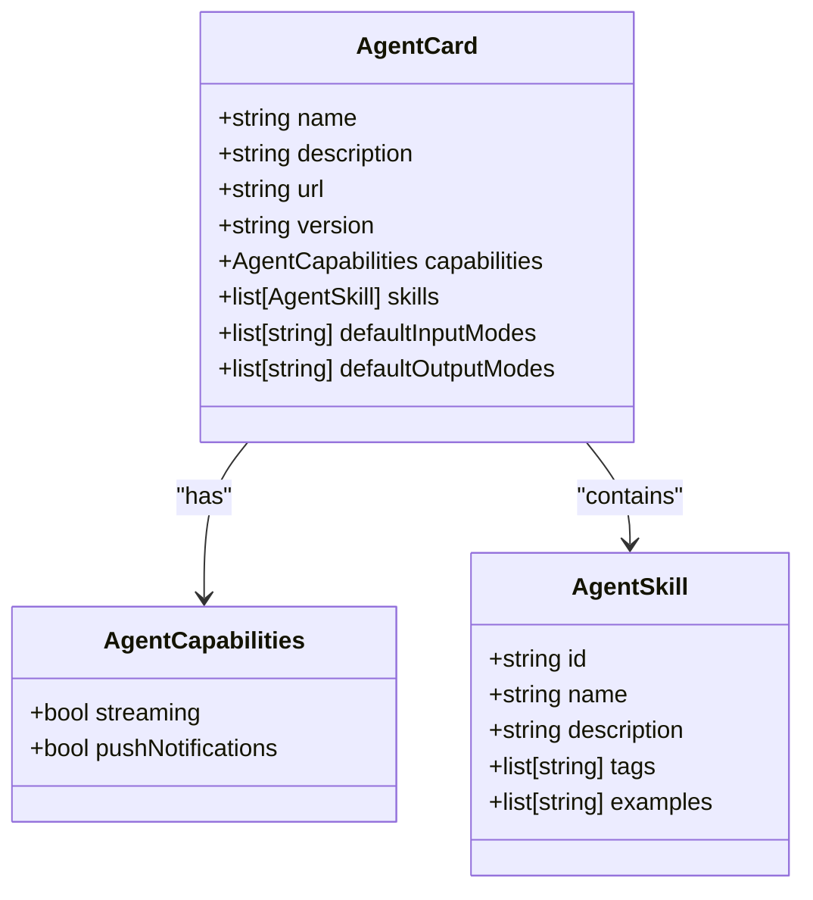
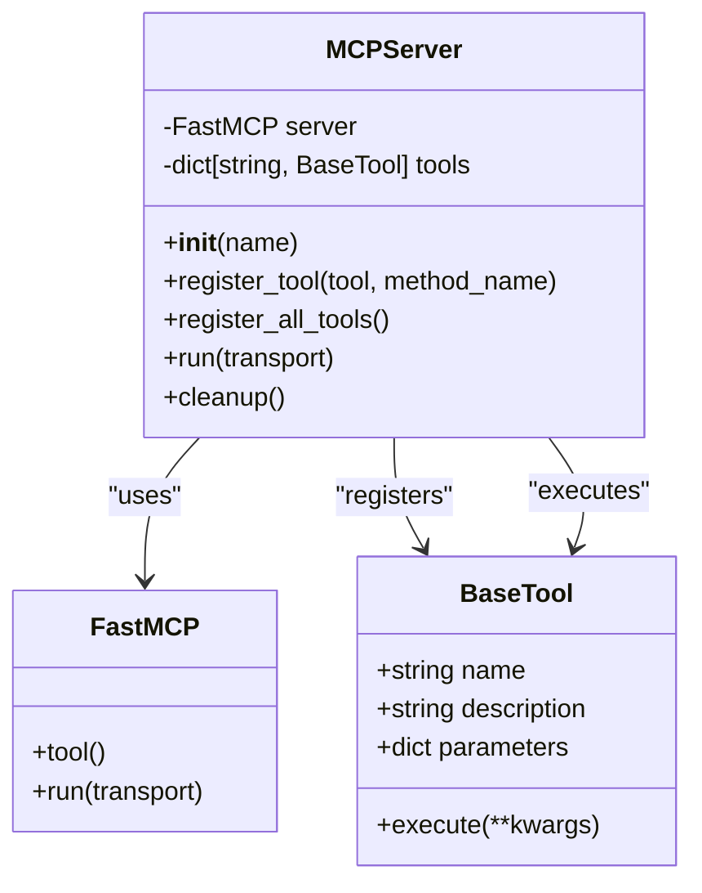
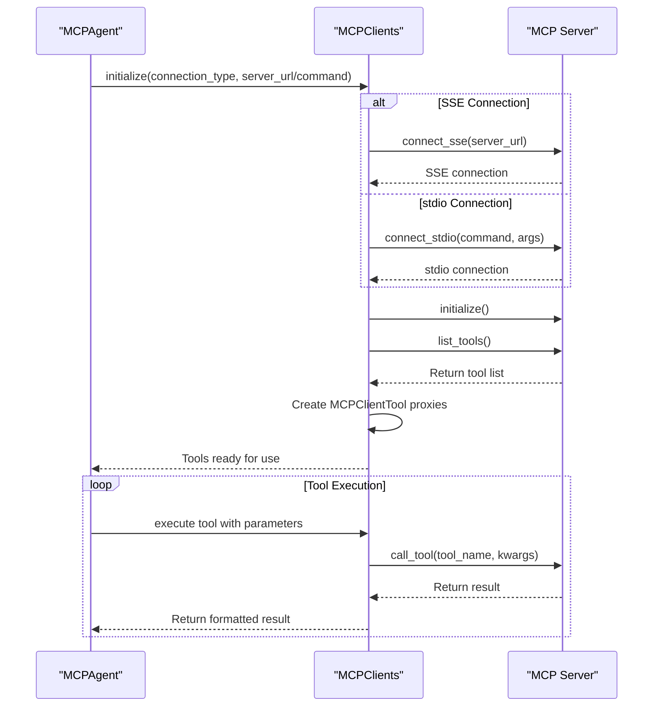
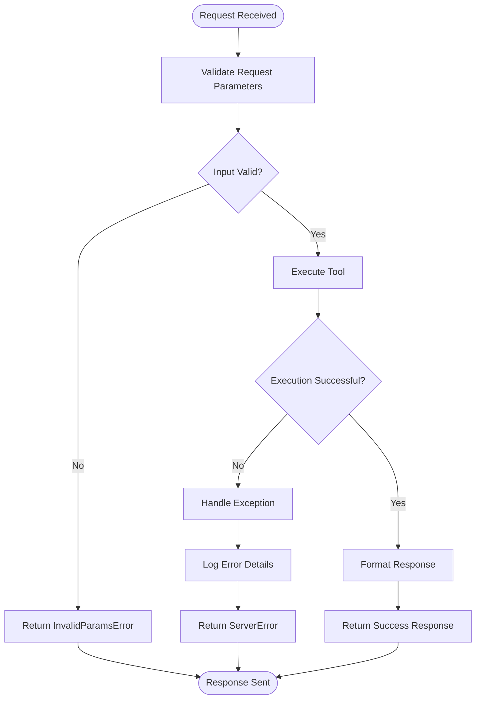

# Protocol Integration

<cite>
**Referenced Files in This Document**  
- [main.py](file://protocol/a2a/app/main.py)
- [agent.py](file://protocol/a2a/app/agent.py)
- [agent_executor.py](file://protocol/a2a/app/agent_executor.py)
- [server.py](file://app/mcp/server.py)
- [mcp.py](file://app/agent/mcp.py)
- [mcp.py](file://app/tool/mcp.py)
- [mcp.example.json](file://config/mcp.example.json)
</cite>

## Table of Contents
1. [Introduction](#introduction)
2. [A2A Protocol Implementation](#a2a-protocol-implementation)
3. [Agent Card Structure and Discovery](#agent-card-structure-and-discovery)
4. [MCP Server Implementation](#mcp-server-implementation)
5. [MCP Client Integration](#mcp-client-integration)
6. [Security Considerations](#security-considerations)
7. [Error Handling and Debugging](#error-handling-and-debugging)
8. [Integration Issues and Troubleshooting](#integration-issues-and-troubleshooting)
9. [Custom Protocol Extensions](#custom-protocol-extensions)
10. [Conclusion](#conclusion)

## Introduction
This document provides comprehensive guidance on protocol integration within OpenManus, focusing on the A2A (Agent-to-Agent) protocol and MCP (Model Context Protocol) implementations. The A2A protocol enables standardized agent communication and task delegation through a well-defined interface, while the MCP protocol facilitates remote tool access and dynamic tool registration. This documentation covers the implementation details, configuration, and integration patterns for both protocols, providing developers with the knowledge needed to extend and customize the system effectively.

## A2A Protocol Implementation
The A2A protocol implementation in OpenManus enables agent communication and task delegation through a standardized interface. The protocol is implemented in the `protocol/a2a/app/main.py` file, which serves as the entry point for the A2A server. The implementation follows the A2A specification, providing endpoints for agent discovery and task execution.

The server is built using the A2A SDK, which provides the necessary components for handling A2A requests and responses. The implementation includes a request handler that processes incoming messages and delegates tasks to the appropriate agent. The server supports both synchronous and asynchronous task execution, allowing for flexible integration with different client applications.

**Diagram sources**  
- [main.py](file://protocol/a2a/app/main.py)
- [agent_executor.py](file://protocol/a2a/app/agent_executor.py)
- [agent.py](file://protocol/a2a/app/agent.py)

**Section sources**  
- [main.py](file://protocol/a2a/app/main.py#L26-L131)
- [agent_executor.py](file://protocol/a2a/app/agent_executor.py#L1-L72)

## Agent Card Structure and Discovery
The A2A protocol uses the `/.well-known/agent.json` endpoint for agent discovery and capability advertisement. This endpoint returns an Agent Card that describes the agent's capabilities, skills, and metadata. The Agent Card structure follows the A2A specification and includes essential information for client applications to interact with the agent.

The Agent Card is constructed in the `main.py` file and includes the following components:
- **Name**: The agent's display name
- **Description**: A brief description of the agent's capabilities
- **URL**: The base URL for the agent's API
- **Version**: The agent's version
- **Capabilities**: Supported features such as streaming and push notifications
- **Skills**: Available tools and their descriptions

The implementation dynamically constructs the Agent Card by collecting information from various tool modules and formatting it according to the A2A specification. Each skill includes an ID, name, description, tags, and usage examples to help clients understand how to use the tool.

**Diagram sources**  
- [main.py](file://protocol/a2a/app/main.py#L55-L104)
- [a2a.types](file://a2a.types)

**Section sources**  
- [main.py](file://protocol/a2a/app/main.py#L55-L104)
- [README.md](file://protocol/a2a/app/README.md#L44-L144)

## MCP Server Implementation
The MCP (Model Context Protocol) server implementation enables remote tool access through SSE (Server-Sent Events) and stdio interfaces. The server is implemented in `app/mcp/server.py` and provides a framework for registering tools and exposing them to client applications.

The MCP server uses the FastMCP library to handle protocol communication and provides two transport methods:
- **stdio**: Communication through standard input/output streams
- **SSE**: Server-Sent Events for HTTP-based communication

The server implementation includes a `MCPServer` class that manages tool registration and lifecycle. Tools are registered dynamically using the `register_tool` method, which validates parameters and generates appropriate documentation. The server automatically generates docstrings and function signatures based on tool metadata, ensuring consistent documentation across all registered tools.

**Diagram sources**  
- [server.py](file://app/mcp/server.py#L0-L180)
- [run_mcp_server.py](file://run_mcp_server.py)

**Section sources**  
- [server.py](file://app/mcp/server.py#L0-L180)
- [run_mcp_server.py](file://run_mcp_server.py)

## MCP Client Integration
MCP client integration enables agents to connect to MCP servers and utilize their tools. The integration is implemented in `app/agent/mcp.py` and `app/tool/mcp.py`, providing a comprehensive framework for connecting to MCP servers and managing remote tools.

The MCP client supports two connection methods:
- **SSE (Server-Sent Events)**: Connects to an MCP server via HTTP
- **stdio**: Connects to an MCP server via standard input/output

The client implementation includes automatic tool discovery and registration. When connecting to an MCP server, the client retrieves the list of available tools and creates local proxies for each tool. These proxies handle the communication with the remote server, making the remote tools appear as local tools to the agent.

**Diagram sources**  
- [mcp.py](file://app/agent/mcp.py#L0-L185)
- [mcp.py](file://app/tool/mcp.py#L0-L194)

**Section sources**  
- [mcp.py](file://app/agent/mcp.py#L0-L185)
- [mcp.py](file://app/tool/mcp.py#L0-L194)
- [mcp.example.json](file://config/mcp.example.json)

## Security Considerations
The protocol integration in OpenManus includes several security considerations to protect against unauthorized access and ensure secure communication. While the current implementation focuses on functionality, there are opportunities to enhance security through authentication and authorization mechanisms.

For A2A protocol communication, security can be implemented at the HTTP level using standard authentication methods such as API keys or OAuth. The server could validate incoming requests against a whitelist of authorized clients or require authentication tokens for access.

For MCP server communication, both SSE and stdio transports should be secured appropriately:
- **SSE connections** should use HTTPS to encrypt data in transit
- **stdio connections** should run in isolated environments with appropriate access controls

The configuration system in `config/mcp.example.json` allows for defining server connections, but does not currently include authentication parameters. Future enhancements could include support for API keys, tokens, or other authentication methods in the server configuration.

Additional security measures could include:
- Rate limiting to prevent abuse
- Input validation for all incoming requests
- Logging and monitoring of suspicious activities
- Regular security audits of the codebase

**Section sources**  
- [main.py](file://protocol/a2a/app/main.py)
- [server.py](file://app/mcp/server.py)
- [mcp.example.json](file://config/mcp.example.json)

## Error Handling and Debugging
The protocol implementations include comprehensive error handling and debugging capabilities to assist with integration and troubleshooting. Both the A2A and MCP protocols include structured error reporting that helps identify and resolve issues.

In the A2A implementation, errors are handled through the `ServerError` exception class, which wraps various error types such as `InvalidParamsError` and `UnsupportedOperationError`. The request handler in `agent_executor.py` catches exceptions and returns appropriate error responses to clients.

The MCP implementation includes detailed logging for tool execution and connection management. Each tool execution is logged with the tool name and parameters, making it easier to trace issues. Connection errors are handled gracefully, with appropriate error messages returned to the client.

**Diagram sources**  
- [agent_executor.py](file://protocol/a2a/app/agent_executor.py#L1-L72)
- [server.py](file://app/mcp/server.py#L0-L180)

**Section sources**  
- [agent_executor.py](file://protocol/a2a/app/agent_executor.py#L1-L72)
- [server.py](file://app/mcp/server.py#L0-L180)

## Integration Issues and Troubleshooting
Common integration issues and their troubleshooting strategies are documented to assist developers in resolving problems during protocol integration. The most frequent issues relate to connection problems, tool registration, and configuration errors.

### Connection Issues
- **SSE Connection Failures**: Verify the server URL is correct and accessible. Check that the server is running and listening on the specified port.
- **stdio Connection Failures**: Ensure the command path is correct and the executable has the necessary permissions. Verify that the Python environment contains all required dependencies.

### Tool Registration Issues
- **Missing Tools**: Verify that tools are properly registered with the MCP server. Check that the tool classes inherit from `BaseTool` and implement the required methods.
- **Parameter Validation Errors**: Ensure tool parameters are correctly defined with appropriate types and validation rules.

### Configuration Issues
- **Invalid Configuration**: Use the example configuration in `mcp.example.json` as a template. Validate JSON syntax and ensure all required fields are present.
- **Environment Variables**: Ensure all required environment variables are set, particularly for external services.

Debugging strategies include:
- Enabling verbose logging to trace request flow
- Using the `/.well-known/agent.json` endpoint to verify agent capabilities
- Testing individual tools independently before integration
- Checking server logs for error messages and stack traces

**Section sources**  
- [mcp.example.json](file://config/mcp.example.json)
- [main.py](file://protocol/a2a/app/main.py)
- [server.py](file://app/mcp/server.py)

## Custom Protocol Extensions
The protocol implementations in OpenManus are designed to be extensible, allowing developers to create custom protocol extensions and ensure compatibility with the existing system. The modular architecture supports adding new features while maintaining backward compatibility.

To implement custom protocol extensions:
1. **Extend the Agent Card**: Add new capabilities or skills to the Agent Card structure in `main.py`. Ensure new fields follow the A2A specification or are properly documented as extensions.
2. **Create Custom Tools**: Implement new tools by extending the `BaseTool` class and registering them with the MCP server. Follow the existing pattern for parameter validation and documentation.
3. **Modify Request Handling**: Extend the request handler to support new message types or protocols while maintaining compatibility with existing functionality.

When creating extensions, consider the following compatibility guidelines:
- Maintain backward compatibility with existing clients
- Use versioning to manage breaking changes
- Document extensions clearly for client developers
- Follow the same error handling patterns as the core implementation

The system's modular design allows for adding new transports, authentication methods, or data formats without modifying the core protocol implementation.

**Section sources**  
- [main.py](file://protocol/a2a/app/main.py)
- [server.py](file://app/mcp/server.py)
- [mcp.py](file://app/tool/mcp.py)

## Conclusion
The protocol integration in OpenManus provides a robust foundation for agent communication and tool sharing through the A2A and MCP protocols. The A2A implementation enables standardized agent discovery and task delegation via the `/.well-known/agent.json` endpoint and JSON-RPC messaging. The MCP implementation supports remote tool access through both SSE and stdio interfaces, allowing for flexible integration patterns.

Key strengths of the current implementation include its modular design, comprehensive tool management, and clear separation of concerns between protocol handling and business logic. The system provides a solid foundation for building agent-based applications with rich tool ecosystems.

Future enhancements could focus on security improvements, additional transport methods, and enhanced error reporting. By following the patterns and practices documented here, developers can extend the system with custom protocols and integrations while maintaining compatibility and reliability.