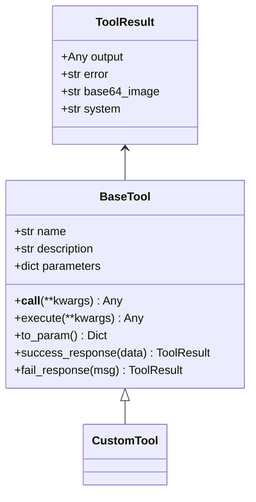
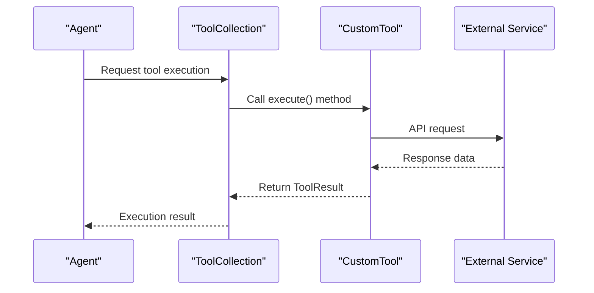
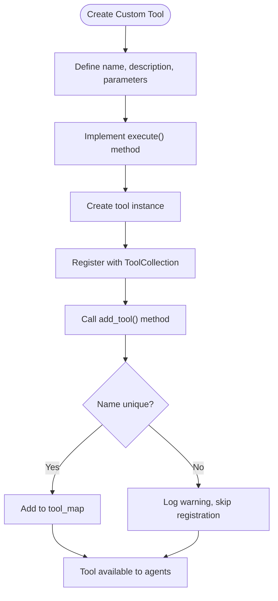

# Custom Tool Development

<cite>
**Referenced Files in This Document**   
- [base.py](file://app/tool/base.py)
- [tool_collection.py](file://app/tool/tool_collection.py)
- [exceptions.py](file://app/exceptions.py)
- [browser_use_tool.py](file://app/tool/browser_use_tool.py)
- [create_chat_completion.py](file://app/tool/create_chat_completion.py)
- [ask_human.py](file://app/tool/ask_human.py)
- [japan_travel_guide_instructions.txt](file://examples/use_case/japan-travel-plan/japan_travel_guide_instructions.txt)
</cite>

## Table of Contents
1. [Introduction](#introduction)
2. [BaseTool Interface](#basetool-interface)
3. [Tool Implementation Examples](#tool-implementation-examples)
4. [Tool Registration and Collection](#tool-registration-and-collection)
5. [Error Handling and Validation](#error-handling-and-validation)
6. [Async Operations and Performance](#async-operations-and-performance)
7. [Parameter Schema Design](#parameter-schema-design)
8. [Testing and Monitoring](#testing-and-monitoring)
9. [Real-World Usage Patterns](#real-world-usage-patterns)
10. [Best Practices](#best-practices)

## Introduction
This document provides comprehensive guidance on extending the OpenManus framework through custom tool development. The framework enables agents to perform complex tasks by leveraging specialized tools that inherit from the BaseTool class. Custom tools can be created for various purposes including weather lookup, database querying, API integration, and other domain-specific operations. This documentation covers the complete development lifecycle from interface requirements to real-world implementation patterns.

**Section sources**
- [base.py](file://app/tool/base.py#L77-L172)

## BaseTool Interface
The BaseTool class serves as the foundation for all custom tools in the OpenManus framework. It defines the essential interface that all tools must implement, ensuring consistency and interoperability across the system. The core components of the BaseTool interface include the name, description, and parameters properties, along with the execute method for tool functionality.

The name property provides a unique identifier for the tool, while the description offers a clear explanation of the tool's purpose and capabilities. The parameters property defines the input schema using JSON Schema format, specifying the required and optional parameters along with their types and constraints. The execute method contains the core logic that performs the tool's designated function and returns a ToolResult object.

**Diagram sources**
- [base.py](file://app/tool/base.py#L77-L172)

**Section sources**
- [base.py](file://app/tool/base.py#L77-L172)

## Tool Implementation Examples
Creating custom tools involves inheriting from the BaseTool class and implementing the required interface. The framework supports various types of tools, from simple utility functions to complex integrations with external services. Below are examples demonstrating different implementation patterns for common use cases.

### Weather Lookup Tool
A weather lookup tool would inherit from BaseTool and implement the execute method to fetch weather data from a weather API. The parameters schema would include location, date range, and data type preferences. The tool would use async/await patterns for API calls and include proper error handling for network failures or invalid responses.

### Database Query Tool
A database querying tool would define parameters for SQL queries, connection details, and result formatting options. It would implement connection pooling for performance optimization and include input validation to prevent SQL injection attacks. The tool would return query results in a structured format suitable for LLM processing.

### API Integration Tool
An API integration tool would provide a generic interface for interacting with RESTful services. It would support various HTTP methods, authentication schemes, and payload formats. The parameters schema would be flexible enough to accommodate different API endpoints while maintaining security best practices.

**Diagram sources**
- [base.py](file://app/tool/base.py#L77-L172)
- [tool_collection.py](file://app/tool/tool_collection.py#L8-L70)

**Section sources**
- [browser_use_tool.py](file://app/tool/browser_use_tool.py#L38-L566)
- [create_chat_completion.py](file://app/tool/create_chat_completion.py#L7-L168)

## Tool Registration and Collection
Custom tools are managed through the ToolCollection class, which provides methods for adding, retrieving, and executing tools. The ToolCollection maintains a registry of available tools and handles the execution lifecycle, including parameter validation and result processing.

Tools are registered with the collection using the add_tool or add_tools methods. The collection ensures that tool names are unique and provides warnings when attempting to register duplicate tools. Once registered, tools can be executed by name, with the collection handling the routing and execution.

The to_params method converts the collection of tools into a format compatible with LLM function calling, enabling agents to understand and utilize the available tools. This method iterates through all registered tools and calls their to_param method to generate the appropriate function schema.

**Diagram sources**
- [tool_collection.py](file://app/tool/tool_collection.py#L8-L70)

**Section sources**
- [tool_collection.py](file://app/tool/tool_collection.py#L50-L61)
- [tool_collection.py](file://app/tool/tool_collection.py#L63-L70)

## Error Handling and Validation
Proper error handling is critical for robust tool implementation. The framework provides the ToolError exception class for signaling tool-specific errors, which should be raised when exceptional conditions occur during execution. Tools should validate input parameters and handle expected error conditions gracefully.

The BaseTool class includes helper methods for creating standardized success and failure responses. The success_response method formats successful results, while the fail_response method creates error responses with descriptive messages. These methods ensure consistent result formatting across all tools.

Input validation should be implemented using Pydantic models when possible, leveraging their built-in validation capabilities. For complex validation logic, custom validation methods can be implemented within the tool class. Validation errors should be caught and converted to ToolError exceptions with clear error messages.

**Section sources**
- [exceptions.py](file://app/exceptions.py#L0-L4)
- [base.py](file://app/tool/base.py#L146-L160)
- [base.py](file://app/tool/base.py#L162-L172)

## Async Operations and Performance
The OpenManus framework is designed to handle I/O-bound operations efficiently using async/await patterns. Custom tools should implement their execute methods as coroutines to avoid blocking the event loop during network requests, file operations, or other asynchronous tasks.

For I/O-bound operations such as API calls, database queries, or file system access, tools should use asynchronous libraries and await the results. This allows the framework to handle multiple operations concurrently, improving overall performance and responsiveness.

Performance monitoring can be implemented by adding timing measurements around critical operations and including performance metrics in the tool's output or logs. This information can help identify bottlenecks and optimize tool performance over time.

**Section sources**
- [base.py](file://app/tool/base.py#L120-L121)
- [base.py](file://app/tool/base.py#L115-L117)

## Parameter Schema Design
The parameters property plays a crucial role in enabling LLMs to understand and use custom tools effectively. A well-designed parameter schema provides clear guidance on the tool's inputs, their types, and their relationships. The schema should be comprehensive yet concise, balancing detail with readability.

Required parameters should be clearly marked in the schema, and dependencies between parameters should be specified using the dependencies property. This helps the LLM understand which parameters are needed together and prevents invalid combinations.

For complex tools with many parameters, consider organizing the schema into logical groups and providing detailed descriptions for each parameter. Enumerated values should be specified using the enum property to limit valid inputs and improve reliability.

**Section sources**
- [base.py](file://app/tool/base.py#L95-L95)
- [browser_use_tool.py](file://app/tool/browser_use_tool.py#L38-L566)

## Testing and Monitoring
Comprehensive testing is essential for reliable tool operation. Unit tests should cover normal operation, edge cases, and error conditions. Integration tests should verify that the tool works correctly within the full framework context, including proper registration and execution through the ToolCollection.

Logging should be implemented throughout the tool's execution path to provide visibility into its operation. The framework's logger can be used to record important events, parameter values, and execution results. This information is invaluable for debugging and monitoring tool performance.

Performance monitoring should track key metrics such as execution time, success rate, and error frequency. This data can be used to identify issues, optimize performance, and ensure the tool meets reliability requirements.

**Section sources**
- [utils/logger.py](file://app/utils/logger.py#L0-L31)

## Real-World Usage Patterns
The japan-travel-plan example demonstrates practical patterns for tool usage in real-world scenarios. This use case shows how multiple tools can be coordinated to achieve complex objectives, with each tool handling a specific aspect of the planning process.

The example illustrates the importance of tool composition, where multiple simple tools are combined to solve complex problems. It also demonstrates the value of persistent state across tool calls, allowing agents to build upon previous results and maintain context throughout extended interactions.

Real-world usage often involves iterative refinement, where initial tool results are analyzed and followed by additional tool calls to gather more information or perform further processing. This pattern enables agents to adapt their approach based on intermediate results and converge on optimal solutions.

**Section sources**
- [japan_travel_guide_instructions.txt](file://examples/use_case/japan-travel-plan/japan_travel_guide_instructions.txt)

## Best Practices
When developing custom tools for the OpenManus framework, several best practices should be followed to ensure reliability, maintainability, and effectiveness:

1. **Clear Documentation**: Provide comprehensive descriptions and parameter documentation to help LLMs understand and use the tool correctly.

2. **Robust Error Handling**: Implement thorough error handling and validation to prevent crashes and provide meaningful error messages.

3. **Asynchronous Design**: Use async/await patterns for all I/O operations to maintain framework responsiveness.

4. **Security Considerations**: Validate inputs, sanitize outputs, and follow security best practices when interacting with external systems.

5. **Performance Optimization**: Implement caching, connection pooling, and other optimizations to minimize latency and resource usage.

6. **Comprehensive Testing**: Develop thorough unit and integration tests to ensure reliability and catch regressions.

7. **Monitoring and Logging**: Implement detailed logging and performance monitoring to facilitate debugging and optimization.

8. **Backward Compatibility**: Maintain backward compatibility when updating tools to avoid breaking existing agent workflows.