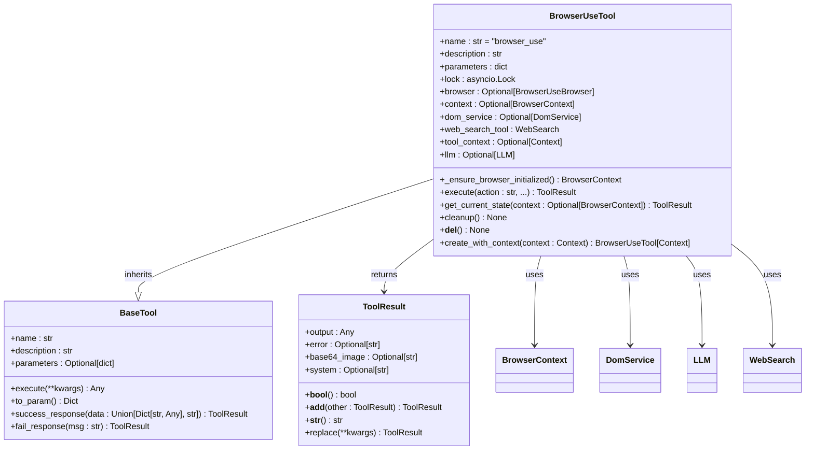
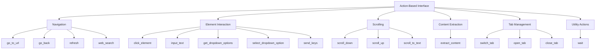
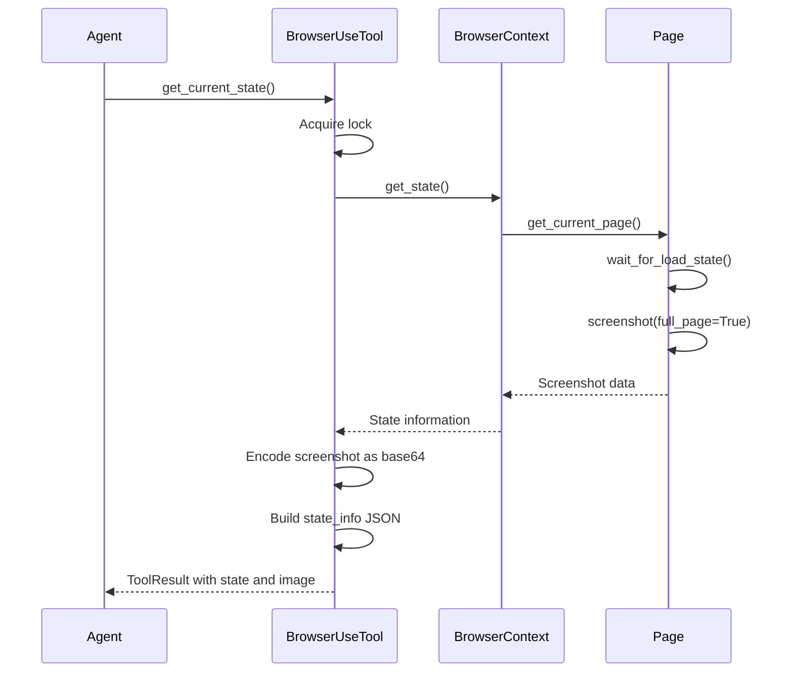
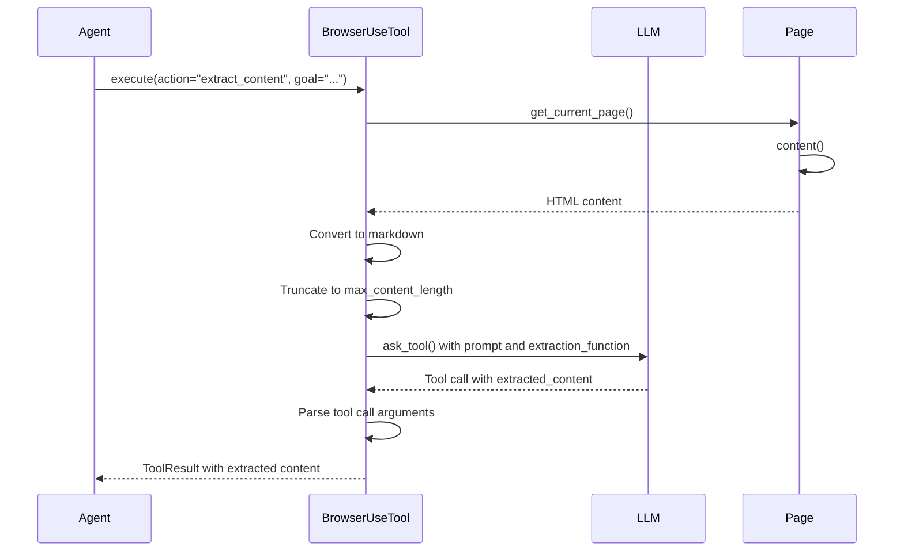
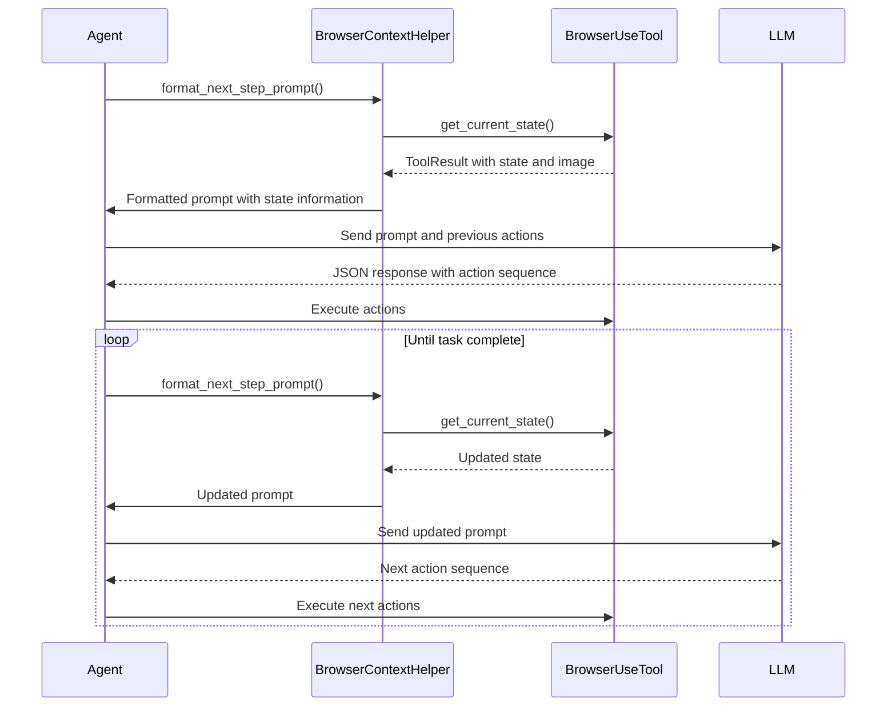

# Browser Automation

<cite>
**Referenced Files in This Document**   
- [browser_use_tool.py](file://app/tool/browser_use_tool.py)
- [config.py](file://app/config.py)
- [base.py](file://app/tool/base.py)
- [llm.py](file://app/llm.py)
- [web_search.py](file://app/tool/web_search.py)
- [browser.py](file://app/agent/browser.py)
- [prompt/browser.py](file://app/prompt/browser.py)
</cite>

## Table of Contents
1. [Introduction](#introduction)
2. [Core Components](#core-components)
3. [Action-Based Interface](#action-based-interface)
4. [State Management](#state-management)
5. [Content Extraction with LLM](#content-extraction-with-llm)
6. [Security and Performance](#security-and-performance)
7. [Integration with Agent Loop](#integration-with-agent-loop)
8. [Configuration and Proxy Settings](#configuration-and-proxy-settings)

## Introduction

The Browser Automation tool in OpenManus provides a comprehensive interface for browser interaction through the `browser_use` library, which leverages Playwright for full-featured browser automation. This tool enables agents to perform complex web interactions including navigation, form filling, content extraction, and tab management through a structured action-based interface. The implementation maintains browser state across interactions and uses DOM indexing for reliable element targeting, allowing for robust and consistent automation workflows.

**Section sources**
- [browser_use_tool.py](file://app/tool/browser_use_tool.py#L38-L566)

## Core Components

The Browser Automation system is built around the `BrowserUseTool` class, which extends `BaseTool` and provides a rich set of browser interaction capabilities. The tool maintains state through `BrowserContext` and uses the `DomService` for DOM manipulation. It integrates with the LLM system for intelligent content extraction and supports various browser actions through a well-defined parameter schema. The implementation ensures thread safety with an asyncio lock and properly handles resource cleanup through the `cleanup` method.



**Diagram sources**
- [browser_use_tool.py](file://app/tool/browser_use_tool.py#L38-L566)
- [base.py](file://app/tool/base.py#L77-L172)

**Section sources**
- [browser_use_tool.py](file://app/tool/browser_use_tool.py#L38-L566)
- [base.py](file://app/tool/base.py#L77-L172)

## Action-Based Interface

The `BrowserUseTool` class provides an action-based interface with a comprehensive set of browser operations. The tool supports navigation actions like `go_to_url` and `go_back`, element interaction through `click_element` and `input_text`, scrolling via `scroll_down` and `scroll_to_text`, content extraction with `extract_content`, and tab management including `switch_tab` and `open_tab`. Each action is defined in the tool's parameters schema with specific required and optional parameters, ensuring proper validation and usage.



**Diagram sources**
- [browser_use_tool.py](file://app/tool/browser_use_tool.py#L38-L566)

**Section sources**
- [browser_use_tool.py](file://app/tool/browser_use_tool.py#L38-L566)

## State Management

The Browser Automation tool maintains state through the `BrowserContext` object, which persists across tool invocations. The tool uses an asyncio lock to ensure thread-safe access to the browser instance and context. The `get_current_state` method captures the current browser state including URL, title, tabs, interactive elements, and scroll information, and returns it as a `ToolResult` with a base64-encoded screenshot. This state information is crucial for the agent to understand the current browser context and make informed decisions about subsequent actions.



**Diagram sources**
- [browser_use_tool.py](file://app/tool/browser_use_tool.py#L478-L538)
- [browser.py](file://app/agent/browser.py#L23-L50)

**Section sources**
- [browser_use_tool.py](file://app/tool/browser_use_tool.py#L478-L538)
- [browser.py](file://app/agent/browser.py#L23-L50)

## Content Extraction with LLM

The `extract_content` action leverages LLM-powered parsing with function calling to extract relevant information from web pages based on a specified goal. The tool converts the page content to markdown format, truncates it according to the configured `max_content_length`, and sends it to the LLM with a structured prompt and function schema. The LLM is instructed to extract specific information according to the goal using function calling, ensuring structured output that can be easily processed by the agent. This approach combines the browser's ability to render and access web content with the LLM's natural language understanding capabilities.



**Diagram sources**
- [browser_use_tool.py](file://app/tool/browser_use_tool.py#L359-L392)
- [browser_use_tool.py](file://app/tool/browser_use_tool.py#L429-L454)
- [llm.py](file://app/llm.py#L500-L550)

**Section sources**
- [browser_use_tool.py](file://app/tool/browser_use_tool.py#L359-L392)
- [browser_use_tool.py](file://app/tool/browser_use_tool.py#L429-L454)

## Security and Performance

The Browser Automation tool includes several security and performance considerations. By default, the browser runs in non-headless mode with security disabled, which can be configured through the global config. The tool uses full browser instantiation, which provides complete rendering capabilities but has performance implications compared to headless browsers. The implementation includes proper resource cleanup through the `cleanup` method and destructor to ensure browser instances are properly closed. The use of asyncio locks prevents race conditions when multiple operations access the browser simultaneously.

**Section sources**
- [browser_use_tool.py](file://app/tool/browser_use_tool.py#L140-L187)
- [config.py](file://app/config.py#L100-L130)

## Integration with Agent Loop

The Browser Automation tool integrates with the agent's decision-making loop through structured `ToolResult` responses that provide both textual output and visual state information. The agent uses the `get_current_state` method to obtain the current browser state, including a base64-encoded screenshot, which is then used to inform subsequent actions. The prompt system guides the agent on how to interact with the browser, specifying the available actions and how to format responses. This tight integration allows the agent to make informed decisions based on both the current state and previous actions.



**Diagram sources**
- [browser.py](file://app/agent/browser.py#L23-L50)
- [prompt/browser.py](file://app/prompt/browser.py#L67-L93)

**Section sources**
- [browser.py](file://app/agent/browser.py#L23-L50)
- [prompt/browser.py](file://app/prompt/browser.py#L67-L93)

## Configuration and Proxy Settings

The Browser Automation tool's behavior is configurable through the global config system, which allows setting browser options such as headless mode, security settings, and proxy configuration. The tool reads these settings from the config file and applies them when initializing the browser instance. Proxy settings are handled through the `ProxySettings` class, which supports server, username, and password configuration. Additional browser attributes like extra Chromium arguments and Chrome instance paths can also be configured, providing flexibility for different deployment scenarios.

```mermaid
flowchart TD
A[Configuration] --> B[Global Config]
A --> C[Browser Settings]
A --> D[Proxy Settings]
B --> B1[config.py]
B --> B2[config.toml]
C --> C1[headless: bool]
C --> C2[disable_security: bool]
C --> C3[extra_chromium_args: List[str]]
C --> C4[chrome_instance_path: Optional[str]]
C --> C5[wss_url: Optional[str]]
C --> C6[cdp_url: Optional[str]]
C --> C7[max_content_length: int]
D --> D1[server: str]
D --> D2[username: Optional[str]]
D --> D3[password: Optional[str]]
B1 --> |Reads| B2
C --> |Applied in| E[_ensure_browser_initialized]
D --> |Used in| E
```

**Diagram sources**
- [config.py](file://app/config.py#L100-L130)
- [browser_use_tool.py](file://app/tool/browser_use_tool.py#L140-L187)

**Section sources**
- [config.py](file://app/config.py#L100-L130)
- [browser_use_tool.py](file://app/tool/browser_use_tool.py#L140-L187)