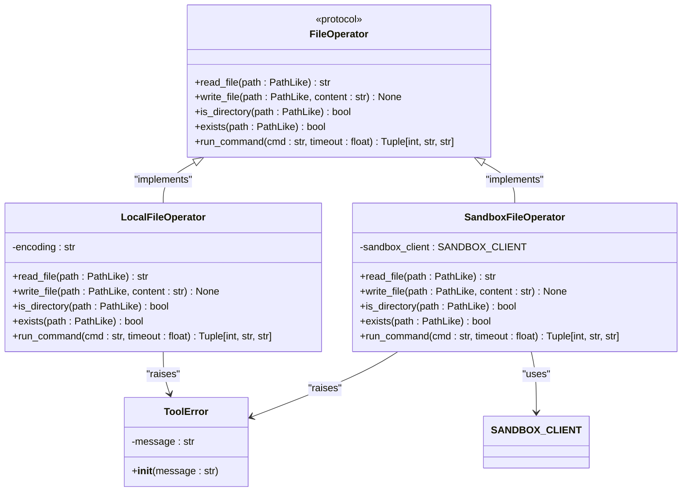
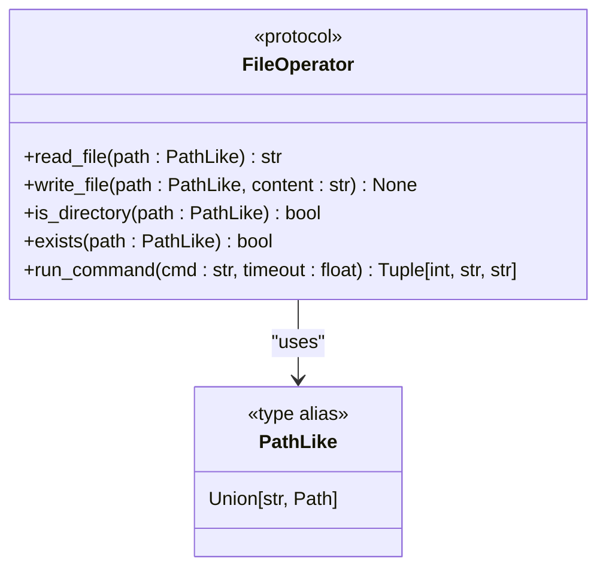
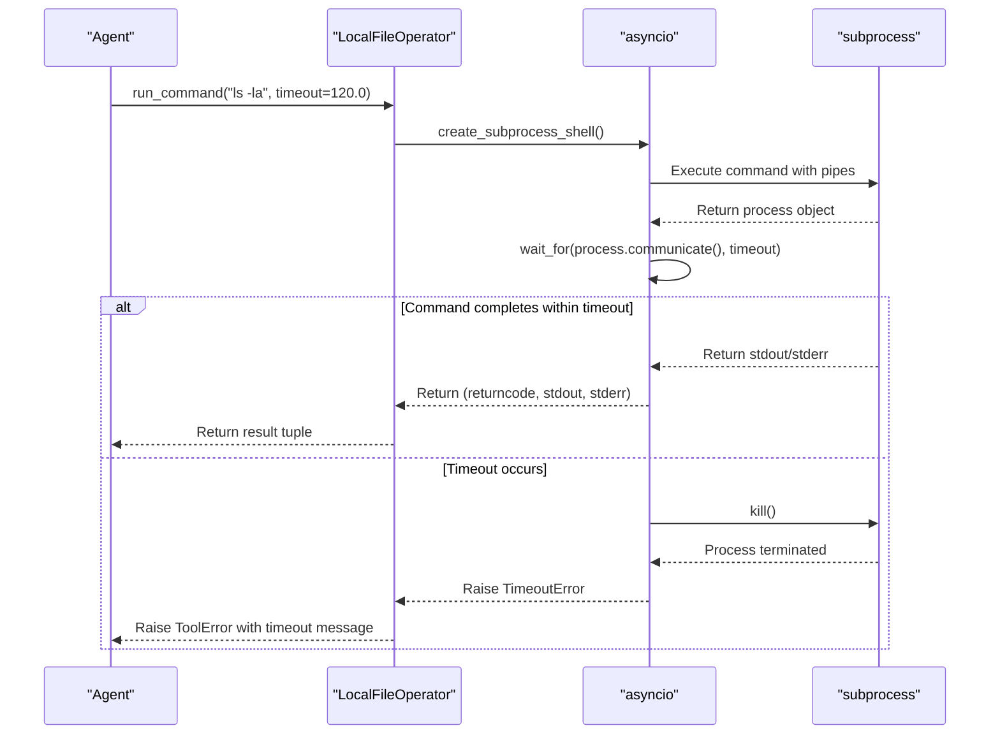
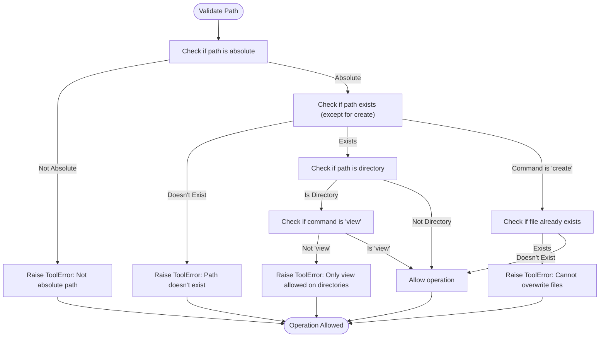

# File Operations

<cite>
**Referenced Files in This Document**   
- [file_operators.py](file://app/tool/file_operators.py)
- [str_replace_editor.py](file://app/tool/str_replace_editor.py)
- [client.py](file://app/sandbox/client.py)
- [exceptions.py](file://app/exceptions.py)
</cite>

## Table of Contents
1. [Introduction](#introduction)
2. [Core Components](#core-components)
3. [Architecture Overview](#architecture-overview)
4. [Detailed Component Analysis](#detailed-component-analysis)
5. [Security Considerations](#security-considerations)
6. [Performance Implications](#performance-implications)
7. [Integration with Sandboxed Environments](#integration-with-sandboxed-environments)
8. [Usage Patterns](#usage-patterns)
9. [Conclusion](#conclusion)

## Introduction
The File Operations tool in OpenManus provides a comprehensive interface for file system interactions within agent workflows. It enables agents to perform essential file operations such as reading, writing, and executing commands while maintaining compatibility across different execution environments. The implementation centers around the `FileOperator` protocol, which defines a consistent interface for file operations, with concrete implementations for both local and sandboxed environments. This design allows seamless switching between execution contexts while providing robust error handling through the `ToolError` exception class. The tool supports asynchronous I/O operations using Python's `asyncio` framework, ensuring non-blocking execution in agent workflows.

## Core Components
The File Operations tool consists of several key components that work together to provide file system functionality. The `FileOperator` protocol serves as the foundation, defining the interface for all file operations. Concrete implementations include `LocalFileOperator` for direct filesystem access and `SandboxFileOperator` for isolated environment operations. The `PathLike` type alias supports both string and `Path` object inputs, providing flexibility in path specification. The `ToolError` class handles exception wrapping across all operations, ensuring consistent error reporting. These components work together to provide a unified interface for file operations regardless of the underlying execution environment.

**Section sources**
- [file_operators.py](file://app/tool/file_operators.py#L15-L157)
- [exceptions.py](file://app/exceptions.py#L0-L4)

## Architecture Overview

**Diagram sources**
- [file_operators.py](file://app/tool/file_operators.py#L15-L157)
- [client.py](file://app/sandbox/client.py#L200-L200)
- [exceptions.py](file://app/exceptions.py#L0-L4)

## Detailed Component Analysis

### FileOperator Protocol
The `FileOperator` protocol defines the contract for file operations in OpenManus. It specifies five core methods: `read_file`, `write_file`, `is_directory`, `exists`, and `run_command`. All methods are asynchronous, ensuring non-blocking execution in agent workflows. The protocol uses the `PathLike` type for path parameters, allowing both string and `Path` object inputs. This abstraction enables different implementations to provide the same interface while varying in their underlying execution environment.

**Diagram sources**
- [file_operators.py](file://app/tool/file_operators.py#L15-L38)

**Section sources**
- [file_operators.py](file://app/tool/file_operators.py#L15-L38)

### LocalFileOperator Implementation
The `LocalFileOperator` provides concrete implementation of the `FileOperator` protocol for local filesystem operations. It uses Python's `pathlib.Path` for file operations and `asyncio.subprocess` for command execution. The implementation handles file encoding through the `encoding` field, defaulting to UTF-8. For command execution, it uses `subprocess.PIPE` with `asyncio.wait_for` for timeout handling, ensuring that long-running processes don't block agent workflows. When operations fail, the implementation raises `ToolError` with descriptive messages, providing consistent error handling across the system.

**Diagram sources**
- [file_operators.py](file://app/tool/file_operators.py#L41-L92)

**Section sources**
- [file_operators.py](file://app/tool/file_operators.py#L41-L92)

### SandboxFileOperator Implementation
The `SandboxFileOperator` implements the `FileOperator` protocol for sandboxed environments. It delegates operations to the `SANDBOX_CLIENT`, ensuring isolation from the host system. The implementation includes `_ensure_sandbox_initialized` to guarantee the sandbox is ready before operations. For existence and directory checks, it uses shell commands with `test` and echo statements, as direct filesystem queries are not available. The `run_command` method returns a simplified result structure, as the sandbox implementation doesn't provide separate stderr output. This design prioritizes security and isolation over detailed process information.

**Section sources**
- [file_operators.py](file://app/tool/file_operators.py#L95-L157)
- [client.py](file://app/sandbox/client.py#L200-L200)

### PathLike and Async I/O
The `PathLike` type alias enables flexible path specification by supporting both string and `Path` inputs. This design choice simplifies integration with various parts of the codebase that may use different path representations. All file operations are implemented asynchronously using `asyncio`, allowing non-blocking execution in agent workflows. The async design is particularly important for I/O-bound operations like file reading and command execution, preventing agent threads from being blocked during potentially long-running operations.

**Section sources**
- [file_operators.py](file://app/tool/file_operators.py#L11-L11)
- [file_operators.py](file://app/tool/file_operators.py#L46-L51)

### Error Handling with ToolError
The `ToolError` exception class provides consistent error handling across all file operations. Both `LocalFileOperator` and `SandboxFileOperator` wrap underlying exceptions in `ToolError` with descriptive messages. This abstraction ensures that agents receive consistent error information regardless of the execution environment. The error messages include the operation type, path, and original exception details, facilitating debugging and error recovery in agent workflows.

**Section sources**
- [exceptions.py](file://app/exceptions.py#L0-L4)
- [file_operators.py](file://app/tool/file_operators.py#L53-L58)

## Security Considerations
The File Operations tool implements several security measures to prevent path traversal attacks and unauthorized access. The `validate_path` method in `StrReplaceEditor` enforces absolute paths, preventing directory traversal through relative path manipulation. It also validates path existence and type before operations, ensuring that commands are only executed on appropriate file types. The sandboxed environment provides an additional security layer by isolating file operations from the host system. The `create` command prevents overwriting existing files, reducing the risk of accidental data loss. These security measures work together to create a secure file operation environment while maintaining usability for legitimate agent workflows.

**Diagram sources**
- [str_replace_editor.py](file://app/tool/str_replace_editor.py#L165-L193)

**Section sources**
- [str_replace_editor.py](file://app/tool/str_replace_editor.py#L165-L193)

## Performance Implications
The asynchronous design of the File Operations tool minimizes performance impact on agent workflows. However, there are important performance considerations to note. The `LocalFileOperator` executes file operations synchronously within async methods, which could potentially block the event loop for large file operations. The `run_command` method uses `asyncio.wait_for` with timeout handling, preventing indefinite blocking but requiring careful timeout configuration. In the sandboxed environment, operations like `exists` and `is_directory` are implemented using shell commands rather than direct filesystem queries, adding overhead. The tool's performance is generally optimized for typical agent use cases involving small to medium-sized files and short-running commands.

**Section sources**
- [file_operators.py](file://app/tool/file_operators.py#L68-L92)
- [file_operators.py](file://app/tool/file_operators.py#L145-L157)

## Integration with Sandboxed Environments
The File Operations tool integrates with sandboxed environments through the `SANDBOX_CLIENT` abstraction. The `SandboxFileOperator` uses this client to delegate operations to an isolated execution environment. This design enables secure execution of file operations without direct access to the host filesystem. The integration includes automatic sandbox initialization through `_ensure_sandbox_initialized`, ensuring the environment is ready before operations. Command execution in the sandbox returns simplified results without separate stderr output, reflecting the limitations of the sandbox implementation. This integration allows agents to perform file operations in a secure, isolated environment while maintaining the same interface as local operations.

**Section sources**
- [file_operators.py](file://app/tool/file_operators.py#L95-L157)
- [client.py](file://app/sandbox/client.py#L200-L200)

## Usage Patterns
The File Operations tool supports several key usage patterns in agent workflows. For persistent state storage, agents can use `write_file` and `read_file` to maintain data between executions. Log manipulation is enabled through reading and writing log files, allowing agents to monitor and analyze system behavior. Configuration file updates can be performed using the `str_replace` command in `StrReplaceEditor`, enabling dynamic configuration management. The `run_command` method supports shell command execution for system interactions, while the `view` command provides file and directory inspection capabilities. These patterns enable agents to perform complex file system tasks as part of their workflows.

**Section sources**
- [str_replace_editor.py](file://app/tool/str_replace_editor.py#L195-L281)
- [file_operators.py](file://app/tool/file_operators.py#L41-L92)

## Conclusion
The File Operations tool in OpenManus provides a robust, secure, and flexible interface for file system interactions in agent workflows. Its protocol-based design with concrete implementations for local and sandboxed environments enables consistent operation across different execution contexts. The asynchronous implementation ensures non-blocking execution, while comprehensive error handling through `ToolError` provides reliable exception management. Security measures like path validation and sandbox isolation protect the host system while enabling powerful file operations. The tool's design supports essential agent capabilities including state persistence, log analysis, and configuration management, making it a fundamental component of the OpenManus agent framework.