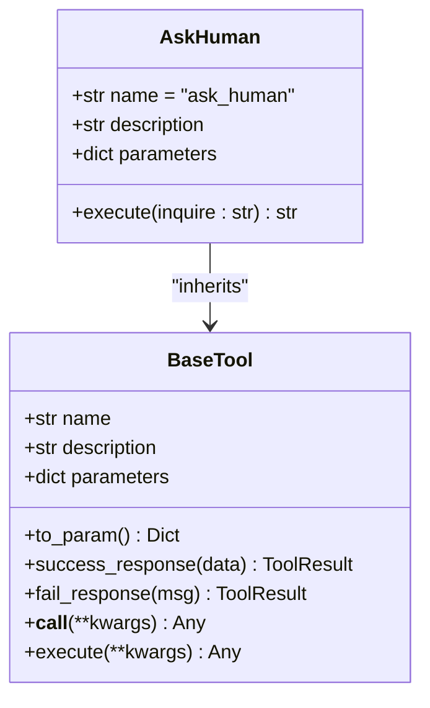
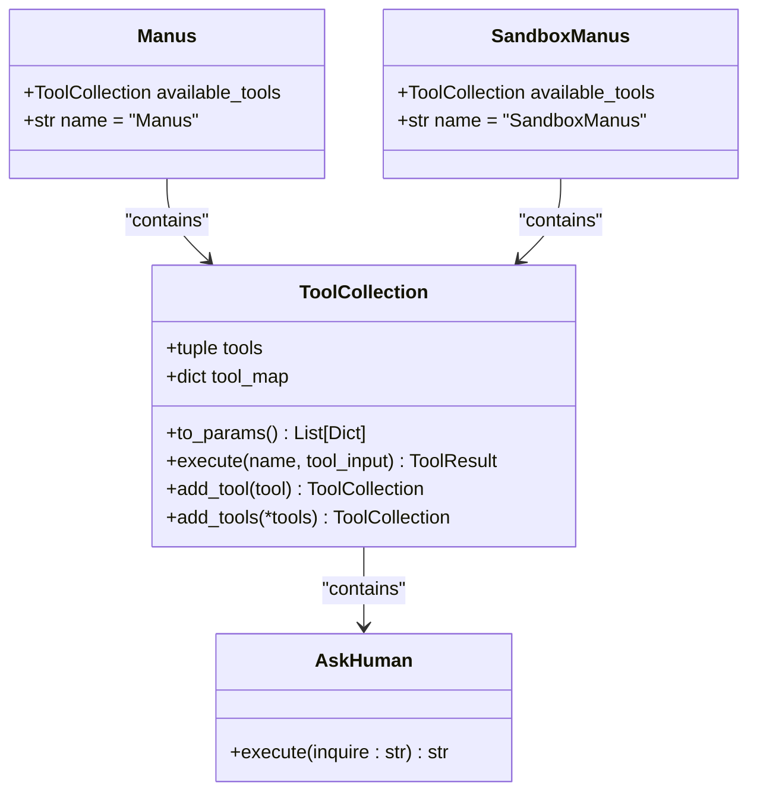

# Human Interaction

<cite>
**Referenced Files in This Document**   
- [ask_human.py](file://app/tool/ask_human.py)
- [tool_collection.py](file://app/tool/tool_collection.py)
- [base.py](file://app/tool/base.py)
- [manus.py](file://app/agent/manus.py)
- [sandbox_agent.py](file://app/agent/sandbox_agent.py)
- [toolcall.py](file://app/agent/toolcall.py)
</cite>

## Table of Contents
1. [Introduction](#introduction)
2. [Core Implementation](#core-implementation)
3. [Integration with Agent Architecture](#integration-with-agent-architecture)
4. [Usability Considerations](#usability-considerations)
5. [Performance Implications](#performance-implications)
6. [Use Cases](#use-cases)
7. [Conclusion](#conclusion)

## Introduction
The Human Interaction tool in OpenManus provides a critical mechanism for human-in-the-loop decision making through the AskHuman tool. This blocking interface enables automated agents to pause execution and request input from human users when facing ambiguous situations, requiring sensitive operation authorization, or needing clarification on complex tasks. The implementation allows for seamless integration into automated workflows while maintaining the ability for human oversight and intervention.

**Section sources**
- [ask_human.py](file://app/tool/ask_human.py#L3-L20)

## Core Implementation

### AskHuman Tool Structure
The AskHuman tool is implemented as a specialized tool class that inherits from BaseTool, providing a standardized interface for human interaction within the agent ecosystem. The tool is designed with a simple yet effective structure that focuses on the core functionality of requesting and receiving human input.

**Diagram sources**
- [ask_human.py](file://app/tool/ask_human.py#L3-L20)
- [base.py](file://app/tool/base.py#L77-L172)

### Execution Flow
The AskHuman tool implements a synchronous blocking pattern through its execute method, which uses Python's built-in input() function to pause execution and wait for user input. When invoked, the tool formats the inquiry with clear prompts and waits for the user to provide a response through standard input.

The tool's parameters are defined in a JSON schema format, specifying that an "inquire" string parameter is required. This parameter contains the question that will be presented to the human user, ensuring that all human interaction requests are properly structured and contain the necessary context.

**Section sources**
- [ask_human.py](file://app/tool/ask_human.py#L3-L20)

## Integration with Agent Architecture

### Agent Tool Registration
The AskHuman tool is integrated into various agent implementations through the available_tools field, which maintains a collection of tools that the agent can utilize during execution. Multiple agent classes, including Manus and SandboxManus, include AskHuman in their available_tools collection, making it accessible for human interaction when needed.

**Diagram sources**
- [manus.py](file://app/agent/manus.py#L33-L41)
- [sandbox_agent.py](file://app/agent/sandbox_agent.py#L36-L44)
- [tool_collection.py](file://app/tool/tool_collection.py#L8-L70)

### Tool Execution Pipeline
The AskHuman tool integrates into the agent's execution pipeline through the ToolCallAgent class, which manages the think-act cycle of tool usage. When an agent determines that human input is needed, it creates a tool call for AskHuman with the appropriate inquiry parameter. The ToolCollection.execute method then routes the call to the AskHuman instance, triggering the blocking input operation.

The execution flow follows a standardized pattern across all tools in the system, ensuring consistent behavior and error handling. When the AskHuman tool is executed, it temporarily halts the agent's progress until the human provides input, which is then returned as the tool result and incorporated into the agent's memory for subsequent processing.

**Section sources**
- [toolcall.py](file://app/agent/toolcall.py#L24-L249)
- [tool_collection.py](file://app/tool/tool_collection.py#L24-L34)

## Usability Considerations

### Clear Question Framing
The AskHuman tool is designed to promote clear and effective communication between the agent and human user. The tool's implementation encourages agents to formulate specific, well-structured questions by providing a dedicated "inquire" parameter. This ensures that human users receive clear context about why their input is needed and what information is being requested.

The prompt formatting includes visual separation between the bot's question and the user's response area, enhancing readability and reducing the likelihood of input errors. This clear framing helps prevent misunderstandings and ensures that human input is relevant and useful for the agent's decision-making process.

### Response Validation
While the current implementation relies on the agent to validate the human's response after it is received, the tool's structure supports future enhancements for input validation. The separation between the inquiry and response phases allows for potential extensions that could include response format specifications or validation rules as additional parameters.

The integration with the ToolResult system ensures that responses are properly formatted and can be easily processed by the agent. Successful responses are returned as ToolResult objects with the output field containing the user's input, while errors are captured in the error field, providing a consistent interface for handling both successful and failed interactions.

### Fallback Strategies
The current implementation does not include explicit fallback strategies for situations where human input is unavailable or delayed. However, the agent architecture provides mechanisms that could be leveraged to implement such strategies. For example, agents have a maximum step limit (max_steps) that would eventually terminate execution if a human fails to respond, preventing infinite blocking.

Future enhancements could incorporate timeout mechanisms or alternative decision-making pathways when human input is not received within a specified timeframe. These could be implemented at the agent level, allowing for context-aware fallback strategies based on the importance and urgency of the requested input.

**Section sources**
- [ask_human.py](file://app/tool/ask_human.py#L3-L20)
- [toolcall.py](file://app/agent/toolcall.py#L35-L36)

## Performance Implications

### Synchronous Blocking Behavior
The AskHuman tool implements a synchronous blocking pattern that has significant performance implications for agent workflows. When the tool is invoked, the entire agent execution is paused until human input is received, creating a potential bottleneck in automated processes.

This blocking behavior ensures that the agent maintains context and state while waiting for input, but it also means that no other processing can occur during the waiting period. The performance impact is particularly noticeable in scenarios where human response times are unpredictable or when multiple human interactions are required in sequence.

The synchronous nature of the implementation simplifies the code and ensures data consistency, but it may not be optimal for high-throughput or time-sensitive applications. Alternative asynchronous patterns could be considered for future iterations, potentially using callback mechanisms or event-driven architectures to allow other processing to continue while waiting for human input.

### Integration Patterns
The AskHuman tool is integrated into agent workflows through several key patterns that balance automation with human oversight:

1. **Approval Gates**: The tool is used to implement approval gates for sensitive operations, requiring explicit human confirmation before proceeding with actions that could have significant consequences.

2. **Ambiguous Situation Resolution**: When the agent encounters ambiguous or uncertain situations that cannot be resolved through automated means, it uses AskHuman to request clarification or guidance from a human user.

3. **Sensitive Operation Authorization**: For operations involving security, privacy, or financial transactions, the tool provides a mechanism for obtaining human authorization before proceeding.

These integration patterns ensure that human oversight is applied at critical decision points while allowing the agent to handle routine tasks autonomously. The tool's placement in the available_tools collection of multiple agent types demonstrates its versatility and importance across different use cases.

**Section sources**
- [manus.py](file://app/agent/manus.py#L33-L41)
- [sandbox_agent.py](file://app/agent/sandbox_agent.py#L36-L44)

## Use Cases

### Complex Task Resolution
The AskHuman tool is particularly valuable in scenarios involving complex task resolution where the agent may need to make judgment calls that require human intuition or domain expertise. For example, when analyzing ambiguous requirements or making trade-off decisions between competing objectives, the agent can pause and request human input to ensure alignment with user expectations.

### Error Recovery
In error recovery scenarios, the AskHuman tool provides a mechanism for human intervention when automated error handling fails. When the agent encounters unexpected errors or edge cases that are not covered by its programming, it can request human assistance to determine the appropriate recovery strategy.

### Ethical Decision Making
For applications involving ethical considerations or potential bias, the AskHuman tool enables human oversight of decision-making processes. This is particularly important in sensitive domains such as healthcare, finance, or content moderation, where automated decisions may have significant consequences.

## Conclusion
The AskHuman tool in OpenManus provides a robust implementation of human-in-the-loop decision making through a blocking interface that seamlessly integrates with the agent architecture. By pausing agent execution and waiting for user input through standard input, the tool enables critical human oversight at key decision points in automated workflows.

The implementation demonstrates a clear understanding of the trade-offs between automation and human control, providing a simple yet effective mechanism for incorporating human judgment into AI-driven processes. While the current synchronous blocking behavior has performance implications, it ensures data consistency and provides a straightforward interface for human interaction.

Future enhancements could explore asynchronous patterns, timeout mechanisms, and more sophisticated response validation to further improve the usability and reliability of human-agent collaboration. Nevertheless, the current implementation effectively addresses the core requirements of human-in-the-loop decision making, making it a valuable component of the OpenManus framework.