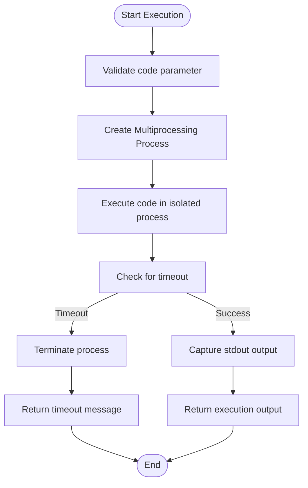
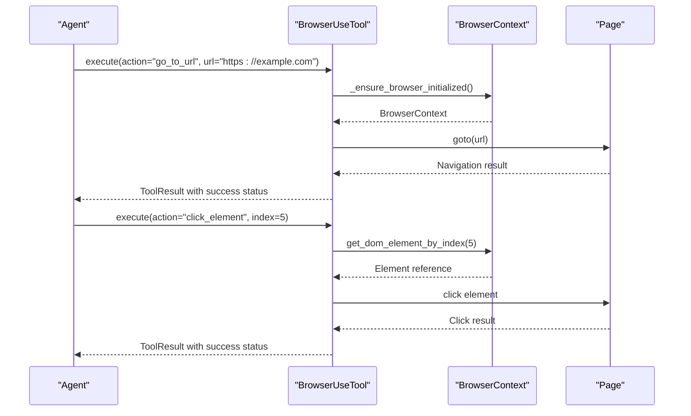
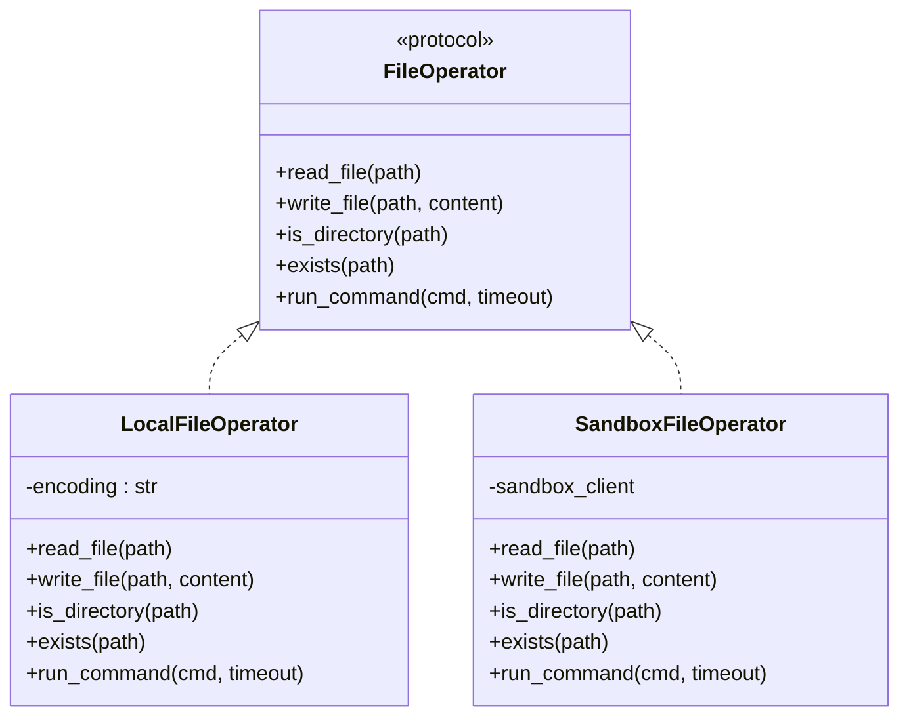
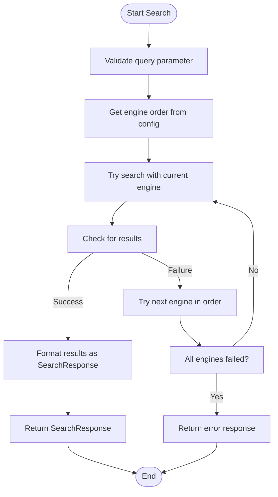
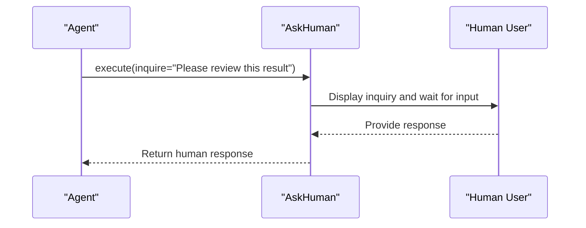
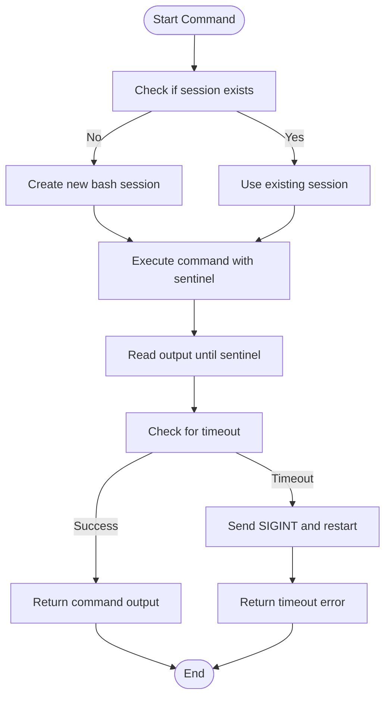
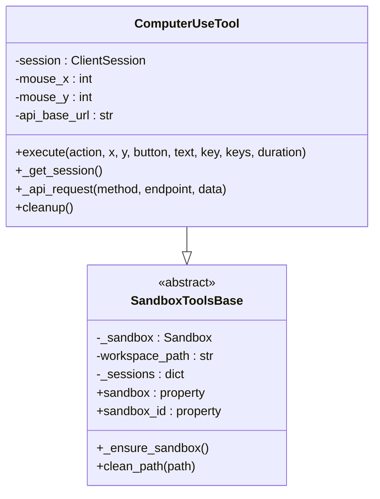
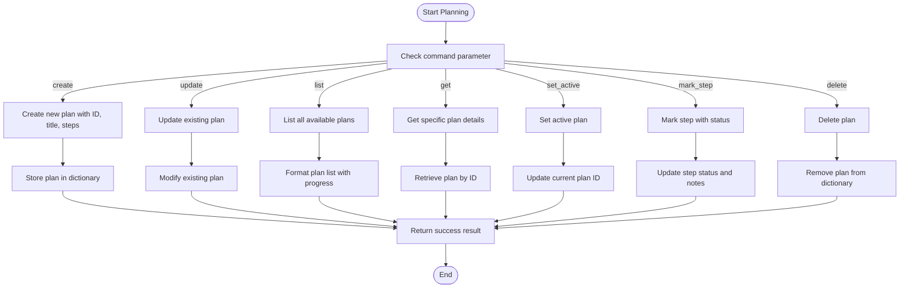
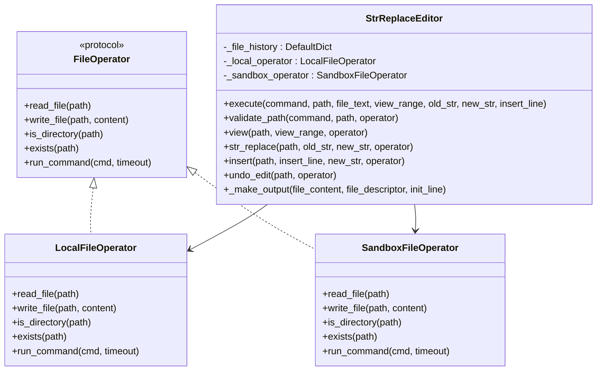
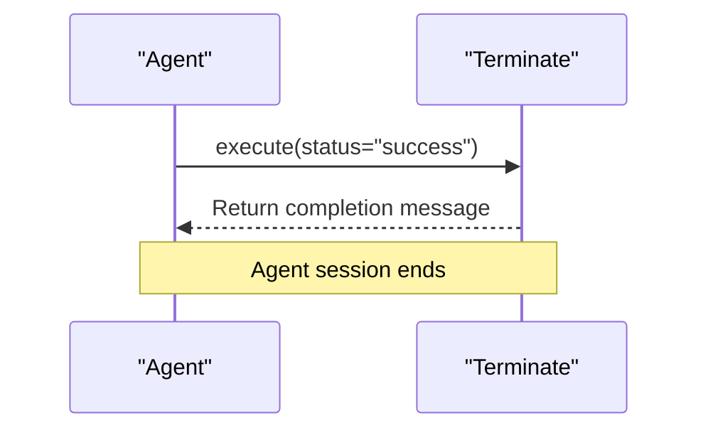

# Local Tools

<cite>
**Referenced Files in This Document**   
- [python_execute.py](file://app/tool/python_execute.py)
- [browser_use_tool.py](file://app/tool/browser_use_tool.py)
- [file_operators.py](file://app/tool/file_operators.py)
- [web_search.py](file://app/tool/web_search.py)
- [ask_human.py](file://app/tool/ask_human.py)
- [bash.py](file://app/tool/bash.py)
- [computer_use_tool.py](file://app/tool/computer_use_tool.py)
- [planning.py](file://app/tool/planning.py)
- [str_replace_editor.py](file://app/tool/str_replace_editor.py)
- [terminate.py](file://app/tool/terminate.py)
- [base.py](file://app/tool/base.py)
- [config.py](file://app/config.py)
</cite>

## Table of Contents
1. [Introduction](#introduction)
2. [Core Local Tools](#core-local-tools)
   - [python_execute](#python_execute)
   - [browser_use_tool](#browser_use_tool)
   - [file_operators](#file_operators)
   - [web_search](#web_search)
   - [ask_human](#ask_human)
3. [Auxiliary Tools](#auxiliary-tools)
   - [bash](#bash)
   - [computer_use_tool](#computer_use_tool)
   - [planning](#planning)
   - [str_replace_editor](#str_replace_editor)
   - [terminate](#terminate)
4. [Tool Integration and Execution](#tool-integration-and-execution)
5. [Security and Performance Considerations](#security-and-performance-considerations)

## Introduction
The OpenManus framework provides a comprehensive suite of local tools that enable agents to perform various tasks ranging from code execution and web browsing to file manipulation and human interaction. These tools are designed to be modular, secure, and efficient, allowing for seamless integration into the agent's decision-making process. This document details the implementation and usage of both core and auxiliary tools, providing insights into their functionality, input/output schemas, and error handling mechanisms.

**Section sources**
- [python_execute.py](file://app/tool/python_execute.py#L1-L75)
- [browser_use_tool.py](file://app/tool/browser_use_tool.py#L1-L567)
- [file_operators.py](file://app/tool/file_operators.py#L1-L158)
- [web_search.py](file://app/tool/web_search.py#L1-L418)
- [ask_human.py](file://app/tool/ask_human.py#L1-L21)
- [bash.py](file://app/tool/bash.py#L1-L158)
- [computer_use_tool.py](file://app/tool/computer_use_tool.py#L1-L487)
- [planning.py](file://app/tool/planning.py#L1-L363)
- [str_replace_editor.py](file://app/tool/str_replace_editor.py#L1-L432)
- [terminate.py](file://app/tool/terminate.py#L1-L25)

## Core Local Tools

### python_execute
The `python_execute` tool enables secure execution of Python code within a sandboxed environment. It uses multiprocessing to isolate code execution and implements timeout protection to prevent infinite loops. The tool captures stdout output but does not capture return values from functions, requiring the use of print statements to view results.

The implementation creates a safe execution environment by restricting access to built-in functions and using a separate process for code execution. If the execution exceeds the specified timeout (default 5 seconds), the process is terminated to prevent resource exhaustion.

**Diagram sources**
- [python_execute.py](file://app/tool/python_execute.py#L38-L74)

**Section sources**
- [python_execute.py](file://app/tool/python_execute.py#L1-L75)

### browser_use_tool
The `browser_use_tool` provides Playwright-based browser automation capabilities, allowing agents to interact with web pages through various actions such as navigation, element interaction, scrolling, content extraction, and tab management. The tool maintains state across calls, keeping the browser session alive until explicitly closed.

Key features include:
- Navigation: Go to URLs, go back, refresh pages, or perform web searches
- Element interaction: Click elements, input text, select from dropdowns, send keyboard commands
- Scrolling: Scroll up/down by pixel amount or scroll to specific text
- Content extraction: Extract and analyze content from web pages based on specific goals
- Tab management: Switch between tabs, open new tabs, or close tabs

The tool uses an asynchronous execution model with a lock mechanism to ensure thread safety when multiple operations are performed on the same browser instance.

**Diagram sources**
- [browser_use_tool.py](file://app/tool/browser_use_tool.py#L189-L476)

**Section sources**
- [browser_use_tool.py](file://app/tool/browser_use_tool.py#L1-L567)

### file_operators
The `file_operators` module provides a unified interface for file system interactions with support for both local and sandboxed environments. It defines a `FileOperator` protocol that specifies the required methods for file operations, with concrete implementations for local (`LocalFileOperator`) and sandboxed (`SandboxFileOperator`) environments.

The tool supports the following operations:
- Reading and writing files
- Checking if a path is a directory
- Checking if a path exists
- Running shell commands and capturing output

The implementation uses the `SANDBOX_CLIENT` to interact with the sandbox environment when configured, falling back to local file operations otherwise. This allows for secure file manipulation while maintaining compatibility with existing code.

**Diagram sources**
- [file_operators.py](file://app/tool/file_operators.py#L15-L38)

**Section sources**
- [file_operators.py](file://app/tool/file_operators.py#L1-L158)

### web_search
The `web_search` tool enables multi-engine web search capabilities, supporting Google, Bing, DuckDuckGo, and Baidu search engines. It implements a fallback mechanism that automatically tries alternative engines if the primary engine fails, ensuring reliable search results.

Key features include:
- Configurable search engine priority
- Automatic fallback to alternative engines
- Rate limiting and retry mechanisms
- Content fetching from search result pages
- Structured search response with metadata

The tool uses a retry mechanism with exponential backoff to handle temporary failures and implements rate limiting to prevent abuse of search APIs. Search results are returned in a structured format with URLs, titles, descriptions, and optional content previews.

**Diagram sources**
- [web_search.py](file://app/tool/web_search.py#L200-L287)

**Section sources**
- [web_search.py](file://app/tool/web_search.py#L1-L418)

### ask_human
The `ask_human` tool facilitates human-in-the-loop interactions by allowing the agent to request assistance from a human user. This is particularly useful for tasks that require subjective judgment, clarification of ambiguous requirements, or verification of results.

The tool implements a simple interface that takes an inquiry string and returns the human's response. It integrates seamlessly with the agent's decision loop, allowing for interactive problem-solving and validation of intermediate results.

**Diagram sources**
- [ask_human.py](file://app/tool/ask_human.py#L19-L20)

**Section sources**
- [ask_human.py](file://app/tool/ask_human.py#L1-L21)

## Auxiliary Tools

### bash
The `bash` tool provides shell command execution capabilities with support for long-running processes and interactive sessions. It maintains a bash session state, allowing for commands to be executed in sequence with access to the same environment.

Key features include:
- Execution of bash commands in a persistent session
- Support for long-running commands with background execution
- Interactive mode for commands that require input
- Timeout protection and error handling
- Ability to interrupt running processes

The tool uses asyncio to manage the bash process and implements a buffer-based approach to read output without waiting for EOF, enabling real-time monitoring of command execution.

**Diagram sources**
- [bash.py](file://app/tool/bash.py#L133-L151)

**Section sources**
- [bash.py](file://app/tool/bash.py#L1-L158)

### computer_use_tool
The `computer_use_tool` enables desktop automation by providing control over mouse, keyboard, and screen capture functions. It interfaces with a remote automation service API to perform GUI interactions on a virtual desktop environment.

Key capabilities include:
- Mouse control: Move, click, drag, scroll
- Keyboard input: Type text, press keys or key combinations
- Screenshots: Capture and save screen images
- Waiting: Pause execution for specified duration

The tool maintains state including the current mouse position and uses an aiohttp session to communicate with the automation service API. It implements proper cleanup procedures to ensure resources are released when the tool is destroyed.

**Diagram sources**
- [computer_use_tool.py](file://app/tool/computer_use_tool.py#L224-L470)

**Section sources**
- [computer_use_tool.py](file://app/tool/computer_use_tool.py#L1-L487)

### planning
The `planning` tool enables task decomposition and progress tracking by allowing agents to create, update, and manage plans for solving complex tasks. It provides functionality for creating plans with multiple steps, updating step statuses, and tracking overall progress.

Key features include:
- Plan creation with title and steps
- Step status tracking (not_started, in_progress, completed, blocked)
- Active plan management
- Progress visualization
- Step notes for additional context

The tool maintains an in-memory dictionary of plans and tracks the current active plan. It provides comprehensive feedback on plan status and progress, enabling agents to effectively manage complex workflows.

**Diagram sources**
- [planning.py](file://app/tool/planning.py#L71-L117)

**Section sources**
- [planning.py](file://app/tool/planning.py#L1-L363)

### str_replace_editor
The `str_replace_editor` tool provides file editing capabilities with support for viewing, creating, and modifying files. It maintains edit history to enable undo operations and supports both local and sandboxed file operations.

Key features include:
- File viewing with line numbers
- File creation
- String replacement with exact matching requirements
- Text insertion at specific lines
- Directory listing
- Edit history and undo functionality

The tool implements a stateful approach with persistent edit history and uses a file operator pattern to abstract file operations, allowing seamless switching between local and sandboxed environments based on configuration.

**Diagram sources**
- [str_replace_editor.py](file://app/tool/str_replace_editor.py#L113-L163)

**Section sources**
- [str_replace_editor.py](file://app/tool/str_replace_editor.py#L1-L432)

### terminate
The `terminate` tool provides a mechanism for ending agent sessions when tasks are completed or cannot proceed further. It requires a status parameter indicating whether the interaction was successful or failed.

The tool serves as a signal to the agent framework that the current task has been completed, triggering cleanup procedures and session termination. This ensures that resources are properly released and prevents infinite loops in the agent's decision process.

**Diagram sources**
- [terminate.py](file://app/tool/terminate.py#L22-L24)

**Section sources**
- [terminate.py](file://app/tool/terminate.py#L1-L25)

## Tool Integration and Execution
The local tools in OpenManus are integrated into the agent's decision loop through a standardized interface defined by the `BaseTool` class. This base class provides common functionality including parameter validation, result formatting, and error handling, ensuring consistent behavior across all tools.

Tools are registered with agents through the `available_tools` collection, which is configured in the agent classes (e.g., `manus.py`, `swe.py`). When an agent decides to use a tool, it calls the tool's `execute` method with the appropriate parameters, and the tool returns a `ToolResult` object containing the output, error information, or other relevant data.

The integration follows a consistent pattern:
1. The agent selects a tool based on the current task requirements
2. The agent calls the tool's `execute` method with the required parameters
3. The tool performs its operation and returns a `ToolResult`
4. The agent processes the result and decides on the next action

This modular approach allows for easy extension and replacement of tools while maintaining compatibility with the agent framework.

**Section sources**
- [base.py](file://app/tool/base.py#L77-L172)
- [manus.py](file://app/agent/manus.py#L33-L41)
- [swe.py](file://app/agent/swe.py#L18-L20)

## Security and Performance Considerations
The OpenManus local tools implement several security and performance measures to ensure safe and efficient operation:

### Security Considerations
- **Sandboxed Execution**: The `python_execute` tool uses multiprocessing to isolate code execution, preventing malicious code from affecting the host system
- **Input Validation**: All tools validate input parameters to prevent injection attacks and ensure data integrity
- **Configuration Management**: Sensitive configuration data is managed through the `Config` class, which loads settings from secure configuration files
- **Access Control**: File operations are restricted to the workspace directory, preventing unauthorized access to system files
- **Network Security**: Browser automation can be configured to run in headless mode with security features disabled only when explicitly required

### Rate Limiting for Web APIs
- **Search Engine Fallback**: The `web_search` tool implements a fallback mechanism that automatically tries alternative engines if the primary engine fails
- **Retry Mechanisms**: Tools use exponential backoff for retries to prevent overwhelming external services
- **Rate Limit Configuration**: Search settings can be configured in `config.toml` to control retry behavior and engine priority
- **Timeout Protection**: All network operations have configurable timeouts to prevent hanging requests

### State Management in Interactive Tools
- **Persistent State**: Tools like `browser_use_tool` and `bash` maintain state across calls, preserving browser sessions and shell environments
- **Resource Cleanup**: Tools implement proper cleanup procedures (e.g., `cleanup` methods) to release resources when no longer needed
- **State Serialization**: Tool state is serialized to JSON format for transmission between components
- **Error Recovery**: Tools include error handling to recover from transient failures and maintain consistent state

### Performance Implications
- **Synchronous vs Asynchronous Execution**: Most tools use asynchronous execution to prevent blocking the agent's decision loop, with synchronous operations limited to specific cases where necessary
- **Resource Management**: Tools are designed to minimize memory and CPU usage, with large operations performed in isolated processes when possible
- **Caching**: Frequently accessed data is cached to reduce redundant operations
- **Lazy Initialization**: Resources like browser instances are initialized only when needed to reduce startup time

These considerations ensure that the local tools provide robust functionality while maintaining security, reliability, and performance in various usage scenarios.

**Section sources**
- [config.py](file://app/config.py#L1-L372)
- [python_execute.py](file://app/tool/python_execute.py#L38-L74)
- [web_search.py](file://app/tool/web_search.py#L200-L287)
- [base.py](file://app/tool/base.py#L77-L172)