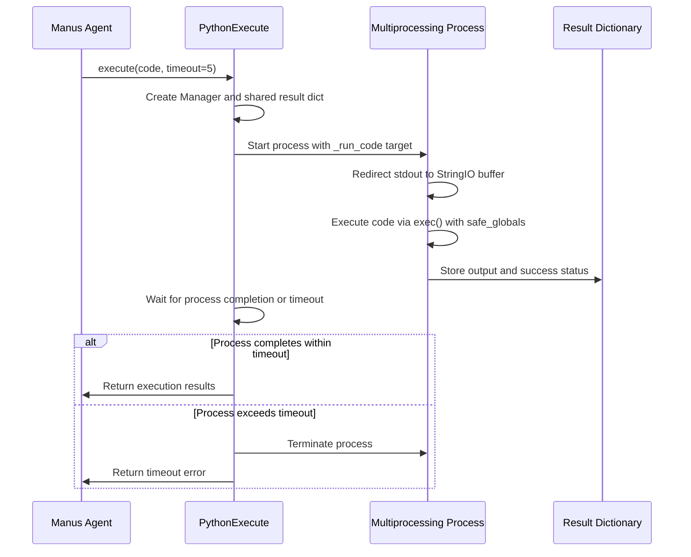
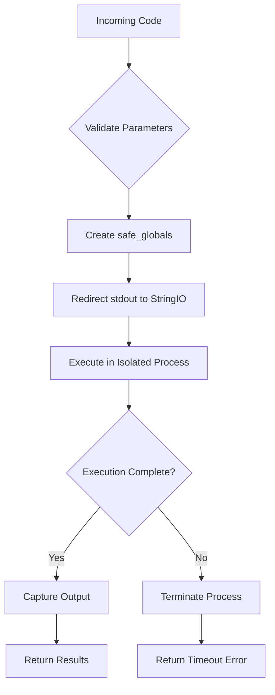
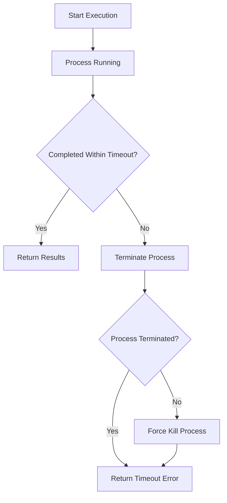

# Python Execute

<cite>
**Referenced Files in This Document**   
- [python_execute.py](file://app/tool/python_execute.py)
- [base.py](file://app/tool/base.py)
- [manus.py](file://app/agent/manus.py)
- [chart_visualization/python_execute.py](file://app/tool/chart_visualization/python_execute.py)
</cite>

## Table of Contents
1. [Introduction](#introduction)
2. [Core Implementation](#core-implementation)
3. [Security Model](#security-model)
4. [Execution Flow](#execution-flow)
5. [Error Handling and Timeouts](#error-handling-and-timeouts)
6. [Integration with Manus Agent](#integration-with-manus-agent)
7. [Performance Characteristics](#performance-characteristics)
8. [Usage Examples](#usage-examples)
9. [Conclusion](#conclusion)

## Introduction

The Python Execute tool in OpenManus provides a secure mechanism for executing untrusted Python code within the agent system. This tool enables dynamic code execution for data analysis, mathematical computations, and algorithmic processing while maintaining strict security boundaries. The implementation leverages Python's multiprocessing module to create isolated execution environments that prevent malicious or runaway code from affecting the host system. The tool is integrated into the Manus agent's tool calling loop, allowing the AI agent to generate and execute Python code as part of its problem-solving process.

**Section sources**
- [python_execute.py](file://app/tool/python_execute.py#L1-L10)

## Core Implementation

The PythonExecute class extends BaseTool to provide a secure code execution capability. The implementation uses multiprocessing to create isolated processes for code execution, ensuring that each code execution runs in a separate memory space from the main application. This architectural choice provides strong isolation guarantees and prevents memory leaks or state corruption between executions.

The execute() method accepts two parameters: the code string to execute and an optional timeout duration (defaulting to 5 seconds). When invoked, it creates a new multiprocessing.Manager to coordinate between the parent and child processes. A shared dictionary is established to communicate the execution results back to the parent process.

**Diagram sources**
- [python_execute.py](file://app/tool/python_execute.py#L45-L74)

**Section sources**
- [python_execute.py](file://app/tool/python_execute.py#L8-L74)

## Security Model

The security model of the Python Execute tool is designed to prevent arbitrary code execution risks through multiple layers of protection. The primary security mechanism is the use of safe_globals to restrict access to Python's built-in functions. When preparing the execution environment, the tool creates a safe_globals dictionary that contains a copy of __builtins__, preventing direct access to dangerous functions like eval, exec (when used maliciously), open, or system calls.

The tool also employs process-level isolation through multiprocessing, which provides an additional security boundary. Even if malicious code were to bypass the safe_globals restrictions, the damage would be limited to the isolated process, which is terminated after execution. Resource consumption is controlled through the timeout parameter, which limits the maximum execution time and prevents infinite loops or resource exhaustion attacks.

The implementation specifically notes that only print outputs are visible, as function return values are not captured. This design choice encourages users to use print statements for output, making it easier to capture and display results while avoiding potential issues with complex object serialization.

**Diagram sources**
- [python_execute.py](file://app/tool/python_execute.py#L24-L36)

**Section sources**
- [python_execute.py](file://app/tool/python_execute.py#L24-L36)

## Execution Flow

The execution flow of the Python Execute tool follows a well-defined sequence of operations that ensures both functionality and safety. When the execute() method is called, it first creates a multiprocessing.Manager context to manage shared objects between processes. Within this context, it initializes a shared dictionary to store the execution results, including the observation (output) and success status.

The tool then prepares the safe_globals environment by creating a copy of the built-in functions. This prevents the executed code from modifying the global built-in namespace, which could have unintended consequences for subsequent executions. A new Process is instantiated with the _run_code method as its target, passing the code string, result dictionary, and safe_globals as arguments.

Once the process is started, the tool waits for completion using join() with the specified timeout. If the process completes within the timeout period, the results are retrieved from the shared dictionary and returned to the caller. If the process is still alive after the timeout, it is terminated, and a timeout error message is returned.

**Section sources**
- [python_execute.py](file://app/tool/python_execute.py#L45-L74)

## Error Handling and Timeouts

The Python Execute tool implements robust error handling and timeout enforcement to ensure reliable operation. The _run_code method uses a try-except-finally block to capture any exceptions that occur during code execution. When an exception is caught, its string representation is stored in the result dictionary along with a success status of False. This allows the tool to provide meaningful error messages to the user without crashing the main application.

Timeout handling is implemented at the process level using multiprocessing. The proc.join(timeout) method waits for the process to complete for the specified duration. If the process is still running after this period, the proc.is_alive() check returns True, triggering process termination. The tool first calls proc.terminate() to request graceful shutdown, then calls proc.join(1) to wait briefly for cleanup. If the process still doesn't terminate, it will be forcefully killed by the operating system.

The default timeout of 5 seconds represents a balance between allowing sufficient time for meaningful computations and preventing long-running or infinite loops. This value can be adjusted based on the specific use case, though shorter timeouts are generally preferred for security reasons.

**Diagram sources**
- [python_execute.py](file://app/tool/python_execute.py#L65-L74)

**Section sources**
- [python_execute.py](file://app/tool/python_execute.py#L65-L74)

## Integration with Manus Agent

The Python Execute tool is seamlessly integrated into the Manus agent's tool calling loop, enabling the AI agent to leverage Python code execution as part of its problem-solving capabilities. In the Manus class definition, PythonExecute is included in the available_tools collection alongside other core tools like BrowserUseTool, StrReplaceEditor, AskHuman, and Terminate.

This integration allows the Manus agent to dynamically generate Python code in response to user requests, particularly for tasks involving data analysis, mathematical calculations, or algorithmic processing. When the agent determines that code execution would be beneficial, it generates a tool call with the appropriate Python code, which is then processed by the PythonExecute tool.

The tool's output format, which returns a dictionary with 'observation' and 'success' fields, aligns with the Manus agent's expectations for tool results. This structured response enables the agent to interpret the execution results and incorporate them into its ongoing reasoning process.

**Section sources**
- [manus.py](file://app/agent/manus.py#L33-L41)

## Performance Characteristics

The performance characteristics of the Python Execute tool are shaped by its use of multiprocessing for isolation. While this approach provides strong security guarantees, it introduces overhead associated with process creation and inter-process communication. Each code execution requires spawning a new process, which involves memory allocation, interpreter initialization, and setup of the inter-process communication channels.

The process spawning overhead makes the tool less suitable for high-frequency, low-latency use cases. However, for the typical use cases in an AI agent system—such as executing data analysis scripts or mathematical computations—the overhead is acceptable given the security benefits. The tool is designed for synchronous execution patterns, with the async execute method primarily serving to integrate with the agent's asynchronous architecture.

For performance-critical applications, the tool's timeout parameter helps prevent resource exhaustion from poorly performing code. The default 5-second timeout ensures that even inefficient code will not consume excessive resources. In scenarios where longer computations are required, the timeout can be increased, though this should be done with caution to maintain system responsiveness.

**Section sources**
- [python_execute.py](file://app/tool/python_execute.py#L45-L74)

## Usage Examples

The Python Execute tool is used in various contexts within the OpenManus system. The NormalPythonExecute class, which inherits from PythonExecute, demonstrates a specialized usage pattern for data analysis tasks. This subclass provides additional guidance in its description, emphasizing the generation of comprehensive text-based reports and the use of print statements to ensure visibility of results.

The tool is particularly valuable for tasks that require precise mathematical calculations, data manipulation, or algorithmic processing that would be difficult to accomplish through natural language alone. Examples include statistical analysis of datasets, financial calculations, string manipulation algorithms, and mathematical problem solving.

The integration with the Manus agent allows for iterative problem solving, where the agent can execute code, analyze the results, and then generate follow-up code based on the observations. This feedback loop enables sophisticated problem-solving capabilities that combine the reasoning power of the AI with the precision of programmatic execution.

**Section sources**
- [chart_visualization/python_execute.py](file://app/tool/chart_visualization/python_execute.py#L4-L35)

## Conclusion

The Python Execute tool in OpenManus provides a secure and effective mechanism for executing untrusted Python code within an AI agent system. By leveraging multiprocessing for isolation and implementing careful security controls through safe_globals, the tool balances functionality with safety. The timeout enforcement and structured error handling ensure reliable operation, while the integration with the Manus agent enables powerful problem-solving capabilities.

The design choices reflect a deep understanding of the security challenges associated with code execution in AI systems, prioritizing isolation and resource control over raw performance. As AI agents increasingly incorporate code execution as a core capability, the approach taken by OpenManus serves as a model for balancing functionality with security in agent tool design.