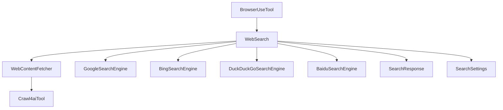
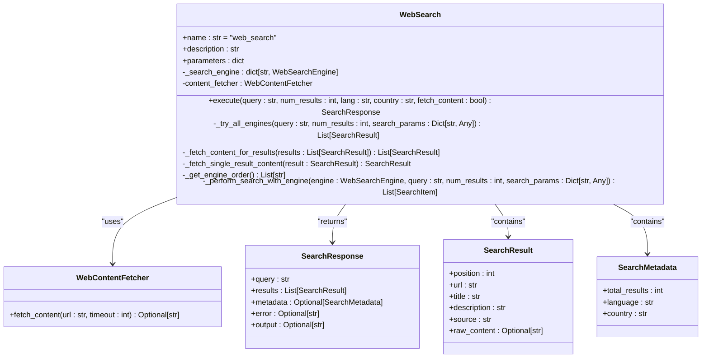
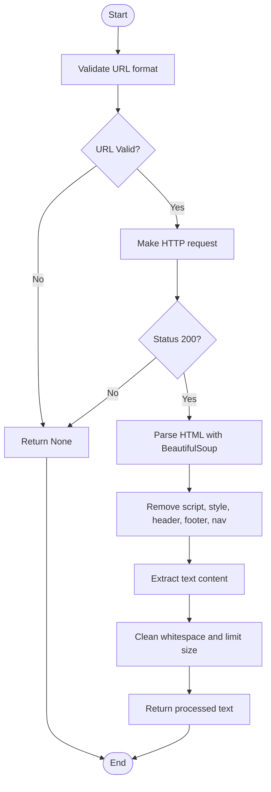
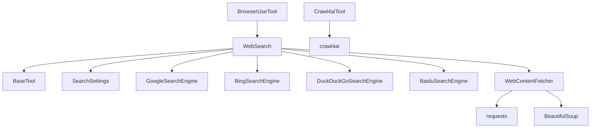

# Web Search

<cite>
**Referenced Files in This Document**   
- [web_search.py](file://app/tool/web_search.py)
- [crawl4ai.py](file://app/tool/crawl4ai.py)
- [base.py](file://app/tool/base.py)
- [google_search.py](file://app/tool/search/google_search.py)
- [bing_search.py](file://app/tool/search/bing_search.py)
- [duckduckgo_search.py](file://app/tool/search/duckduckgo_search.py)
- [baidu_search.py](file://app/tool/search/baidu_search.py)
- [config.py](file://app/config.py)
- [browser_use_tool.py](file://app/tool/browser_use_tool.py)
</cite>

## Table of Contents
1. [Introduction](#introduction)
2. [Core Components](#core-components)
3. [Architecture Overview](#architecture-overview)
4. [Detailed Component Analysis](#detailed-component-analysis)
5. [Dependency Analysis](#dependency-analysis)
6. [Performance Considerations](#performance-considerations)
7. [Troubleshooting Guide](#troubleshooting-guide)
8. [Conclusion](#conclusion)

## Introduction
The Web Search tool in OpenManus provides a robust mechanism for retrieving real-time information from multiple search engines. It supports pluggable backends for Google, Bing, DuckDuckGo, and Baidu, enabling flexible and reliable web searches. The tool is designed to handle various search scenarios, including research tasks, fact verification, and information gathering within agent workflows.

## Core Components

The Web Search functionality is implemented through several key components that work together to provide a seamless search experience. These include the WebSearch class, search engine backends, content fetching utilities, and configuration management.

**Section sources**
- [web_search.py](file://app/tool/web_search.py#L155-L407)
- [base.py](file://app/tool/base.py#L77-L172)

## Architecture Overview



**Diagram sources **
- [web_search.py](file://app/tool/web_search.py#L155-L407)
- [crawl4ai.py](file://app/tool/crawl4ai.py#L1-L269)
- [config.py](file://app/config.py#L1-L372)

## Detailed Component Analysis

### WebSearch Class Analysis

The WebSearch class serves as the primary interface for executing web searches across multiple engines. It implements a fallback strategy and content fetching capabilities.

#### Class Diagram


**Diagram sources **
- [web_search.py](file://app/tool/web_search.py#L155-L407)

**Section sources**
- [web_search.py](file://app/tool/web_search.py#L155-L407)

### Search Engine Backends

The system supports multiple search engine backends through a pluggable architecture. Each engine implements the WebSearchEngine interface.

#### Sequence Diagram
```mermaid
sequenceDiagram
participant User
participant WebSearch
participant Engine as WebSearchEngine
participant ContentFetcher as WebContentFetcher
User->>WebSearch : execute(query, num_results, fetch_content)
WebSearch->>WebSearch : _get_engine_order()
loop For each engine in order
WebSearch->>Engine : perform_search(query, num_results)
Engine-->>WebSearch : List[SearchItem]
alt Results found
WebSearch->>WebSearch : Transform to SearchResult
alt fetch_content=true
loop For each result
WebSearch->>ContentFetcher : fetch_content(url)
ContentFetcher-->>WebSearch : raw_content
end
end
WebSearch-->>User : SearchResponse with results
break Success
end
end
alt No engines successful
WebSearch->>WebSearch : Retry with delay
WebSearch-->>User : Error response after max retries
end
```

**Diagram sources **
- [web_search.py](file://app/tool/web_search.py#L200-L287)
- [google_search.py](file://app/tool/search/google_search.py#L1-L33)
- [bing_search.py](file://app/tool/search/bing_search.py#L1-L144)

**Section sources**
- [google_search.py](file://app/tool/search/google_search.py#L1-L33)
- [bing_search.py](file://app/tool/search/bing_search.py#L1-L144)
- [duckduckgo_search.py](file://app/tool/search/duckduckgo_search.py#L1-L57)
- [baidu_search.py](file://app/tool/search/baidu_search.py#L1-L54)

### Content Fetching Pipeline

The content fetching system extracts and processes web content for deeper analysis.

#### Flowchart


**Diagram sources **
- [web_search.py](file://app/tool/web_search.py#L124-L156)

**Section sources**
- [web_search.py](file://app/tool/web_search.py#L124-L156)

## Dependency Analysis



**Diagram sources **
- [web_search.py](file://app/tool/web_search.py#L155-L407)
- [crawl4ai.py](file://app/tool/crawl4ai.py#L1-L269)
- [base.py](file://app/tool/base.py#L77-L172)

**Section sources**
- [config.py](file://app/config.py#L1-L372)
- [browser_use_tool.py](file://app/tool/browser_use_tool.py#L1-L35)

## Performance Considerations

The Web Search tool implements several performance optimizations:
- Asynchronous execution using asyncio
- Thread pool execution for blocking operations
- Configurable retry mechanisms with exponential backoff
- Parallel content fetching for multiple results
- Configurable timeouts and rate limiting

The tool balances speed and reliability by allowing fast initial results while providing options for deeper content analysis through the fetch_content parameter.

## Troubleshooting Guide

Common issues and their solutions:

1. **Search engine failures**: The system automatically retries with alternative engines and implements exponential backoff.
2. **Content fetching errors**: Invalid URLs are skipped, and network errors are handled gracefully with appropriate logging.
3. **Configuration issues**: Default values are provided for all parameters, and configuration is validated at runtime.
4. **Rate limiting**: The system respects search engine rate limits through configurable retry delays.

**Section sources**
- [web_search.py](file://app/tool/web_search.py#L200-L287)
- [crawl4ai.py](file://app/tool/crawl4ai.py#L1-L269)

## Conclusion

The Web Search tool in OpenManus provides a comprehensive solution for web-based information retrieval. Its pluggable architecture supports multiple search engines with automatic fallback mechanisms, ensuring reliability. The integration with crawl4ai enables rich content extraction, while the configurable parameters allow for flexible usage patterns. This tool is well-suited for research tasks, fact verification, and information gathering in agent workflows, providing both speed and depth of analysis.