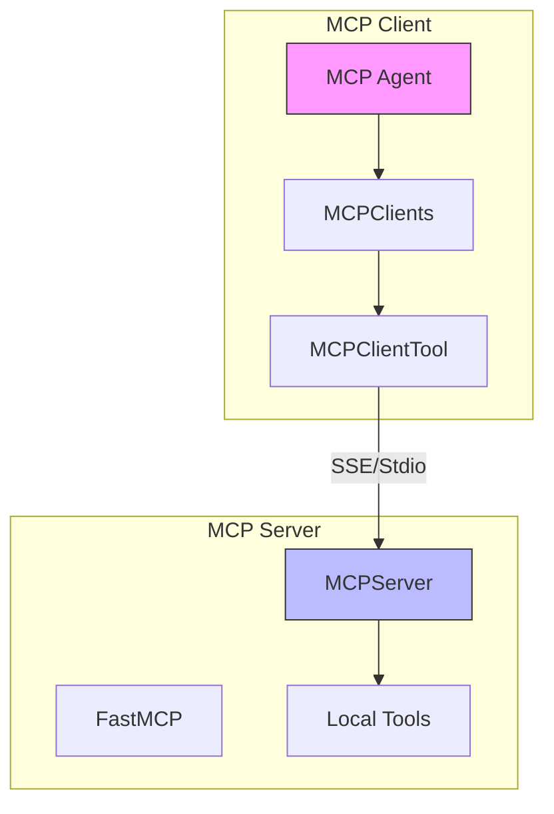
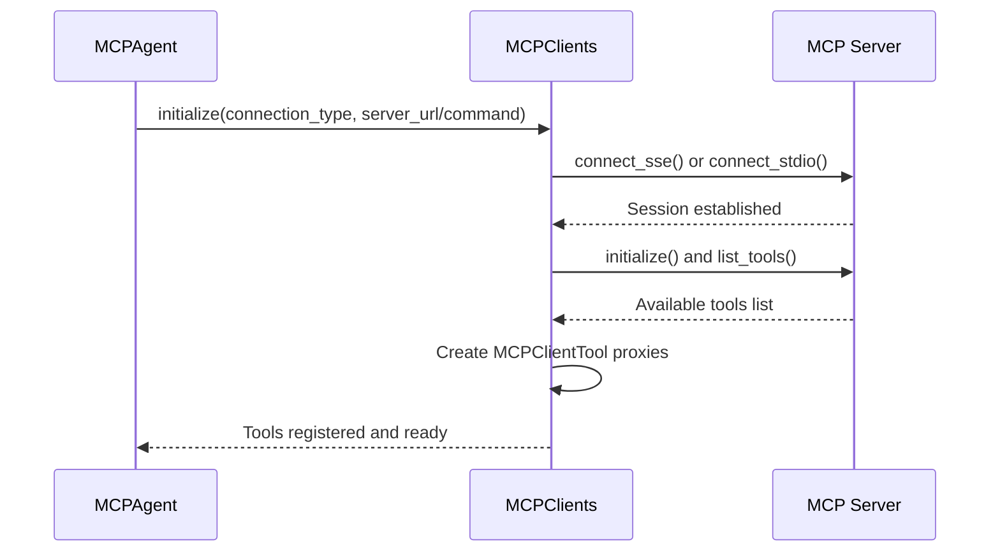
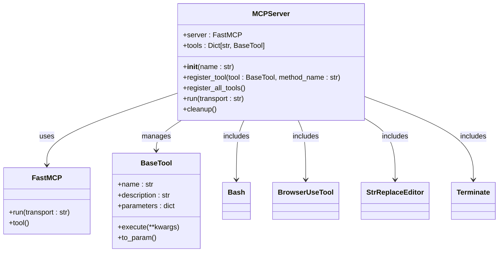
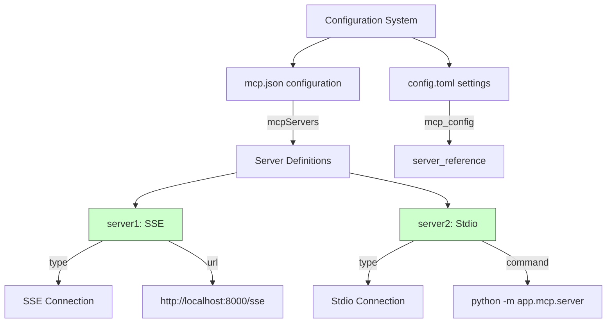

# MCP Tools

<cite>
**Referenced Files in This Document**   
- [app/agent/mcp.py](file://app/agent/mcp.py)
- [app/mcp/server.py](file://app/mcp/server.py)
- [config/mcp.example.json](file://config/mcp.example.json)
- [app/tool/mcp.py](file://app/tool/mcp.py)
- [app/prompt/mcp.py](file://app/prompt/mcp.py)
- [run_mcp.py](file://run_mcp.py)
- [run_mcp_server.py](file://run_mcp_server.py)
</cite>

## Table of Contents
1. [Introduction](#introduction)
2. [Architecture Overview](#architecture-overview)
3. [MCP Client Implementation](#mcp-client-implementation)
4. [MCP Server Implementation](#mcp-server-implementation)
5. [Configuration Management](#configuration-management)
6. [Connection Lifecycle Management](#connection-lifecycle-management)
7. [Security Considerations](#security-considerations)
8. [Error Handling and Propagation](#error-handling-and-propagation)
9. [Performance Characteristics](#performance-characteristics)
10. [Troubleshooting Guide](#troubleshooting-guide)

## Introduction
The Model Context Protocol (MCP) integration in OpenManus enables seamless remote tool access through bidirectional communication channels. This system allows agents to leverage tools hosted on external servers while also exposing local tools to other agents in the network. The MCP framework supports two transport mechanisms: Server-Sent Events (SSE) for HTTP-based communication and stdio for direct process communication. This architecture facilitates distributed agent collaboration, enabling modular tool sharing and execution across different environments.

**Section sources**
- [app/agent/mcp.py](file://app/agent/mcp.py#L1-L185)
- [app/mcp/server.py](file://app/mcp/server.py#L1-L180)

## Architecture Overview
The MCP system in OpenManus follows a client-server architecture where agents can act as both clients and servers. The client component connects to remote MCP servers to access their tools, while the server component exposes local tools to other agents. Communication occurs through standardized protocols that support both SSE and stdio transports, ensuring flexibility in deployment scenarios.



**Diagram sources**
- [app/agent/mcp.py](file://app/agent/mcp.py#L12-L184)
- [app/mcp/server.py](file://app/mcp/server.py#L23-L159)

## MCP Client Implementation
The MCP client implementation in `mcp.py` enables agents to connect to external MCP servers and utilize their tools as first-class citizens within the agent environment. The `MCPAgent` class extends `ToolCallAgent` and manages connections to remote servers through either SSE or stdio transport mechanisms.

The client establishes connections by initializing the `MCPClients` collection, which maintains sessions with one or more MCP servers. During initialization, the agent connects to the specified server and automatically discovers available tools through the `list_tools` protocol method. Each remote tool is then exposed locally with a namespaced identifier that includes the server ID and original tool name.



**Diagram sources**
- [app/agent/mcp.py](file://app/agent/mcp.py#L39-L84)
- [app/tool/mcp.py](file://app/tool/mcp.py#L49-L68)
- [app/tool/mcp.py](file://app/tool/mcp.py#L70-L94)

**Section sources**
- [app/agent/mcp.py](file://app/agent/mcp.py#L12-L184)
- [app/tool/mcp.py](file://app/tool/mcp.py#L36-L193)

## MCP Server Implementation
The MCP server implementation in `server.py` allows OpenManus to expose its internal tools to other agents in the network. The `MCPServer` class wraps the FastMCP framework and manages tool registration, execution, and lifecycle management.

The server comes with four standard tools pre-registered: bash (command execution), browser (web interaction), editor (file editing), and terminate (session control). Additional tools can be registered programmatically through the `register_tool` method, which handles parameter validation, documentation generation, and signature building.

When a tool is executed remotely, the server logs the execution details and returns the result in a standardized format. The response is serialized to JSON if the result supports model dumping or is already a dictionary, ensuring consistent data interchange.



**Diagram sources**
- [app/mcp/server.py](file://app/mcp/server.py#L23-L159)
- [app/tool/base.py](file://app/tool/base.py#L1-L181)

**Section sources**
- [app/mcp/server.py](file://app/mcp/server.py#L23-L159)

## Configuration Management
Configuration for MCP connections is managed through the `mcp.example.json` file, which defines server endpoints, connection types, and authentication parameters. The configuration follows a structured format that supports multiple server definitions with unique identifiers.

The MCP settings in the main configuration system also include a `server_reference` parameter that specifies the module path for the local MCP server implementation. This allows for flexible deployment configurations where different server implementations can be referenced based on environment requirements.



**Diagram sources**
- [config/mcp.example.json](file://config/mcp.example.json#L1-L9)
- [app/config.py](file://app/config.py#L250-L300)

**Section sources**
- [config/mcp.example.json](file://config/mcp.example.json#L1-L9)
- [app/config.py](file://app/config.py#L250-L300)

## Connection Lifecycle Management
The MCP system implements comprehensive connection lifecycle management to ensure reliable operation and proper resource cleanup. Connections are established through the `initialize` method on the `MCPAgent`, which handles both SSE and stdio transport initialization.

The client automatically refreshes the available tools list every five steps through the `_refresh_tools` method, detecting any changes in the remote toolset. This periodic refresh allows the agent to adapt to dynamic tool availability, such as tools being added, removed, or modified on the server side.

Connection termination is handled gracefully through the `cleanup` method, which ensures proper disconnection from all active sessions. The cleanup process uses AsyncExitStack to manage resource disposal and handles potential cancellation scope errors that may occur during disconnection.

```mermaid
flowchart TD
Start[Start Connection]
--> Initialize[Initialize MCPAgent]
--> Connect{Connection Type?}
Connect --> |SSE| SSEConnect[connect_sse(server_url)]
Connect --> |Stdio| StdioConnect[connect_stdio(command, args)]
SSEConnect --> Session[Create ClientSession]
StdioConnect --> Session
Session --> InitializeSession[session.initialize()]
--> ListTools[session.list_tools()]
--> RegisterTools[Register tool proxies]
--> Ready[Agent Ready]
Ready --> Execute[Execute tool calls]
--> Monitor{Periodic Refresh?}
Monitor --> |Yes| Refresh[_refresh_tools()]
--> CheckChanges{Tools changed?}
--> Notify[Update memory with changes]
Ready --> Finish[Agent finished]
--> Cleanup[cleanup()]
--> Disconnect[disconnect() from all servers]
--> End[Connection closed]
style Ready fill:#cfc,stroke:#333
style Finish fill:#f99,stroke:#333
```

**Diagram sources**
- [app/agent/mcp.py](file://app/agent/mcp.py#L39-L84)
- [app/agent/mcp.py](file://app/agent/mcp.py#L86-L131)
- [app/agent/mcp.py](file://app/agent/mcp.py#L171-L175)

**Section sources**
- [app/agent/mcp.py](file://app/agent/mcp.py#L39-L184)

## Security Considerations
The MCP system incorporates several security considerations for remote execution scenarios. While the current implementation focuses on functionality, there are important security aspects to consider when deploying in production environments.

Remote tool execution inherently carries risks, as commands are executed on potentially different systems with varying privilege levels. The bash tool, in particular, provides direct command execution capabilities that could be exploited if proper access controls are not implemented.

Authentication mechanisms are currently minimal, with no built-in authentication in the example configuration. In production deployments, it is recommended to implement proper authentication and authorization layers, especially for SSE endpoints that are exposed over HTTP.

Network security should also be considered, with recommendations to use TLS/SSL for SSE connections and to restrict access to trusted networks. Input validation is critical, as remote agents can potentially send malicious payloads to local tools.

**Section sources**
- [app/mcp/server.py](file://app/mcp/server.py#L23-L159)
- [config/mcp.example.json](file://config/mcp.example.json#L1-L9)

## Error Handling and Propagation
The MCP system implements robust error handling and propagation mechanisms to ensure reliable operation in distributed environments. Errors from remote services are propagated back to the calling agent through standardized error responses.

When a tool execution fails on the server side, the error is caught and returned as part of the tool result. The client-side `MCPClientTool` handles exceptions during remote calls and returns appropriate error messages. Network-level errors, such as connection failures or timeouts, are also captured and reported.

The system distinguishes between different types of errors, including connection errors, authentication failures, tool execution errors, and serialization issues. These errors are logged appropriately and can be used by the agent to adjust its behavior or inform the user.

Special attention is given to cancellation scope errors during disconnection, which are handled gracefully to prevent resource leaks while maintaining system stability.

**Section sources**
- [app/tool/mcp.py](file://app/tool/mcp.py#L154-L193)
- [app/agent/mcp.py](file://app/agent/mcp.py#L153-L164)

## Performance Characteristics
The performance of MCP-based tool calls is influenced by several factors, primarily related to the network-based nature of remote execution. Network latency directly impacts response times, making local tool execution significantly faster than remote calls.

The choice of transport mechanism affects performance characteristics:
- SSE connections introduce HTTP overhead but allow for firewall-friendly communication
- Stdio connections provide lower latency for co-located processes but require direct process access

Each remote tool call involves serialization of input parameters and deserialization of results, adding processing overhead. The system mitigates some of these costs through periodic tool discovery rather than querying on every call.

For high-frequency operations, the performance trade-offs of network-based tool calls should be carefully considered. Caching strategies and batch processing can help mitigate some performance limitations in latency-sensitive applications.

**Section sources**
- [app/agent/mcp.py](file://app/agent/mcp.py#L34-L34)
- [app/mcp/server.py](file://app/mcp/server.py#L50-L75)

## Troubleshooting Guide
Common issues with MCP connections typically fall into several categories:

**Connectivity Issues:**
- Verify server URL and port availability for SSE connections
- Ensure the server command is correct and executable for stdio connections
- Check network connectivity and firewall settings

**Configuration Problems:**
- Validate JSON syntax in mcp.json configuration files
- Ensure server IDs are unique and properly referenced
- Verify transport type matches the connection method

**Version Compatibility:**
- Ensure MCP protocol versions are compatible between client and server
- Check that tool schemas are compatible across versions
- Verify serialization formats are consistent

**Runtime Errors:**
- Monitor logs for connection establishment and tool discovery
- Check for proper resource cleanup during disconnection
- Verify tool parameter compatibility between client and server

The system provides comprehensive logging through the standard logger, which can be used to trace connection lifecycle events, tool execution, and error conditions.

**Section sources**
- [run_mcp.py](file://run_mcp.py#L1-L116)
- [run_mcp_server.py](file://run_mcp_server.py#L1-L11)
- [app/agent/mcp.py](file://app/agent/mcp.py#L1-L185)