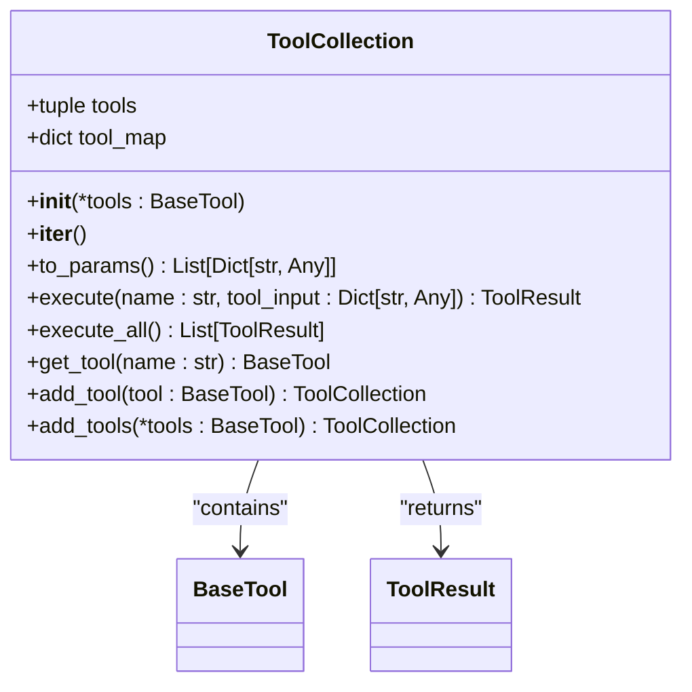
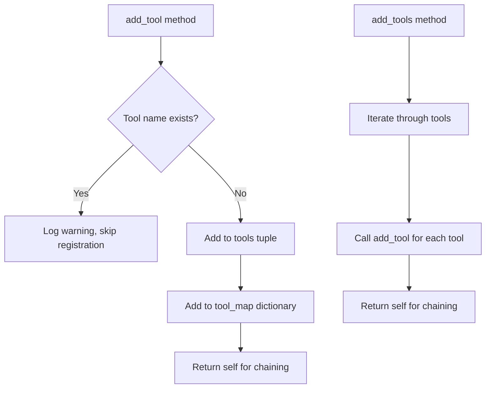
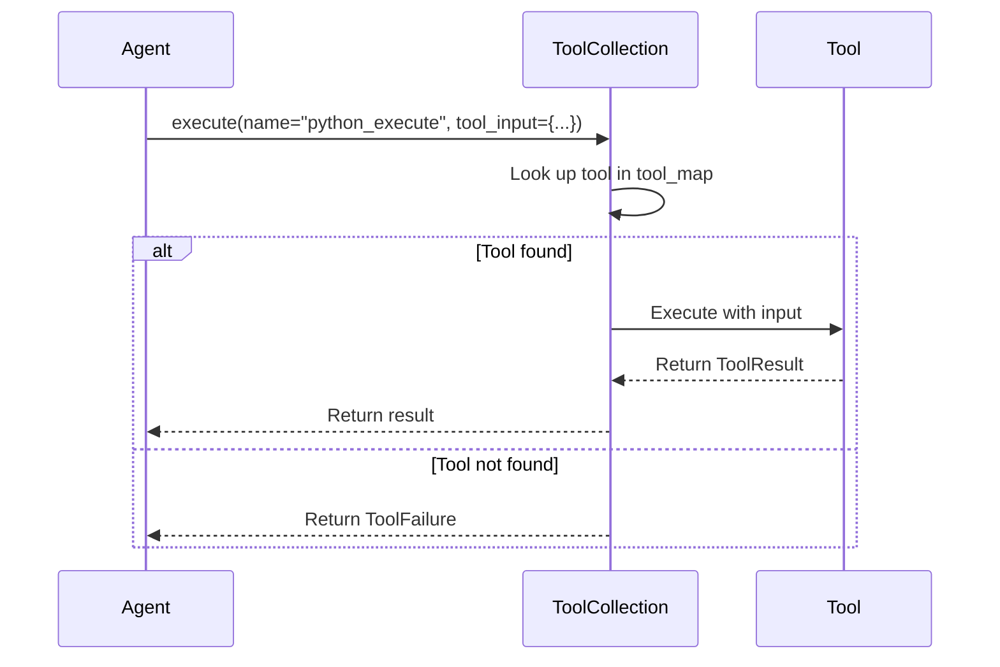
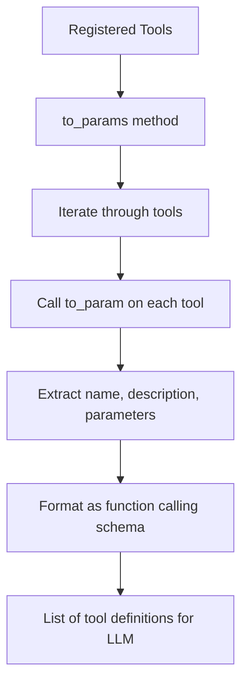
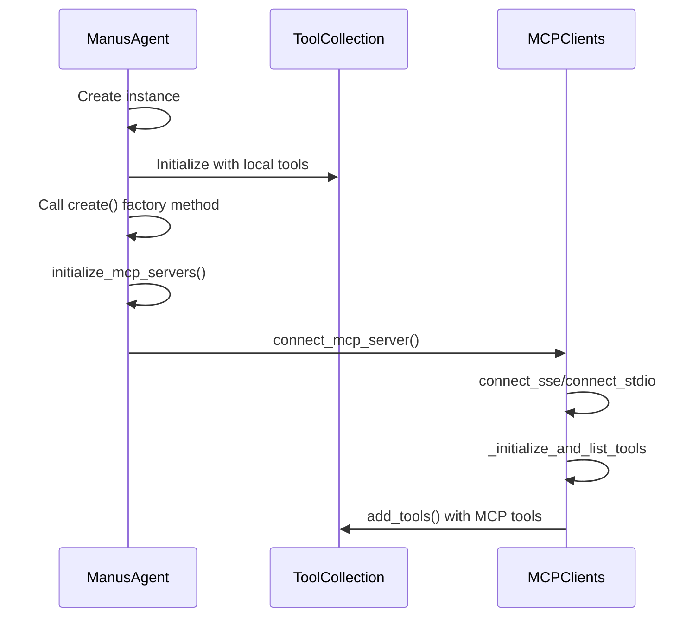
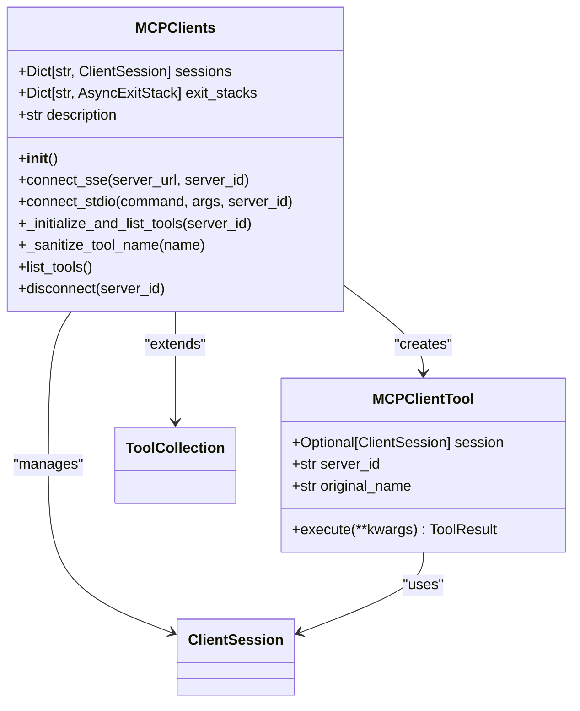

# Tool Collection Management

<cite>
**Referenced Files in This Document**   
- [tool_collection.py](file://app/tool/tool_collection.py)
- [mcp.py](file://app/tool/mcp.py)
- [manus.py](file://app/agent/manus.py)
- [base.py](file://app/tool/base.py)
</cite>

## Table of Contents
1. [Introduction](#introduction)
2. [ToolCollection Class Overview](#toolcollection-class-overview)
3. [Internal Data Structures](#internal-data-structures)
4. [Tool Registration Methods](#tool-registration-methods)
5. [Tool Lookup and Execution](#tool-lookup-and-execution)
6. [LLM Integration](#llm-integration)
7. [Agent Initialization Process](#agent-initialization-process)
8. [MCP Integration](#mcp-integration)
9. [Best Practices and Considerations](#best-practices-and-considerations)
10. [Troubleshooting Guide](#troubleshooting-guide)

## Introduction

The ToolCollection class serves as the central registry for all available tools in the OpenManus framework, providing a unified interface for managing both local and Model Context Protocol (MCP) tools. This comprehensive tool management system enables agents to dynamically register, discover, and execute tools while maintaining efficient O(1) name-based lookups through an internal dictionary structure. The design supports flexible tool composition, allowing agents to build customized tool sets for different task domains while ensuring seamless integration with the LLM's function calling mechanism.

**Section sources**
- [tool_collection.py](file://app/tool/tool_collection.py#L8-L70)

## ToolCollection Class Overview

The ToolCollection class provides a centralized registry for managing tools within the OpenManus framework. It inherits from Pydantic's BaseModel with arbitrary_types_allowed enabled, allowing it to work with various tool types while maintaining data validation capabilities. The class serves as the primary interface for tool management, offering methods for registration, lookup, and execution of tools. As the central registry, it maintains references to all available tools and provides the necessary infrastructure for integrating these tools with the LLM's function calling capabilities.



**Diagram sources**
- [tool_collection.py](file://app/tool/tool_collection.py#L8-L70)

**Section sources**
- [tool_collection.py](file://app/tool/tool_collection.py#L8-L70)

## Internal Data Structures

The ToolCollection class utilizes two primary data structures to manage tools efficiently: a tuple for ordered storage and a dictionary for O(1) name-based lookups. The `tools` attribute is a tuple that maintains the collection of registered tools in insertion order, providing an immutable sequence that can be iterated over. The `tool_map` dictionary serves as a hash map with tool names as keys and tool instances as values, enabling constant-time lookups regardless of collection size. This dual-structure approach balances the need for ordered iteration with the performance requirements of frequent name-based searches, which is critical for the high-frequency tool discovery operations during agent execution.

```mermaid
flowchart TD
A[Tool Registration] --> B[Add to tools tuple]
A --> C[Add to tool_map dictionary]
D[Tool Lookup by Name] --> E[O(1) dictionary lookup in tool_map]
F[Iterate All Tools] --> G[Sequential access via tools tuple]
H[Execute All Tools] --> I[Iterate tools tuple sequentially]
```

**Diagram sources**
- [tool_collection.py](file://app/tool/tool_collection.py#L15-L16)

**Section sources**
- [tool_collection.py](file://app/tool/tool_collection.py#L15-L16)

## Tool Registration Methods

The ToolCollection class provides two complementary methods for registering tools: `add_tool` for single tool registration and `add_tools` for batch registration. The `add_tool` method performs a name conflict check before adding a new tool, logging a warning and skipping registration if a tool with the same name already exists. This conflict resolution strategy prioritizes existing tools, preventing accidental overwrites while maintaining system stability. The method updates both the `tools` tuple and `tool_map` dictionary atomically, ensuring data consistency. The `add_tools` method serves as a convenience wrapper that iterates through multiple tools and registers each using `add_tool`, inheriting the same conflict resolution behavior. This design allows for flexible tool composition while protecting against naming collisions that could lead to unexpected behavior.



**Diagram sources**
- [tool_collection.py](file://app/tool/tool_collection.py#L50-L70)

**Section sources**
- [tool_collection.py](file://app/tool/tool_collection.py#L50-L70)

## Tool Lookup and Execution

The ToolCollection class provides robust mechanisms for tool lookup and execution, forming the core of the agent's tool interaction capabilities. The `get_tool` method enables direct access to tool instances by name through the `tool_map` dictionary, returning None if the tool is not found. This O(1) lookup performance is critical for the high-frequency tool discovery operations during agent reasoning cycles. The `execute` method provides asynchronous execution of a specific tool by name, handling both successful execution and error conditions through the ToolResult interface. It performs validation by checking tool existence before execution and wraps execution in a try-except block to catch ToolError exceptions, converting them to appropriate failure responses. The `execute_all` method enables sequential execution of all registered tools, collecting results while handling individual tool failures gracefully without interrupting the overall execution flow.



**Diagram sources**
- [tool_collection.py](file://app/tool/tool_collection.py#L24-L45)

**Section sources**
- [tool_collection.py](file://app/tool/tool_collection.py#L24-L48)

## LLM Integration

The ToolCollection class facilitates seamless integration with LLM function calling through the `to_params` method, which converts registered tools into a format compatible with the LLM's function calling interface. This method iterates through all registered tools and calls each tool's `to_param` method, which returns a dictionary containing the tool's name, description, and parameters schema in the standard function calling format. The resulting list of tool definitions is provided to the LLM, enabling it to select appropriate tools for task execution. This conversion process ensures that the LLM has accurate and up-to-date information about available tools, including their capabilities and required parameters, which is essential for effective tool selection and proper function call generation.



**Diagram sources**
- [tool_collection.py](file://app/tool/tool_collection.py#L21-L22)
- [base.py](file://app/tool/base.py#L123-L136)

**Section sources**
- [tool_collection.py](file://app/tool/tool_collection.py#L21-L22)

## Agent Initialization Process

The Manus agent initializes and populates its tool collection during startup through a structured initialization process that combines static and dynamic tool registration. In the class definition, the `available_tools` field is initialized with a default factory that creates a ToolCollection containing core local tools such as PythonExecute, BrowserUseTool, StrReplaceEditor, AskHuman, and Terminate. This static initialization ensures that essential tools are available immediately upon agent creation. During the asynchronous initialization phase in the `create` class method, the agent calls `initialize_mcp_servers` to establish connections with configured MCP servers. This dynamic phase expands the tool collection by adding remote tools from MCP servers, creating a comprehensive tool set that combines local capabilities with distributed services.



**Diagram sources**
- [manus.py](file://app/agent/manus.py#L33-L41)
- [manus.py](file://app/agent/manus.py#L100-L120)

**Section sources**
- [manus.py](file://app/agent/manus.py#L33-L41)

## MCP Integration

The MCPClients class extends ToolCollection to provide specialized functionality for managing tools from Model Context Protocol servers, creating a unified interface for both local and remote tools. When connecting to an MCP server via SSE or stdio transport, the system establishes a session and initializes the connection by calling `list_tools` to discover available tools. Each discovered tool is wrapped in an MCPClientTool instance with a namespaced name following the pattern "mcp_{server_id}_{original_name}", preventing naming conflicts between tools from different servers. The `_sanitize_tool_name` method ensures tool names comply with naming requirements by replacing invalid characters, removing consecutive underscores, and truncating to 64 characters if necessary. This integration allows the agent to seamlessly use remote tools as if they were local, with the MCPClientTool handling the proxy communication to the remote server.



**Diagram sources**
- [mcp.py](file://app/tool/mcp.py#L36-L193)

**Section sources**
- [mcp.py](file://app/tool/mcp.py#L36-L193)

## Best Practices and Considerations

When working with the ToolCollection system, several best practices and considerations should be observed to ensure optimal performance and reliability. For organizing large tool sets, consider grouping related tools by functionality and using consistent naming conventions to improve discoverability. The system's memory overhead is primarily determined by the number of registered tools and their parameter schemas, so avoid registering unnecessary tools in memory-constrained environments. While the current implementation is not explicitly thread-safe, the immutable tuple structure provides some protection against concurrent modification issues. For dynamic tool loading, always validate tool signatures before registration to ensure compatibility with the expected interface. When registering tools with conflicting names, the system's warning-based conflict resolution preserves existing tools, so plan tool naming carefully to avoid unintentional skips. For performance-critical applications, consider the initialization cost of tools with heavy dependencies and lazy-load when possible.

**Section sources**
- [tool_collection.py](file://app/tool/tool_collection.py#L50-L61)

## Troubleshooting Guide

When encountering tool visibility issues, follow this systematic troubleshooting approach. First, verify that the tool has been properly registered by checking the `tool_map` dictionary for the expected tool name. If using MCP tools, ensure the connection to the MCP server is active and that the server is running and accessible. Check the logs for warnings about name conflicts during registration, as duplicate names will cause tools to be skipped. Validate that the tool's name complies with the naming requirements, especially for MCP tools which undergo sanitization that may alter the original name. Confirm that the tool's parameters schema is correctly defined and matches the expected format for LLM function calling. For execution issues, verify that the tool's `execute` method is properly implemented and handles exceptions appropriately. When debugging dynamic tool loading, ensure that the tool classes are properly imported and instantiated before registration. Use the `to_params` method to inspect the final tool definitions being sent to the LLM, as this can reveal issues with parameter schemas or missing tools.

**Section sources**
- [tool_collection.py](file://app/tool/tool_collection.py#L50-L61)
- [mcp.py](file://app/tool/mcp.py#L127-L144)