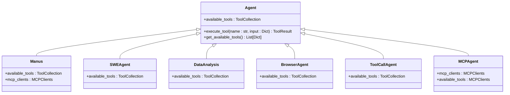

# Tool System

<cite>
**Referenced Files in This Document**   
- [ToolCollection](file://app/tool/tool_collection.py)
- [BaseTool](file://app/tool/base.py)
- [PythonExecute](file://app/tool/python_execute.py)
- [file_operators.py](file://app/tool/file_operators.py)
- [web_search.py](file://app/tool/web_search.py)
- [ask_human.py](file://app/tool/ask_human.py)
- [mcp.py](file://app/tool/mcp.py)
- [browser_use_tool.py](file://app/tool/browser_use_tool.py)
- [sb_files_tool.py](file://app/tool/sandbox/sb_files_tool.py)
- [sb_shell_tool.py](file://app/tool/sandbox/sb_shell_tool.py)
- [sb_browser_tool.py](file://app/tool/sandbox/sb_browser_tool.py)
- [sb_vision_tool.py](file://app/tool/sandbox/sb_vision_tool.py)
- [NormalPythonExecute](file://app/tool/chart_visualization/python_execute.py)
- [DataVisualization](file://app/tool/chart_visualization/data_visualization.py)
</cite>

## Table of Contents
1. [Introduction](#introduction)
2. [ToolCollection Class](#toolcollection-class)
3. [Local Tools](#local-tools)
   - [Python Execution](#python-execution)
   - [Browser Automation](#browser-automation)
   - [File Operations](#file-operations)
   - [Web Search](#web-search)
   - [Human Interaction](#human-interaction)
4. [MCP Tools](#mcp-tools)
5. [Base Tool Interface](#base-tool-interface)
6. [Custom Tool Development](#custom-tool-development)
7. [Tool Calling Patterns](#tool-calling-patterns)
8. [Error Handling](#error-handling)
9. [Security Considerations](#security-considerations)
10. [Performance Implications](#performance-implications)
11. [Integration with Agents](#integration-with-agents)

## Introduction
The Tool System in OpenManus provides a comprehensive framework for managing and executing various tools that agents can utilize to perform tasks. This system is built around the ToolCollection class, which serves as a container for organizing and accessing different tools. The architecture supports both local tools for direct execution and MCP (Model Context Protocol) tools for remote access. The system enables agents to interact with various functionalities including code execution, web browsing, file operations, and human interaction, providing a flexible and extensible platform for agent capabilities.

## ToolCollection Class
The ToolCollection class serves as the central management system for organizing and accessing available tools within the OpenManus framework. This class provides a structured approach to tool management, allowing for dynamic addition, retrieval, and execution of tools.

**Diagram sources**
- [tool_collection.py](file://app/tool/tool_collection.py#L8-L70)

The ToolCollection class maintains two primary data structures: `tools` (a tuple of BaseTool instances) and `tool_map` (a dictionary mapping tool names to their instances). This dual structure enables both ordered iteration through tools and efficient name-based lookups. The class provides methods for adding tools individually or in bulk, with built-in conflict resolution that logs warnings when attempting to add tools with duplicate names.

**Section sources**
- [tool_collection.py](file://app/tool/tool_collection.py#L8-L70)

## Local Tools
The OpenManus framework provides a suite of local tools that enable agents to perform various operations directly within the system. These tools cover essential functionalities required for agent operations, from code execution to web interaction.

### Python Execution
The Python execution tool allows agents to run Python code in a secure, sandboxed environment with timeout protection. This tool is designed to execute code strings and capture their output, providing a way to perform computational tasks and data processing.

**Diagram sources**
- [python_execute.py](file://app/tool/python_execute.py#L8-L74)

The implementation uses Python's multiprocessing module to execute code in a separate process, ensuring that any infinite loops or memory leaks in the executed code do not affect the main application. The tool creates a restricted global namespace to limit access to potentially dangerous built-in functions, providing a basic level of security. Code execution is limited by a configurable timeout, after which the process is terminated to prevent hanging operations.

**Section sources**
- [python_execute.py](file://app/tool/python_execute.py#L8-L74)

### Browser Automation
The browser automation tool enables agents to interact with web pages through various actions, including navigation, element interaction, and content extraction. This tool provides a programmatic interface to control a browser session, allowing agents to browse websites, fill forms, and extract information.

**Diagram sources**
- [browser_use_tool.py](file://app/tool/browser_use_tool.py#L127-L567)

The tool maintains state across calls, keeping the browser session alive until explicitly closed. It supports various actions such as navigating to URLs, clicking elements, inputting text, scrolling, and extracting content. The implementation uses Playwright under the hood to control the browser, providing reliable and efficient automation capabilities. The tool also integrates with the web search functionality, allowing agents to search the web and navigate to the top results.

**Section sources**
- [browser_use_tool.py](file://app/tool/browser_use_tool.py#L127-L567)

### File Operations
The file operations tools provide agents with the ability to manage files in both local and sandboxed environments. These tools support creating, reading, updating, and deleting files, enabling agents to work with file-based data and code.

**Diagram sources**
- [file_operators.py](file://app/tool/file_operators.py#L15-L157)

The file operations are implemented through a protocol-based approach, with a common FileOperator interface and concrete implementations for local and sandboxed environments. The LocalFileOperator provides direct access to the local filesystem, while the SandboxFileOperator operates within a secure sandbox environment. Both implementations support reading and writing files, checking file existence, and running shell commands. The sandboxed version ensures that all operations are performed relative to a designated workspace directory for security.

**Section sources**
- [file_operators.py](file://app/tool/file_operators.py#L15-L157)

### Web Search
The web search tool enables agents to search the internet for real-time information using multiple search engines. This tool provides comprehensive search results with relevant information, URLs, titles, and descriptions, with automatic fallback to alternative engines if the primary engine fails.

**Diagram sources**
- [web_search.py](file://app/tool/web_search.py#L155-L407)

The web search implementation supports multiple search engines including Google, Baidu, DuckDuckGo, and Bing, with configurable preferences and fallbacks. The tool automatically handles retries when search engines fail and can optionally fetch the full content from result pages. Search results are structured with metadata including position, URL, title, description, and source. The implementation uses asynchronous operations to improve performance when fetching content from multiple pages.

**Section sources**
- [web_search.py](file://app/tool/web_search.py#L155-L407)

### Human Interaction
The human interaction tool provides a mechanism for agents to request assistance from human users. This tool enables agents to ask questions and receive input, bridging the gap between automated processing and human intelligence.

**Diagram sources**
- [ask_human.py](file://app/tool/ask_human.py#L3-L20)

The implementation is straightforward, using Python's built-in input() function to prompt the user for a response. The tool takes a question as input and returns the user's response as output. This simple interface allows agents to request clarification, confirmation, or specific information that may be difficult to obtain through automated means.

**Section sources**
- [ask_human.py](file://app/tool/ask_human.py#L3-L20)

## MCP Tools
MCP (Model Context Protocol) tools provide a mechanism for agents to access remote services and tools through standardized communication protocols. These tools enable integration with external systems and services, extending the capabilities of agents beyond the local environment.

**Diagram sources**
- [mcp.py](file://app/tool/mcp.py#L36-L193)

The MCPClients class manages connections to multiple MCP servers using either SSE (Server-Sent Events) or stdio transport. When connecting to a server, it initializes a session, lists available tools, and creates proxy tool objects for each remote tool. The tool names are sanitized to ensure compatibility with the system's naming conventions, and each tool is prefixed with the server identifier to avoid naming conflicts.

The implementation supports both SSE and stdio connection methods, providing flexibility in how agents connect to remote services. The SSE transport is suitable for web-based services, while stdio is ideal for command-line applications. The system maintains clean separation between different server connections, allowing agents to interact with multiple remote services simultaneously.

**Section sources**
- [mcp.py](file://app/tool/mcp.py#L36-L193)

## Base Tool Interface
The base tool interface defines the common structure and behavior for all tools in the OpenManus framework. This interface ensures consistency across different tool implementations and provides essential functionality for tool execution and result handling.

**Diagram sources**
- [base.py](file://app/tool/base.py#L77-L172)

The BaseTool class is an abstract base class that defines the essential attributes and methods for all tools. Each tool must have a name, description, and optional parameters schema. The execute() method is abstract and must be implemented by concrete tool classes, defining the specific behavior of the tool. The __call__() method delegates to execute(), allowing tools to be called like functions.

The ToolResult class provides a standardized format for tool outputs, supporting both successful results and error conditions. It can contain text output, error messages, base64-encoded images, and system messages. The class includes utility methods for combining results, checking success status, and creating success or failure responses with appropriate formatting.

**Section sources**
- [base.py](file://app/tool/base.py#L77-L172)

## Custom Tool Development
Developing custom tools in OpenManus follows a straightforward pattern based on the BaseTool interface. Developers can create new tools by extending the BaseTool class and implementing the required methods, particularly the execute() method which defines the tool's behavior.

The process of creating a custom tool involves several key steps:
1. Define a new class that inherits from BaseTool
2. Set the name, description, and parameters attributes
3. Implement the execute() method with the desired functionality
4. Handle errors appropriately using the fail_response() method
5. Return results using the success_response() method or directly as a ToolResult

Custom tools can be integrated into the system by adding them to a ToolCollection instance, making them available to agents. The framework's design encourages modular tool development, where each tool focuses on a specific capability or service.

When developing custom tools, developers should consider security implications, especially for tools that interact with external systems or execute code. Input validation, timeout handling, and proper error reporting are essential aspects of robust tool implementation.

**Section sources**
- [base.py](file://app/tool/base.py#L77-L172)
- [python_execute.py](file://app/tool/python_execute.py#L8-L74)
- [web_search.py](file://app/tool/web_search.py#L155-L407)

## Tool Calling Patterns
The OpenManus framework supports several patterns for calling tools, enabling flexible integration with agents and various use cases. The primary method is through the ToolCollection's execute() method, which allows calling a specific tool by name with input parameters.

**Diagram sources**
- [tool_collection.py](file://app/tool/tool_collection.py#L24-L34)

The execute() method performs a name-based lookup in the tool_map dictionary and, if the tool exists, calls it with the provided input parameters. The tool's execute() method is awaited since it's asynchronous, allowing for non-blocking execution of potentially long-running operations. Error handling is implemented through a try-except block that catches ToolError exceptions and converts them to ToolFailure results.

An alternative pattern is the execute_all() method, which sequentially executes all tools in the collection. This is useful for scenarios where multiple tools need to be run in a specific order, such as initialization routines or batch processing tasks.

Agents can also retrieve specific tools using the get_tool() method and call them directly, providing more control over the execution process. This pattern is useful when an agent needs to call the same tool multiple times with different parameters or when conditional logic is required based on tool availability.

**Section sources**
- [tool_collection.py](file://app/tool/tool_collection.py#L24-L45)

## Error Handling
The OpenManus tool system implements a comprehensive error handling strategy to ensure robust operation and provide meaningful feedback when issues occur. The system distinguishes between expected errors (handled gracefully) and unexpected errors (logged for debugging).

Expected errors, such as invalid tool names or missing required parameters, are handled within the tool execution flow and returned as structured ToolResult objects with error messages. This allows agents to understand what went wrong and potentially take corrective action. For example, when attempting to execute a non-existent tool, the ToolCollection returns a ToolFailure with a descriptive error message.

Unexpected errors, such as exceptions during tool execution, are caught and converted to ToolFailure results. This prevents unhandled exceptions from crashing the agent or system. The error handling is implemented in the ToolCollection's execute() method, which wraps tool calls in a try-except block that catches ToolError exceptions.

**Diagram sources**
- [tool_collection.py](file://app/tool/tool_collection.py#L24-L34)

The BaseTool class provides utility methods for creating success and failure responses, encouraging consistent error reporting across different tool implementations. The fail_response() method creates a ToolResult with an error message, while the success_response() method creates a ToolResult with output data.

Logging is integrated throughout the tool system, with key operations and errors logged for debugging and monitoring purposes. This includes warnings when adding duplicate tools, information about successful connections to MCP servers, and errors during tool execution.

**Section sources**
- [tool_collection.py](file://app/tool/tool_collection.py#L24-L34)
- [base.py](file://app/tool/base.py#L77-L172)

## Security Considerations
The OpenManus tool system incorporates several security measures to protect the system and data when executing tools. These considerations are particularly important for tools that execute code, access files, or interact with external systems.

For Python code execution, the system uses multiprocessing to isolate code execution in a separate process, preventing memory leaks or infinite loops from affecting the main application. The execution environment is restricted by creating a safe global namespace that limits access to potentially dangerous built-in functions. Code execution is also limited by a configurable timeout, after which the process is terminated.

File operations are restricted to specific directories, particularly in sandboxed environments, to prevent unauthorized access to system files. The SandboxFileOperator ensures that all operations are performed relative to a designated workspace directory, providing a secure boundary for file access.

Web search operations use HTTP requests with appropriate headers and timeouts to prevent abuse of search engines. The system implements retry logic with exponential backoff to avoid overwhelming search services, and content fetching is optional and limited in scope to prevent excessive bandwidth usage.

MCP tools use secure communication protocols (SSE or stdio) to connect to remote servers, with proper session management and cleanup. The system validates server URLs and commands before establishing connections, and provides mechanisms for cleanly disconnecting from servers.

Input validation is implemented throughout the tool system, with Pydantic models used to validate tool parameters and ensure they meet expected formats and constraints. This helps prevent injection attacks and other security vulnerabilities.

**Section sources**
- [python_execute.py](file://app/tool/python_execute.py#L8-L74)
- [file_operators.py](file://app/tool/file_operators.py#L15-L157)
- [web_search.py](file://app/tool/web_search.py#L155-L407)
- [mcp.py](file://app/tool/mcp.py#L36-L193)

## Performance Implications
The design of the OpenManus tool system considers performance implications, particularly regarding the synchronous vs asynchronous nature of tool execution. Most tools are implemented as asynchronous functions, allowing for non-blocking execution and improved responsiveness.

Asynchronous tools enable concurrent execution of multiple operations, which is particularly beneficial for I/O-bound tasks such as web requests, file operations, and network communication. This allows agents to perform multiple actions simultaneously, reducing overall execution time. For example, when searching the web, the system can fetch content from multiple result pages concurrently.

The use of multiprocessing for Python code execution provides isolation and prevents CPU-intensive operations from blocking the event loop. However, this comes with overhead from process creation and inter-process communication, which should be considered when designing workflows that involve frequent code execution.

Synchronous tools, while simpler to implement, can block the event loop and reduce system responsiveness. The framework encourages asynchronous implementations to maximize performance, but provides mechanisms for integrating synchronous operations through thread pools or subprocess execution.

Performance monitoring and optimization opportunities include:
- Caching frequently accessed data or results
- Batch processing of similar operations
- Connection pooling for repeated network requests
- Efficient resource cleanup to prevent memory leaks
- Appropriate timeout settings to prevent hanging operations

The system's architecture allows for performance tuning at multiple levels, from individual tool implementations to the overall tool collection management.

**Section sources**
- [tool_collection.py](file://app/tool/tool_collection.py#L24-L45)
- [python_execute.py](file://app/tool/python_execute.py#L8-L74)
- [web_search.py](file://app/tool/web_search.py#L155-L407)

## Integration with Agents
The tool system is tightly integrated with agents in OpenManus, providing them with the capabilities needed to perform complex tasks. Agents are configured with specific tool collections based on their intended functionality and use cases.

**Diagram sources**
- [manus.py](file://app/agent/manus.py#L30-L41)
- [swe.py](file://app/agent/swe.py#L18-L20)
- [data_analysis.py](file://app/agent/data_analysis.py#L29-L36)
- [browser.py](file://app/agent/browser.py#L104-L106)
- [toolcall.py](file://app/agent/toolcall.py#L26-L28)
- [mcp.py](file://app/agent/mcp.py#L26-L27)

Different agent types are equipped with different sets of tools based on their specialized functions. For example, the Manus agent includes tools for Python execution, browser automation, file editing, and human interaction, making it a general-purpose agent. In contrast, the SWEAgent focuses on software engineering tasks with tools for bash commands and file editing.

The integration pattern typically involves defining the available_tools attribute in agent classes, either as a fixed collection or using a default factory for dynamic creation. This attribute is then used by the agent's execution logic to access and call tools as needed.

MCP agents have a slightly different integration pattern, using MCPClients to manage connections to remote servers and dynamically populate their available tools based on the connected services. This allows MCP agents to adapt their capabilities based on the available remote services.

The tool system's design enables flexible configuration of agents, allowing developers to create specialized agents with precisely the tools needed for specific tasks, while maintaining a consistent interface for tool access and execution.

**Section sources**
- [manus.py](file://app/agent/manus.py#L30-L41)
- [swe.py](file://app/agent/swe.py#L18-L20)
- [data_analysis.py](file://app/agent/data_analysis.py#L29-L36)
- [browser.py](file://app/agent/browser.py#L104-L106)
- [toolcall.py](file://app/agent/toolcall.py#L26-L28)
- [mcp.py](file://app/agent/mcp.py#L26-L27)