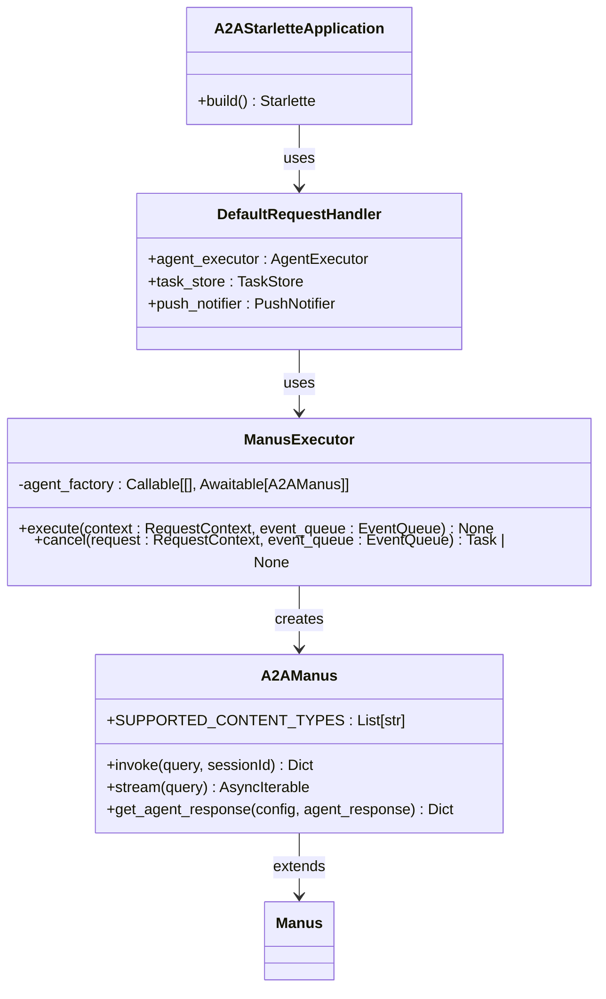
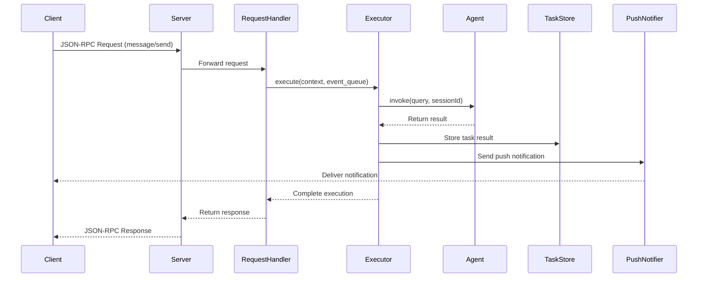
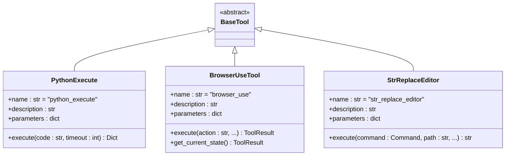
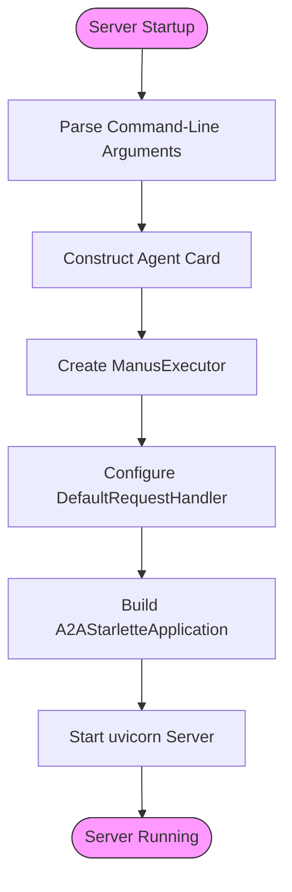
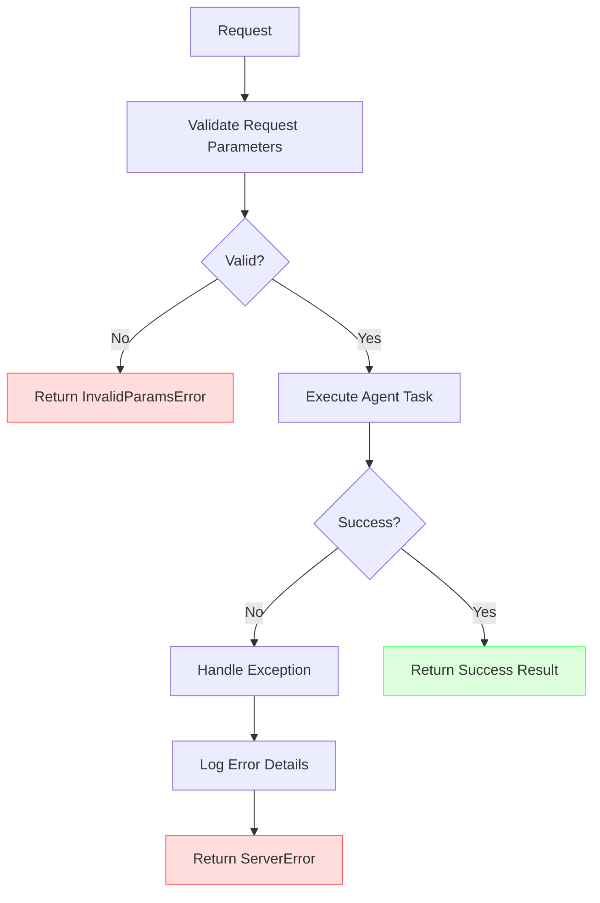

# A2A Protocol

<cite>
**Referenced Files in This Document**   
- [main.py](file://protocol/a2a/app/main.py)
- [agent.py](file://protocol/a2a/app/agent.py)
- [agent_executor.py](file://protocol/a2a/app/agent_executor.py)
- [browser_use_tool.py](file://app/tool/browser_use_tool.py)
- [str_replace_editor.py](file://app/tool/str_replace_editor.py)
- [python_execute.py](file://app/tool/python_execute.py)
- [README.md](file://protocol/a2a/app/README.md)
</cite>

## Table of Contents
1. [Introduction](#introduction)
2. [Agent Card Structure](#agent-card-structure)
3. [Core Components and Integration](#core-components-and-integration)
4. [JSON-RPC 2.0 Interface](#json-rpc-20-interface)
5. [Skill Definitions and Tool Integration](#skill-definitions-and-tool-integration)
6. [Server Startup and Configuration](#server-startup-and-configuration)
7. [Security and Error Handling](#security-and-error-handling)
8. [Testing Procedures](#testing-procedures)
9. [Extending the Agent](#extending-the-agent)
10. [Conclusion](#conclusion)

## Introduction
The A2A (Agent-to-Agent) protocol implementation in OpenManus enables seamless communication between agents through a standardized interface. This documentation provides a comprehensive overview of the protocol's implementation, focusing on the agent card structure, integration patterns, and operational mechanics. The system exposes agent capabilities via a well-known endpoint and facilitates task execution through a JSON-RPC 2.0 interface.

**Section sources**
- [README.md](file://protocol/a2a/app/README.md#L0-L43)

## Agent Card Structure
The agent card served at `/.well-known/agent.json` provides a standardized description of the agent's capabilities and interface. This JSON document contains essential metadata that enables other agents to discover and interact with the Manus agent.

The agent card includes the following fields:
- **name**: "Manus Agent" - The human-readable name of the agent
- **description**: A comprehensive description of the agent's capabilities and purpose
- **url**: The base URL where the agent is hosted, configured via command-line arguments
- **version**: The current version of the agent implementation
- **defaultInputModes**: Supported input content types (text, text/plain)
- **defaultOutputModes**: Supported output content types (text, text/plain)
- **capabilities**: Object indicating supported features like push notifications and streaming
- **skills**: Array of available skills with detailed descriptions, examples, and metadata

The agent card serves as a service discovery mechanism, allowing client applications to understand what the agent can do and how to interact with it before initiating communication.

```mermaid
erDiagram
AGENT_CARD {
string name
string description
string url
string version
array defaultInputModes
array defaultOutputModes
object capabilities
array skills
}
SKILL {
string id
string name
string description
array tags
array examples
}
CAPABILITIES {
boolean streaming
boolean pushNotifications
}
AGENT_CARD ||--o{ SKILL : contains
AGENT_CARD }|--| CAPABILITIES : has
```

**Diagram sources**
- [main.py](file://protocol/a2a/app/main.py#L28-L80)
- [README.md](file://protocol/a2a/app/README.md#L44-L144)

**Section sources**
- [main.py](file://protocol/a2a/app/main.py#L28-L80)
- [README.md](file://protocol/a2a/app/README.md#L44-L144)

## Core Components and Integration
The A2A protocol implementation in OpenManus relies on several core components that work together to enable agent-to-agent communication. The integration between A2AStarletteApplication, DefaultRequestHandler, and ManusExecutor forms the backbone of the system's request processing pipeline.

The A2AStarletteApplication serves as the main server application, configured with the agent card and request handler. It handles incoming HTTP requests and routes them appropriately. The DefaultRequestHandler processes incoming JSON-RPC requests and manages the execution workflow through the ManusExecutor.

The ManusExecutor class implements the AgentExecutor interface and is responsible for executing tasks. It uses a factory pattern to create instances of the A2AManus agent and handles the complete task lifecycle, from request validation to result delivery.



**Diagram sources**
- [main.py](file://protocol/a2a/app/main.py#L82-L100)
- [agent_executor.py](file://protocol/a2a/app/agent_executor.py#L22-L71)
- [agent.py](file://protocol/a2a/app/agent.py#L15-L32)

**Section sources**
- [main.py](file://protocol/a2a/app/main.py#L82-L100)
- [agent_executor.py](file://protocol/a2a/app/agent_executor.py#L22-L71)
- [agent.py](file://protocol/a2a/app/agent.py#L15-L32)

## JSON-RPC 2.0 Interface
The A2A protocol implementation uses JSON-RPC 2.0 for task execution and communication between agents. The interface supports both task execution and push notifications through the InMemoryTaskStore and InMemoryPushNotifier components.

The task execution workflow follows these steps:
1. Client sends a JSON-RPC request to the server with method "message/send"
2. Server validates the request and extracts user input
3. ManusExecutor creates an agent instance and invokes it with the query
4. Results are packaged into artifacts and sent back through the event queue
5. Push notifications are delivered via the configured notifier

The InMemoryTaskStore maintains task state in memory, while the InMemoryPushNotifier handles the delivery of push notifications to clients. This implementation provides a simple but effective mechanism for asynchronous communication between agents.



**Diagram sources**
- [main.py](file://protocol/a2a/app/main.py#L82-L100)
- [agent_executor.py](file://protocol/a2a/app/agent_executor.py#L37-L63)

**Section sources**
- [main.py](file://protocol/a2a/app/main.py#L82-L100)
- [agent_executor.py](file://protocol/a2a/app/agent_executor.py#L37-L63)

## Skill Definitions and Tool Integration
The Manus agent exposes various skills through the agent card, each corresponding to a specific tool implementation. These skills enable the agent to perform diverse tasks ranging from web browsing to code execution and file manipulation.

The implementation includes several key skills:
- **Python Execute**: Executes Python code strings with timeout protection
- **Browser use**: Provides browser automation capabilities for web interaction
- **Replace String**: Enables file editing through string replacement operations
- **Ask human**: Allows the agent to request human assistance when needed
- **terminate**: Terminates the current task when objectives are met

Each skill is defined with a unique ID, name, description, tags, and usage examples. The descriptions provide detailed information about the tool's capabilities, usage patterns, and important considerations for effective utilization.



**Diagram sources**
- [python_execute.py](file://app/tool/python_execute.py#L4-L75)
- [browser_use_tool.py](file://app/tool/browser_use_tool.py#L1-L567)
- [str_replace_editor.py](file://app/tool/str_replace_editor.py#L1-L432)

**Section sources**
- [python_execute.py](file://app/tool/python_execute.py#L4-L75)
- [browser_use_tool.py](file://app/tool/browser_use_tool.py#L1-L567)
- [str_replace_editor.py](file://app/tool/str_replace_editor.py#L1-L432)

## Server Startup and Configuration
The server startup process is managed through the main.py module, which provides a command-line interface for configuring host and port settings. The server is built on uvicorn, a high-performance ASGI server implementation.

The startup process follows these steps:
1. Parse command-line arguments for host and port (defaults: localhost:10000)
2. Construct the agent card with capabilities and skills
3. Initialize the ManusExecutor with an agent factory function
4. Configure the DefaultRequestHandler with the executor and storage components
5. Build the A2AStarletteApplication with the agent card and request handler
6. Start the uvicorn server with the configured application

Command-line arguments allow for flexible deployment configurations:
- `--host`: Specify the server host address (default: localhost)
- `--port`: Specify the server port (default: 10000)

This configuration approach enables easy deployment in different environments, from local development to production servers.



**Diagram sources**
- [main.py](file://protocol/a2a/app/main.py#L102-L131)
- [main.py](file://protocol/a2a/app/main.py#L11-L100)

**Section sources**
- [main.py](file://protocol/a2a/app/main.py#L11-L131)

## Security and Error Handling
The A2A protocol implementation includes several security and error handling mechanisms to ensure robust and reliable operation. These mechanisms protect against various failure modes and potential security issues.

Error handling is implemented at multiple levels:
- Request validation in ManusExecutor checks for invalid parameters
- Exception handling in the execute method captures agent invocation errors
- Tool-specific error handling manages operation failures
- Timeout protection prevents infinite execution in Python code execution

Security considerations include:
- Code execution sandboxing through multiprocessing isolation
- Input validation for all tool parameters
- Error message sanitization to prevent information leakage
- Asynchronous execution to prevent blocking the main server thread

The system uses ServerError exceptions to communicate error conditions back to clients, with appropriate error codes and messages. This structured approach to error handling enables clients to understand and respond to different failure scenarios appropriately.



**Diagram sources**
- [agent_executor.py](file://protocol/a2a/app/agent_executor.py#L37-L63)
- [python_execute.py](file://app/tool/python_execute.py#L46-L74)

**Section sources**
- [agent_executor.py](file://protocol/a2a/app/agent_executor.py#L37-L63)
- [python_execute.py](file://app/tool/python_execute.py#L46-L74)

## Testing Procedures
Testing the A2A endpoint involves verifying both the agent card discovery mechanism and the task execution interface. The implementation provides clear examples for testing both aspects of the system.

To test the agent card:
1. Send an HTTP GET request to `/.well-known/agent.json`
2. Verify the response contains all expected fields
3. Validate that capabilities and skills are correctly described
4. Check that the URL reflects the correct host and port configuration

To test task execution:
1. Send a JSON-RPC request to the root endpoint with method "message/send"
2. Include a user message in the request parameters
3. Verify the response contains the expected task completion
4. Check that artifacts contain the correct output from the agent

Example test commands:
```bash
# Test agent card retrieval
curl http://localhost:10000/.well-known/agent.json

# Test task execution
curl --location 'http://localhost:10000' \
--header 'Content-Type: application/json' \
--data '{
    "id":130,
    "jsonrpc":"2.0",
    "method": "message/send",
    "params": {
        "message": {
            "messageId": "",
            "role": "user",
            "parts": [{"text":"What is the capital of France?"}]
        }
    }
}'
```

**Section sources**
- [README.md](file://protocol/a2a/app/README.md#L145-L173)

## Extending the Agent
Extending the agent card with new skills involves several steps that maintain the integrity of the A2A protocol while enabling new capabilities. The process requires modifications to both the agent card definition and the underlying tool implementations.

To add a new skill:
1. Implement a new tool class that extends BaseTool
2. Define the tool's parameters, description, and execution logic
3. Add the skill to the agent card in main.py
4. Ensure the tool is properly integrated with the agent's execution context

When integrating custom agent implementations, developers should:
- Ensure compatibility with the A2AManus interface
- Maintain the same input/output modes unless explicitly extended
- Preserve the error handling patterns established in the base implementation
- Consider the security implications of new capabilities

The modular design of the system facilitates extension while maintaining a consistent interface for clients. New skills can be added without modifying the core protocol implementation, enabling flexible adaptation to different use cases.

**Section sources**
- [main.py](file://protocol/a2a/app/main.py#L28-L80)
- [agent.py](file://protocol/a2a/app/agent.py#L15-L32)

## Conclusion
The A2A protocol implementation in OpenManus provides a robust framework for agent-to-agent communication. By exposing a standardized agent card and implementing a JSON-RPC 2.0 interface, the system enables seamless integration between different agents. The modular design, with clear separation between the protocol interface and tool implementations, allows for flexible extension and customization. The combination of well-defined skills, robust error handling, and straightforward deployment makes this implementation suitable for a wide range of agent-based applications.