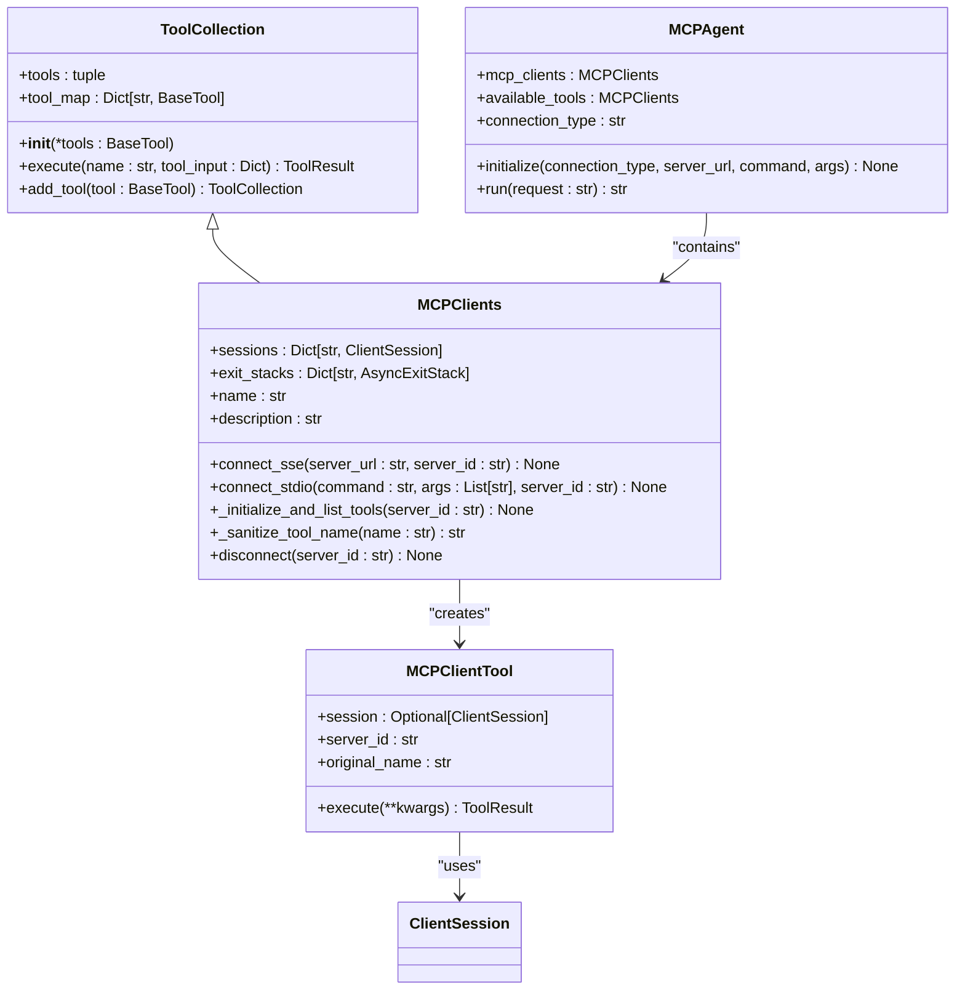
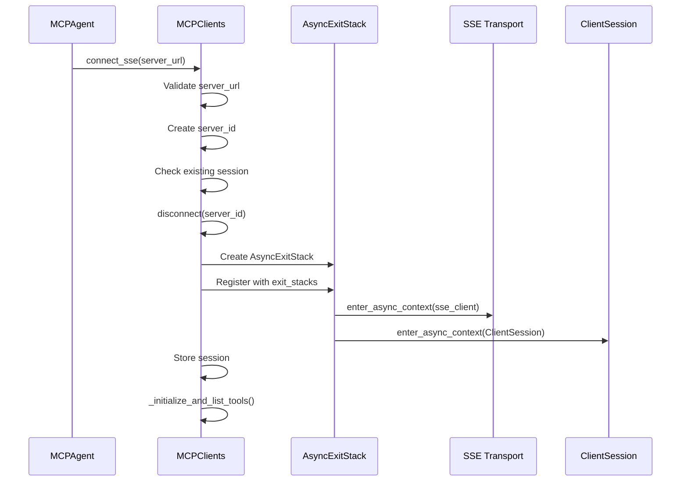
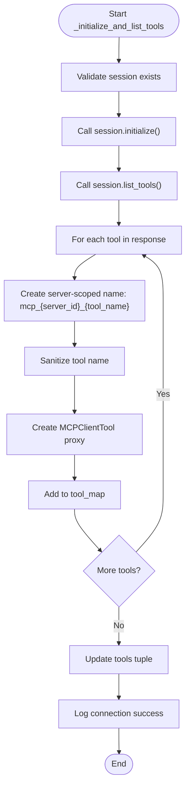
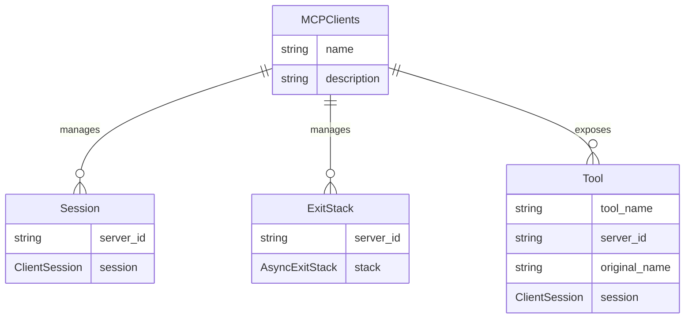
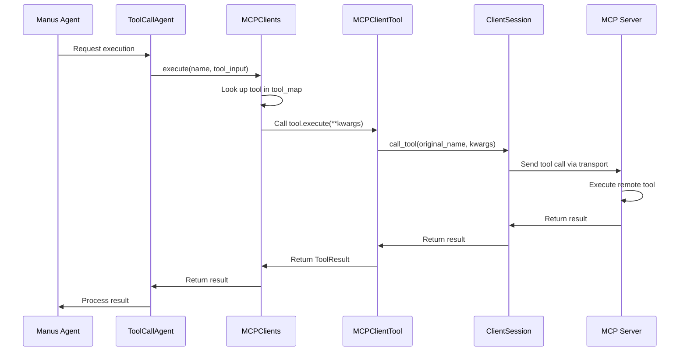
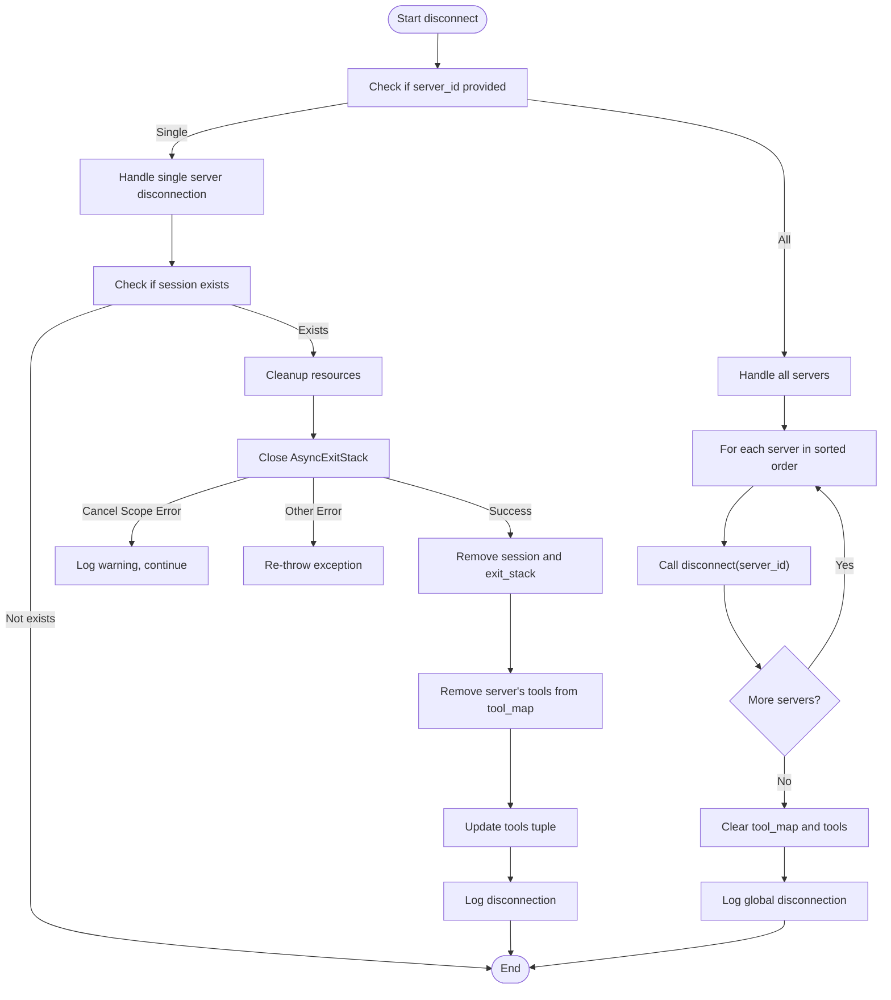

# MCP Client

<cite>
**Referenced Files in This Document**   
- [app/tool/mcp.py](file://app/tool/mcp.py)
- [app/agent/mcp.py](file://app/agent/mcp.py)
- [config/mcp.example.json](file://config/mcp.example.json)
</cite>

## Table of Contents
1. [Introduction](#introduction)
2. [Core Architecture](#core-architecture)
3. [Connection Management](#connection-management)
4. [Tool Discovery and Initialization](#tool-discovery-and-initialization)
5. [Internal State Management](#internal-state-management)
6. [Tool Execution Flow](#tool-execution-flow)
7. [Configuration Requirements](#configuration-requirements)
8. [Error Handling and Cleanup](#error-handling-and-cleanup)
9. [Troubleshooting Guide](#troubleshooting-guide)

## Introduction

The MCP Client implementation in OpenManus provides a robust mechanism for agents to interact with remote Model Context Protocol (MCP) servers. The core component, `MCPClients` class, extends `ToolCollection` to dynamically manage remote tools from multiple MCP servers through both Server-Sent Events (SSE) and stdio transports. This architecture enables seamless integration of external capabilities into the agent's tool ecosystem, allowing Manus agents to leverage remote services as if they were local tools.

The implementation follows a layered approach where the `MCPAgent` serves as the interface between the agent framework and the underlying `MCPClients` infrastructure. This separation of concerns allows for flexible configuration of connection types (SSE or stdio) while maintaining a consistent tool interface for the agent. The system is designed with resource management as a priority, utilizing `AsyncExitStack` for automatic cleanup of sessions and transports, ensuring proper resource disposal even in error conditions.

**Section sources**
- [app/agent/mcp.py](file://app/agent/mcp.py#L1-L50)
- [app/tool/mcp.py](file://app/tool/mcp.py#L36-L47)

## Core Architecture

The MCP Client architecture is built around the `MCPClients` class that inherits from `ToolCollection`, establishing it as a first-class tool container within the OpenManus framework. This inheritance pattern allows the MCP Client to participate in the standard tool execution workflow while adding specialized capabilities for remote server interaction.



**Diagram sources**
- [app/tool/mcp.py](file://app/tool/mcp.py#L36-L193)
- [app/agent/mcp.py](file://app/agent/mcp.py#L26-L27)

**Section sources**
- [app/tool/mcp.py](file://app/tool/mcp.py#L36-L47)
- [app/agent/mcp.py](file://app/agent/mcp.py#L26-L27)

## Connection Management

The MCP Client supports two primary transport mechanisms for connecting to MCP servers: SSE (Server-Sent Events) and stdio (standard input/output). These connection methods are implemented through the `connect_sse()` and `connect_stdio()` methods, both of which leverage `AsyncExitStack` for robust resource management.

The `connect_sse()` method establishes a connection to an MCP server via HTTP using Server-Sent Events, which enables real-time bidirectional communication over a single HTTP connection. This method requires a server URL and optionally accepts a server identifier. Before establishing a new connection, it ensures clean disconnection of any existing session with the same server ID, preventing resource leaks.



**Diagram sources**
- [app/tool/mcp.py](file://app/tool/mcp.py#L49-L68)

The `connect_stdio()` method connects to an MCP server by spawning a subprocess and communicating through standard input and output streams. This approach is particularly useful for local server instances or when direct process communication is preferred over network protocols. The method accepts a command to execute and optional arguments, creating a server parameter object that configures the stdio transport.

Both connection methods follow the same resource management pattern: creating an `AsyncExitStack` instance to manage the lifecycle of asynchronous resources. The exit stack automatically handles cleanup of the transport and session when the connection is closed, ensuring that all resources are properly released even if exceptions occur during execution.

**Section sources**
- [app/tool/mcp.py](file://app/tool/mcp.py#L49-L94)

## Tool Discovery and Initialization

The `_initialize_and_list_tools()` workflow is responsible for discovering available tools on connected MCP servers and integrating them into the local tool ecosystem. This process begins after a successful connection, where the client session is initialized and a `list_tools` request is sent to the server to retrieve the available tool definitions.



**Diagram sources**
- [app/tool/mcp.py](file://app/tool/mcp.py#L96-L125)

The tool naming strategy employs server-scoped naming by prefixing each tool with `mcp_{server_id}_` followed by the original tool name. This prevents naming conflicts when multiple servers expose tools with identical names. The `_sanitize_tool_name()` method ensures compliance with naming constraints by:

1. Replacing invalid characters (anything not alphanumeric, underscore, or hyphen) with underscores
2. Collapsing consecutive underscores into a single underscore
3. Removing leading and trailing underscores
4. Truncating names to 64 characters maximum

This sanitization process guarantees that all tool names conform to the requirements of the MCP protocol while maintaining readability and uniqueness across different servers.

**Section sources**
- [app/tool/mcp.py](file://app/tool/mcp.py#L96-L144)

## Internal State Management

The MCP Client maintains its internal state through several key data structures that track active connections, resources, and available tools. The primary state components include the `sessions` dictionary, `exit_stacks` dictionary, `tool_map`, and `tools` tuple.



**Diagram sources**
- [app/tool/mcp.py](file://app/tool/mcp.py#L41-L42)

The `sessions` dictionary maps server identifiers to active `ClientSession` objects, enabling the client to maintain multiple concurrent connections to different MCP servers. Each session represents an established communication channel with a specific server, allowing for independent interaction with each remote service.

The `exit_stacks` dictionary pairs each server identifier with its corresponding `AsyncExitStack` instance. This design ensures that resource cleanup operations are properly scoped to individual connections, allowing for both targeted disconnection of specific servers and global cleanup of all connections.

The `tool_map` dictionary serves as the primary registry for available tools, mapping sanitized tool names to their corresponding `MCPClientTool` proxy instances. Each proxy encapsulates the necessary information to route tool calls to the appropriate server, including the original tool name, server identifier, and reference to the client session.

**Section sources**
- [app/tool/mcp.py](file://app/tool/mcp.py#L41-L47)

## Tool Execution Flow

The end-to-end flow of a tool call from the Manus agent to remote execution involves several coordinated components working together to transparently proxy the request to the appropriate MCP server. This process begins when the agent selects a tool for execution and ends with the return of results to the agent's memory system.



**Diagram sources**
- [app/tool/mcp.py](file://app/tool/mcp.py#L13-L33)
- [app/agent/toolcall.py](file://app/agent/toolcall.py#L24-L34)

When a tool call is initiated, the `ToolCallAgent` routes the request to the `MCPClients` instance through the standard tool execution interface. The `MCPClients` class looks up the requested tool in its `tool_map` and invokes the `execute()` method on the corresponding `MCPClientTool` proxy. This proxy then uses its associated `ClientSession` to make a remote procedure call to the original tool name on the server, passing the provided arguments.

The use of `MCPClientTool` proxies as intermediaries allows for transparent translation between the agent's perspective (using the sanitized, server-scoped tool name) and the server's perspective (using the original tool name). This abstraction layer ensures that the agent can interact with remote tools without needing to be aware of the underlying transport mechanism or server topology.

**Section sources**
- [app/tool/mcp.py](file://app/tool/mcp.py#L13-L33)
- [app/agent/toolcall.py](file://app/agent/toolcall.py#L24-L34)

## Configuration Requirements

The MCP Client requires proper configuration to establish connections with MCP servers. The configuration is specified in the `mcp.example.json` file, which defines the servers and their connection parameters. This configuration file follows a structured format that maps server identifiers to their respective connection types and parameters.

```json
{
    "mcpServers": {
      "server1": {
        "type": "sse",
        "url": "http://localhost:8000/sse"
      }
    }
}
```

For SSE connections, the configuration requires:
- `type`: Set to "sse" to indicate Server-Sent Events transport
- `url`: The HTTP endpoint of the MCP server's SSE interface

For stdio connections, the configuration would require:
- `type`: Set to "stdio" to indicate standard input/output transport
- `command`: The executable command to launch the MCP server process
- `args`: An array of command-line arguments for the server process

The server identifier (e.g., "server1") serves as both the key in the configuration and the default `server_id` used in the client implementation. This identifier is incorporated into the tool naming scheme to ensure uniqueness across different servers.

**Section sources**
- [config/mcp.example.json](file://config/mcp.example.json#L1-L9)

## Error Handling and Cleanup

The MCP Client implements comprehensive error handling and cleanup mechanisms to ensure robust operation in various failure scenarios. The `disconnect()` method handles both single-server and global disconnection, with special attention to error resilience during cleanup operations.

When disconnecting from a specific server, the method first attempts to close the associated `AsyncExitStack`, which automatically cleans up the transport and session resources. The implementation includes specific handling for "cancel scope" errors that may occur during asynchronous cleanup, logging a warning but continuing with the cleanup process to prevent resource leaks.



**Diagram sources**
- [app/tool/mcp.py](file://app/tool/mcp.py#L154-L193)

The global disconnection process follows a deterministic order by sorting server identifiers before disconnection, ensuring consistent behavior across different execution environments. After disconnecting from all individual servers, it clears the `tool_map` and `tools` collections to maintain internal consistency.

**Section sources**
- [app/tool/mcp.py](file://app/tool/mcp.py#L154-L193)

## Troubleshooting Guide

When encountering issues with the MCP Client, consider the following common problems and their solutions:

**Connection Timeouts**: If connections to MCP servers time out, verify that the server is running and accessible at the specified URL or command. Check network connectivity and firewall settings that might block the connection. For SSE connections, ensure the server's HTTP endpoint is correctly configured and responsive.

**Authentication Issues**: Authentication problems typically manifest as connection failures or immediate disconnections. Verify that any required authentication tokens or credentials are properly configured in the server and client environments. Check server logs for authentication-related error messages.

**Tool Discovery Failures**: If tools are not being discovered from connected servers, confirm that the server is properly advertising its tools through the `list_tools` endpoint. Verify that the client has successfully established the session by checking the initialization logs. Ensure that tool names comply with the naming constraints (64-character limit, valid characters only).

**Message Serialization Problems**: Issues with message serialization between client and server often appear as parsing errors or malformed data exceptions. Ensure that both client and server are using compatible versions of the MCP protocol. Verify that data being exchanged adheres to the expected JSON schema and that special characters are properly escaped.

**Resource Cleanup Issues**: If resources are not being properly cleaned up after disconnection, check for unhandled exceptions during the `aclose()` operation on the `AsyncExitStack`. The presence of "cancel scope" errors may indicate asynchronous cancellation issues that should be handled gracefully as demonstrated in the implementation.

**Section sources**
- [app/tool/mcp.py](file://app/tool/mcp.py#L154-L193)
- [app/agent/mcp.py](file://app/agent/mcp.py#L1-L50)