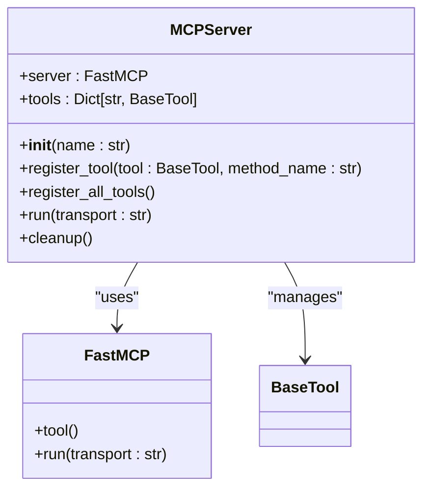
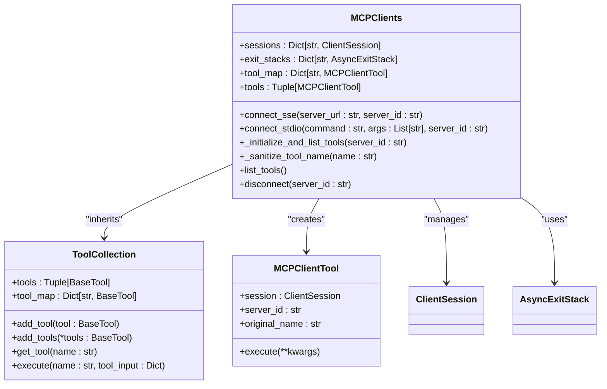
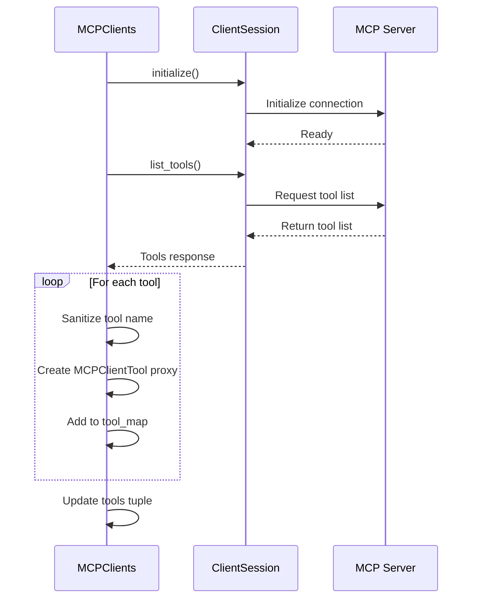
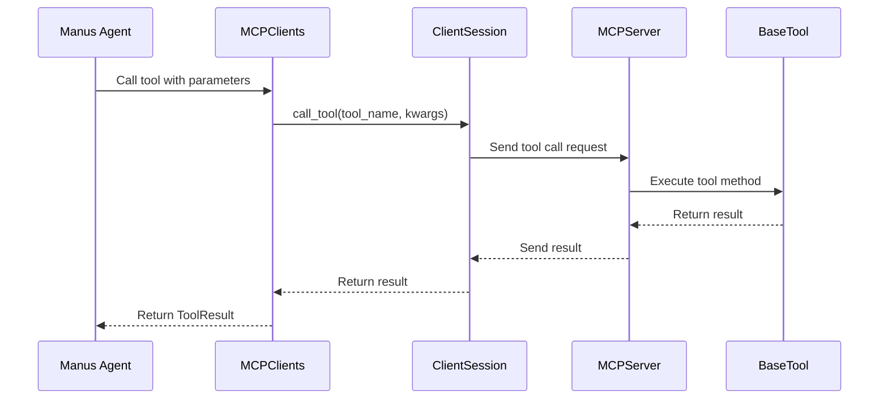

# MCP Protocol

<cite>
**Referenced Files in This Document**   
- [app/mcp/server.py](file://app/mcp/server.py)
- [app/tool/mcp.py](file://app/tool/mcp.py)
- [app/agent/mcp.py](file://app/agent/mcp.py)
- [config/mcp.example.json](file://config/mcp.example.json)
- [run_mcp_server.py](file://run_mcp_server.py)
- [run_mcp.py](file://run_mcp.py)
- [app/config.py](file://app/config.py)
</cite>

## Table of Contents
1. [Introduction](#introduction)
2. [Server Implementation](#server-implementation)
3. [Client Implementation](#client-implementation)
4. [Configuration and Security](#configuration-and-security)
5. [Tool Execution Flow](#tool-execution-flow)
6. [Troubleshooting](#troubleshooting)
7. [Conclusion](#conclusion)

## Introduction
The Model Context Protocol (MCP) integration in OpenManus enables agents to access remote tools through standardized communication protocols. This document details the implementation of both server and client components that facilitate this integration. The MCP architecture allows for flexible tool exposure and consumption through different transport mechanisms, primarily stdio and Server-Sent Events (SSE). The system is designed to support dynamic tool discovery, secure execution, and proper resource management throughout the session lifecycle.

## Server Implementation

The MCP server implementation in OpenManus is centered around the `MCPServer` class defined in `app/mcp/server.py`. This class serves as the foundation for exposing tools to remote clients through the Model Context Protocol. The server uses FastMCP, a lightweight framework for implementing MCP servers, to handle communication and tool registration.

The `MCPServer` class initializes with a default name "openmanus" and maintains a dictionary of available tools. During initialization, it automatically sets up four standard tools: bash, browser, editor, and terminate. These tools provide essential functionality for command execution, web browsing, text editing, and session termination respectively.



**Diagram sources**
- [app/mcp/server.py](file://app/mcp/server.py#L26-L34)

**Section sources**
- [app/mcp/server.py](file://app/mcp/server.py#L26-L34)

### Tool Registration Process

The tool registration process in the MCP server is a sophisticated mechanism that ensures proper parameter validation, documentation, and signature building. The `register_tool` method is responsible for registering individual tools with the server. When a tool is registered, several important operations occur:

First, the method extracts the tool's parameter information through the `to_param()` method, which returns a dictionary containing the tool's function metadata. Then, it creates an async wrapper function that will be exposed through the MCP interface. This wrapper handles logging of tool execution and result processing.

The server builds comprehensive documentation for each tool by generating a docstring from the tool's metadata. The `_build_docstring` method creates a formatted string that includes the tool's description and detailed parameter information, including type, requirement status, and description for each parameter.

```mermaid
flowchart TD
Start([Register Tool]) --> ExtractMetadata["Extract tool metadata via to_param()"]
ExtractMetadata --> CreateWrapper["Create async wrapper function"]
CreateWrapper --> SetMetadata["Set function metadata (__name__, __doc__, __signature__)]
SetMetadata --> BuildDocstring["Build docstring with parameter details"]
BuildDocstring --> BuildSignature["Build function signature from JSON Schema"]
BuildSignature --> StoreSchema["Store parameter schema for programmatic access"]
StoreSchema --> Register["Register with FastMCP server"]
Register --> End([Tool Registered])
```

**Diagram sources**
- [app/mcp/server.py](file://app/mcp/server.py#L36-L75)

**Section sources**
- [app/mcp/server.py](file://app/mcp/server.py#L36-L75)

### Signature Building and Parameter Validation

The signature building process is a critical component of the MCP server's functionality. The `_build_signature` method converts JSON Schema type definitions into Python type annotations, enabling proper parameter validation and IDE support. The method maps JSON Schema types to their Python equivalents: "string" to str, "integer" to int, "number" to float, "boolean" to bool, "object" to dict, and "array" to list.

For each parameter, the method determines whether it is required or optional based on the "required" field in the tool's parameters. Required parameters are given a default value of `Parameter.empty`, while optional parameters receive a default value of `None`. All parameters are created with `kind=Parameter.KEYWORD_ONLY` to ensure they are passed as keyword arguments.

The server also stores a parameter schema as an attribute on the registered method, making it accessible programmatically. This schema includes the description, type, and required status for each parameter, providing a comprehensive reference for tool usage.

**Section sources**
- [app/mcp/server.py](file://app/mcp/server.py#L99-L135)

### Standard Tools Initialization

The MCP server initializes four standard tools during construction: bash, browser, editor, and terminate. These tools are instantiated and stored in the `tools` dictionary with their respective keys. The bash tool provides command-line interface functionality, allowing execution of shell commands. The browser tool enables web browsing capabilities, while the editor tool supports text editing operations through string replacement.

The terminate tool serves a special purpose in the MCP ecosystem, providing a mechanism to gracefully end the agent's execution. When this tool is called, it signals the agent to stop processing further steps, effectively terminating the current session. This design pattern allows for controlled shutdown of agent workflows based on tool execution.

The server's `register_all_tools` method iterates through all tools in the `tools` dictionary and registers each one with the server using the `register_tool` method. This ensures that all initialized tools are properly exposed through the MCP interface.

**Section sources**
- [app/mcp/server.py](file://app/mcp/server.py#L26-L34)
- [app/mcp/server.py](file://app/mcp/server.py#L144-L147)

### Server Execution and Cleanup

The MCP server is executed through the `run` method, which orchestrates the complete startup process. This method first calls `register_all_tools` to expose all available tools through the MCP interface. It then registers a cleanup function using Python's `atexit` module, ensuring that resources are properly released when the server terminates.

The cleanup process is implemented in the `cleanup` method, which specifically handles the browser tool's resources. If a browser tool is present and has a `cleanup` method, it is asynchronously called to release any allocated resources. This targeted cleanup approach ensures that only necessary cleanup operations are performed, optimizing shutdown time.

The server supports different transport methods, with stdio being the default and currently supported option. The `run` method accepts a transport parameter that specifies the communication method, allowing for potential future expansion to other transport mechanisms.

**Section sources**
- [app/mcp/server.py](file://app/mcp/server.py#L149-L159)
- [app/mcp/server.py](file://app/mcp/server.py#L137-L142)

## Client Implementation

The client-side implementation of MCP in OpenManus is handled by the `MCPClients` class in `app/tool/mcp.py`. This class manages connections to one or more MCP servers and provides a unified interface for accessing remote tools. The implementation uses AsyncExitStack for proper resource management, ensuring that connections are properly closed and resources are released when no longer needed.

The `MCPClients` class inherits from `ToolCollection`, which provides the foundational structure for managing multiple tools. It maintains several important state variables: `sessions` to track active server connections, `exit_stacks` to manage asynchronous context managers, and `tool_map` to map tool names to their corresponding instances.



**Diagram sources**
- [app/tool/mcp.py](file://app/tool/mcp.py#L36-L68)

**Section sources**
- [app/tool/mcp.py](file://app/tool/mcp.py#L36-L68)

### Connection Management with AsyncExitStack

The client implementation uses AsyncExitStack to manage the lifecycle of connections to MCP servers. When connecting to a server via SSE or stdio, an AsyncExitStack is created and stored in the `exit_stacks` dictionary with the server ID as the key. This stack manages the asynchronous context managers for the connection, ensuring proper cleanup when the connection is closed.

For SSE connections, the `connect_sse` method creates a streams context using `sse_client`, which is entered into the exit stack. The resulting streams are then used to create a `ClientSession`, which is also entered into the exit stack. This nested context management ensures that both the SSE connection and the client session are properly closed when the stack is closed.

Similarly, for stdio connections, the `connect_stdio` method creates a stdio transport using `stdio_client` with the specified command and arguments. The read and write streams from this transport are used to create a `ClientSession`, with both the transport and session managed by the exit stack.

This resource management pattern ensures that even if an error occurs during connection or communication, the exit stack will properly clean up all allocated resources, preventing resource leaks.

**Section sources**
- [app/tool/mcp.py](file://app/tool/mcp.py#L49-L68)
- [app/tool/mcp.py](file://app/tool/mcp.py#L70-L94)

### Tool Discovery and Proxy Creation

The `_initialize_and_list_tools` method is responsible for discovering available tools on a connected MCP server and creating proxy objects for them. After establishing a connection and initializing the session, this method calls `list_tools` on the server to retrieve information about all available tools.

For each discovered tool, the method creates a unique name by prefixing "mcp_" followed by the server ID and the original tool name. This naming convention ensures that tools from different servers do not conflict, even if they have the same original name. The tool name is then sanitized using the `_sanitize_tool_name` method to ensure it conforms to naming requirements.



**Diagram sources**
- [app/tool/mcp.py](file://app/tool/mcp.py#L96-L125)

**Section sources**
- [app/tool/mcp.py](file://app/tool/mcp.py#L96-L125)

### Name Sanitization

The `_sanitize_tool_name` method ensures that generated tool names are valid and consistent. It performs several transformations on the name: replacing invalid characters (anything not alphanumeric, underscore, or hyphen) with underscores, removing consecutive underscores, stripping leading and trailing underscores, and truncating names longer than 64 characters.

This sanitization process is crucial for maintaining compatibility with various systems that may have restrictions on identifier names. By standardizing the naming format, the client ensures that tool names are predictable and can be safely used in different contexts without causing errors.

**Section sources**
- [app/tool/mcp.py](file://app/tool/mcp.py#L127-L144)

### Session Lifecycle Management

The client implementation provides comprehensive session lifecycle management through the `connect_sse`, `connect_stdio`, and `disconnect` methods. Before establishing a new connection, the client checks if a connection with the same server ID already exists and disconnects it to prevent conflicts.

The `disconnect` method handles cleanup for a specific server or all servers. When disconnecting from a specific server, it closes the corresponding exit stack, which triggers the cleanup of all resources managed by that stack. It then removes the server's session and exit stack from their respective dictionaries and removes all tools associated with that server from the tool map.

For error resilience, the disconnect method includes special handling for "cancel scope" runtime errors, which may occur during asynchronous cleanup. These errors are logged as warnings rather than being raised, allowing the cleanup process to continue and ensuring that resources are released even in error conditions.

**Section sources**
- [app/tool/mcp.py](file://app/tool/mcp.py#L154-L193)

## Configuration and Security

### Configuration Requirements

The MCP integration in OpenManus supports configuration through JSON files, with `mcp.example.json` providing a template for server configuration. The configuration file defines one or more MCP servers with their connection parameters. Each server entry includes a type field specifying the connection method (sse or stdio), and corresponding connection details such as URL for SSE connections or command and arguments for stdio connections.

The configuration system is implemented in `app/config.py` with the `MCPServerConfig` and `MCPSettings` classes. These classes use Pydantic for data validation, ensuring that configuration values meet the required specifications. The `load_server_config` class method attempts to load configuration from `mcp.json`, falling back to defaults if the file is not found.

```json
{
    "mcpServers": {
      "server1": {
        "type": "sse",
        "url": "http://localhost:8000/sse"
      }
    }
}
```

The server reference is configurable through the `server_reference` field in `MCPSettings`, which defaults to "app.mcp.server". This allows for flexibility in specifying which module contains the MCP server implementation.

**Section sources**
- [config/mcp.example.json](file://config/mcp.example.json#L0-L7)
- [app/config.py](file://app/config.py#L126-L159)

### Security Considerations

Remote tool execution through MCP introduces several security considerations that must be addressed. The primary concern is the potential for arbitrary code execution, particularly through tools like bash and python_execute. These tools can execute commands on the host system, potentially leading to privilege escalation or system compromise.

To mitigate these risks, the implementation should be deployed in a restricted environment with appropriate sandboxing. The bash tool, for example, should run in a container or virtual machine with limited privileges and network access. Similarly, the python_execute tool should operate in a restricted environment with limited access to system resources and network connectivity.

Authentication and authorization mechanisms should be implemented to control access to MCP servers. For SSE connections, this could involve token-based authentication or API keys. The communication channel should be encrypted using HTTPS to prevent eavesdropping and man-in-the-middle attacks.

Input validation is another critical security aspect. All inputs to remote tools should be validated and sanitized to prevent injection attacks. The parameter validation built into the MCP server helps with this by ensuring that only parameters defined in the tool's schema are accepted.

**Section sources**
- [app/mcp/server.py](file://app/mcp/server.py#L36-L75)
- [app/tool/mcp.py](file://app/tool/mcp.py#L20-L33)

## Tool Execution Flow

The tool execution flow in OpenManus follows a well-defined sequence from the Manus agent to the remote MCP server and back. When an agent determines that a tool should be executed, it calls the appropriate tool through the `available_tools` interface, which routes the call to the corresponding `MCPClientTool` proxy.

The `execute` method of `MCPClientTool` makes a remote call to the MCP server using the `call_tool` method of the `ClientSession`. This sends the tool name and parameters to the server, where the corresponding registered method is invoked. The server executes the tool's logic, processes the result, and returns it to the client.



**Diagram sources**
- [app/tool/mcp.py](file://app/tool/mcp.py#L20-L33)
- [app/mcp/server.py](file://app/mcp/server.py#L36-L75)

**Section sources**
- [app/tool/mcp.py](file://app/tool/mcp.py#L20-L33)

The result is processed by the client, which extracts text content from the response and returns a `ToolResult` object to the agent. This result is then incorporated into the agent's memory and used to inform subsequent decisions. The entire process is asynchronous, allowing for non-blocking execution and efficient resource utilization.

The `MCPAgent` class in `app/agent/mcp.py` manages the overall interaction with MCP servers. It initializes connections based on the specified connection type and periodically refreshes the list of available tools to detect changes in the server's tool set. This dynamic tool discovery allows the agent to adapt to changes in the available tool set during execution.

**Section sources**
- [app/agent/mcp.py](file://app/agent/mcp.py#L26-L28)

## Troubleshooting

### Connection Issues

Common connection issues with MCP servers include incorrect server URLs, network connectivity problems, and server startup failures. For SSE connections, ensure that the server URL is correct and accessible from the client. Verify that the server is running and listening on the specified port.

For stdio connections, ensure that the command specified in the configuration is correct and available in the system's PATH. Check that any required arguments are properly specified and that the Python module containing the server implementation can be imported.

When connection issues occur, check the server logs for error messages that may indicate the root cause. Common issues include missing dependencies, configuration errors, or port conflicts. The client-side logs can also provide valuable information about connection attempts and any errors encountered.

### Serialization Errors

Serialization errors can occur when transferring data between the client and server, particularly when dealing with complex data types. The MCP implementation handles result serialization in the server's tool wrapper function, converting results to JSON format when appropriate.

Ensure that all data returned by tools can be serialized to JSON. Complex objects should implement a `model_dump` method or be converted to dictionaries before returning. Avoid returning objects that cannot be serialized, such as file handles or database connections.

When encountering serialization errors, examine the data being returned by the tool and ensure it consists only of JSON-serializable types: strings, numbers, booleans, lists, and dictionaries. For custom objects, implement proper serialization methods or convert them to dictionaries before returning.

### Debugging Tips

Enable verbose logging to gain insight into the MCP communication flow. The server and client both use Python's logging module with INFO level logging, which provides detailed information about tool registration, execution, and connection management.

Use the `list_tools` method to verify that tools are properly registered and available. This can help identify issues with tool registration or discovery. Check that tool names are correctly sanitized and that there are no naming conflicts.

For persistent issues, consider running the server and client in debug mode with additional logging. The FastMCP framework may provide additional debugging information that can help identify communication problems.

**Section sources**
- [app/mcp/server.py](file://app/mcp/server.py#L36-L75)
- [app/tool/mcp.py](file://app/tool/mcp.py#L154-L193)

## Conclusion

The MCP integration in OpenManus provides a robust framework for exposing and consuming tools through standardized protocols. The server implementation, centered around the `MCPServer` class, offers a flexible mechanism for registering tools with proper parameter validation, documentation, and signature building. The client implementation, through the `MCPClients` class, enables seamless connection to one or more MCP servers using either SSE or stdio transports, with comprehensive resource management via AsyncExitStack.

The system supports dynamic tool discovery and proxy creation, allowing agents to adapt to changing tool availability. The naming convention and sanitization process ensure that tools from multiple servers can coexist without conflicts. The integration with OpenManus agents enables sophisticated workflows that leverage both local and remote capabilities.

Security considerations for remote tool execution should be carefully evaluated, with appropriate sandboxing and access controls implemented. Configuration through JSON files provides flexibility in defining server connections, while the extensible design allows for future enhancements and additional transport methods.

Overall, the MCP integration enhances the capabilities of OpenManus by enabling distributed tool execution and collaboration between different components of the system.