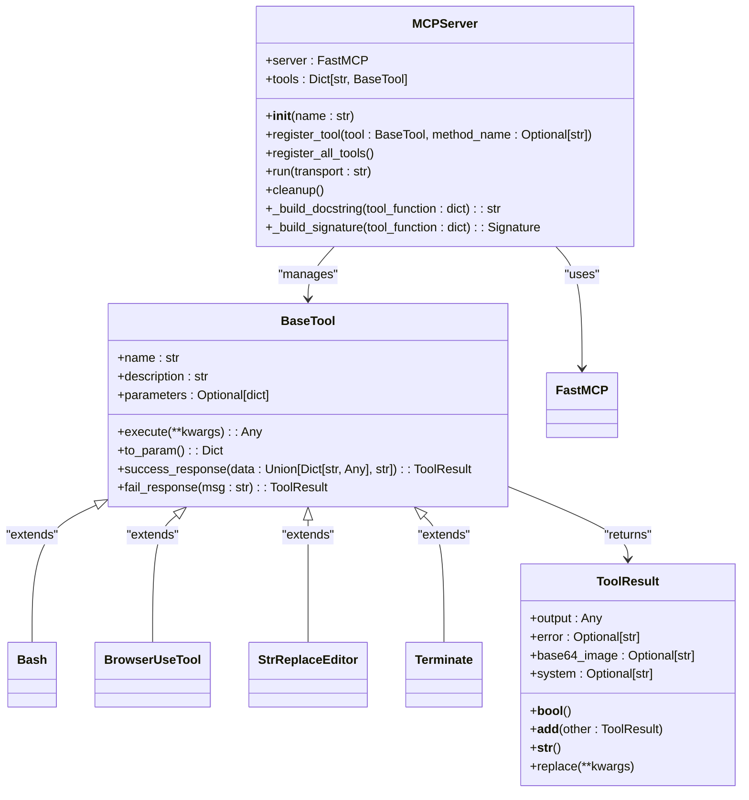
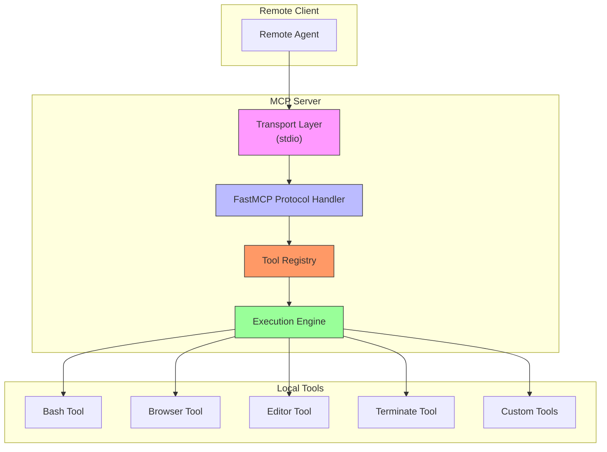
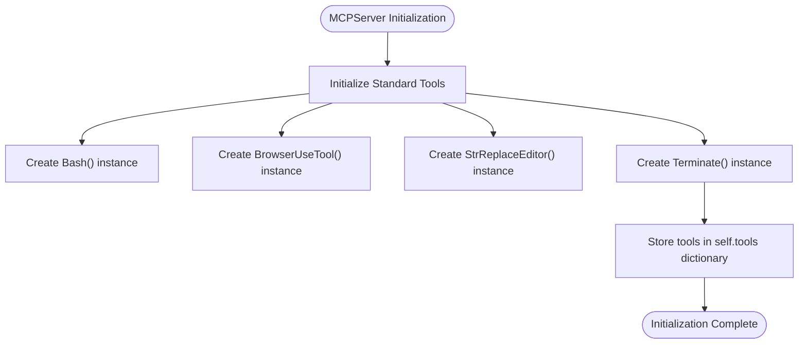
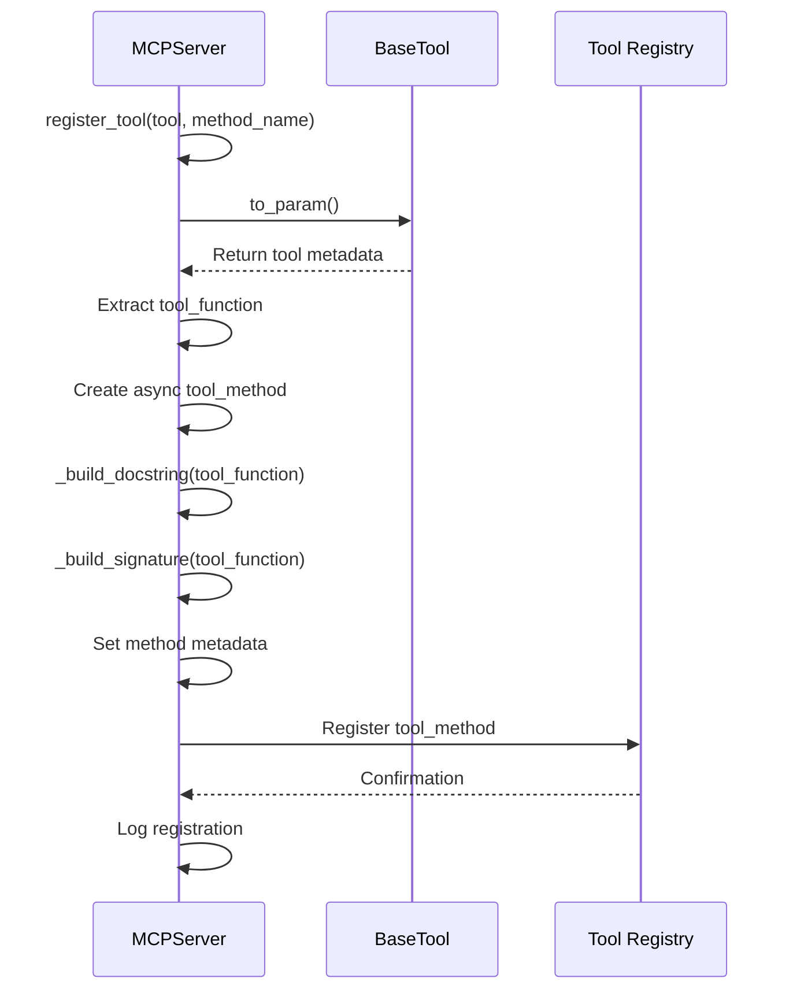
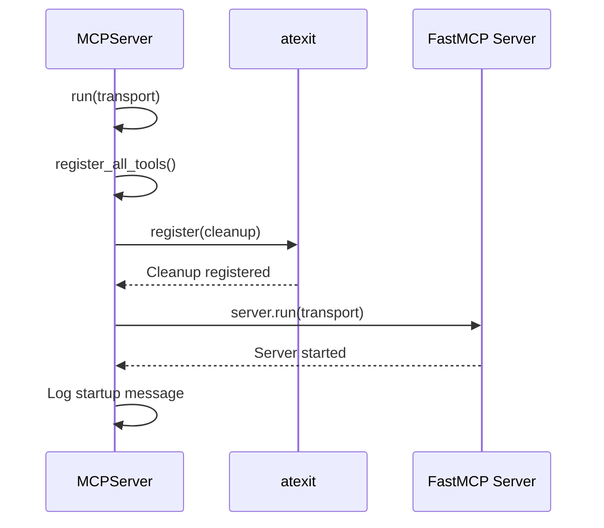

# MCP Server

<cite>
**Referenced Files in This Document**   
- [app/mcp/server.py](file://app/mcp/server.py)
- [app/tool/base.py](file://app/tool/base.py)
- [app/tool/bash.py](file://app/tool/bash.py)
- [app/tool/browser_use_tool.py](file://app/tool/browser_use_tool.py)
- [app/tool/str_replace_editor.py](file://app/tool/str_replace_editor.py)
- [app/tool/terminate.py](file://app/tool/terminate.py)
</cite>

## Table of Contents
1. [Introduction](#introduction)
2. [Core Components](#core-components)
3. [Architecture Overview](#architecture-overview)
4. [Detailed Component Analysis](#detailed-component-analysis)
5. [Tool Registration and Management](#tool-registration-and-management)
6. [Serialization and Execution Flow](#serialization-and-execution-flow)
7. [Transport and Execution Modes](#transport-and-execution-modes)
8. [Security Considerations](#security-considerations)
9. [Troubleshooting Guide](#troubleshooting-guide)

## Introduction

The MCP Server implementation in OpenManus provides a robust framework for exposing local tools to remote agents through the Model Context Protocol (MCP). This document details the architecture and functionality of the MCPServer class, which serves as the central component for tool management and remote execution. The server leverages FastMCP to enable communication via stdio transport, allowing external systems to invoke local capabilities securely and efficiently. The implementation follows a modular design pattern, with clear separation between tool definition, registration, execution, and resource management.

**Section sources**
- [app/mcp/server.py](file://app/mcp/server.py#L1-L20)

## Core Components

The MCP Server architecture is built around several key components that work together to provide a seamless tool exposure mechanism. At its core, the MCPServer class manages the lifecycle of registered tools and handles communication with remote clients. The system incorporates built-in standard tools for essential operations such as shell command execution, web browsing, file editing, and session termination. These tools inherit from the BaseTool abstract class, which defines a consistent interface for tool implementation and execution. The server's design emphasizes extensibility, allowing developers to register custom tools while maintaining compatibility with the MCP protocol.



**Diagram sources**
- [app/mcp/server.py](file://app/mcp/server.py#L23-L159)
- [app/tool/base.py](file://app/tool/base.py#L1-L182)

**Section sources**
- [app/mcp/server.py](file://app/mcp/server.py#L23-L159)
- [app/tool/base.py](file://app/tool/base.py#L1-L182)

## Architecture Overview

The MCP Server architecture follows a layered design pattern that separates concerns between protocol handling, tool management, and execution logic. The server acts as a bridge between the Model Context Protocol and local system capabilities, exposing tools through a standardized interface. At initialization, the server creates instances of standard tools and stores them in a dictionary for efficient access. When a tool is registered, the server dynamically generates appropriate metadata including docstrings and function signatures based on JSON Schema definitions. The architecture supports multiple transport modes, with stdio being the primary method for inter-process communication. Resource management is handled through the atexit module, ensuring proper cleanup of resources when the server terminates.



**Diagram sources**
- [app/mcp/server.py](file://app/mcp/server.py#L23-L159)

## Detailed Component Analysis

### MCPServer Class Analysis

The MCPServer class serves as the central component of the MCP implementation, responsible for managing tool registration, execution, and lifecycle events. The class initializes with a set of standard tools that provide essential capabilities for system interaction. These built-in tools include bash for shell command execution, browser for web automation, editor for file manipulation, and terminate for session management. The server maintains a dictionary of registered tools, allowing for efficient lookup and execution. The architecture follows the dependency injection pattern, with tools being instantiated and stored during initialization.



**Diagram sources**
- [app/mcp/server.py](file://app/mcp/server.py#L26-L34)

**Section sources**
- [app/mcp/server.py](file://app/mcp/server.py#L26-L34)

### Tool Base Class Analysis

The BaseTool class provides a foundational interface for all tools in the system, ensuring consistency in implementation and behavior. It extends both ABC (Abstract Base Class) and BaseModel from Pydantic, combining abstract method definitions with data validation capabilities. The class defines essential methods such as execute() for tool logic and to_param() for converting tool metadata into the format required by the MCP protocol. The ToolResult class, which is returned by tool execution, encapsulates both success and error states with additional metadata such as base64-encoded images for visual content. This design enables rich, structured responses that can be easily serialized and transmitted.

**Section sources**
- [app/tool/base.py](file://app/tool/base.py#L1-L182)

## Tool Registration and Management

The tool registration mechanism in the MCP Server is designed to provide flexibility while maintaining type safety and proper documentation. The register_tool() method accepts a BaseTool instance and an optional method name, allowing for both direct registration and name customization. During registration, the method performs several critical operations: it validates tool parameters, generates comprehensive docstrings from JSON Schema metadata, and constructs Python function signatures that map JSON Schema types to appropriate Python type annotations. This dynamic signature construction enables IDE support and type checking for registered tools.



**Diagram sources**
- [app/mcp/server.py](file://app/mcp/server.py#L36-L75)

**Section sources**
- [app/mcp/server.py](file://app/mcp/server.py#L36-L75)

### Dynamic Docstring Generation

The _build_docstring() method plays a crucial role in providing comprehensive documentation for registered tools. It extracts parameter information from the tool's JSON Schema definition and formats it into a human-readable docstring that follows Python conventions. The generated docstring includes the tool's description followed by a structured parameters section that lists each parameter with its type, requirement status, and description. This approach ensures that tools are self-documenting and that their usage is clear to both developers and automated systems. The method handles optional parameters by marking them as "(optional)" and required parameters as "(required)", providing immediate clarity about parameter constraints.

**Section sources**
- [app/mcp/server.py](file://app/mcp/server.py#L77-L97)

### Function Signature Construction

The _build_signature() method is responsible for creating Python function signatures that accurately reflect the tool's parameter requirements as defined in JSON Schema. It maps JSON Schema types such as "string", "integer", "number", "boolean", "object", and "array" to their corresponding Python type annotations (str, int, float, bool, dict, list). For required parameters, the method sets the default value to Parameter.empty, while optional parameters receive a default value of None. All parameters are created with kind=Parameter.KEYWORD_ONLY, ensuring that they must be passed by name rather than position. This signature construction enables proper type checking and IDE support while maintaining compatibility with the MCP protocol's parameter handling.

**Section sources**
- [app/mcp/server.py](file://app/mcp/server.py#L99-L135)

## Serialization and Execution Flow

The tool execution flow in the MCP Server follows a well-defined pattern that ensures consistent handling of results across different tool types. When a tool is invoked, the server logs the execution with the provided parameters and calls the tool's execute() method. The result is then processed through a serialization pipeline that handles three primary cases: objects with a model_dump() method (typically Pydantic models), dictionary objects, and raw values. Results with model_dump() are serialized using json.dumps() after calling model_dump(), while dictionary results are directly serialized. All other result types are returned as-is, allowing for flexible response handling. This serialization strategy ensures that complex data structures are properly transmitted while maintaining backward compatibility with simple return values.

```mermaid
flowchart TD
Start([Tool Execution]) --> ValidateInput["Validate Input Parameters"]
ValidateInput --> ExecuteTool["Call tool.execute(**kwargs)"]
ExecuteTool --> CheckResultType["Check Result Type"]
CheckResultType --> |Has model_dump()| SerializeModel["json.dumps(result.model_dump())"]
CheckResultType --> |Is dict| SerializeDict["json.dumps(result)"]
CheckResultType --> |Other| ReturnRaw["Return result as-is"]
SerializeModel --> ReturnResult["Return serialized result"]
SerializeDict --> ReturnResult
ReturnRaw --> ReturnResult
ReturnResult --> End([Execution Complete])
```

**Diagram sources**
- [app/mcp/server.py](file://app/mcp/server.py#L45-L65)

**Section sources**
- [app/mcp/server.py](file://app/mcp/server.py#L45-L65)

### Batch Registration with register_all_tools()

The register_all_tools() method provides a convenient way to register all tools currently stored in the server's tools dictionary. This method iterates through the values in the tools dictionary and calls register_tool() for each one, ensuring that all standard and custom tools are properly registered with the FastMCP instance. The method is typically called during the server's startup sequence, before the server begins listening for incoming requests. This batch registration approach simplifies server initialization and ensures that all available tools are exposed to remote clients without requiring individual registration calls.

**Section sources**
- [app/mcp/server.py](file://app/mcp/server.py#L144-L147)

## Transport and Execution Modes

The run() method orchestrates the server's startup sequence and manages its execution lifecycle. It begins by calling register_all_tools() to ensure all available tools are registered, then sets up a cleanup function using atexit.register() to handle resource management when the server terminates. The cleanup function, when triggered, calls the server's cleanup() method asynchronously to properly close any open resources, particularly the browser tool which may have active sessions. Finally, the method starts the FastMCP server with the specified transport mode, currently supporting only stdio. The logging output provides visibility into the server's startup process, including the transport mode being used.



**Diagram sources**
- [app/mcp/server.py](file://app/mcp/server.py#L149-L159)

**Section sources**
- [app/mcp/server.py](file://app/mcp/server.py#L149-L159)

### Resource Management with cleanup()

The cleanup() method is responsible for proper resource management and graceful shutdown of the server. It specifically targets the browser tool for cleanup, as this tool may maintain active browser sessions and associated system resources. The method checks if a browser tool is present in the tools dictionary and if it has a cleanup() method, then asynchronously calls the cleanup method to properly close the browser session. This targeted approach ensures that resources are released appropriately without affecting other tools that may not require explicit cleanup. The method is designed to be called both during normal shutdown and in response to system exit signals, providing reliable resource management across different termination scenarios.

**Section sources**
- [app/mcp/server.py](file://app/mcp/server.py#L137-L142)

## Security Considerations

Exposing local tools remotely through the MCP Server introduces several security considerations that must be carefully managed. The server implementation provides powerful capabilities such as shell command execution and file system access, which could be exploited if not properly secured. The current implementation relies on the transport layer (stdio) for security, assuming that communication occurs within a trusted environment. However, when deploying the server in production environments, additional security measures should be considered, such as authentication mechanisms, input validation, and execution sandboxing. The terminate tool, in particular, requires careful handling as it can end the server session, potentially disrupting ongoing operations.

## Troubleshooting Guide

Common issues with the MCP Server typically fall into several categories: serialization errors, transport failures, and tool registration conflicts. Serialization errors may occur when tool results contain non-serializable objects or when the result type doesn't match the expected format. These can be diagnosed by examining the server logs for JSON serialization exceptions. Transport failures, particularly with stdio, may manifest as broken pipes or connection timeouts and are often related to process lifecycle management. Tool registration conflicts can occur when multiple tools attempt to register with the same name, leading to unexpected behavior. These issues can be identified by checking the server startup logs for duplicate registration warnings. For debugging, enabling verbose logging and examining the tool registration sequence can help identify the root cause of issues.

**Section sources**
- [app/mcp/server.py](file://app/mcp/server.py#L1-L159)
- [app/tool/base.py](file://app/tool/base.py#L1-L182)
- [app/tool/bash.py](file://app/tool/bash.py#L1-L159)
- [app/tool/browser_use_tool.py](file://app/tool/browser_use_tool.py#L1-L568)
- [app/tool/str_replace_editor.py](file://app/tool/str_replace_editor.py#L1-L433)
- [app/tool/terminate.py](file://app/tool/terminate.py#L1-L26)