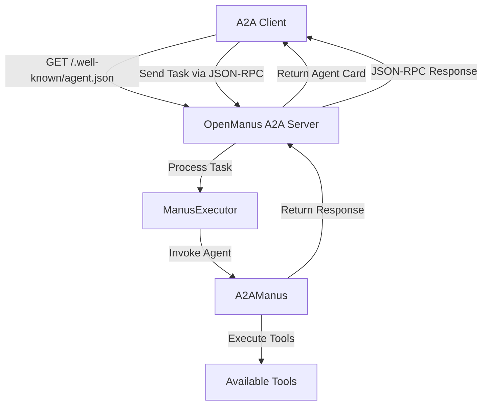
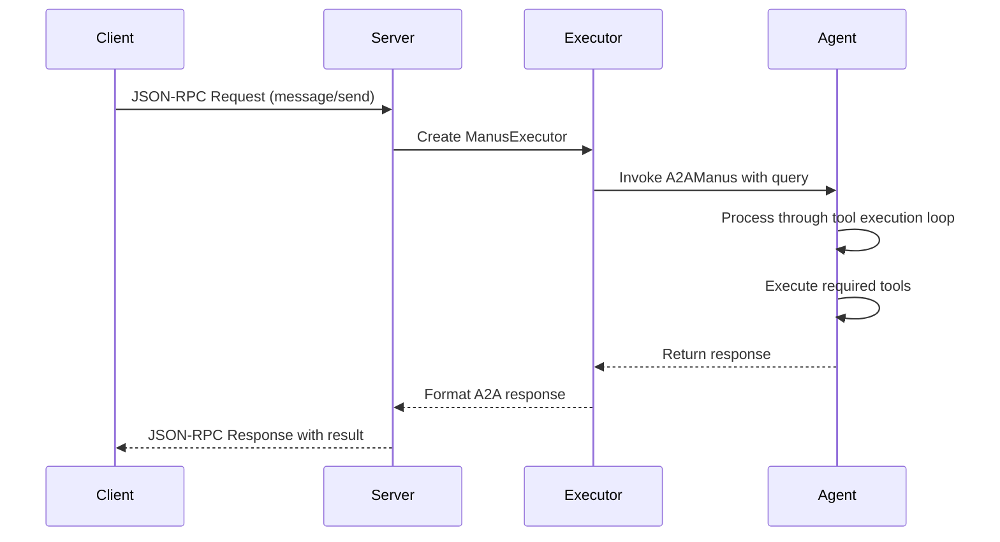
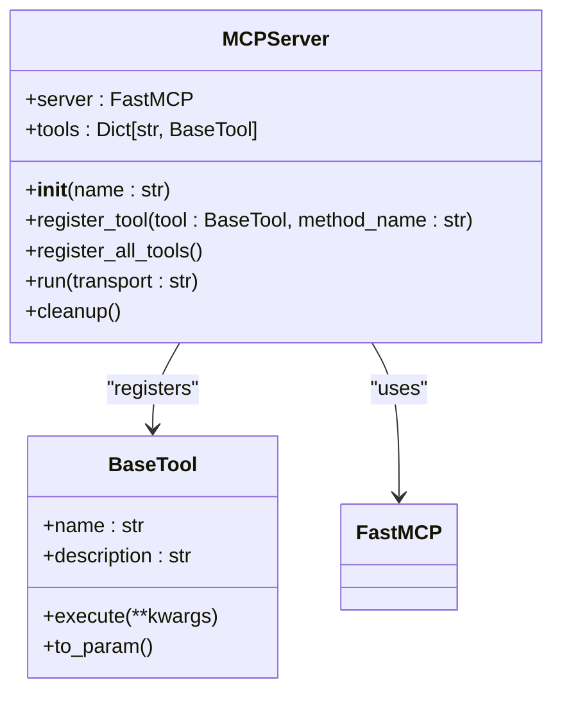
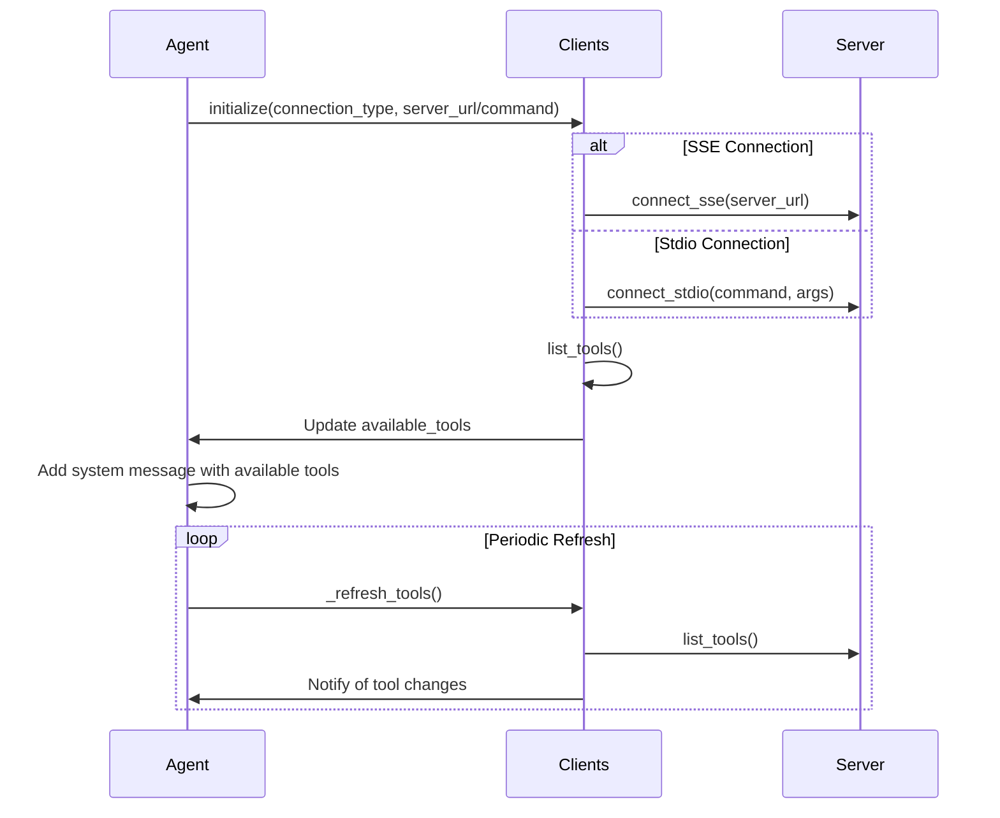

# Protocol Integration

<cite>
**Referenced Files in This Document**   
- [agent.py](file://protocol/a2a/app/agent.py)
- [main.py](file://protocol/a2a/app/main.py)
- [README.md](file://protocol/a2a/app/README.md)
- [server.py](file://app/mcp/server.py)
- [mcp.py](file://app/agent/mcp.py)
- [mcp.example.json](file://config/mcp.example.json)
</cite>

## Table of Contents
1. [Introduction](#introduction)
2. [A2A Protocol Implementation](#a2a-protocol-implementation)
3. [MCP Integration](#mcp-integration)
4. [MCP Server Implementation](#mcp-server-implementation)
5. [Manus Agent and MCP Connection](#manus-agent-and-mcp-connection)
6. [Security and Error Handling](#security-and-error-handling)
7. [Deployment and Testing](#deployment-and-testing)

## Introduction
This document provides comprehensive coverage of protocol integration in OpenManus, focusing on the A2A (Agent-to-Agent) and MCP (Model Context Protocol) implementations. It details how agents expose capabilities through standardized endpoints, handle JSON-RPC messages, execute tasks, and integrate with external tools via different transport mechanisms. The documentation covers both client and server components, providing implementation details, configuration guidance, and operational considerations.

## A2A Protocol Implementation

The A2A protocol implementation in OpenManus enables agent-to-agent communication through standardized endpoints and message formats. The implementation follows the A2A specification with support for non-streaming mode operations.

### Agent Card Endpoint
The agent card endpoint at `/.well-known/agent.json` provides a standardized way for other agents to discover capabilities and metadata about the Manus agent. This endpoint returns a JSON document containing essential information that enables interoperability between agents.

The agent card includes:
- **Name and description**: Identifies the agent and its purpose
- **Version information**: Specifies the agent's version
- **Capabilities**: Indicates supported features like push notifications and streaming
- **Input/output modes**: Defines supported content types
- **Skills**: Lists available tools with descriptions, examples, and tags
- **URL**: Provides the base URL for agent interaction



**Diagram sources**
- [main.py](file://protocol/a2a/app/main.py#L20-L130)
- [agent.py](file://protocol/a2a/app/agent.py#L14-L31)

**Section sources**
- [main.py](file://protocol/a2a/app/main.py#L20-L130)
- [README.md](file://protocol/a2a/app/README.md#L20-L100)

### JSON-RPC Message Handling
The A2A implementation uses JSON-RPC 2.0 for message exchange between agents. The server handles incoming JSON-RPC requests and returns appropriate responses with results, artifacts, and status information.

Key aspects of JSON-RPC handling:
- **Method routing**: The server routes requests to appropriate handlers based on the method field
- **Task execution**: The `message/send` method triggers task processing through the Manus agent
- **Response formatting**: Results are structured according to A2A specifications with artifacts, history, and status
- **Error handling**: Proper JSON-RPC error responses are generated for invalid requests or execution failures

The message flow follows a request-response pattern where the client sends a task and receives a structured response containing the execution result, artifacts, and task status.

**Section sources**
- [main.py](file://protocol/a2a/app/main.py#L50-L130)
- [agent.py](file://protocol/a2a/app/agent.py#L14-L31)

### Task Execution Interface
The task execution interface in OpenManus processes incoming requests through the A2A protocol. When a task is received, the system creates an execution context and processes the request through the Manus agent.

The execution workflow:
1. Receive JSON-RPC request with task details
2. Create execution context with thread ID for session management
3. Invoke the Manus agent with the query
4. Process the agent's response and format it according to A2A specifications
5. Return structured response with results, artifacts, and status

The implementation uses the `A2AManus` class which extends the base `Manus` agent to provide A2A-specific functionality while leveraging the core agent capabilities.



**Diagram sources**
- [main.py](file://protocol/a2a/app/main.py#L50-L130)
- [agent.py](file://protocol/a2a/app/agent.py#L14-L31)

**Section sources**
- [main.py](file://protocol/a2a/app/main.py#L50-L130)
- [agent.py](file://protocol/a2a/app/agent.py#L14-L31)

## MCP Integration

The MCP (Model Context Protocol) integration in OpenManus enables agents to connect to external MCP servers and utilize their tools as if they were local. This integration supports both SSE (Server-Sent Events) and stdio transport methods.

### Client and Server Components
The MCP integration consists of client and server components that work together to enable tool sharing between agents and external services.

**Client Component**: The `MCPAgent` class in `app/agent/mcp.py` handles the client-side of the MCP integration. It manages connections to MCP servers, discovers available tools, and executes tool calls.

**Server Component**: The MCP server implementation in `app/mcp/server.py` exposes local tools to external clients through the MCP protocol.

The integration allows for dynamic tool discovery and execution, where the agent can detect when new tools become available or existing tools are removed from the server.

**Section sources**
- [mcp.py](file://app/agent/mcp.py#L12-L184)
- [server.py](file://app/mcp/server.py#L23-L159)

### Tool Exposure via SSE and stdio
MCP servers in OpenManus can expose their tools through two transport methods: SSE (Server-Sent Events) and stdio (standard input/output).

**SSE Connection**: Uses HTTP Server-Sent Events for bidirectional communication. This method is suitable for web-based deployments and services that need to be accessed over HTTP.

**stdio Connection**: Uses standard input and output streams for communication. This method is suitable for command-line tools and processes that run in the same environment.

The choice of transport method depends on the deployment scenario and requirements for connectivity and security.

```mermaid
graph TD
subgraph "MCP Client"
Agent["MCPAgent"]
Clients["MCPClients"]
end
subgraph "Transport Methods"
SSE["SSE Connection"]
Stdio["Stdio Connection"]
end
subgraph "MCP Server"
Server["MCPServer"]
Tools["Registered Tools"]
end
Agent --> Clients
Clients --> SSE
Clients --> Stdio
SSE < --> Server
Stdio < --> Server
Server --> Tools
style Agent fill:#f9f,stroke:#333
style Server fill:#bbf,stroke:#333
```

**Diagram sources**
- [mcp.py](file://app/agent/mcp.py#L39-L84)
- [server.py](file://app/mcp/server.py#L149-L159)

**Section sources**
- [mcp.py](file://app/agent/mcp.py#L39-L84)
- [server.py](file://app/mcp/server.py#L149-L159)

## MCP Server Implementation

The MCP server implementation in `server.py` provides a framework for exposing tools to external agents through the Model Context Protocol.

### Tool Discovery and Execution
The MCP server handles tool discovery and execution requests from clients. When a client connects to the server, it can discover available tools and execute them through the MCP protocol.

The server implementation includes:
- **Tool registration**: Tools are registered with the server and made available to clients
- **Parameter validation**: Input parameters are validated according to tool specifications
- **Documentation generation**: Docstrings and signatures are generated from tool metadata
- **Execution handling**: Tool calls are executed and results are returned to the client

The `MCPServer` class manages the lifecycle of the server, including tool registration, connection handling, and resource cleanup.



**Diagram sources**
- [server.py](file://app/mcp/server.py#L23-L159)

**Section sources**
- [server.py](file://app/mcp/server.py#L23-L159)

### Server Architecture
The MCP server architecture is designed to be extensible and support multiple transport methods. The core components include:

- **FastMCP**: The underlying MCP framework that handles protocol details
- **Tool registry**: Manages registered tools and their metadata
- **Execution engine**: Handles tool execution and result formatting
- **Transport layer**: Supports different communication methods (stdio, SSE)
- **Cleanup system**: Ensures proper resource cleanup when the server shuts down

The server follows a modular design where tools are registered dynamically, allowing for flexible configuration and extension.

**Section sources**
- [server.py](file://app/mcp/server.py#L23-L159)

## Manus Agent and MCP Connection

The Manus agent integrates with MCP servers to incorporate their tools into its available tool collection, enabling access to external capabilities.

### Connection Process
The Manus agent connects to MCP servers through the `MCPAgent` class, which handles the connection lifecycle and tool integration.

The connection process involves:
1. Initializing the MCP connection with specified transport method
2. Connecting to the MCP server via SSE or stdio
3. Discovering available tools from the server
4. Adding the discovered tools to the agent's available tools collection
5. Maintaining the connection and monitoring for tool changes

The agent periodically refreshes the list of available tools to detect when tools are added, removed, or modified on the server.



**Diagram sources**
- [mcp.py](file://app/agent/mcp.py#L39-L84)
- [mcp.py](file://app/agent/mcp.py#L86-L131)

**Section sources**
- [mcp.py](file://app/agent/mcp.py#L12-L184)

### Tool Integration
When the Manus agent connects to an MCP server, it incorporates the server's tools into its available tool collection. This allows the agent to use remote tools as if they were local.

The integration process:
- Maps MCP server tools to the agent's tool interface
- Maintains a schema of tool parameters for proper validation
- Handles tool execution results and error conditions
- Updates the agent's context with information about available tools

The agent also handles special tools like 'terminate' that can trigger the completion of task execution.

**Section sources**
- [mcp.py](file://app/agent/mcp.py#L12-L184)

## Security and Error Handling

The protocol implementations in OpenManus include security considerations and comprehensive error handling for both A2A and MCP protocols.

### Authentication Methods
The current implementation focuses on basic security patterns, with authentication handled at the deployment level. For production deployments, additional security measures should be implemented, such as:

- API key authentication for endpoint access
- TLS encryption for data in transit
- Rate limiting to prevent abuse
- Input validation to prevent injection attacks

The configuration file `mcp.example.json` shows how MCP servers can be defined with their connection details, which can be extended to include authentication credentials.

**Section sources**
- [mcp.example.json](file://config/mcp.example.json#L1-L9)

### Error Handling
Both protocol implementations include comprehensive error handling to ensure robust operation.

**A2A Error Handling**:
- Validates incoming JSON-RPC requests
- Handles missing or invalid parameters
- Provides appropriate error responses according to the JSON-RPC specification
- Logs errors for debugging and monitoring

**MCP Error Handling**:
- Validates tool parameters before execution
- Handles connection failures to MCP servers
- Manages tool execution errors and timeouts
- Provides graceful degradation when tools are unavailable

The error handling system ensures that failures are properly reported and do not cause the entire system to fail.

**Section sources**
- [main.py](file://protocol/a2a/app/main.py#L100-L130)
- [server.py](file://app/mcp/server.py#L137-L142)
- [mcp.py](file://app/agent/mcp.py#L153-L175)

## Deployment and Testing

This section provides guidance on deploying and testing the protocol endpoints in OpenManus.

### Deployment Instructions
To deploy the A2A server:
1. Activate the OpenManus Python environment
2. Install the A2A SDK: `pip install a2a-sdk==0.2.5`
3. Start the server: `python -m protocol.a2a.app.main`

To deploy the MCP server:
1. Run: `python run_mcp_server.py`
2. The server will start in stdio mode by default

MCP servers can also be configured in the `config.toml` file with SSE or stdio connections.

### Testing Protocol Endpoints
The A2A endpoints can be tested using the official A2A client:

**Test Agent Card**:
```bash
curl http://localhost:10000/.well-known/agent.json
```

**Test Task Execution**:
```bash
curl --location 'http://localhost:10000' \
--header 'Content-Type: application/json' \
--data '{
    "id":130,
    "jsonrpc":"2.0",
    "method": "message/send",
    "params": {
        "message": {
            "messageId": "",
            "role": "user",
            "parts": [{"text":"What is a happy planet?"}]
        }
    }
}'
```

The MCP server can be tested by connecting to it from an MCP client or by using the Manus agent with MCP server configuration.

**Section sources**
- [README.md](file://protocol/a2a/app/README.md#L20-L100)
- [main.py](file://protocol/a2a/app/main.py#L100-L130)
- [server.py](file://app/mcp/server.py#L149-L159)