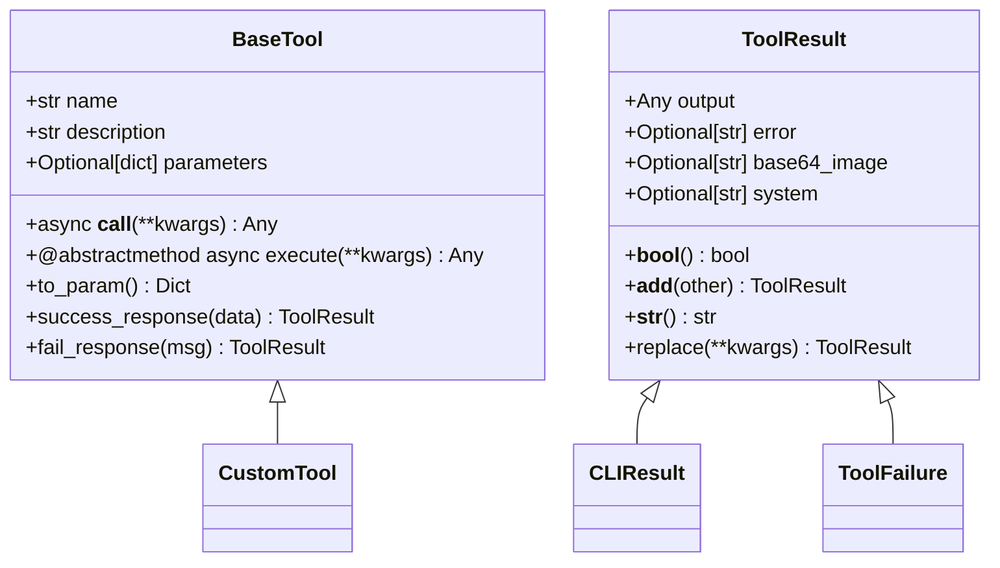
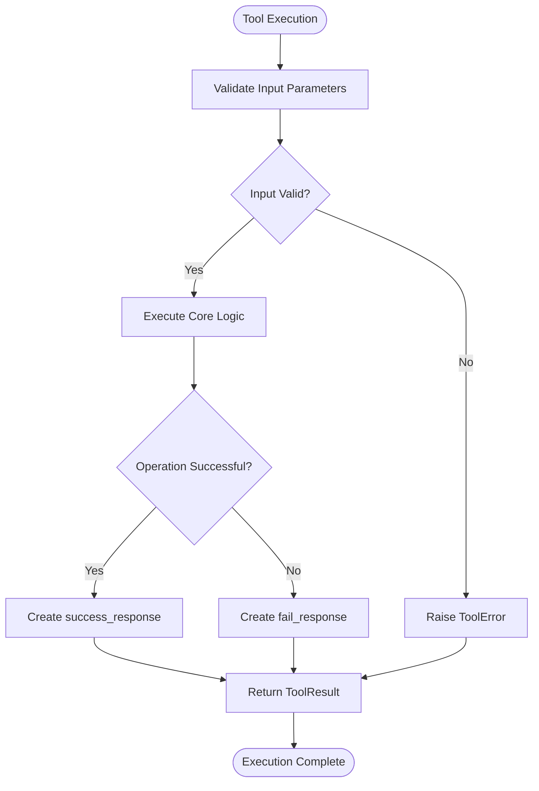

# Custom Tool Development

<cite>
**Referenced Files in This Document**   
- [base.py](file://app/tool/base.py)
- [tool_collection.py](file://app/tool/tool_collection.py)
- [python_execute.py](file://app/tool/python_execute.py)
- [str_replace_editor.py](file://app/tool/str_replace_editor.py)
- [crawl4ai.py](file://app/tool/crawl4ai.py)
</cite>

## Table of Contents
1. [Introduction](#introduction)
2. [Core Components](#core-components)
3. [Tool Schema Definition](#tool-schema-definition)
4. [Execution Implementation Pattern](#execution-implementation-pattern)
5. [Result Handling](#result-handling)
6. [Tool Collection Integration](#tool-collection-integration)
7. [Example Implementations](#example-implementations)
8. [Best Practices](#best-practices)
9. [Testing and Validation](#testing-and-validation)

## Introduction
This document provides comprehensive guidance on creating custom tools in OpenManus by extending the BaseTool class. It covers the essential components, implementation patterns, and integration methods required to develop functional and reliable tools for agent workflows. The documentation details the required attributes, execution patterns, result handling mechanisms, and integration processes necessary for building both simple and complex tools within the OpenManus framework.

## Core Components

The foundation of custom tool development in OpenManus revolves around the BaseTool class and its associated components. The BaseTool class serves as the abstract base class for all tools, providing standardized interfaces for tool execution, parameter validation, and result handling. Key components include the ToolResult class for representing execution outcomes, the ToolCollection class for managing multiple tools, and various helper classes that facilitate specific tool functionalities.

The architecture follows a consistent pattern where each tool extends the BaseTool class and implements the required attributes and methods. This design ensures uniformity across different tools while allowing for specialized functionality through inheritance and method overriding. The system leverages Pydantic models for input validation and data structure definition, ensuring type safety and proper parameter handling.

**Section sources**
- [base.py](file://app/tool/base.py#L77-L172)
- [tool_collection.py](file://app/tool/tool_collection.py#L8-L70)

## Tool Schema Definition

Custom tools in OpenManus require three essential attributes: name, description, and parameters. The name attribute serves as the unique identifier for the tool and must be a string value. The description provides a comprehensive explanation of the tool's purpose and functionality, helping both developers and the LLM understand its intended use.

The parameters attribute is defined using a dictionary that follows the JSON Schema specification, enabling robust input validation through Pydantic models. This dictionary contains properties that define the expected input parameters, including their types, descriptions, and validation rules. Required parameters are specified in the "required" array, while additional constraints like minimum/maximum values, enums, and dependencies can be defined within the schema.



**Diagram sources**
- [base.py](file://app/tool/base.py#L77-L172)

**Section sources**
- [base.py](file://app/tool/base.py#L93-L95)

## Execution Implementation Pattern

The execute method in OpenManus tools follows a consistent async implementation pattern, requiring all custom tools to implement this abstract method. The method accepts keyword arguments (**kwargs) that correspond to the parameters defined in the tool's schema, with Pydantic handling automatic validation and type conversion.

Implementation follows several key principles: proper error handling using try-catch blocks, validation of input parameters before execution, and adherence to the async/await pattern for non-blocking operations. Complex tools may include additional helper methods to organize functionality, while maintaining the primary execution logic within the execute method.

The __call__ method serves as the entry point for tool execution, delegating to the execute method while providing a clean interface for tool invocation. This pattern enables both direct method calls and function-style invocation, maintaining consistency across different usage scenarios.



**Diagram sources**
- [base.py](file://app/tool/base.py#L115-L117)
- [base.py](file://app/tool/base.py#L120-L121)

**Section sources**
- [base.py](file://app/tool/base.py#L120-L121)

## Result Handling

Result handling in OpenManus tools is standardized through the ToolResult class and its associated helper methods. The success_response and fail_response methods provide a consistent interface for creating tool results, ensuring proper formatting and logging. The success_response method accepts either a string or dictionary and returns a ToolResult with the output field populated, while the fail_response method creates a ToolResult with the error field set.

The ToolResult class itself contains four primary fields: output for successful results, error for failure messages, base64_image for image data, and system for system-level messages. These fields enable rich result representation that can be properly interpreted by the agent system. The class also implements several utility methods including __bool__ for truthiness evaluation, __add__ for combining results, and replace for creating modified copies.

```mermaid
classDiagram
class ToolResult {
+Any output
+Optional[str] error
+Optional[str] base64_image
+Optional[str] system
+__bool__() bool
+__add__(other) ToolResult
+__str__() str
+replace(**kwargs) ToolResult
}
class CLIResult {
}
class ToolFailure {
}
ToolResult <|-- CLIResult
ToolResult <|-- ToolFailure
ToolResult <|-- CustomResult
note right of ToolResult
Base class for all tool results
Implements field combination and
string representation
end note
note right of CLIResult
Specialized result type for
command-line interface output
end note
note right of ToolFailure
Result type specifically for
representing tool failures
end note
```

**Diagram sources**
- [base.py](file://app/tool/base.py#L37-L74)
- [base.py](file://app/tool/base.py#L146-L160)
- [base.py](file://app/tool/base.py#L162-L172)

**Section sources**
- [base.py](file://app/tool/base.py#L37-L74)

## Tool Collection Integration

Integration of custom tools into the OpenManus system occurs through the ToolCollection class, which manages tool registration and execution. Tools are added to the collection using the add_tool or add_tools methods, which handle name conflicts by skipping duplicate tools and logging warnings. The tool_map dictionary maintains a name-to-tool mapping for efficient lookup during execution.

The ToolCollection provides several key methods for tool management: execute for running a specific tool by name, execute_all for running all tools in sequence, get_tool for retrieving a tool by name, and to_params for converting all tools to their parameter representation for LLM function calling. This collection pattern enables dynamic tool management and facilitates the integration of new tools into existing agent workflows.

```mermaid
classDiagram
class ToolCollection {
+tuple tools
+dict tool_map
+__init__(*tools)
+__iter__()
+to_params() List[Dict]
+async execute(name, tool_input) ToolResult
+async execute_all() List[ToolResult]
+get_tool(name) BaseTool
+add_tool(tool) ToolCollection
+add_tools(*tools) ToolCollection
}
class BaseTool {
+str name
+str description
+dict parameters
+async execute(**kwargs) Any
}
ToolCollection "1" *-- "0..*" BaseTool : contains
ToolCollection ..> BaseTool : executes
ToolCollection ..> ToolResult : returns
note right of ToolCollection
Manages collection of tools
Provides execution interface
Handles tool registration
end note
```

**Diagram sources**
- [tool_collection.py](file://app/tool/tool_collection.py#L8-L70)

**Section sources**
- [tool_collection.py](file://app/tool/tool_collection.py#L8-L70)

## Example Implementations

### Simple Tool Example: System Time Retrieval
A simple tool implementation demonstrates the basic pattern of extending BaseTool. The tool would define its name, description, and empty parameters dictionary (as it requires no input). The execute method would retrieve the current system time and return it through the success_response method. This example illustrates the minimal requirements for a functional tool.

### Complex Tool Example: API Integration
A more complex example involves creating a tool that integrates with external APIs, such as the Crawl4aiTool. This tool defines multiple parameters including URLs, timeout settings, and caching options. The execute method handles URL validation, async API calls, response processing, and error handling. It demonstrates advanced patterns like input normalization, external library integration, and comprehensive result formatting.

The str_replace_editor tool provides another complex example, showcasing stateful operations with file history tracking, multiple command handling, and sandbox environment integration. This tool demonstrates how to manage complex logic with helper methods while maintaining a clean execute method interface.

**Section sources**
- [python_execute.py](file://app/tool/python_execute.py#L8-L74)
- [str_replace_editor.py](file://app/tool/str_replace_editor.py#L59-L431)
- [crawl4ai.py](file://app/tool/crawl4ai.py#L15-L268)

## Best Practices

When developing custom tools for OpenManus, several best practices should be followed to ensure reliability and maintainability. Comprehensive error handling is essential, with specific error messages that help diagnose issues. Input validation should be thorough, leveraging Pydantic's capabilities to ensure data integrity before processing.

Logging should be implemented at appropriate levels, with debug messages for operational details and error messages for exceptional conditions. Security considerations include input sanitization, rate limiting for external calls, and proper handling of sensitive data. Performance optimization involves efficient algorithm implementation and appropriate use of async operations to prevent blocking.

Documentation within the tool code should be comprehensive, with clear docstrings for methods and comments explaining complex logic. The description attribute should provide sufficient detail for the LLM to understand the tool's purpose and proper usage patterns.

**Section sources**
- [base.py](file://app/tool/base.py#L77-L172)
- [tool_collection.py](file://app/tool/tool_collection.py#L8-L70)

## Testing and Validation

Testing custom tools requires a comprehensive approach that includes unit tests for individual methods, integration tests for the complete execution flow, and validation of the tool schema. Unit tests should cover both success and failure cases, verifying that the tool handles edge cases and invalid inputs appropriately.

Integration with agent workflows should be tested to ensure proper communication between the tool and the agent system. This includes verifying that tool results are properly interpreted and that the agent can make appropriate decisions based on tool outputs. Schema validation should be tested to confirm that the parameters dictionary correctly defines the expected inputs and that Pydantic validation works as expected.

Validation also extends to the tool's impact on the overall system, ensuring that it doesn't introduce performance bottlenecks or stability issues. Monitoring and logging should be verified to ensure that tool execution is properly tracked and that issues can be diagnosed from log output.

**Section sources**
- [python_execute.py](file://app/tool/python_execute.py#L8-L74)
- [str_replace_editor.py](file://app/tool/str_replace_editor.py#L59-L431)