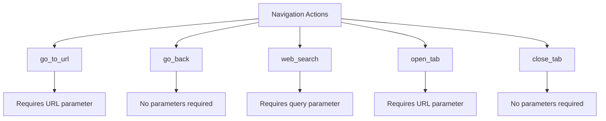
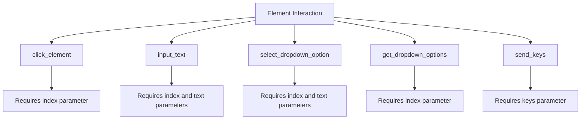
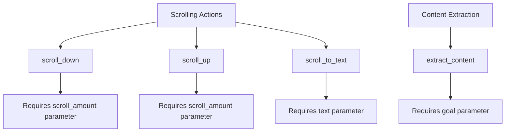
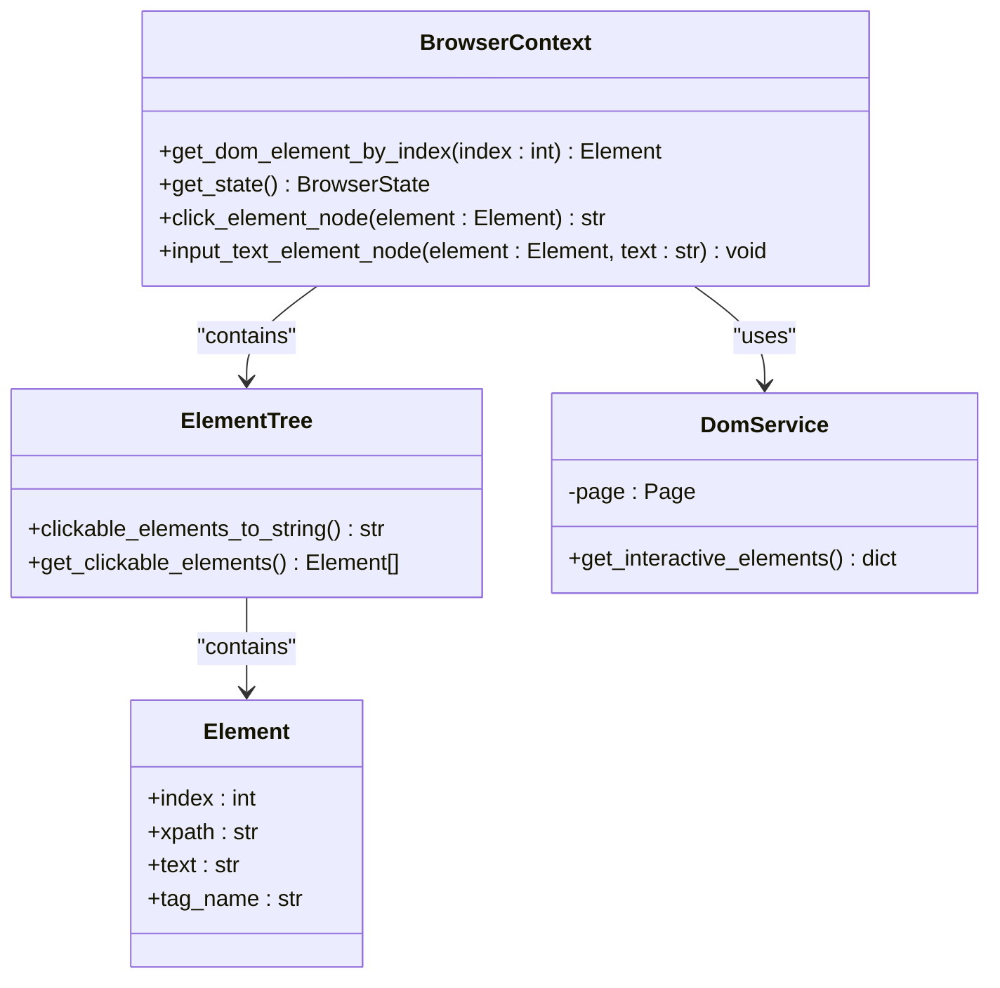
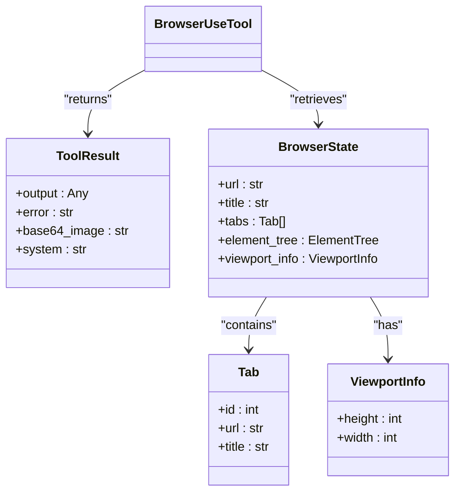
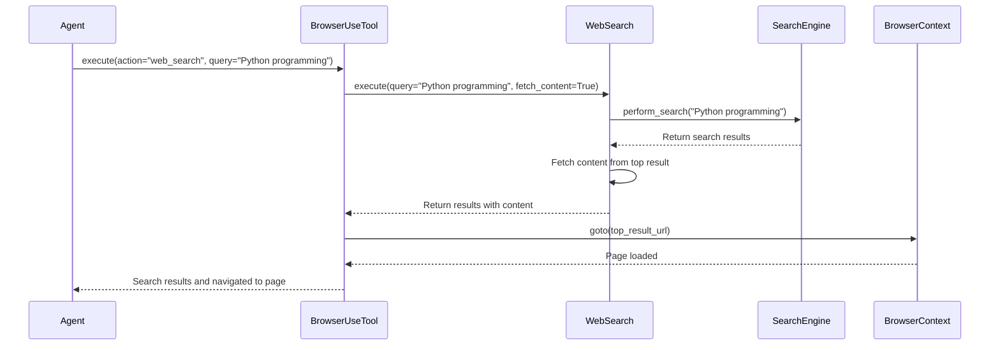
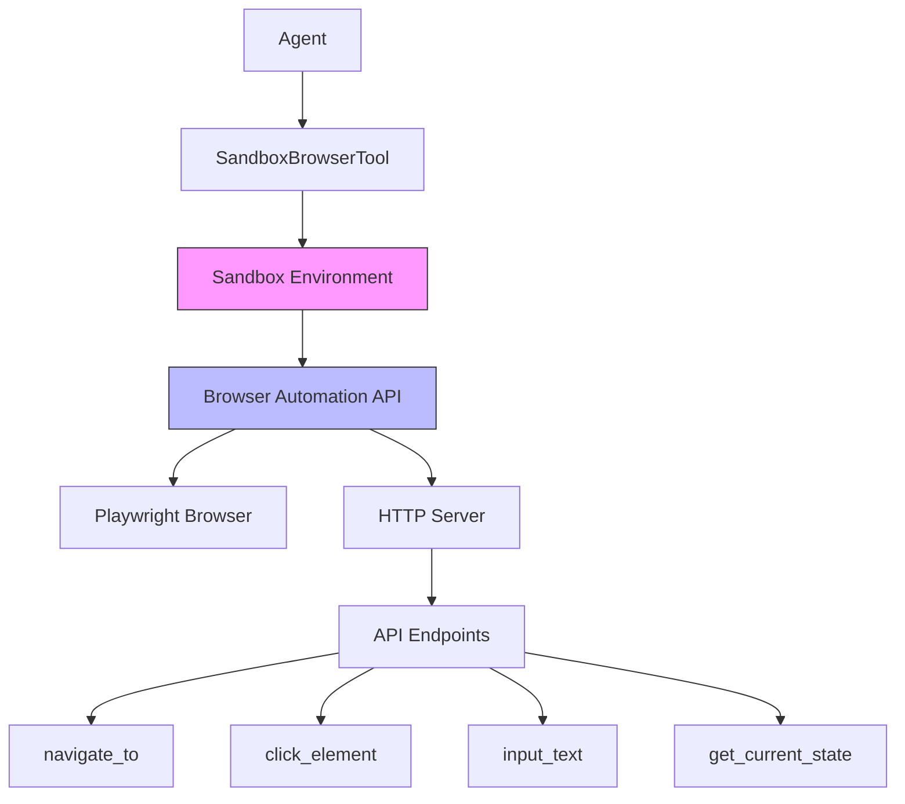
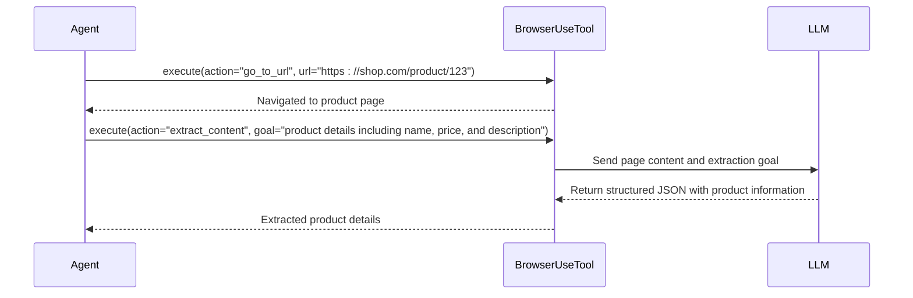
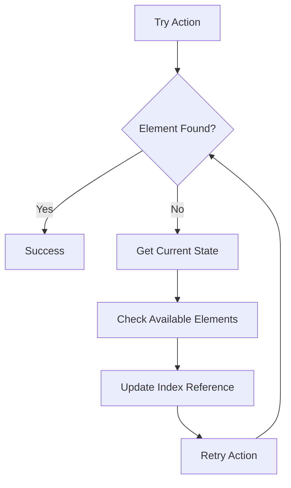

# Browser Automation

<cite>
**Referenced Files in This Document**   
- [browser_use_tool.py](file://app/tool/browser_use_tool.py)
- [sb_browser_tool.py](file://app/tool/sandbox/sb_browser_tool.py)
- [web_search.py](file://app/tool/web_search.py)
- [browser.py](file://app/agent/browser.py)
- [base.py](file://app/tool/base.py)
</cite>

## Table of Contents
1. [Introduction](#introduction)
2. [Core Components](#core-components)
3. [Action Types and Parameters](#action-types-and-parameters)
4. [DOM Element Indexing System](#dom-element-indexing-system)
5. [State Management and Screenshot Integration](#state-management-and-screenshot-integration)
6. [Web Search Integration](#web-search-integration)
7. [Sandboxed Browser Implementation](#sandboxed-browser-implementation)
8. [Practical Examples](#practical-examples)
9. [Troubleshooting Guide](#troubleshooting-guide)

## Introduction
OpenManus provides a comprehensive browser automation framework powered by Playwright, enabling agents to interact with web pages through a rich set of actions. The system supports navigation, element interaction, tab management, content extraction, and integration with web search functionality. Two primary implementations exist: the standard `BrowserUseTool` for direct browser control and the `SandboxBrowserTool` for isolated execution environments. The tools maintain persistent browser state across calls and provide screenshot integration for visual feedback.

## Core Components

The browser automation system is built around several key components that work together to enable web interaction. The `BrowserUseTool` class serves as the primary interface for browser operations, inheriting from `BaseTool` and implementing various actions through its execute method. This tool manages browser context, handles DOM interactions through `DomService`, and integrates with web search capabilities. The state management system captures current browser information including URL, title, tabs, and interactive elements, while also providing screenshot capabilities.

The architecture follows a layered approach where high-level actions are translated into Playwright operations, with proper error handling and resource cleanup. The tool ensures thread safety through asyncio locks and properly cleans up resources when destroyed. Integration with the agent system allows for seamless incorporation into automated workflows.

**Section sources**
- [browser_use_tool.py](file://app/tool/browser_use_tool.py#L38-L566)
- [base.py](file://app/tool/base.py#L77-L172)
- [browser.py](file://app/agent/browser.py#L104-L106)

## Action Types and Parameters

### Navigation Actions
The browser automation tool supports several navigation actions that allow movement between web pages:



**Diagram sources**
- [browser_use_tool.py](file://app/tool/browser_use_tool.py#L38-L566)

The `go_to_url` action navigates to a specified URL, while `go_back` returns to the previous page in history. The `web_search` action combines search functionality with navigation by first performing a web search and then navigating to the top result. Tab management actions allow opening new tabs with `open_tab` and closing the current tab with `close_tab`.

### Element Interaction Actions
Element interaction is facilitated through a variety of actions that target DOM elements by their numerical index:



**Diagram sources**
- [browser_use_tool.py](file://app/tool/browser_use_tool.py#L38-L566)

The `click_element` action simulates a mouse click on an element identified by its index. `input_text` allows typing text into form fields, while dropdown interactions are handled through `get_dropdown_options` (which retrieves available options) and `select_dropdown_option` (which selects a specific option by text). The `send_keys` action sends keyboard input to the active element.

### Scrolling and Content Extraction
Scrolling actions enable navigation through page content, while content extraction allows retrieving information from web pages:



**Diagram sources**
- [browser_use_tool.py](file://app/tool/browser_use_tool.py#L38-L566)

Scrolling can be performed by pixel amount using `scroll_down` and `scroll_up`, or by text content with `scroll_to_text` which locates and scrolls to specific text on the page. The `extract_content` action uses an LLM to analyze page content and extract information relevant to a specified goal, returning structured data in JSON format.

**Section sources**
- [browser_use_tool.py](file://app/tool/browser_use_tool.py#L38-L566)

## DOM Element Indexing System

The DOM element indexing system provides a numerical interface for interacting with webpage elements, translating visual elements into actionable indices. When the browser state is retrieved, interactive elements are assigned sequential indices that correspond to their position in the DOM tree. This system enables precise interaction with webpage components without requiring knowledge of CSS selectors or XPath expressions.

The indexing is dynamically generated based on the current page content and viewport, with elements ordered according to their visual layout. Clickable elements such as links, buttons, and form controls are prioritized in the indexing process. The system maintains consistency across consecutive state requests, allowing agents to reference the same elements throughout a browsing session.



**Diagram sources**
- [browser_use_tool.py](file://app/tool/browser_use_tool.py#L38-L566)

The indexing system is implemented through the `BrowserContext` class, which maintains the current state of the browser and provides methods for retrieving elements by index. The `DomService` class handles the extraction of interactive elements from the page, converting them into a format that can be easily consumed by the automation system. When an action requires element interaction, the index is used to retrieve the corresponding DOM element, which is then used to perform the requested operation.

**Section sources**
- [browser_use_tool.py](file://app/tool/browser_use_tool.py#L38-L566)

## State Management and Screenshot Integration

The state management system captures comprehensive information about the current browser session, providing agents with context for decision-making. The `get_current_state` method returns a structured representation of the browser state, including the current URL, page title, tab information, and details about interactive elements on the page.



**Diagram sources**
- [browser_use_tool.py](file://app/tool/browser_use_tool.py#L478-L538)
- [base.py](file://app/tool/base.py#L37-L74)

A key feature of the state management system is integrated screenshot capture. When retrieving the current state, the tool automatically takes a full-page screenshot and encodes it as base64 data, which is included in the `ToolResult`. This visual feedback allows agents to understand the current page layout and make informed decisions about subsequent actions. The screenshot is captured with animations disabled and at full quality to ensure clarity.

The state information also includes scroll position data, indicating how much content is available above and below the current viewport. This helps agents determine when scrolling is necessary to access additional content. The interactive elements are presented as a formatted string with corresponding indices, making it easy for agents to identify and interact with specific page components.

**Section sources**
- [browser_use_tool.py](file://app/tool/browser_use_tool.py#L478-L538)
- [browser.py](file://app/agent/browser.py#L52-L78)

## Web Search Integration

The browser automation system integrates with web search functionality through the `WebSearch` tool, enabling agents to find and navigate to relevant information. The `web_search` action combines search capabilities with browser navigation, allowing agents to discover new content and automatically visit the most relevant results.



**Diagram sources**
- [browser_use_tool.py](file://app/tool/browser_use_tool.py#L38-L566)
- [web_search.py](file://app/tool/web_search.py#L155-L407)

The integration works by first executing a web search using the configured search engines (Google, Baidu, DuckDuckGo, or Bing). The search system supports multiple engines with configurable fallback order, ensuring reliability even if the primary engine fails. Search results include titles, URLs, descriptions, and optionally the full content of the pages. When the `web_search` action is called, the browser automatically navigates to the first search result, allowing seamless transition from information discovery to content exploration.

The search functionality includes robust error handling with retry mechanisms and configurable timeouts. Results can be filtered by language and country, and the number of results returned can be specified. Content fetching is optional but recommended when detailed information is needed, as it allows the agent to analyze the actual page content rather than just the search snippet.

**Section sources**
- [browser_use_tool.py](file://app/tool/browser_use_tool.py#L38-L566)
- [web_search.py](file://app/tool/web_search.py#L155-L407)

## Sandboxed Browser Implementation

The sandboxed browser implementation provides an isolated execution environment for browser automation tasks, enhancing security and resource management. The `SandboxBrowserTool` operates within a Daytona sandbox environment, communicating with the browser service through HTTP API calls rather than direct Playwright integration.



**Diagram sources**
- [sb_browser_tool.py](file://app/tool/sandbox/sb_browser_tool.py#L38-L450)

The sandboxed implementation uses curl commands to interact with the browser automation API, which runs on localhost:8003. Each browser action is translated into an HTTP request to the corresponding API endpoint. The tool includes comprehensive validation of base64-encoded screenshots to ensure image integrity and prevent potential security issues. The sandbox environment isolates browser operations from the main application, preventing potential crashes or security vulnerabilities from affecting the core system.

Key differences from the standard implementation include:
- HTTP-based communication instead of direct Playwright integration
- Additional validation of image data
- Integration with sandbox session management
- Different parameter names (e.g., "navigate_to" instead of "go_to_url")
- Coordinate-based actions like "click_coordinates" and "drag_drop"

The sandboxed tool maintains state through `ThreadMessage` objects, which store the current browser state including screenshots. This allows the agent to maintain context across multiple interactions while benefiting from the isolation and security of the sandbox environment.

**Section sources**
- [sb_browser_tool.py](file://app/tool/sandbox/sb_browser_tool.py#L38-L450)

## Practical Examples

### Automating Complex Web Workflows
Complex web workflows can be automated by combining multiple actions in sequence. For example, booking a flight might involve searching for flights, selecting options, filling out passenger information, and completing payment:

```mermaid
flowchart TD
A[Start] --> B[go_to_url: "https://flight-booking.com"]
B --> C[input_text: index=5, text="New York"]
C --> D[input_text: index=6, text="London"]
D --> E[click_element: index=7]
E --> F[wait: seconds=5]
F --> G[click_element: index=12]
G --> H[input_text: index=18, text="John Doe"]
H --> I[input_text: index=19, text="4111111111111111"]
I --> J[click_element: index=25]
J --> K[extract_content: goal="confirmation number"]
K --> L[End]
```

**Diagram sources**
- [browser_use_tool.py](file://app/tool/browser_use_tool.py#L38-L566)

### Extracting Structured Data
The content extraction capability can be used to gather structured information from web pages. For example, extracting product information from an e-commerce site:



**Diagram sources**
- [browser_use_tool.py](file://app/tool/browser_use_tool.py#L38-L566)

### Handling Dynamic Content
Dynamic content that loads asynchronously can be handled by combining navigation, waiting, and scrolling actions:

```mermaid
flowchart TD
A[Start] --> B[go_to_url: "https://news-site.com"]
B --> C[scroll_down: scroll_amount=1000]
C --> D[wait: seconds=3]
D --> E[scroll_down: scroll_amount=1000]
E --> F[wait: seconds=3]
F --> G[extract_content: goal="latest news headlines"]
G --> H[End]
```

**Diagram sources**
- [browser_use_tool.py](file://app/tool/browser_use_tool.py#L38-L566)

**Section sources**
- [browser_use_tool.py](file://app/tool/browser_use_tool.py#L38-L566)

## Troubleshooting Guide

### Element Not Found Errors
Element not found errors occur when an action references an index that doesn't correspond to any interactive element on the current page. This can happen due to:

- Page content changes after navigation
- Dynamic content that hasn't fully loaded
- Incorrect index values from outdated state information

To resolve these issues:
1. Always retrieve the current browser state before attempting element interactions
2. Verify that the desired element is within the current viewport
3. Use `wait` actions to allow time for dynamic content to load
4. Implement retry logic with updated state information



**Diagram sources**
- [browser_use_tool.py](file://app/tool/browser_use_tool.py#L38-L566)

### Timeout Failures
Timeout failures can occur when pages take longer to load than expected or when network conditions are poor. Prevention strategies include:

- Increasing wait times for known slow pages
- Using conditional waits based on element presence rather than fixed durations
- Implementing retry mechanisms with exponential backoff
- Checking network connectivity before initiating navigation

### Navigation Problems
Navigation issues may arise from:
- Invalid URLs
- Network connectivity problems
- Redirect loops
- JavaScript-based navigation that doesn't trigger page load events

Solutions include:
- Validating URLs before navigation
- Implementing fallback URLs
- Using `wait` actions after navigation to ensure page stability
- Combining navigation with content verification to confirm successful loading

**Section sources**
- [browser_use_tool.py](file://app/tool/browser_use_tool.py#L38-L566)
- [base.py](file://app/tool/base.py#L37-L74)