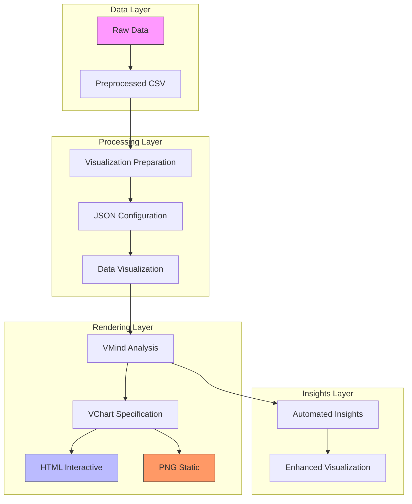
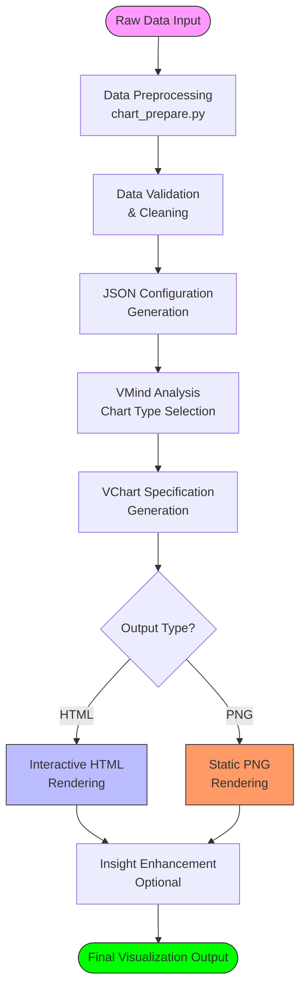
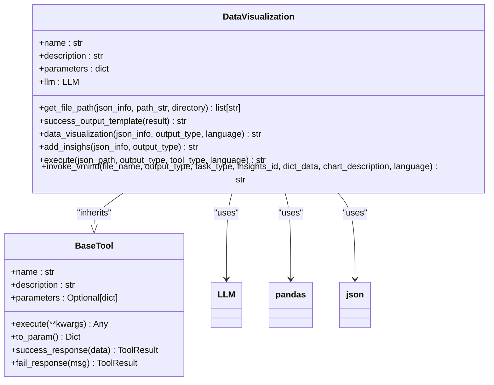
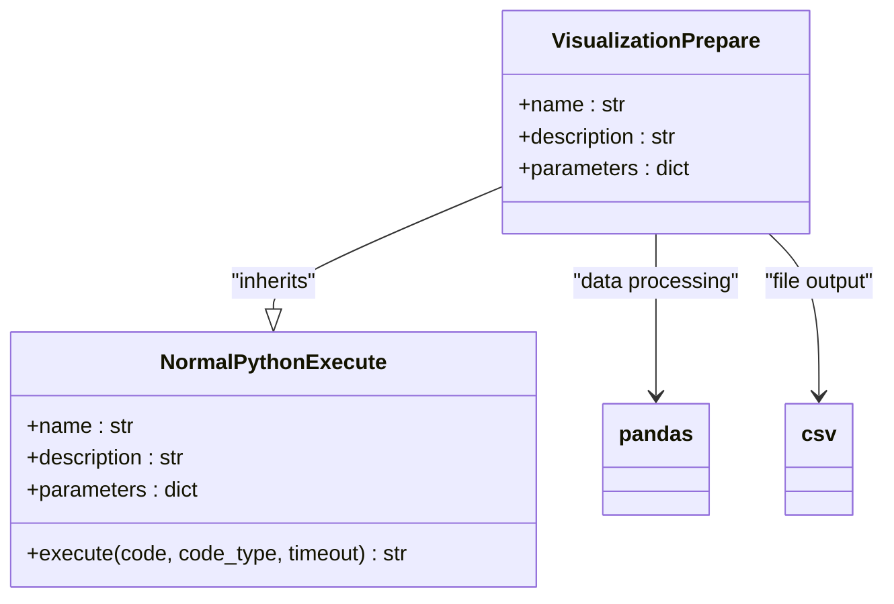
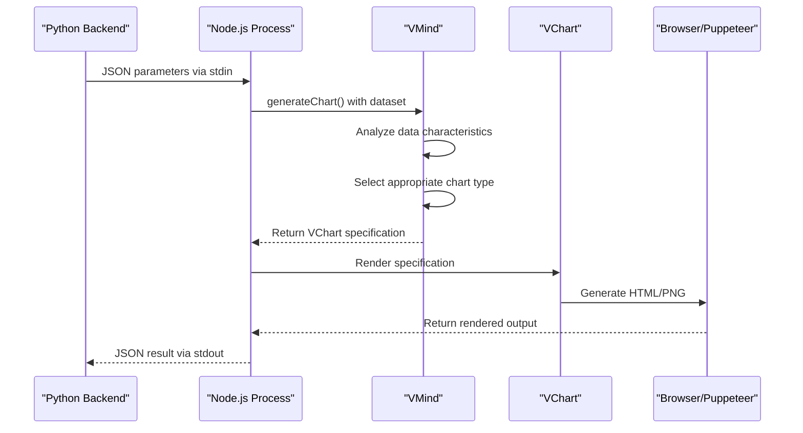
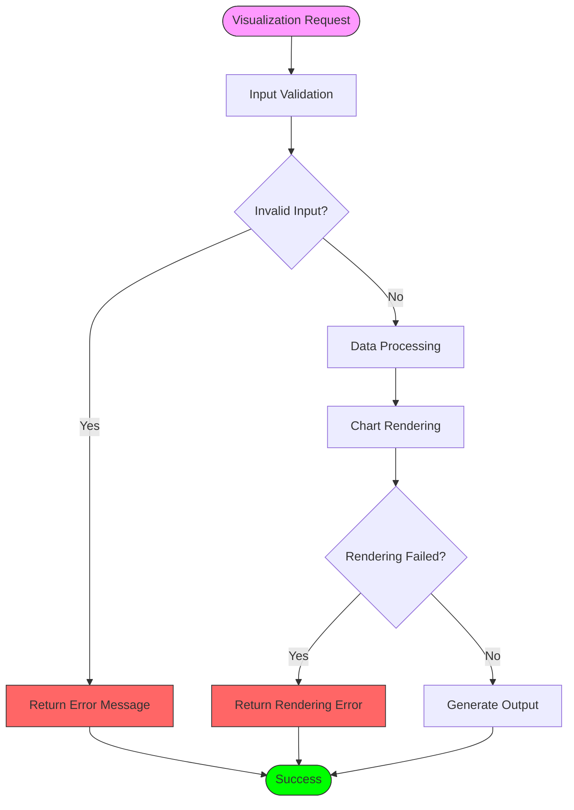

# Data Visualization

<cite>
**Referenced Files in This Document**   
- [data_visualization.py](file://app/tool/chart_visualization/data_visualization.py)
- [chart_prepare.py](file://app/tool/chart_visualization/chart_prepare.py)
- [chartVisualize.ts](file://app/tool/chart_visualization/src/chartVisualize.ts)
- [README.md](file://app/tool/chart_visualization/README.md)
- [package.json](file://app/tool/chart_visualization/package.json)
- [tsconfig.json](file://app/tool/chart_visualization/tsconfig.json)
</cite>

## Table of Contents
1. [Introduction](#introduction)
2. [Architecture Overview](#architecture-overview)
3. [Workflow from Raw Data to Visualization](#workflow-from-raw-data-to-visualization)
4. [Core Components Analysis](#core-components-analysis)
5. [Configuration Options and Interactivity](#configuration-options-and-interactivity)
6. [Practical Examples](#practical-examples)
7. [Error Handling and Performance](#error-handling-and-performance)
8. [Best Practices](#best-practices)

## Introduction

The OpenManus data visualization system provides a comprehensive solution for transforming raw data into meaningful visual representations through the chart_visualization suite. This system integrates VMind/VChart technologies to create interactive visualizations that enhance data understanding and support decision-making processes. The architecture follows a modular approach with distinct components handling data preprocessing, chart generation, and rendering. The system supports multiple output formats including interactive HTML and static PNG images, with configurable language options for internationalization. The visualization pipeline is designed to automatically select appropriate chart types based on data characteristics, providing both automated insights and customizable visualization options.

**Section sources**
- [README.md](file://app/tool/chart_visualization/README.md#L1-L50)

## Architecture Overview

The data visualization architecture consists of a multi-layered system that processes data from ingestion to final rendering. The workflow begins with Python-based data preprocessing, transitions to TypeScript-based visualization generation, and concludes with browser-based rendering through VChart. The system leverages VMind as an intelligent layer that analyzes data characteristics and generates appropriate chart specifications.

**Diagram sources**
- [data_visualization.py](file://app/tool/chart_visualization/data_visualization.py#L1-L50)
- [chartVisualize.ts](file://app/tool/chart_visualization/src/chartVisualize.ts#L1-L50)

**Section sources**
- [data_visualization.py](file://app/tool/chart_visualization/data_visualization.py#L1-L50)
- [chartVisualize.ts](file://app/tool/chart_visualization/src/chartVisualize.ts#L1-L50)

## Workflow from Raw Data to Visualization

The visualization workflow follows a structured process from raw data to final visualization output. The system begins with data preprocessing through the chart_prepare.py module, which extracts relevant data and generates configuration metadata. This metadata is then processed by the data_visualization.py implementation, which orchestrates the visualization pipeline. The core workflow involves several sequential steps:

1. **Data Preparation**: Raw data is processed and transformed into clean CSV format with appropriate metadata
2. **Configuration Generation**: JSON configuration files are created containing data paths and visualization requirements
3. **Chart Specification Generation**: VMind analyzes the data and generates VChart specifications
4. **Rendering**: VChart renders the final visualization in the requested format
5. **Insight Enhancement**: Optional data insights are added to enrich the visualization

The workflow is designed to handle both simple visualizations and complex analytical scenarios, with support for iterative refinement and insight addition.

**Diagram sources**
- [chart_prepare.py](file://app/tool/chart_visualization/chart_prepare.py#L1-L37)
- [data_visualization.py](file://app/tool/chart_visualization/data_visualization.py#L1-L50)
- [chartVisualize.ts](file://app/tool/chart_visualization/src/chartVisualize.ts#L1-L50)

**Section sources**
- [chart_prepare.py](file://app/tool/chart_visualization/chart_prepare.py#L1-L37)
- [data_visualization.py](file://app/tool/chart_visualization/data_visualization.py#L1-L50)

## Core Components Analysis

### Data Visualization Implementation

The data_visualization.py module serves as the central orchestrator of the visualization pipeline. It implements the DataVisualization class that inherits from BaseTool, providing a standardized interface for visualization operations. The module handles the execution flow, error management, and integration with external systems.

**Diagram sources**
- [data_visualization.py](file://app/tool/chart_visualization/data_visualization.py#L14-L262)

**Section sources**
- [data_visualization.py](file://app/tool/chart_visualization/data_visualization.py#L14-L262)

### Chart Preparation Module

The chart_prepare.py module implements the VisualizationPrepare class responsible for data preprocessing and format conversion. This component transforms raw data into the structured format required for visualization, handling data cleaning, transformation, and metadata generation.

**Diagram sources**
- [chart_prepare.py](file://app/tool/chart_visualization/chart_prepare.py#L3-L37)

**Section sources**
- [chart_prepare.py](file://app/tool/chart_visualization/chart_prepare.py#L3-L37)

### TypeScript Visualization Implementation

The chartVisualize.ts file contains the TypeScript implementation that renders interactive charts in the user interface. This component serves as the bridge between the Python backend and the VChart rendering engine, handling the final visualization generation and output.

**Diagram sources**
- [chartVisualize.ts](file://app/tool/chart_visualization/src/chartVisualize.ts#L323-L371)

**Section sources**
- [chartVisualize.ts](file://app/tool/chart_visualization/src/chartVisualize.ts#L323-L371)

## Configuration Options and Interactivity

The visualization system provides extensive configuration options for customizing chart appearance, interactivity, and output formats. These options are exposed through the tool parameters and can be controlled programmatically.

### Configuration Parameters

| Parameter | Type | Default | Options | Description |
|---------|------|---------|---------|-------------|
| json_path | string | - | .json file path | Path to configuration file containing visualization metadata |
| output_type | string | html | png, html | Rendering format (html for interactive, png for static) |
| tool_type | string | visualization | visualization, insight | Purpose of operation (generate chart or add insights) |
| language | string | en | en, zh | Language for labels and insights (English or Chinese) |

The system supports automatic chart type selection based on data characteristics, with VMind analyzing the dataset to determine the most appropriate visualization method. For time series data, line charts are typically selected, while categorical data often results in bar charts or pie charts. The system also supports more complex chart types like scatter plots, dual-axis charts, and flow diagrams based on the data structure and relationships.

Interactivity features are available in the HTML output format, allowing users to explore data through hover effects, zooming, and filtering. The system also supports insight annotations that highlight key patterns and anomalies in the data.

**Section sources**
- [data_visualization.py](file://app/tool/chart_visualization/data_visualization.py#L22-L49)
- [README.md](file://app/tool/chart_visualization/README.md#L100-L130)

## Practical Examples

The visualization system supports various data types and analytical scenarios. Practical examples include:

### Statistical Data Visualization
For statistical data such as product sales distribution or monthly revenue trends, the system generates appropriate charts based on the data characteristics. The visualization_preparation tool extracts the relevant data and creates a JSON configuration with the chart title and data path.

### Time Series Analysis
Time series data like monthly revenue trends or daily temperature changes are automatically detected and visualized using line charts or area charts. The system can identify temporal patterns and highlight trends, seasonality, and anomalies.

### Categorical Data Representation
Categorical data such as product categories, customer segments, or survey responses are visualized using bar charts, pie charts, or donut charts. The system automatically selects the most appropriate chart type based on the number of categories and their distribution.

The test suite includes examples of various chart types including bar charts, line charts, scatter plots, dual-axis charts, and flow diagrams, demonstrating the system's versatility in handling different data visualization needs.

**Section sources**
- [README.md](file://app/tool/chart_visualization/README.md#L130-L146)
- [chart_demo.py](file://app/tool/chart_visualization/test/chart_demo.py#L1-L200)

## Error Handling and Performance

The visualization system implements comprehensive error handling and performance optimization strategies to address common issues that may arise during the visualization process.

### Error Handling

The system handles various error scenarios including:
- **Incompatible data formats**: The system validates data structure and provides meaningful error messages when data cannot be processed
- **Rendering failures**: Errors during chart rendering are caught and reported with diagnostic information
- **File access issues**: The system checks file paths and permissions before attempting to read or write files

Error handling is implemented at multiple levels, with specific error messages returned for different failure scenarios. The data_visualization.py module includes comprehensive try-catch blocks and error reporting mechanisms.

### Performance Considerations

For large datasets, the system implements several performance optimizations:
- **Data sampling**: For very large datasets, the system may sample data to maintain responsive visualization
- **Asynchronous processing**: The visualization pipeline uses async/await patterns to prevent blocking operations
- **Memory management**: Data is processed in chunks when possible to minimize memory usage

The system also includes timeout mechanisms and resource monitoring to prevent excessive resource consumption during visualization operations.

**Diagram sources**
- [data_visualization.py](file://app/tool/chart_visualization/data_visualization.py#L216-L262)
- [chartVisualize.ts](file://app/tool/chart_visualization/src/chartVisualize.ts#L171-L285)

**Section sources**
- [data_visualization.py](file://app/tool/chart_visualization/data_visualization.py#L216-L262)
- [chartVisualize.ts](file://app/tool/chart_visualization/src/chartVisualize.ts#L171-L285)

## Best Practices

To create effective visualizations that enhance data understanding and support decision-making, follow these best practices:

1. **Data Preparation**: Ensure data is clean and properly formatted before visualization. Remove duplicates, handle missing values, and validate data types.
2. **Appropriate Chart Selection**: Choose chart types that accurately represent the data relationships. Use line charts for time series, bar charts for comparisons, and scatter plots for correlations.
3. **Clear Labeling**: Use descriptive titles, axis labels, and legends to make visualizations self-explanatory.
4. **Color Usage**: Use color purposefully to highlight important information, but avoid excessive color that can distract from the data.
5. **Interactive Elements**: Leverage HTML output format for interactive features when users need to explore data in depth.
6. **Performance Optimization**: For large datasets, consider data sampling or aggregation to maintain responsive visualizations.
7. **Insight Integration**: Use the insight enhancement feature to highlight key patterns, trends, and anomalies in the data.
8. **Accessibility**: Ensure visualizations are accessible to all users, including those with color vision deficiencies.

Following these best practices will result in visualizations that effectively communicate insights and support data-driven decision-making.

**Section sources**
- [README.md](file://app/tool/chart_visualization/README.md#L1-L146)
- [data_visualization.py](file://app/tool/chart_visualization/data_visualization.py#L1-L262)