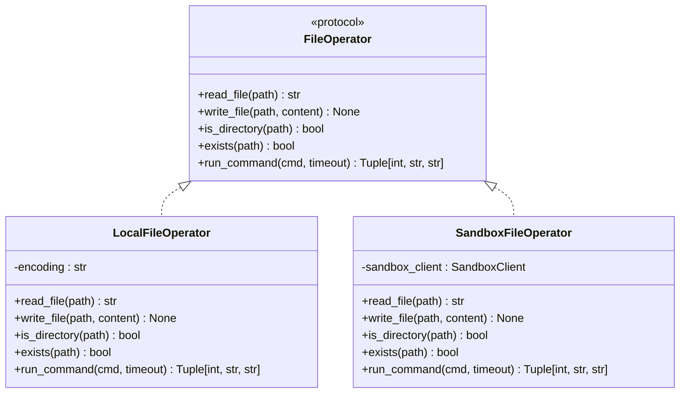
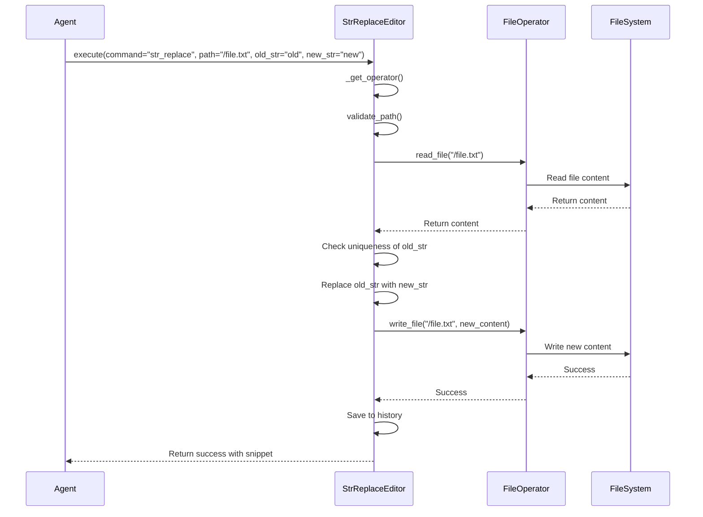
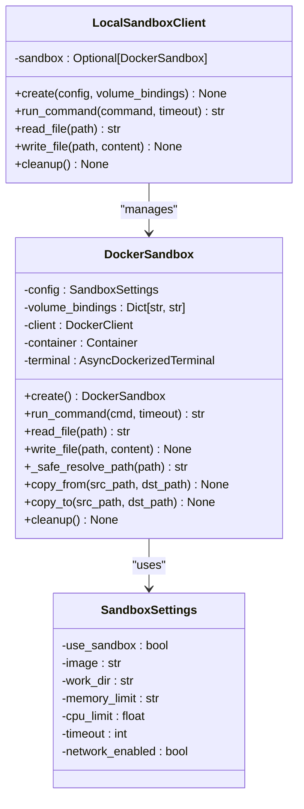
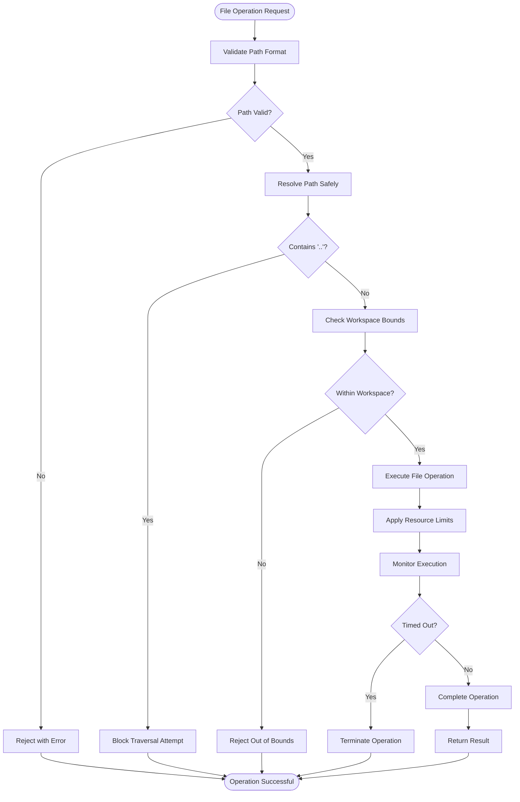
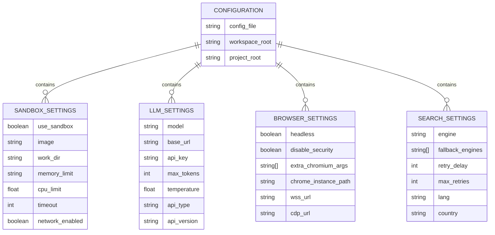

# File Operations

<cite>
**Referenced Files in This Document**   
- [file_operators.py](file://app/tool/file_operators.py)
- [str_replace_editor.py](file://app/tool/str_replace_editor.py)
- [sandbox.py](file://app/sandbox/core/sandbox.py)
- [client.py](file://app/sandbox/client.py)
- [config.py](file://app/config.py)
- [sb_files_tool.py](file://app/tool/sandbox/sb_files_tool.py)
- [files_utils.py](file://app/utils/files_utils.py)
</cite>

## Table of Contents
1. [Introduction](#introduction)
2. [File Operators Implementation](#file-operators-implementation)
3. [Str Replace Editor Tool](#str-replace-editor-tool)
4. [Sandboxed File Operations](#sandboxed-file-operations)
5. [Safe File Handling Practices](#safe-file-handling-practices)
6. [Configuration Options](#configuration-options)
7. [Practical Examples](#practical-examples)
8. [Common Issues and Solutions](#common-issues-and-solutions)
9. [Performance Considerations](#performance-considerations)
10. [Conclusion](#conclusion)

## Introduction
OpenManus provides a comprehensive file operation system that enables agents to interact with the filesystem through various tools and interfaces. The system is designed with security, reliability, and flexibility in mind, offering both local and sandboxed execution environments. This documentation covers the implementation of file operation tools, focusing on the file_operators module, str_replace_editor tool, and sandboxed file operations. The architecture ensures safe file handling practices while providing robust functionality for reading, writing, creating, and managing files.

**Section sources**
- [file_operators.py](file://app/tool/file_operators.py#L1-L158)
- [str_replace_editor.py](file://app/tool/str_replace_editor.py#L1-L433)
- [sandbox.py](file://app/sandbox/core/sandbox.py#L1-L463)

## File Operators Implementation

The file_operators module provides a unified interface for file operations across different execution environments. It implements the FileOperator protocol that defines the core file operations: reading, writing, checking directory status, existence verification, and command execution. The module supports two implementations: LocalFileOperator for direct filesystem access and SandboxFileOperator for containerized operations.

The LocalFileOperator uses Python's pathlib module to perform file operations with UTF-8 encoding by default. It handles exceptions gracefully, converting them into ToolError instances with descriptive messages. For command execution, it uses asyncio to run shell commands asynchronously, capturing both stdout and stderr while implementing timeout protection.

The SandboxFileOperator routes operations through a Docker-based sandbox environment, ensuring isolation and security. It uses the SANDBOX_CLIENT to communicate with the sandbox container, translating file operations into container-executed commands. Path validation is performed through shell commands like "test -d" and "test -e" to check directory status and file existence within the container environment.

**Diagram sources**
- [file_operators.py](file://app/tool/file_operators.py#L15-L158)

**Section sources**
- [file_operators.py](file://app/tool/file_operators.py#L15-L158)

## Str Replace Editor Tool

The str_replace_editor tool provides a comprehensive interface for viewing, creating, and editing files with support for both local and sandboxed execution. It implements the BaseTool interface and offers multiple commands: view, create, str_replace, insert, and undo_edit. The tool maintains edit history for each file, enabling the undo_edit functionality that reverts to previous file states.

The tool's execute method first determines the appropriate file operator based on the current configuration (sandbox vs. local), then validates the path and command combination before executing the requested operation. Path validation ensures that only absolute paths are accepted and verifies file existence for non-create operations. The tool also prevents overwriting existing files with the create command, requiring explicit replacement operations.

For file viewing, the tool supports both full file display and range-based viewing with line numbers. When viewing directories, it uses the find command to list contents up to two levels deep while excluding hidden items. The output is formatted with line numbers using the _make_output method, which also handles content truncation when files exceed the maximum response length.

**Diagram sources**
- [str_replace_editor.py](file://app/tool/str_replace_editor.py#L59-L431)

**Section sources**
- [str_replace_editor.py](file://app/tool/str_replace_editor.py#L59-L431)

## Sandboxed File Operations

The sandboxed file operations implementation provides isolated file access within Docker containers, ensuring security and resource control. The DockerSandbox class manages the container lifecycle, creating isolated environments with configurable resource limits for memory, CPU, and execution time. Each sandbox runs in a dedicated container with a unique name prefixed with "sandbox_" followed by a random hexadecimal identifier.

File operations within the sandbox are performed through tar archive manipulation. Reading a file involves retrieving a tar archive from the container using get_archive, then extracting the content from the tar stream. Writing a file requires creating a tar archive containing the file data and uploading it to the container using put_archive. This approach ensures atomic operations and proper file permissions management.

The sandbox implementation includes comprehensive cleanup procedures to release resources when the sandbox is destroyed. The cleanup method stops and removes the container, closes the terminal connection, and handles any errors that occur during the cleanup process. The async context manager interface (__aenter__ and __aexit__) allows for proper resource management using async with statements.

**Diagram sources**
- [sandbox.py](file://app/sandbox/core/sandbox.py#L17-L461)
- [client.py](file://app/sandbox/client.py#L85-L188)

**Section sources**
- [sandbox.py](file://app/sandbox/core/sandbox.py#L17-L461)
- [client.py](file://app/sandbox/client.py#L0-L201)

## Safe File Handling Practices

The system implements multiple layers of security to prevent directory traversal attacks and unauthorized access. The _safe_resolve_path method in DockerSandbox explicitly checks for ".." in path components, raising a ValueError if potential traversal patterns are detected. Paths are resolved relative to the configured work_dir (/workspace by default), ensuring all operations remain within the designated workspace.

File operations are further protected by the use of absolute paths only. The str_replace_editor's validate_path method enforces this requirement, rejecting any non-absolute paths. This prevents relative path attacks that could potentially escape the intended directory structure. Additionally, the system uses container isolation to provide a strong boundary between the host system and file operations.

The implementation also includes protection against resource exhaustion attacks. The sandbox configuration allows setting memory limits (e.g., "512m") and CPU limits (e.g., 1.0) to prevent individual operations from consuming excessive resources. Command execution timeouts (default 300 seconds) prevent long-running or infinite operations from blocking system resources.

**Diagram sources**
- [sandbox.py](file://app/sandbox/core/sandbox.py#L231-L252)
- [str_replace_editor.py](file://app/tool/str_replace_editor.py#L165-L193)

**Section sources**
- [sandbox.py](file://app/sandbox/core/sandbox.py#L231-L252)
- [str_replace_editor.py](file://app/tool/str_replace_editor.py#L165-L193)

## Configuration Options

The file operation system provides extensive configuration options through the config.py module and TOML configuration files. The SandboxSettings class defines configurable parameters including use_sandbox (boolean flag), image (container image), work_dir (working directory), memory_limit (e.g., "512m"), cpu_limit (e.g., 1.0), timeout (execution timeout in seconds), and network_enabled (network access control).

Configuration can be set through the config.example.toml file, which provides commented examples for various settings. The system loads configuration from config.toml if it exists, falling back to config.example.toml. This allows users to customize the environment without modifying the example file. The configuration supports multiple LLM providers, browser settings, search engines, and MCP (Model Context Protocol) servers.

File size limits and allowed directories are controlled through the files_utils.py module, which defines EXCLUDED_FILES, EXCLUDED_DIRS, and EXCLUDED_EXT constants. These lists specify files, directories, and extensions that should be excluded from operations. The should_exclude_file function checks against these lists to prevent operations on excluded items, while the clean_path function normalizes paths relative to the workspace.

**Diagram sources**
- [config.py](file://app/config.py#L277-L372)
- [config.example.toml](file://config/config.example.toml#L1-L106)
- [files_utils.py](file://app/utils/files_utils.py#L1-L88)

**Section sources**
- [config.py](file://app/config.py#L277-L372)
- [config.example.toml](file://config/config.example.toml#L1-L106)
- [files_utils.py](file://app/utils/files_utils.py#L1-L88)

## Practical Examples

The file operation tools can be used for various practical scenarios including editing configuration files, creating reports, and managing project files. For editing configuration files, the str_replace command can modify specific settings while preserving the overall structure. For example, changing a database connection string in a config file by replacing the old connection string with a new one, ensuring the replacement is unique to avoid unintended modifications.

Creating reports involves using the create command to generate new files with structured content. The tool can create Markdown reports, JSON data files, or HTML documents by providing the complete content in the file_text parameter. Project file management includes creating new source files, updating existing code, and organizing directory structures through a series of file operations.

The view command with range parameters allows focused inspection of specific file sections, which is particularly useful for large files. By specifying a line range like [100, 150], users can examine a particular code section without loading the entire file content. The insert command enables adding content at specific line numbers, useful for modifying code structure or adding comments.

**Section sources**
- [str_replace_editor.py](file://app/tool/str_replace_editor.py#L195-L281)
- [sb_files_tool.py](file://app/tool/sandbox/sb_files_tool.py#L27-L66)

## Common Issues and Solutions

Common issues in file operations include file not found errors, permission denied exceptions, and encoding problems. File not found errors typically occur when specifying incorrect paths or attempting to read non-existent files. The solution is to verify the absolute path and ensure the file exists before reading, using the exists command to check file existence.

Permission denied exceptions may occur when attempting to write to protected directories or files without proper permissions. In the sandbox environment, file permissions can be explicitly set using the permissions parameter in file creation operations. For local operations, ensuring the process has appropriate filesystem permissions is essential.

Encoding problems can arise when handling files with non-UTF-8 encodings. The system uses UTF-8 encoding by default, which covers most use cases. For files with different encodings, preprocessing may be required before operations. Binary files are automatically excluded from text operations through the should_exclude_file function, preventing encoding errors when attempting to process non-text files.

**Section sources**
- [file_operators.py](file://app/tool/file_operators.py#L165-L193)
- [files_utils.py](file://app/utils/files_utils.py#L1-L88)

## Performance Considerations

When handling large files, performance considerations include memory usage, processing time, and network transfer overhead. The system implements content truncation through the maybe_truncate function, which limits response length to MAX_RESPONSE_LEN (16000 characters by default) and appends a truncation notice. This prevents excessive memory consumption when dealing with very large files.

For atomic file operations, the system uses the container's filesystem operations which are inherently atomic for single file operations. When multiple related changes are needed, the edit history in str_replace_editor allows for rollback if needed. The sandbox environment provides isolation that prevents partial writes from affecting the host system.

Performance is further optimized through asynchronous operations using asyncio, allowing non-blocking file operations. Command execution timeouts prevent long-running operations from consuming resources indefinitely. The system also minimizes data transfer by only retrieving necessary file portions and using efficient tar archive operations for file transfers between host and container.

**Section sources**
- [str_replace_editor.py](file://app/tool/str_replace_editor.py#L59-L431)
- [sandbox.py](file://app/sandbox/core/sandbox.py#L1-L463)

## Conclusion

The OpenManus file operation system provides a robust, secure, and flexible framework for agent interaction with the filesystem. Through the combination of local and sandboxed execution environments, comprehensive tooling, and strict security practices, the system enables powerful file manipulation capabilities while maintaining safety and reliability. The modular design allows for easy extension and customization, making it suitable for a wide range of applications from simple file editing to complex project management tasks.