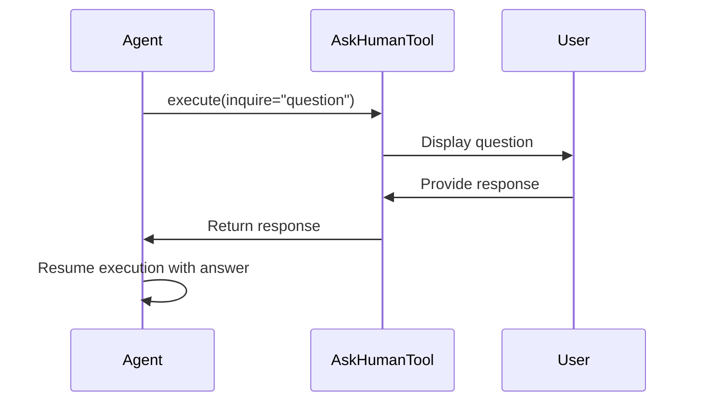
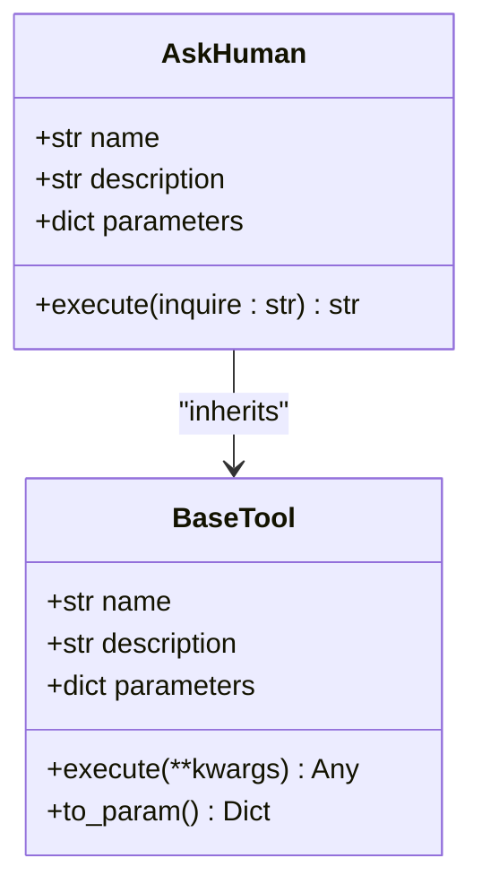

# Human Interaction

<cite>
**Referenced Files in This Document**   
- [ask_human.py](file://app/tool/ask_human.py)
- [base.py](file://app/tool/base.py)
- [manus.py](file://app/agent/manus.py)
- [sandbox_agent.py](file://app/agent/sandbox_agent.py)
- [main.py](file://protocol/a2a/app/main.py)
</cite>

## Table of Contents
1. [Introduction](#introduction)
2. [Core Components](#core-components)
3. [Architecture Overview](#architecture-overview)
4. [Detailed Component Analysis](#detailed-component-analysis)
5. [Integration with Agent Memory](#integration-with-agent-memory)
6. [Configuration Options](#configuration-options)
7. [Practical Examples](#practical-examples)
8. [Common Issues and Solutions](#common-issues-and-solutions)
9. [Best Practices](#best-practices)
10. [Conclusion](#conclusion)

## Introduction
OpenManus provides human interaction capabilities through the ask_human tool, enabling agents to request input from users during task execution. This documentation details the implementation of the AskHumanTool class and its integration within the agent framework. The system allows agents to pause execution, present questions to users, and resume workflows with provided answers, creating a hybrid automation-human collaboration model. This capability is essential for handling ambiguous decisions, verifying critical actions, and obtaining subjective information that cannot be determined algorithmically.

## Core Components

The human interaction functionality in OpenManus is centered around the AskHuman tool implementation. This tool enables agents to request input from users during task execution, creating a feedback loop between automated processes and human oversight. The implementation follows a clean, extensible design pattern consistent with the overall tool architecture in the system.

**Section sources**
- [ask_human.py](file://app/tool/ask_human.py#L1-L21)

## Architecture Overview

The human interaction system in OpenManus follows a modular architecture where the AskHuman tool integrates with the agent's execution flow. When an agent determines that human input is needed, it invokes the ask_human tool with a specific inquiry. The tool temporarily halts the agent's execution and presents the question to the user through the interface. Once the user provides a response, the tool returns this input to the agent, which then resumes its workflow with the newly acquired information.

**Diagram sources**
- [ask_human.py](file://app/tool/ask_human.py#L1-L21)
- [manus.py](file://app/agent/manus.py#L1-L165)

## Detailed Component Analysis

### AskHuman Tool Implementation
The AskHuman class extends the BaseTool class and implements the core functionality for requesting human input. The tool is designed with a simple yet effective interface that requires only an inquiry parameter, making it easy for agents to use when they need human assistance.

#### Class Structure and Parameters
The AskHuman tool is defined with specific metadata that describes its purpose and usage parameters. The tool's schema specifies that it requires an "inquire" parameter containing the question to be asked of the human user. This structured approach ensures consistent usage across different agents and contexts.

**Diagram sources**
- [ask_human.py](file://app/tool/ask_human.py#L1-L21)
- [base.py](file://app/tool/base.py#L1-L181)

#### Execution Mechanism
The execution mechanism of the AskHuman tool involves pausing the agent's workflow and soliciting input from the user. The tool formats the inquiry with a clear prompt indicating that the bot is asking a question and waits for the user to provide a response. This synchronous interaction ensures that the agent receives the necessary information before proceeding with subsequent steps.

**Section sources**
- [ask_human.py](file://app/tool/ask_human.py#L1-L21)

## Integration with Agent Memory

The human interaction system maintains context across interaction points by integrating with the agent's memory system. When a question is asked and answered, both the inquiry and the response are stored in the agent's memory, preserving the conversation history. This allows the agent to reference previous human inputs when making future decisions, maintaining continuity throughout the task execution process.

The memory integration follows the same pattern as other tool interactions, with messages being added to the agent's memory store with appropriate roles (assistant for the question, user for the response). This consistent approach ensures that human interactions are treated as first-class citizens within the agent's cognitive process, on par with other information sources.

**Section sources**
- [manus.py](file://app/agent/manus.py#L1-L165)
- [base.py](file://app/agent/base.py#L1-L196)

## Configuration Options

While the current implementation of the AskHuman tool provides basic functionality, it can be extended with various configuration options to support different interaction modes. Potential configuration parameters include timeout durations for user responses, default response options for unresponsive users, and message formatting options to customize how questions are presented to users.

The tool's design allows for easy extension of these configuration options without modifying the core execution logic. Configuration could be implemented through additional parameters in the tool's schema or through agent-level settings that control the behavior of all human interactions.

**Section sources**
- [ask_human.py](file://app/tool/ask_human.py#L1-L21)
- [manus.py](file://app/agent/manus.py#L1-L165)

## Practical Examples

### Ambiguous Decision Resolution
When faced with ambiguous decisions that require subjective judgment, agents can use the ask_human tool to request guidance. For example, when determining the most relevant search results or evaluating the quality of generated content, the agent can present options to the user and incorporate their preferences into the decision-making process.

### Critical Action Verification
Before executing critical actions such as file modifications, system changes, or financial transactions, agents can use human verification to prevent unintended consequences. The ask_human tool allows the agent to confirm the user's intent, ensuring that potentially destructive operations are performed only with explicit approval.

### Subjective Information Gathering
For tasks that require subjective information such as personal preferences, emotional context, or cultural nuances, the ask_human tool provides a direct channel for obtaining this information. This capability enables agents to personalize their responses and adapt their behavior based on user-specific factors that cannot be inferred from available data.

**Section sources**
- [main.py](file://protocol/a2a/app/main.py#L1-L131)
- [ask_human.py](file://app/tool/ask_human.py#L1-L21)

## Common Issues and Solutions

### User Unresponsiveness
In cases where users do not respond to inquiries, the system could implement timeout handling to prevent agents from waiting indefinitely. After a configurable period, the agent could either proceed with a default action, escalate the request, or terminate the task with an appropriate status.

### Unclear Questions
To address the issue of unclear questions, the system could implement validation mechanisms that ensure inquiries are specific and actionable. Agents could be trained to provide context with their questions and to format them in a way that makes it easy for users to understand and respond appropriately.

### Context Loss
To prevent context loss during human interactions, the system maintains a complete history of the conversation in the agent's memory. This ensures that both the agent and the user can reference previous exchanges when needed, maintaining continuity throughout the interaction.

**Section sources**
- [ask_human.py](file://app/tool/ask_human.py#L1-L21)
- [manus.py](file://app/agent/manus.py#L1-L165)

## Best Practices

When designing human interaction points, it is important to balance automation with necessary human oversight. Interactions should be used judiciously, only when the value of human input outweighs the cost of interrupting the automated workflow. Questions should be clear, specific, and provide sufficient context to enable informed responses.

Agents should be designed to minimize the frequency of human interactions by leveraging available information and making reasonable assumptions when possible. When human input is required, the system should provide clear explanations of why the input is needed and how it will be used, building trust and transparency in the agent-user relationship.

**Section sources**
- [ask_human.py](file://app/tool/ask_human.py#L1-L21)
- [main.py](file://protocol/a2a/app/main.py#L1-L131)

## Conclusion
The ask_human tool in OpenManus provides a robust mechanism for integrating human input into automated workflows. By enabling agents to request assistance when needed, the system creates a collaborative intelligence model that combines the efficiency of automation with the judgment and creativity of human users. The clean implementation and seamless integration with the agent framework make it easy to use this capability across different applications and domains.