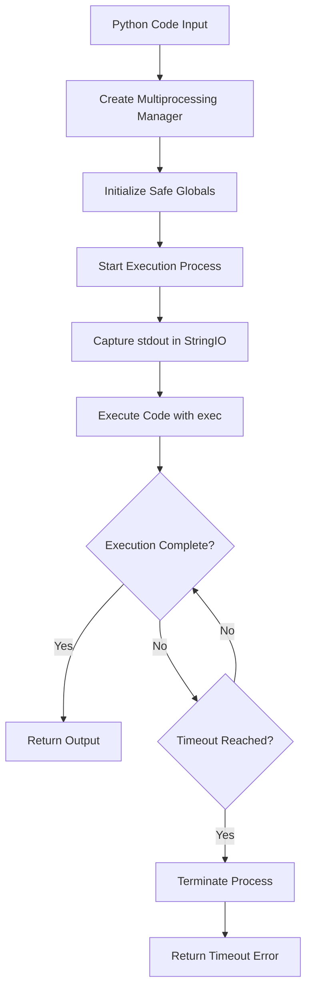
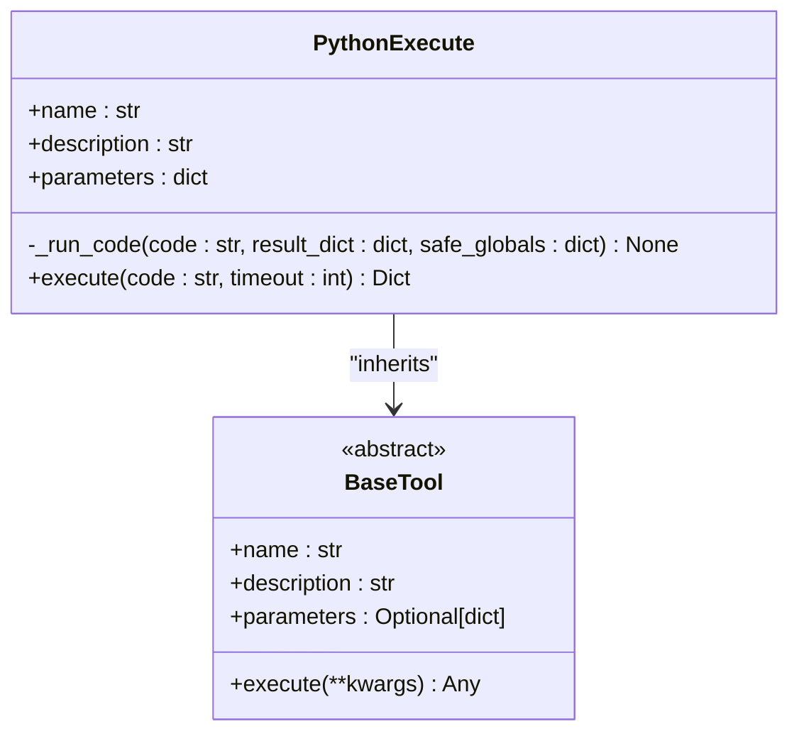
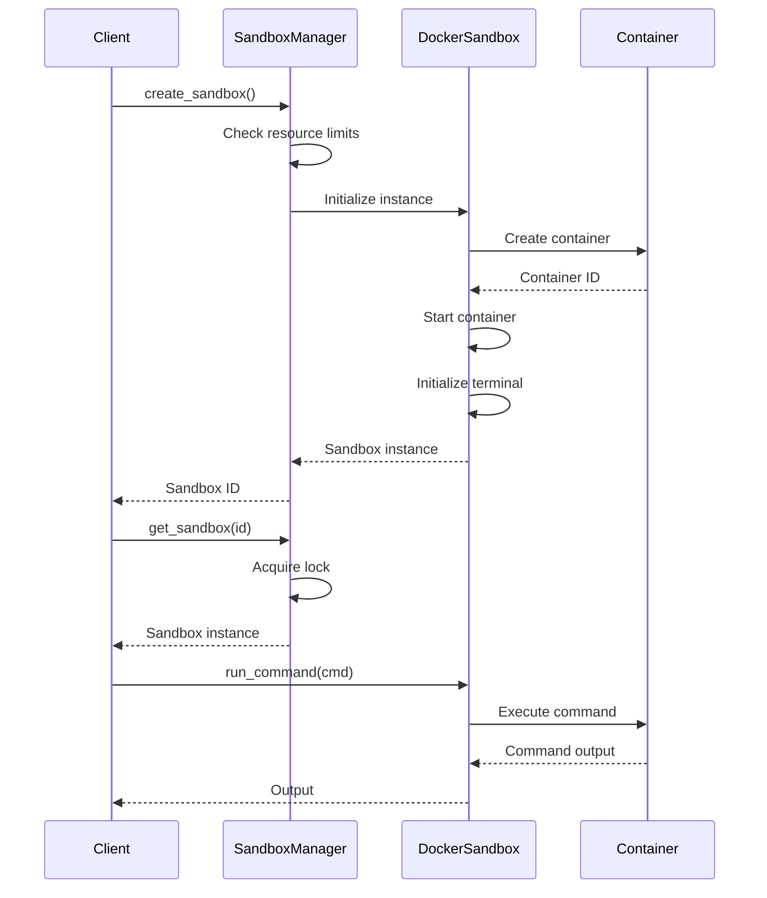
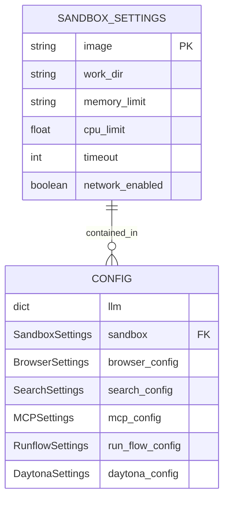

# Python Execution

<cite>
**Referenced Files in This Document**   
- [app/tool/python_execute.py](file://app/tool/python_execute.py)
- [app/tool/chart_visualization/python_execute.py](file://app/tool/chart_visualization/python_execute.py)
- [app/tool/chart_visualization/chart_prepare.py](file://app/tool/chart_visualization/chart_prepare.py)
- [app/tool/chart_visualization/data_visualization.py](file://app/tool/chart_visualization/data_visualization.py)
- [app/sandbox/core/sandbox.py](file://app/sandbox/core/sandbox.py)
- [app/sandbox/core/manager.py](file://app/sandbox/core/manager.py)
- [app/config.py](file://app/config.py)
</cite>

## Table of Contents
1. [Introduction](#introduction)
2. [Core Execution Model](#core-execution-model)
3. [PythonExecuteTool Implementation](#pythonexecutetool-implementation)
4. [Sandboxed Execution Environment](#sandboxed-execution-environment)
5. [Chart Visualization Integration](#chart-visualization-integration)
6. [Configuration Options](#configuration-options)
7. [Practical Examples](#practical-examples)
8. [Troubleshooting Guide](#troubleshooting-guide)
9. [Performance Considerations](#performance-considerations)
10. [Best Practices](#best-practices)

## Introduction
OpenManus provides a secure and isolated environment for executing Python code through its Python execution tools. The system supports both standard and sandboxed execution environments, enabling safe code execution for data analysis, mathematical computations, and visualization workflows. This documentation details the secure code execution model, implementation details, integration with visualization components, and practical usage guidance.

## Core Execution Model

OpenManus implements a secure code execution model using multiprocessing to isolate Python code execution and prevent resource exhaustion. The execution environment captures output and handles errors while maintaining system stability.



**Diagram sources**
- [app/tool/python_execute.py](file://app/tool/python_execute.py#L4-L75)

**Section sources**
- [app/tool/python_execute.py](file://app/tool/python_execute.py#L4-L75)

## PythonExecuteTool Implementation

The PythonExecuteTool class provides a secure mechanism for executing Python code with comprehensive validation, output capturing, and error handling. The implementation uses multiprocessing to isolate execution and prevent potential system impacts.

### Code Validation and Execution
The tool validates input parameters and executes code in a restricted environment with limited built-in functions. Code execution occurs in a separate process to ensure isolation from the main application.

### Output Capturing
The implementation captures all stdout output using StringIO, allowing complete capture of print statements and other output during execution. This ensures that all results are visible to the calling application.

### Error Handling
Comprehensive error handling captures any exceptions during code execution and returns detailed error messages without exposing sensitive system information.



**Diagram sources**
- [app/tool/python_execute.py](file://app/tool/python_execute.py#L8-L74)

**Section sources**
- [app/tool/python_execute.py](file://app/tool/python_execute.py#L8-L74)

## Sandboxed Execution Environment

For enhanced security, OpenManus provides a sandboxed execution environment using Docker containers. This environment offers additional isolation and resource controls beyond the multiprocessing model.

### DockerSandbox Implementation
The DockerSandbox class creates isolated container environments with configurable resource limits, including memory, CPU, and execution timeout. The sandbox runs with network access disabled by default to prevent external connections.

### Sandbox Manager
The SandboxManager handles the lifecycle of multiple sandbox instances, including creation, monitoring, and cleanup. It enforces limits on the number of concurrent sandboxes and automatically cleans up idle instances.



**Diagram sources**
- [app/sandbox/core/manager.py](file://app/sandbox/core/manager.py#L1-L313)
- [app/sandbox/core/sandbox.py](file://app/sandbox/core/sandbox.py#L1-L462)

**Section sources**
- [app/sandbox/core/manager.py](file://app/sandbox/core/manager.py#L1-L313)
- [app/sandbox/core/sandbox.py](file://app/sandbox/core/sandbox.py#L1-L462)

## Chart Visualization Integration

OpenManus integrates Python execution with chart visualization workflows through a multi-step process that separates data processing from visualization.

### Visualization Workflow
The visualization process consists of three main components:
1. **NormalPythonExecute**: Executes data analysis code and prepares data
2. **VisualizationPrepare**: Generates metadata and cleaned CSV files for visualization
3. **DataVisualization**: Renders charts using VMind and VChart libraries

### Data Flow
The system follows a structured data flow where Python code processes raw data, generates cleaned CSV files and JSON metadata, and then passes this information to the visualization component.

```mermaid
flowchart TD
A[Raw Data] --> B[NormalPythonExecute]
B --> C[Data Processing]
C --> D[Cleaned CSV Files]
C --> E[JSON Metadata]
D --> F[VisualizationPrepare]
E --> F
F --> G[DataVisualization]
G --> H[Charts (PNG/HTML)]
G --> I[Insights (.md)]
```

**Diagram sources**
- [app/tool/chart_visualization/python_execute.py](file://app/tool/chart_visualization/python_execute.py#L1-L36)
- [app/tool/chart_visualization/chart_prepare.py](file://app/tool/chart_visualization/chart_prepare.py#L1-L38)
- [app/tool/chart_visualization/data_visualization.py](file://app/tool/chart_visualization/data_visualization.py#L1-L263)

**Section sources**
- [app/tool/chart_visualization/python_execute.py](file://app/tool/chart_visualization/python_execute.py#L1-L36)
- [app/tool/chart_visualization/chart_prepare.py](file://app/tool/chart_visualization/chart_prepare.py#L1-L38)
- [app/tool/chart_visualization/data_visualization.py](file://app/tool/chart_visualization/data_visualization.py#L1-L263)

## Configuration Options

OpenManus provides extensive configuration options for controlling execution behavior, resource limits, and security restrictions.

### Execution Timeout
The system allows configuration of execution timeouts at multiple levels:
- Default timeout of 5 seconds for standard execution
- Configurable timeout parameter in the execute method
- Sandbox-level timeout configuration in config.py

### Memory Limits
Memory usage can be controlled through:
- Sandbox memory limits (default: 512m)
- Process-level resource monitoring
- Automatic cleanup of resource-intensive processes

### Security Restrictions
Security features include:
- Restricted built-in functions in execution environment
- Network access disabled in sandbox by default
- Path traversal protection in file operations
- CPU usage limits in sandboxed environments



**Diagram sources**
- [app/config.py](file://app/config.py#L1-L372)

**Section sources**
- [app/config.py](file://app/config.py#L1-L372)

## Practical Examples

### Data Analysis Script Execution
Executing a data analysis script that processes CSV data and generates summary statistics:

```python
import pandas as pd
import numpy as np

# Load and analyze data
df = pd.read_csv("data.csv")
print(f"Dataset shape: {df.shape}")
print(f"Column names: {list(df.columns)}")
print(f"Basic statistics:\n{df.describe()}")
print(f"Missing values:\n{df.isnull().sum()}")
```

### Mathematical Computations
Performing complex mathematical calculations with error handling:

```python
import math
from scipy import integrate

def complex_function(x):
    return math.exp(-x**2) * math.sin(x)

# Calculate definite integral
result, error = integrate.quad(complex_function, 0, 10)
print(f"Integral result: {result}")
print(f"Estimated error: {error}")
```

### Visualization Code
Preparing data for visualization with proper metadata generation:

```python
import pandas as pd
import json
import os

# Process data for visualization
df = pd.read_csv("sales_data.csv")
monthly_sales = df.groupby('month')['revenue'].sum()

# Save cleaned data
csv_path = os.path.join(config.workspace_root, "monthly_sales.csv")
monthly_sales.to_csv(csv_path)

# Generate metadata
metadata = [{
    "csvFilePath": "monthly_sales.csv",
    "chartTitle": "Monthly Revenue Trend"
}]

# Save metadata
json_path = os.path.join(config.workspace_root, "visualization_config.json")
with open(json_path, 'w', encoding='utf-8') as f:
    json.dump(metadata, f, ensure_ascii=False)

print(f"JSON config saved at: {json_path}")
```

**Section sources**
- [app/tool/chart_visualization/test/chart_demo.py](file://app/tool/chart_visualization/test/chart_demo.py#L1-L191)
- [app/tool/chart_visualization/test/report_demo.py](file://app/tool/chart_visualization/test/report_demo.py#L1-L27)

## Troubleshooting Guide

### Dependency Management
When encountering missing module errors, ensure all required packages are installed in the execution environment. For sandboxed execution, dependencies must be available in the container image.

### Syntax Errors
Syntax errors are captured and returned in the execution result. Common issues include:
- Missing parentheses in print statements
- Incorrect indentation
- Undefined variables
- Invalid syntax in complex expressions

### Infinite Loops
The execution environment prevents infinite loops through timeout mechanisms:
- Standard execution: 5-second timeout by default
- Sandboxed execution: Configurable timeout (default: 300 seconds)
- Automatic process termination when timeout is exceeded

### File Access Issues
File operations may fail due to:
- Incorrect file paths
- Permission restrictions
- Path traversal protection
- Missing parent directories

Ensure files are saved in the workspace directory and use proper path resolution.

**Section sources**
- [app/tool/python_execute.py](file://app/tool/python_execute.py#L4-L75)
- [app/sandbox/core/sandbox.py](file://app/sandbox/core/sandbox.py#L1-L462)

## Performance Considerations

### Resource Utilization
The multiprocessing model provides good isolation but consumes additional system resources. For high-frequency execution scenarios, consider:
- Reusing sandbox instances when possible
- Optimizing code to minimize execution time
- Adjusting timeout values based on expected execution duration

### Memory Management
Large data processing tasks may require increased memory limits. Monitor memory usage and adjust sandbox configuration accordingly.

### Execution Overhead
The secure execution model introduces some overhead due to:
- Process creation and teardown
- Output capturing and redirection
- Security checks and validations

For performance-critical applications, balance security requirements with performance needs.

**Section sources**
- [app/tool/python_execute.py](file://app/tool/python_execute.py#L4-L75)
- [app/sandbox/core/sandbox.py](file://app/sandbox/core/sandbox.py#L1-L462)

## Best Practices

### Writing Compatible Python Code
Follow these guidelines for successful execution:
- Use print() statements to output results (return values are not captured)
- Handle exceptions appropriately to prevent process crashes
- Keep execution time within configured limits
- Save intermediate files in the workspace directory
- Use relative paths when referencing files

### Security Considerations
Adhere to security best practices:
- Avoid executing untrusted code in non-sandboxed environments
- Validate all inputs before execution
- Use sandboxed execution for potentially risky operations
- Monitor resource usage for unusual patterns

### Error Handling
Implement robust error handling in executed code:
- Use try-except blocks for potentially problematic operations
- Provide meaningful error messages
- Include fallback mechanisms when possible
- Log important events for debugging

**Section sources**
- [app/tool/python_execute.py](file://app/tool/python_execute.py#L4-L75)
- [app/tool/chart_visualization/python_execute.py](file://app/tool/chart_visualization/python_execute.py#L1-L36)