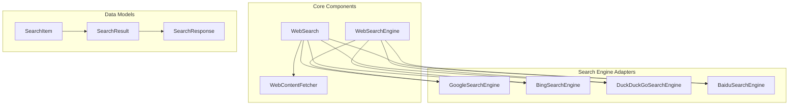
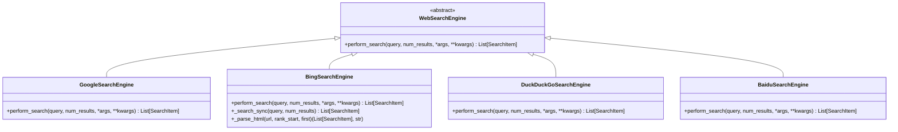
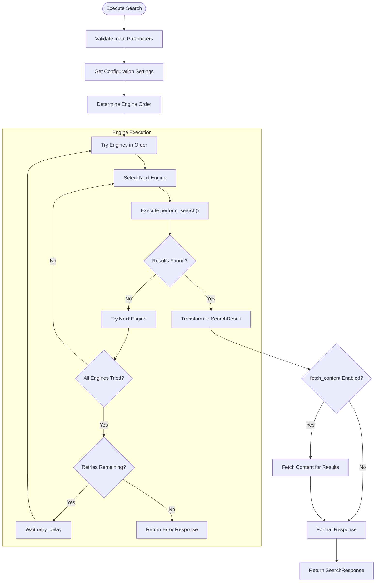
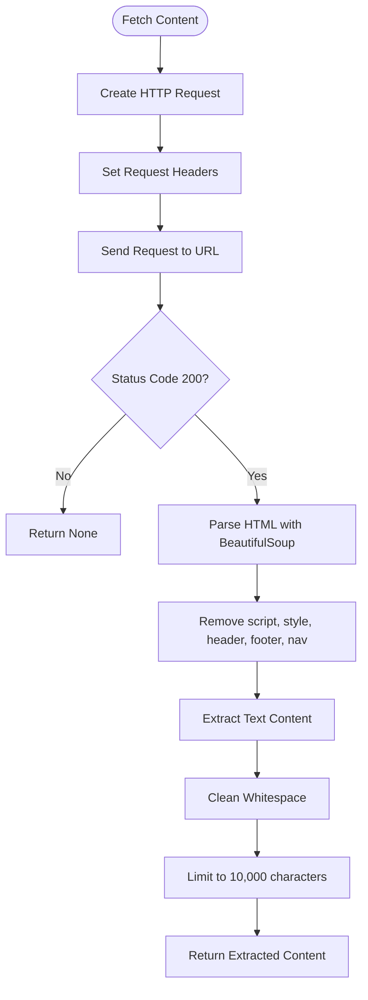
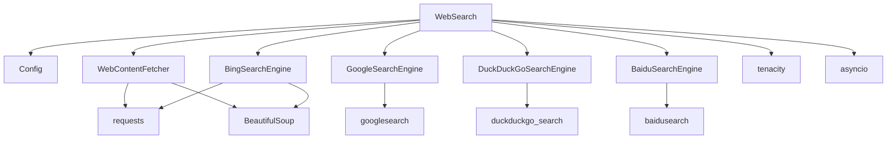

# Web Search

<cite>
**Referenced Files in This Document**   
- [web_search.py](file://app/tool/web_search.py)
- [base.py](file://app/tool/search/base.py)
- [google_search.py](file://app/tool/search/google_search.py)
- [bing_search.py](file://app/tool/search/bing_search.py)
- [duckduckgo_search.py](file://app/tool/search/duckduckgo_search.py)
- [baidu_search.py](file://app/tool/search/baidu_search.py)
- [config.py](file://app/config.py)
</cite>

## Table of Contents
1. [Introduction](#introduction)
2. [Project Structure](#project-structure)
3. [Core Components](#core-components)
4. [Architecture Overview](#architecture-overview)
5. [Detailed Component Analysis](#detailed-component-analysis)
6. [Dependency Analysis](#dependency-analysis)
7. [Performance Considerations](#performance-considerations)
8. [Troubleshooting Guide](#troubleshooting-guide)
9. [Conclusion](#conclusion)

## Introduction
The OpenManus web search functionality provides a multi-engine search capability that supports Google, Bing, DuckDuckGo, and Baidu. This system abstracts the differences between search engines through a unified interface, allowing consistent result formatting and simplified integration. The implementation includes robust error handling, fallback strategies, and content fetching capabilities for deeper analysis of search results. The system is configured through a flexible configuration system that allows users to specify preferred search engines, API keys, and regional settings.

## Project Structure
The web search functionality is organized within the `app/tool/search/` directory, which contains dedicated modules for each search engine adapter. The main `web_search.py` file in the `app/tool/` directory serves as the entry point and orchestrator for search operations. The architecture follows a modular design with clear separation between the core search interface, individual engine implementations, and utility components for content extraction.



**Diagram sources**
- [web_search.py](file://app/tool/web_search.py)
- [base.py](file://app/tool/search/base.py)

**Section sources**
- [web_search.py](file://app/tool/web_search.py)
- [base.py](file://app/tool/search/base.py)

## Core Components
The web search system consists of several core components that work together to provide a seamless search experience. The `WebSearch` class serves as the main interface, coordinating search operations across multiple engines. The `SearchResult` and `SearchResponse` models provide structured data representations of search outcomes. The `WebContentFetcher` utility enables content extraction from search result pages for deeper analysis. Each search engine is implemented as a separate adapter that conforms to the `WebSearchEngine` interface, ensuring consistent behavior across different providers.

**Section sources**
- [web_search.py](file://app/tool/web_search.py#L21-L152)
- [base.py](file://app/tool/search/base.py#L1-L40)

## Architecture Overview
The web search architecture follows a strategy pattern where the `WebSearch` tool delegates actual search operations to specific engine implementations. The system uses a configurable fallback mechanism that attempts searches in a specified order, with automatic retries when all engines initially fail. Results are normalized into a consistent format regardless of the source engine. The architecture supports content fetching through a separate asynchronous process that retrieves and processes webpage content for selected results.

```mermaid
sequenceDiagram
participant User as "User/Application"
participant WebSearch as "WebSearch Tool"
participant Engine as "Search Engine"
participant ContentFetcher as "WebContentFetcher"
participant Page as "Web Page"
User->>WebSearch : execute(query, num_results, fetch_content)
WebSearch->>WebSearch : _get_engine_order()
loop For each engine in order
WebSearch->>Engine : perform_search(query, params)
alt Search successful
Engine-->>WebSearch : SearchItem list
break Success
else Search failed
WebSearch->>WebSearch : Try next engine
end
end
alt fetch_content is True
WebSearch->>ContentFetcher : fetch_content(result.url)
ContentFetcher->>Page : HTTP GET request
Page-->>ContentFetcher : HTML content
ContentFetcher-->>WebSearch : Extracted text
WebSearch->>WebSearch : Attach content to result
end
WebSearch-->>User : SearchResponse with results
```

**Diagram sources**
- [web_search.py](file://app/tool/web_search.py#L155-L407)
- [base.py](file://app/tool/search/base.py#L1-L40)

## Detailed Component Analysis
The web search system is composed of several key components that work together to provide a robust multi-engine search capability. Each component plays a specific role in the search process, from query execution to result presentation.

### WebSearch Tool Implementation
The `WebSearch` class is the primary interface for executing web searches. It implements the `BaseTool` interface and provides a standardized method for searching across multiple engines. The tool handles configuration parameters, manages the search engine selection process, and coordinates fallback strategies when primary engines fail.

#### For API/Service Components:
```mermaid
sequenceDiagram
participant Client as "Client"
participant WebSearch as "WebSearch"
participant Config as "Config"
participant Engine as "Search Engine"
Client->>WebSearch : execute(query, params)
WebSearch->>Config : Get search configuration
WebSearch->>WebSearch : Determine engine order
loop For each engine
WebSearch->>Engine : perform_search()
alt Success
Engine-->>WebSearch : Search results
break Return results
else Failure
WebSearch->>WebSearch : Log failure, try next
end
end
alt fetch_content enabled
WebSearch->>WebSearch : Fetch content for results
end
WebSearch-->>Client : SearchResponse
```

**Diagram sources**
- [web_search.py](file://app/tool/web_search.py#L155-L407)

**Section sources**
- [web_search.py](file://app/tool/web_search.py#L155-L407)

### Search Engine Adapters
Each search engine is implemented as a separate adapter that inherits from the `WebSearchEngine` base class. These adapters handle the specific API integration patterns, request formatting, and result parsing for their respective search engines. The adapters normalize results into the common `SearchItem` format, which is then transformed into the final `SearchResult` model.

#### For Object-Oriented Components:


**Diagram sources**
- [base.py](file://app/tool/search/base.py#L1-L40)
- [google_search.py](file://app/tool/search/google_search.py#L1-L33)
- [bing_search.py](file://app/tool/search/bing_search.py#L1-L144)
- [duckduckgo_search.py](file://app/tool/search/duckduckgo_search.py#L1-L57)
- [baidu_search.py](file://app/tool/search/baidu_search.py#L1-L54)

**Section sources**
- [base.py](file://app/tool/search/base.py#L1-L40)
- [google_search.py](file://app/tool/search/google_search.py#L1-L33)
- [bing_search.py](file://app/tool/search/bing_search.py#L1-L144)
- [duckduckgo_search.py](file://app/tool/search/duckduckgo_search.py#L1-L57)
- [baidu_search.py](file://app/tool/search/baidu_search.py#L1-L54)

### Unified Search Interface
The unified search interface abstracts the differences between search engines through a common data model and execution pattern. The `SearchResult` class provides a consistent structure for search results regardless of the source engine, including position, URL, title, description, and source identification. The interface handles parameter normalization, ensuring that language and country settings are applied consistently across engines.

#### For Complex Logic Components:


**Diagram sources**
- [web_search.py](file://app/tool/web_search.py#L155-L407)

**Section sources**
- [web_search.py](file://app/tool/web_search.py#L155-L407)

### Content Fetching Mechanism
The content fetching capability allows the system to retrieve full webpage content from search results for deeper analysis. The `WebContentFetcher` class handles HTTP requests, HTML parsing, and content extraction, removing non-essential elements like scripts, styles, headers, and footers. The fetched content is cleaned and limited to 10,000 characters to prevent excessive resource usage.

#### For Complex Logic Components:


**Diagram sources**
- [web_search.py](file://app/tool/web_search.py#L105-L152)

**Section sources**
- [web_search.py](file://app/tool/web_search.py#L105-L152)

## Dependency Analysis
The web search system has a well-defined dependency structure that enables modularity and maintainability. The core dependencies include the configuration system, HTTP client libraries, HTML parsing tools, and search engine APIs. The system uses asynchronous execution to handle I/O operations efficiently, with proper error handling and retry mechanisms.



**Diagram sources**
- [web_search.py](file://app/tool/web_search.py)
- [config.py](file://app/config.py)
- [base.py](file://app/tool/search/base.py)

**Section sources**
- [web_search.py](file://app/tool/web_search.py)
- [config.py](file://app/config.py)

## Performance Considerations
The web search system is designed with performance in mind, using asynchronous operations to handle multiple search requests and content fetching efficiently. The system implements retry mechanisms with exponential backoff to handle temporary failures without overwhelming search engines with rapid retry requests. Content fetching is performed concurrently for multiple results to minimize overall execution time. The system also includes rate limiting considerations through configurable retry delays and maximum retry counts.

The choice of search engine can impact performance, with API-based engines like Google typically being faster than web scraping approaches like Bing. The fallback mechanism ensures that search operations can complete even if the preferred engine is temporarily unavailable, at the cost of potentially increased latency. Content fetching adds significant time to search operations, especially when retrieving content from multiple results, so it should be used judiciously based on the specific use case requirements.

## Troubleshooting Guide
Common issues with the web search functionality typically fall into three categories: API rate limits, blocked requests, and parsing errors. For rate limits, the system automatically implements retries with configurable delays, but persistent issues may require switching to a different primary engine or adjusting the retry configuration. Blocked requests, particularly from engines that employ anti-bot measures, can often be mitigated by ensuring appropriate user agent headers and considering the use of proxy configurations if available.

Parsing errors may occur when search engine result page structures change, requiring updates to the parsing logic in the affected engine adapter. The system logs warnings for parsing failures, which can help identify when specific engines are experiencing issues. For content fetching problems, network connectivity issues, firewall restrictions, or website anti-scraping measures may prevent successful content retrieval. In such cases, examining the specific error messages and considering alternative content sources or extraction methods may be necessary.

Configuration issues are another common source of problems, particularly when search engine preferences or API keys are not properly set. Ensuring that the configuration file is correctly formatted and contains valid settings for the desired search engines is essential for reliable operation. Monitoring system logs can provide valuable insights into the specific nature of any issues that arise during search operations.

## Conclusion
The OpenManus web search functionality provides a comprehensive multi-engine search capability with robust error handling, flexible configuration, and content fetching features. The system's modular architecture allows for easy extension with additional search engines and provides a consistent interface for applications regardless of the underlying search provider. The implementation demonstrates thoughtful consideration of reliability, performance, and usability, making it a powerful tool for research and information gathering tasks. By abstracting the complexities of individual search engine APIs and providing a unified interface, the system enables developers to focus on their core application logic while leveraging the strengths of multiple search providers.