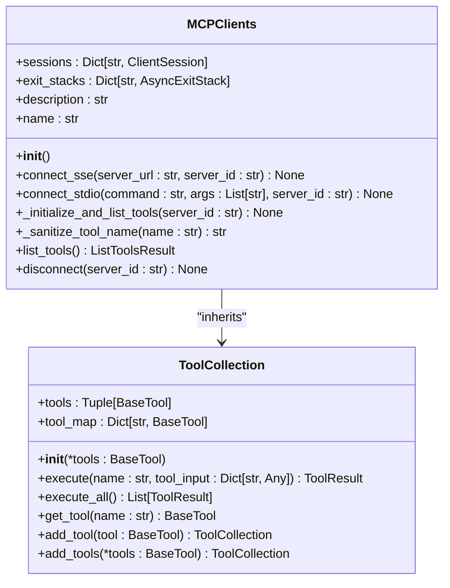
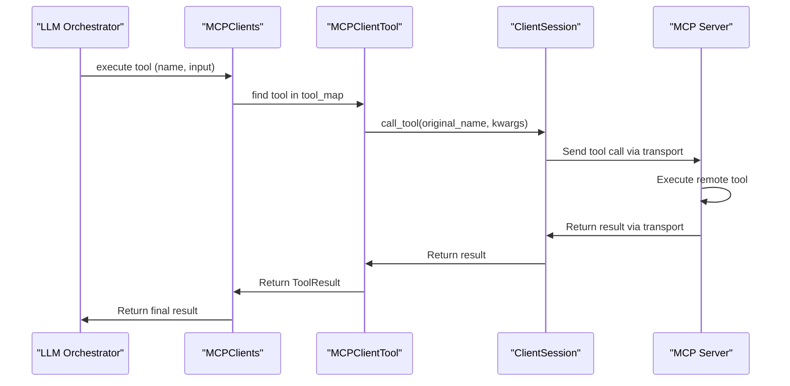
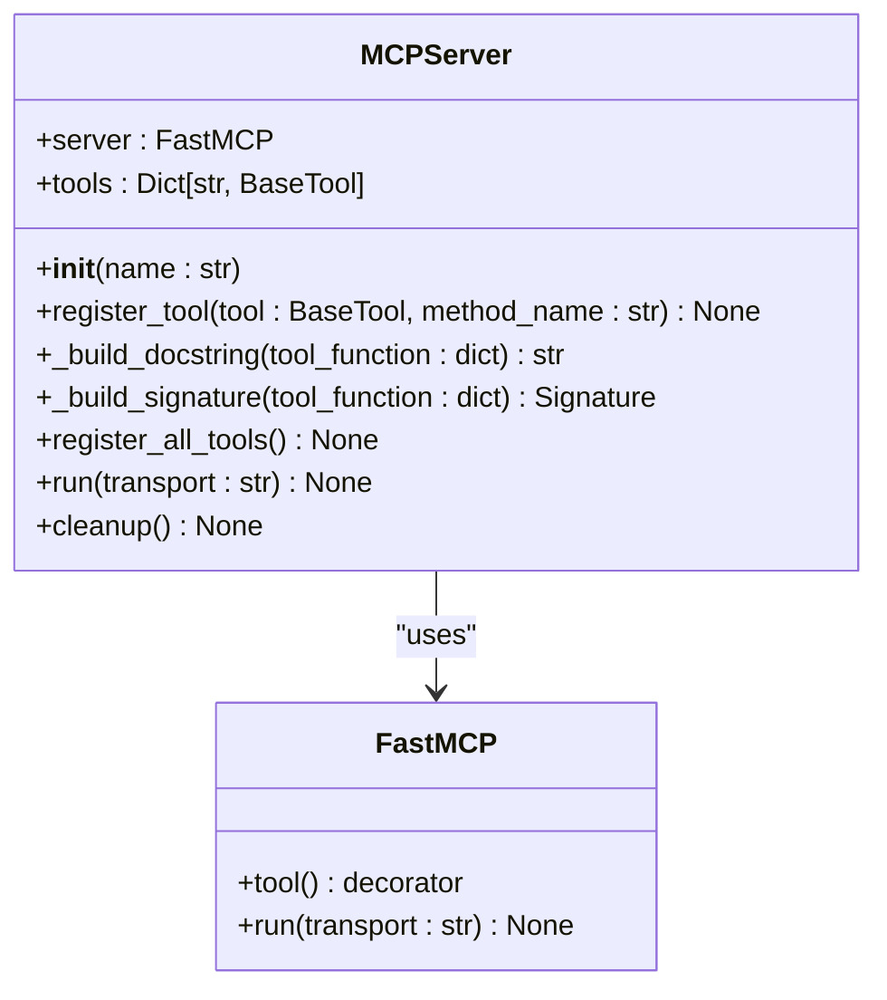
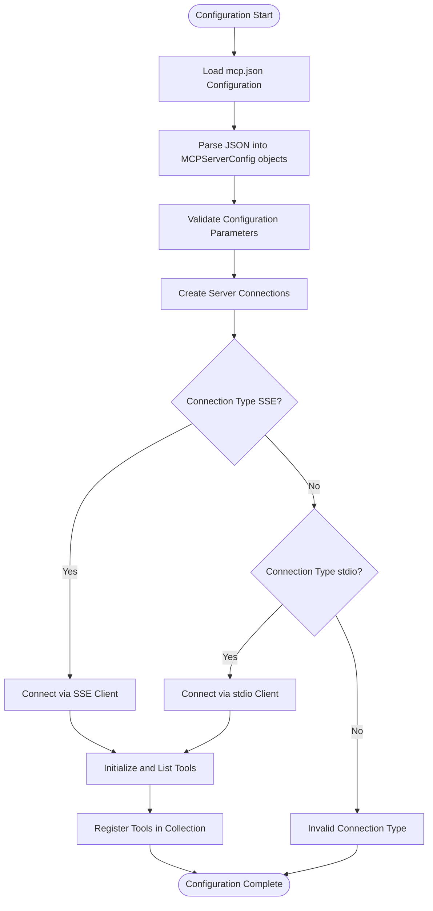
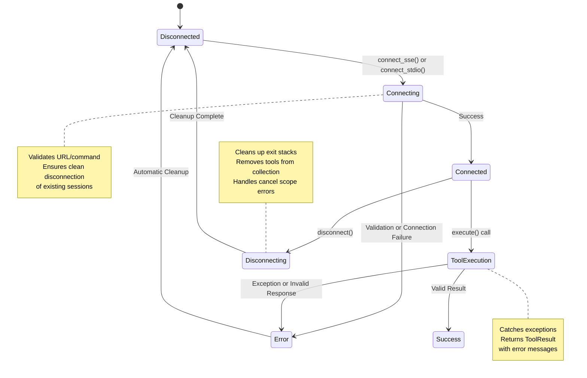

# MCP Tools

<cite>
**Referenced Files in This Document**   
- [app/tool/mcp.py](file://app/tool/mcp.py)
- [app/mcp/server.py](file://app/mcp/server.py)
- [config/mcp.example.json](file://config/mcp.example.json)
- [app/agent/mcp.py](file://app/agent/mcp.py)
- [app/config.py](file://app/config.py)
</cite>

## Table of Contents
1. [Introduction](#introduction)
2. [MCPClients Class and Connection Management](#mcpclients-class-and-connection-management)
3. [MCPClientTool Implementation](#mcpclienttool-implementation)
4. [Server-Side Tool Registration](#server-side-tool-registration)
5. [Configuration and Discovery Mechanism](#configuration-and-discovery-mechanism)
6. [Integration with ToolCollection System](#integration-with-toolcollection-system)
7. [Security, Error Handling, and Timeout Management](#security-error-handling-and-timeout-management)

## Introduction
The Model Context Protocol (MCP) in OpenManus enables agents to access remote tools and services through standardized interfaces. This architecture allows for dynamic tool discovery, bidirectional communication, and seamless integration of remote capabilities with local tooling. The MCP system supports multiple transport mechanisms including Server-Sent Events (SSE) and stdio, enabling flexible deployment scenarios from local processes to networked services.

## MCPClients Class and Connection Management

The MCPClients class serves as the central component for managing connections to MCP servers and their exposed tools. As a subclass of ToolCollection, it maintains a registry of available tools from multiple MCP servers and provides methods for establishing and terminating connections.

The class manages two key dictionaries: `sessions` which stores active ClientSession objects for each server, and `exit_stacks` which manages asynchronous context managers for proper resource cleanup. When connecting to an MCP server, the class ensures clean disconnection of any existing session before establishing a new connection.

Two primary connection methods are provided:
- `connect_sse()` for network-based connections using Server-Sent Events
- `connect_stdio()` for local process-based connections using standard input/output streams

Both methods utilize AsyncExitStack to manage the lifecycle of the connection resources, ensuring proper cleanup even in error conditions. After establishing a connection, the `_initialize_and_list_tools()` method is called to discover available tools on the server and create corresponding local proxies.



**Diagram sources**
- [app/tool/mcp.py](file://app/tool/mcp.py#L36-L193)
- [app/tool/tool_collection.py](file://app/tool/tool_collection.py#L8-L70)

**Section sources**
- [app/tool/mcp.py](file://app/tool/mcp.py#L36-L193)

## MCPClientTool Implementation

The MCPClientTool class represents a proxy for remote tools available on MCP servers. Each instance acts as a local representation of a remote tool, handling the bidirectional communication required for tool execution.

Key attributes of MCPClientTool include:
- `session`: Reference to the ClientSession for communicating with the MCP server
- `server_id`: Identifier for the server hosting the tool
- `original_name`: The original name of the tool on the remote server

The execute() method implements the core functionality, making remote procedure calls to the MCP server through the session object. It handles error propagation by catching exceptions and returning appropriate ToolResult objects with error messages. The method also processes the response content, extracting text from TextContent items in the result.

When tools are discovered on a remote server, they are instantiated with modified names following the pattern "mcp_{server_id}_{original_name}" to ensure uniqueness across multiple servers. The _sanitize_tool_name() method ensures that generated tool names conform to naming requirements by replacing invalid characters, removing consecutive underscores, and truncating to 64 characters if necessary.



**Diagram sources**
- [app/tool/mcp.py](file://app/tool/mcp.py#L13-L33)
- [app/tool/mcp.py](file://app/tool/mcp.py#L20-L33)

**Section sources**
- [app/tool/mcp.py](file://app/tool/mcp.py#L13-L33)

## Server-Side Tool Registration

The MCPServer class in app/mcp/server.py implements the server-side component of the MCP system, responsible for registering and exposing tools to clients. The server is built on the FastMCP framework and provides a structured approach to tool registration and management.

During initialization, the server creates instances of standard tools including:
- bash: Command execution
- browser: Web browsing capabilities
- editor: Text editing operations
- terminate: Agent termination signaling

The register_tool() method handles the registration of tools with comprehensive parameter validation and documentation. It creates an async wrapper function that logs execution details, calls the actual tool execute() method, and formats the result appropriately. The method also constructs docstrings and function signatures from tool metadata, providing rich documentation for clients.

The _build_signature() method maps JSON Schema types to Python type annotations, ensuring proper type information is available to clients. This includes mapping "string" to str, "integer" to int, "number" to float, and other standard type conversions. The server also registers a cleanup function via atexit to ensure proper resource cleanup when the process terminates.



**Diagram sources**
- [app/mcp/server.py](file://app/mcp/server.py#L0-L180)

**Section sources**
- [app/mcp/server.py](file://app/mcp/server.py#L0-L180)

## Configuration and Discovery Mechanism

MCP servers are configured through a JSON configuration file (mcp.json) that follows the structure defined in mcp.example.json. The configuration supports multiple servers with different connection types (SSE or stdio) and associated parameters.

The discovery mechanism operates through periodic polling and dynamic updates. The MCPAgent class implements a _refresh_tools() method that periodically queries connected servers for their available tools and detects changes in the tool set. This method compares current tool schemas with previously stored ones to identify:
- Added tools: New tools that have become available
- Removed tools: Tools that are no longer accessible
- Changed tools: Tools whose parameter schemas have been modified

When changes are detected, the agent updates its internal tool_schemas dictionary and notifies the user through system messages added to the conversation memory. This dynamic discovery allows the system to adapt to changing tool availability during agent execution.

The configuration loading process is handled by the MCPSettings class in app/config.py, which loads server configurations from JSON files and validates them against the MCPServerConfig schema. The configuration supports both SSE connections (with URL specification) and stdio connections (with command and arguments).



**Diagram sources**
- [config/mcp.example.json](file://config/mcp.example.json#L0-L8)
- [app/config.py](file://app/config.py#L126-L159)

**Section sources**
- [config/mcp.example.json](file://config/mcp.example.json#L0-L8)
- [app/config.py](file://app/config.py#L126-L159)

## Integration with ToolCollection System

The MCP system integrates seamlessly with OpenManus's ToolCollection framework, allowing remote tools to appear alongside local tools to the LLM orchestrator. The MCPClients class inherits from ToolCollection, enabling it to be used interchangeably with other tool collections in the system.

Agents such as MCPAgent and Manus initialize their available_tools property with the MCPClients instance, making all connected MCP tools available for selection by the LLM. The to_params() method inherited from ToolCollection converts the tool collection into the format expected by the LLM for function calling, including name, description, and parameter schemas.

The integration supports multiple MCP servers simultaneously, with tools from different servers being distinguished by their server_id prefix. This allows agents to leverage capabilities from multiple specialized servers within a single workflow. The system also handles tool name conflicts by prefixing tool names with the server identifier and sanitizing the resulting names to ensure compatibility.

Agents implement methods like connect_mcp_server() and disconnect_mcp_server() to dynamically manage MCP server connections and update the available tools collection accordingly. This dynamic management enables scenarios where servers can be connected or disconnected during agent execution based on task requirements.

```mermaid
erDiagram
AGENT ||--o{ TOOL_COLLECTION : "has"
TOOL_COLLECTION ||--o{ TOOL : "contains"
MCP_CLIENTS }|-- TOOL_COLLECTION : "extends"
MCP_CLIENTS ||--o{ MCP_SERVER : "connects to"
MCP_SERVER ||--o{ TOOL : "exposes"
LOCAL_TOOLS }|-- TOOL_COLLECTION : "extends"
class AGENT {
+available_tools: ToolCollection
+mcp_clients: MCPClients
}
class TOOL_COLLECTION {
+tools: Tuple[BaseTool]
+tool_map: Dict[str, BaseTool]
}
class MCP_CLIENTS {
+sessions: Dict[str, ClientSession]
+exit_stacks: Dict[str, AsyncExitStack]
}
class MCP_SERVER {
+server: FastMCP
+tools: Dict[str, BaseTool]
}
class TOOL {
+name: str
+description: str
+parameters: dict
}
```

**Diagram sources**
- [app/agent/mcp.py](file://app/agent/mcp.py#L0-L185)
- [app/agent/manus.py](file://app/agent/manus.py#L30-L30)
- [app/tool/tool_collection.py](file://app/tool/tool_collection.py#L8-L70)

**Section sources**
- [app/agent/mcp.py](file://app/agent/mcp.py#L0-L185)

## Security, Error Handling, and Timeout Management

The MCP system implements comprehensive error handling and security considerations for distributed tool execution. Connection management includes validation of required parameters (URL for SSE, command for stdio) and clean disconnection procedures that remove associated tools from the collection.

Error propagation is handled through the ToolResult class, which captures both successful outputs and error conditions. The MCPClientTool execute() method catches exceptions during remote calls and returns appropriate error messages, allowing the LLM orchestrator to understand and respond to failures. The disconnect() method includes specific handling for "cancel scope" errors, which are logged as warnings rather than propagated as exceptions.

Timeout handling is implemented at multiple levels. While the MCPClientTool itself doesn't implement timeouts, the underlying transport mechanisms and remote tool execution may have their own timeout configurations. The system's periodic tool refresh (controlled by _refresh_tools_interval) also serves as a form of liveness check, detecting when MCP services become unavailable.

Security considerations include input validation through JSON Schema definitions, proper resource cleanup via AsyncExitStack, and isolation of remote tool execution on the server side. The system also provides mechanisms for graceful degradation when tools become unavailable, allowing agents to adapt their strategies based on current tool availability.



**Diagram sources**
- [app/tool/mcp.py](file://app/tool/mcp.py#L154-L193)
- [app/tool/mcp.py](file://app/tool/mcp.py#L20-L33)

**Section sources**
- [app/tool/mcp.py](file://app/tool/mcp.py#L154-L193)