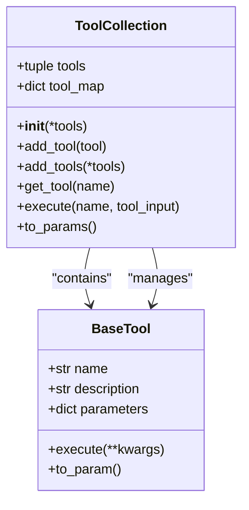
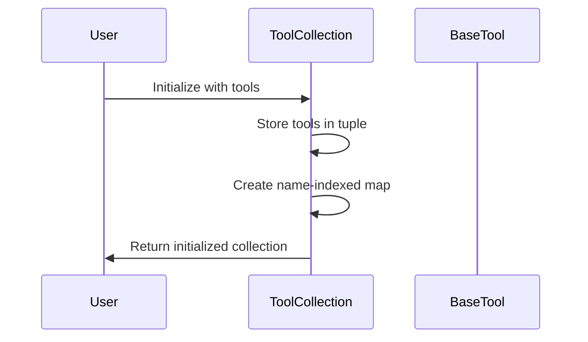
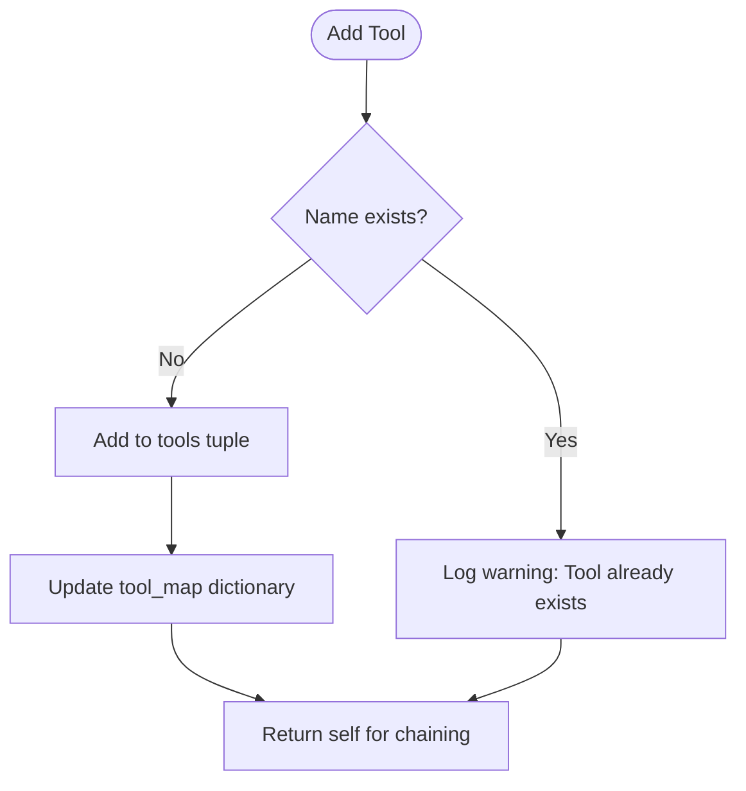
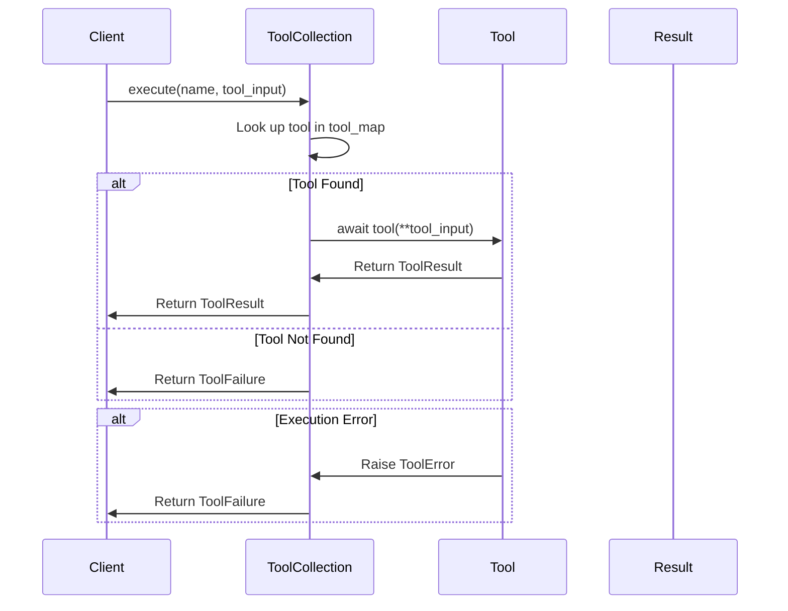
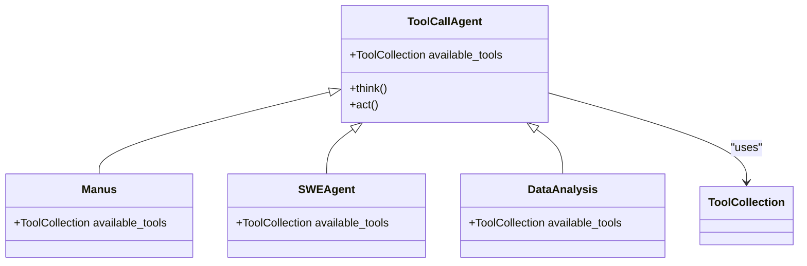
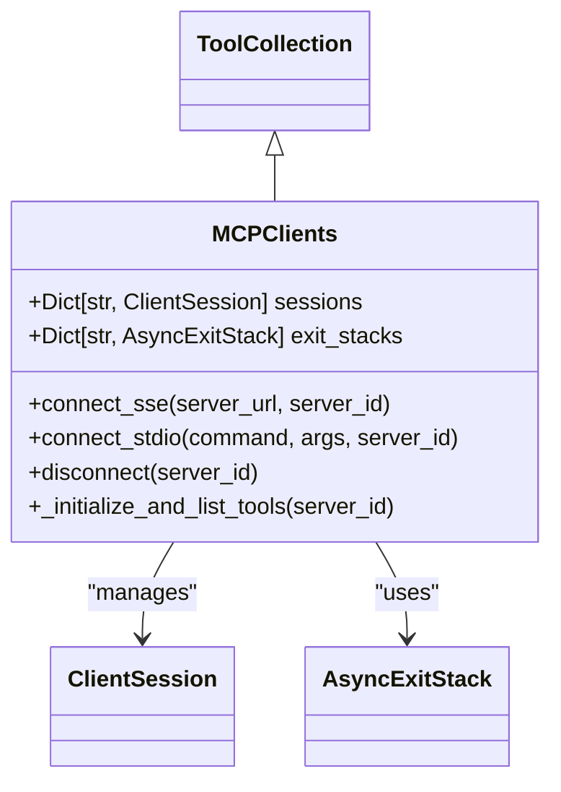

# Tool Collection Management

<cite>
**Referenced Files in This Document**   
- [tool_collection.py](file://app/tool/tool_collection.py)
- [base.py](file://app/tool/base.py)
- [manus.py](file://app/agent/manus.py)
- [mcp.py](file://app/tool/mcp.py)
- [toolcall.py](file://app/agent/toolcall.py)
- [swe.py](file://app/agent/swe.py)
- [data_analysis.py](file://app/agent/data_analysis.py)
- [browser.py](file://app/agent/browser.py)
</cite>

## Table of Contents
1. [Introduction](#introduction)
2. [Core Architecture](#core-architecture)
3. [Initialization and Composition](#initialization-and-composition)
4. [Tool Registration Mechanisms](#tool-registration-mechanisms)
5. [Execution Workflow](#execution-workflow)
6. [LLM Integration and Function Calling](#llm-integration-and-function-calling)
7. [Agent Integration Patterns](#agent-integration-patterns)
8. [Specialized Tool Collection: MCPClients](#specialized-tool-collection-mcpcients)
9. [Conclusion](#conclusion)

## Introduction

The ToolCollection class serves as the central registry for managing available tools in the OpenManus framework. It provides a unified interface for tool registration, retrieval, and execution, acting as the bridge between agents and their functional capabilities. This document comprehensively explains the ToolCollection's role in orchestrating both local and remote tools, detailing its initialization process, registration methods, execution workflow, and integration patterns across the system.

**Section sources**
- [tool_collection.py](file://app/tool/tool_collection.py#L8-L70)

## Core Architecture

The ToolCollection class implements a dual-storage architecture using two complementary data structures: a tuple for ordered tool storage and a dictionary for O(1) lookups. This design ensures both efficient iteration and rapid name-based access. The class inherits from Pydantic's BaseModel with arbitrary_types_allowed configuration, enabling the storage of complex tool objects while maintaining data validation capabilities.

**Diagram sources**
- [tool_collection.py](file://app/tool/tool_collection.py#L8-L70)
- [base.py](file://app/tool/base.py#L77-L172)

**Section sources**
- [tool_collection.py](file://app/tool/tool_collection.py#L8-L70)
- [base.py](file://app/tool/base.py#L77-L172)

## Initialization and Composition

The ToolCollection is initialized with a variable number of BaseTool instances passed as arguments. During initialization, it creates both a tuple of tools and a name-indexed dictionary (tool_map) for O(1) lookups. This dual structure allows for efficient iteration through the tools tuple while enabling rapid name-based access through the tool_map dictionary. The initialization process ensures that all provided tools are immediately available for execution and LLM integration.

**Diagram sources**
- [tool_collection.py](file://app/tool/tool_collection.py#L14-L16)

**Section sources**
- [tool_collection.py](file://app/tool/tool_collection.py#L14-L16)

## Tool Registration Mechanisms

The ToolCollection provides two complementary methods for dynamic tool registration: add_tool for single tool addition and add_tools for batch registration. Both methods implement name conflict detection, preventing duplicate tool registration by checking the tool_map dictionary before insertion. When a duplicate name is detected, the system logs a warning and skips the addition, maintaining collection integrity. The add_tools method internally delegates to add_tool, ensuring consistent behavior and error handling across both interfaces.

**Diagram sources**
- [tool_collection.py](file://app/tool/tool_collection.py#L50-L61)
- [tool_collection.py](file://app/tool/tool_collection.py#L63-L70)

**Section sources**
- [tool_collection.py](file://app/tool/tool_collection.py#L50-L70)

## Execution Workflow

The execute method implements a robust four-step workflow for tool invocation: name-based lookup, input validation, asynchronous execution, and error handling. It first performs a dictionary lookup in tool_map to find the requested tool, returning a ToolFailure response if the tool is not found. Upon successful lookup, it invokes the tool asynchronously with the provided input parameters. The method implements comprehensive error handling, catching ToolError exceptions and converting them to standardized ToolFailure responses, ensuring consistent error reporting across the system.

**Diagram sources**
- [tool_collection.py](file://app/tool/tool_collection.py#L24-L34)

**Section sources**
- [tool_collection.py](file://app/tool/tool_collection.py#L24-L34)

## LLM Integration and Function Calling

The to_params method enables seamless integration with LLM orchestrators by converting the tool collection into an OpenAI-compatible function calling format. It iterates through all registered tools, calling each tool's to_param method to extract metadata including name, description, and parameters schema. This standardized format allows LLMs to understand and select appropriate tools for task execution. The method returns a list of tool parameter dictionaries that can be directly passed to LLM APIs, facilitating dynamic tool selection and function calling capabilities.

**Diagram sources**
- [tool_collection.py](file://app/tool/tool_collection.py#L21-L22)
- [base.py](file://app/tool/base.py#L148-L159)

**Section sources**
- [tool_collection.py](file://app/tool/tool_collection.py#L21-L22)

## Agent Integration Patterns

Multiple agent classes integrate ToolCollection through their available_tools property, establishing a consistent pattern for tool access across the framework. Agents like Manus, SWEAgent, and DataAnalysis initialize their available_tools with specific tool sets relevant to their domains. The ToolCallAgent serves as a base class that defines the fundamental pattern of using ToolCollection for tool management. This integration enables agents to pass their available_tools.to_params() directly to LLM calls, creating a seamless workflow from tool registration to LLM function calling.

**Diagram sources**
- [toolcall.py](file://app/agent/toolcall.py#L26-L28)
- [manus.py](file://app/agent/manus.py#L33-L41)
- [swe.py](file://app/agent/swe.py#L18-L20)
- [data_analysis.py](file://app/agent/data_analysis.py#L29-L36)
- [browser.py](file://app/agent/browser.py#L104-L106)

**Section sources**
- [toolcall.py](file://app/agent/toolcall.py#L26-L28)
- [manus.py](file://app/agent/manus.py#L33-L41)
- [swe.py](file://app/agent/swe.py#L18-L20)
- [data_analysis.py](file://app/agent/data_analysis.py#L29-L36)
- [browser.py](file://app/agent/browser.py#L104-L106)

## Specialized Tool Collection: MCPClients

The MCPClients class extends ToolCollection to manage remote tools accessed through the Model Context Protocol. It overrides the base initialization to start with an empty tool collection and provides specialized methods (connect_sse, connect_stdio) for establishing connections to MCP servers. Upon connection, it dynamically populates the tool_map with remote tools, prefixing their names with "mcp_serverId_" for uniqueness. The class maintains server sessions and exit stacks, enabling proper resource management and clean disconnection. This specialized collection demonstrates how ToolCollection can be extended to handle complex tool management scenarios while maintaining the core interface.

**Diagram sources**
- [mcp.py](file://app/tool/mcp.py#L36-L193)

**Section sources**
- [mcp.py](file://app/tool/mcp.py#L36-L193)

## Conclusion

The ToolCollection class serves as the foundational component for tool management in OpenManus, providing a robust and flexible registry for both local and remote tools. Its dual-storage architecture enables efficient O(1) lookups while maintaining ordered access, and its comprehensive API supports dynamic tool registration, execution, and LLM integration. The class's design patterns are consistently applied across various agent implementations, ensuring a uniform approach to tool management throughout the framework. By standardizing tool access and execution, ToolCollection enables seamless integration between agents, tools, and LLM orchestrators, forming the backbone of the system's functional capabilities.