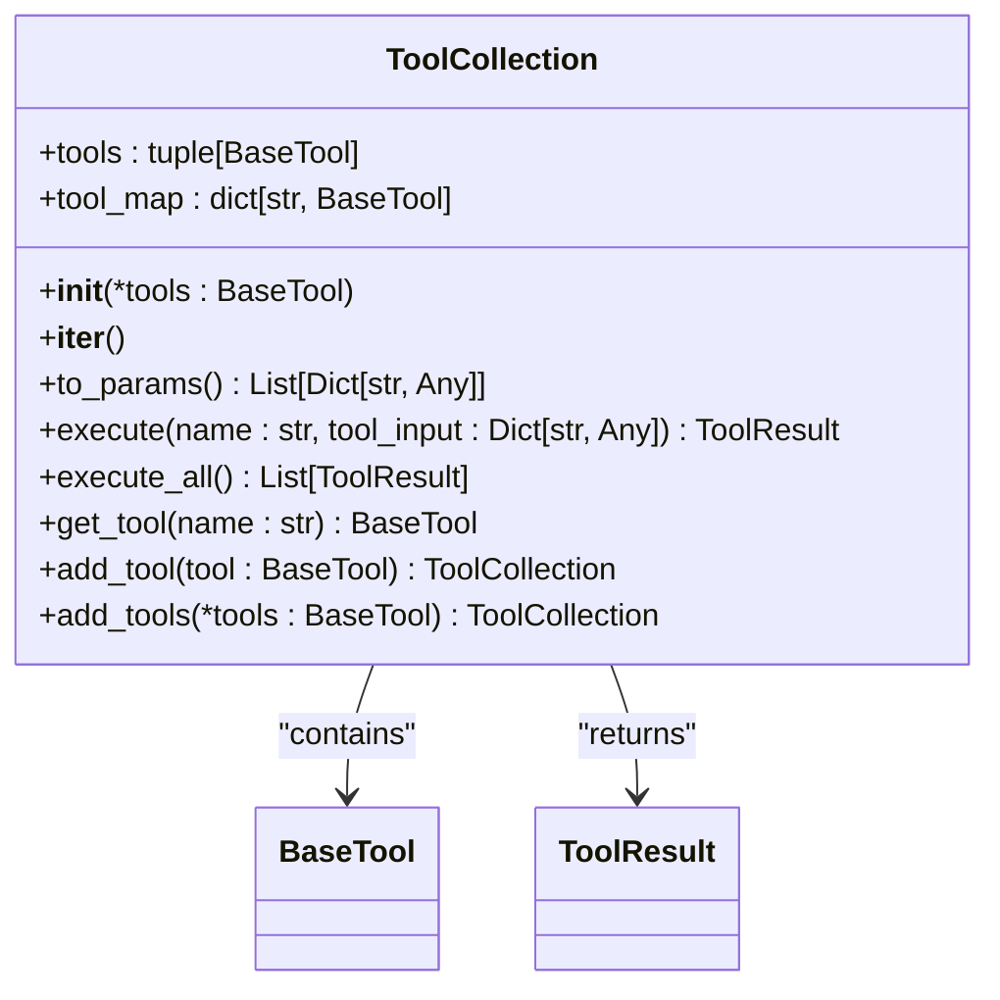
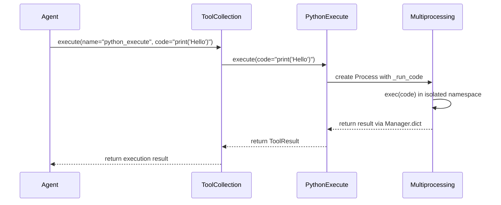
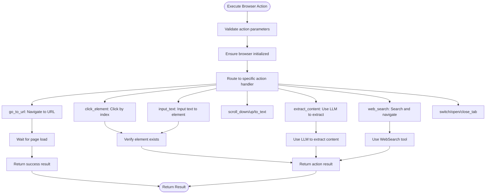
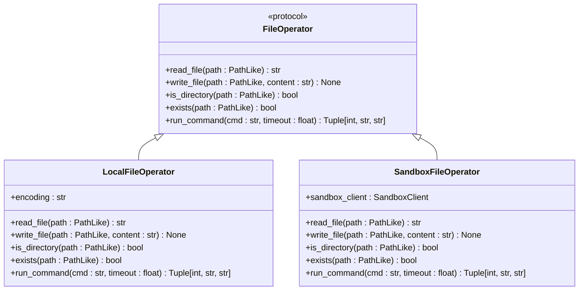
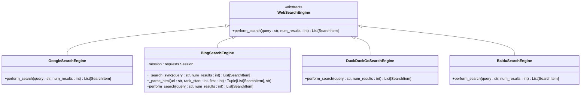
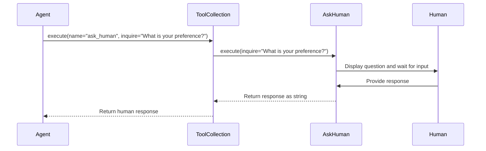
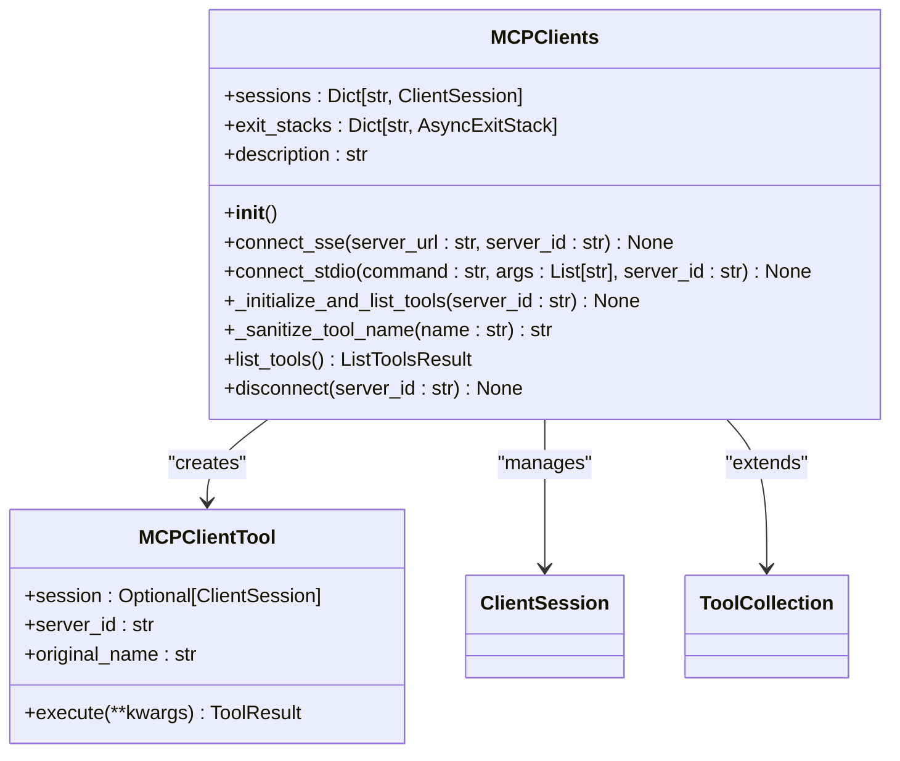
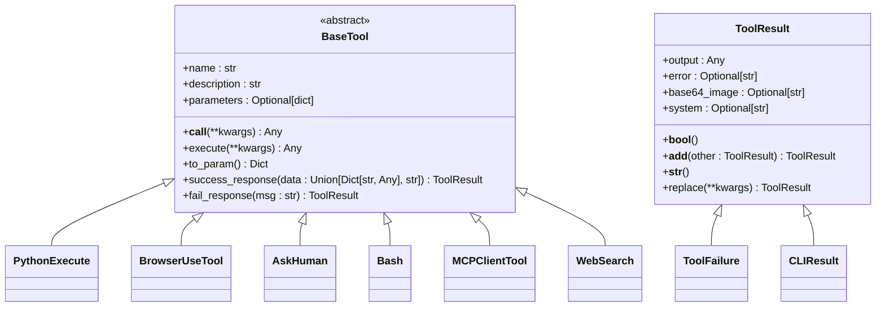
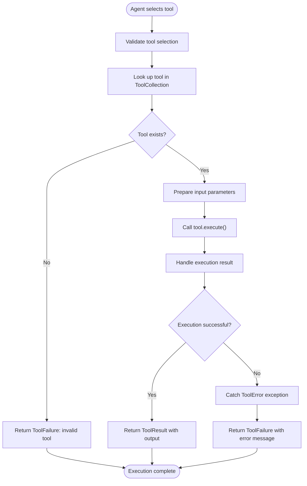

# Tool System

<cite>
**Referenced Files in This Document**   
- [tool_collection.py](file://app/tool/tool_collection.py)
- [base.py](file://app/tool/base.py)
- [python_execute.py](file://app/tool/python_execute.py)
- [browser_use_tool.py](file://app/tool/browser_use_tool.py)
- [mcp.py](file://app/tool/mcp.py)
- [ask_human.py](file://app/tool/ask_human.py)
- [file_operators.py](file://app/tool/file_operators.py)
- [bash.py](file://app/tool/bash.py)
- [web_search.py](file://app/tool/web_search.py)
- [google_search.py](file://app/tool/search/google_search.py)
- [bing_search.py](file://app/tool/search/bing_search.py)
- [duckduckgo_search.py](file://app/tool/search/duckduckgo_search.py)
- [baidu_search.py](file://app/tool/search/baidu_search.py)
</cite>

## Table of Contents
1. [Introduction](#introduction)
2. [ToolCollection Class](#toolcollection-class)
3. [Local Tools](#local-tools)
4. [MCP Tools](#mcp-tools)
5. [Base Tool Class](#base-tool-class)
6. [Tool Implementation Patterns](#tool-implementation-patterns)
7. [Tool Execution Flow](#tool-execution-flow)
8. [Error Handling and Security](#error-handling-and-security)

## Introduction
The OpenManus tool system provides a comprehensive framework for managing and executing various capabilities within an AI agent environment. The system is designed around a modular architecture where tools represent discrete functionalities that agents can leverage to accomplish tasks. This document details the core components of the tool system, including the ToolCollection class for managing available tools, various local tools for executing code, browsing the web, performing file operations, and searching the internet, as well as MCP tools for accessing remote capabilities. The system also defines a base Tool class that enables the creation of custom tools through inheritance.

## ToolCollection Class
The ToolCollection class serves as the central registry and management system for all available tools within the OpenManus framework. It provides methods for adding, retrieving, and executing tools, acting as an intermediary between agents and the actual tool implementations.

**Diagram sources**
- [tool_collection.py](file://app/tool/tool_collection.py#L8-L70)

**Section sources**
- [tool_collection.py](file://app/tool/tool_collection.py#L8-L70)

### Tool Management
The ToolCollection class maintains two primary data structures: a tuple of tools and a dictionary mapping tool names to their instances. This dual structure allows for both ordered iteration and efficient name-based lookups. The class constructor accepts a variable number of tools and initializes both structures accordingly.

### Tool Registration
Tools can be added to a collection either individually through the `add_tool` method or in bulk via `add_tools`. Both methods check for name conflicts before adding a tool, logging a warning and skipping the addition if a tool with the same name already exists in the collection. This prevents accidental overwrites and maintains tool integrity.

### Tool Execution
The `execute` method is the primary interface for running tools. It takes a tool name and input parameters, looks up the corresponding tool in the collection, and invokes it asynchronously. If the tool is not found, it returns a ToolFailure result. The method also handles ToolError exceptions, converting them into appropriate failure results. For scenarios requiring the execution of all tools in the collection, the `execute_all` method runs each tool sequentially and collects their results.

## Local Tools
The OpenManus system includes a variety of local tools that provide essential capabilities for agent operations. These tools are implemented as Python classes that inherit from the BaseTool class and are designed to perform specific functions within the local environment.

### Python Execution with Sandboxing
The PythonExecute tool enables the execution of Python code with safety restrictions and timeout protection. It uses multiprocessing to isolate code execution in a separate process, preventing potentially harmful operations from affecting the main application.

**Diagram sources**
- [python_execute.py](file://app/tool/python_execute.py#L8-L75)

**Section sources**
- [python_execute.py](file://app/tool/python_execute.py#L8-L75)

The tool creates a safe execution environment by copying the built-in functions and executing the code within a restricted global namespace. It captures stdout output, allowing users to see printed results while preventing access to potentially dangerous operations. The execution is wrapped in a multiprocessing process with a configurable timeout, ensuring that infinite loops or long-running operations do not block the agent indefinitely.

### Browser Automation
The BrowserUseTool provides comprehensive browser automation capabilities using the Playwright framework. It allows agents to interact with web pages through various actions such as navigation, clicking elements, inputting text, scrolling, and extracting content.

**Diagram sources**
- [browser_use_tool.py](file://app/tool/browser_use_tool.py#L104-L567)

**Section sources**
- [browser_use_tool.py](file://app/tool/browser_use_tool.py#L104-L567)

The tool maintains a persistent browser session across multiple calls, preserving state such as cookies, local storage, and open tabs. It uses a locking mechanism to ensure thread safety when multiple operations access the browser concurrently. The tool also provides a `get_current_state` method that returns detailed information about the current browser state, including the URL, title, tabs, and interactive elements, along with a screenshot of the current page.

### File Operations
The file operation tools provide capabilities for creating, editing, and viewing files within both local and sandboxed environments. The system implements a protocol-based approach with FileOperator as the interface and separate implementations for local and sandboxed file operations.

**Diagram sources**
- [file_operators.py](file://app/tool/file_operators.py#L8-L158)

**Section sources**
- [file_operators.py](file://app/tool/file_operators.py#L8-L158)

The LocalFileOperator implementation uses Python's pathlib module to perform file operations on the local filesystem, while the SandboxFileOperator delegates operations to a sandbox client, providing isolation for potentially dangerous operations. Both implementations handle errors appropriately, raising ToolError exceptions that are converted to ToolFailure results by the tool collection.

### Web Search
The web search functionality supports multiple search engines including Google, Bing, DuckDuckGo, and Baidu. Each search engine is implemented as a separate class that inherits from a common WebSearchEngine base class, allowing for consistent interfaces while accommodating engine-specific APIs.

**Diagram sources**
- [web_search.py](file://app/tool/web_search.py#L1-L100)
- [google_search.py](file://app/tool/search/google_search.py#L1-L33)
- [bing_search.py](file://app/tool/search/bing_search.py#L1-L144)
- [duckduckgo_search.py](file://app/tool/search/duckduckgo_search.py#L1-L57)
- [baidu_search.py](file://app/tool/search/baidu_search.py#L1-L54)

**Section sources**
- [web_search.py](file://app/tool/web_search.py#L1-L100)
- [google_search.py](file://app/tool/search/google_search.py#L1-L33)
- [bing_search.py](file://app/tool/search/bing_search.py#L1-L144)
- [duckduckgo_search.py](file://app/tool/search/duckduckgo_search.py#L1-L57)
- [baidu_search.py](file://app/tool/search/baidu_search.py#L1-L54)

The WebSearch tool acts as a facade that can route queries to any of the available search engines based on configuration or user preference. It also provides an option to fetch content from search results, enabling agents to not only find relevant pages but also extract information from them.

### Human Interaction
The AskHuman tool facilitates interaction between the agent and human users, allowing the agent to request clarification, confirmation, or additional information when needed. This tool is particularly useful in scenarios where the agent encounters ambiguity or requires subjective judgment.

**Diagram sources**
- [ask_human.py](file://app/tool/ask_human.py#L1-L21)

**Section sources**
- [ask_human.py](file://app/tool/ask_human.py#L1-L21)

The tool implements a simple synchronous interface that displays the inquiry to the user and waits for input. While the current implementation uses standard input/output, this could be extended to support various communication channels such as web interfaces, messaging platforms, or voice assistants.

## MCP Tools
MCP (Model Context Protocol) tools enable agents to access remote capabilities through standardized connections. The MCPClients class extends ToolCollection to manage connections to multiple MCP servers and dynamically register their available tools.

**Diagram sources**
- [mcp.py](file://app/tool/mcp.py#L36-L193)

**Section sources**
- [mcp.py](file://app/tool/mcp.py#L36-L193)

### Connection Protocols
The MCPClients class supports two connection protocols: SSE (Server-Sent Events) and stdio. The `connect_sse` method establishes a connection to an MCP server using HTTP with server-sent events, while `connect_stdio` connects to a server process through standard input/output streams. Both methods ensure clean disconnection before establishing new connections to prevent resource leaks.

### Dynamic Tool Registration
When connecting to an MCP server, the system initializes the session and retrieves the list of available tools through the `list_tools` method. For each tool on the remote server, it creates an MCPClientTool instance with a unique name that includes the server ID, preventing naming conflicts when multiple servers provide tools with the same name. The tool names are sanitized to ensure they conform to naming requirements, replacing invalid characters and truncating to a maximum length.

### Remote Execution
The MCPClientTool class acts as a proxy for remote tools, forwarding execution requests to the appropriate MCP server. When executed, it makes a remote call to the server using the original tool name and returns the result to the caller. The result is processed to extract text content from the response, providing a consistent interface regardless of the underlying server implementation.

## Base Tool Class
The BaseTool class serves as the foundation for all tool implementations in the OpenManus system. It combines Pydantic model validation with an abstract execution interface, providing a standardized structure for tool development.

**Diagram sources**
- [base.py](file://app/tool/base.py#L1-L181)

**Section sources**
- [base.py](file://app/tool/base.py#L1-L181)

### Standardized Interface
All tools inherit from BaseTool and must implement the abstract `execute` method, which defines the core functionality of the tool. The class also provides a `__call__` method that delegates to `execute`, allowing tools to be invoked like functions. This pattern enables a consistent interface across all tools while allowing each tool to define its specific parameters and behavior.

### Result Handling
The BaseTool class includes helper methods for creating standardized results: `success_response` for successful executions and `fail_response` for failures. These methods return ToolResult objects that encapsulate the outcome of tool execution. The ToolResult class itself provides additional functionality, including boolean evaluation, string representation, and the ability to combine multiple results.

### Schema Definition
Tools define their interface through the `parameters` attribute, which follows the OpenAPI schema format. This schema is used to generate function calling parameters in the `to_param` method, making the tool compatible with LLM function calling interfaces. The schema includes the tool name, description, and parameter definitions, allowing agents to understand how to use each tool correctly.

## Tool Implementation Patterns
The OpenManus tool system demonstrates several effective patterns for implementing tools that can be leveraged when creating custom tools.

### PythonExecute Implementation
The PythonExecute tool illustrates how to safely execute untrusted code using process isolation and output capture. Key implementation patterns include:

- Using multiprocessing to isolate code execution in a separate process
- Capturing stdout output while preventing access to return values
- Implementing timeout protection with process termination
- Creating a restricted execution environment with controlled built-ins

These patterns ensure that Python code execution is both safe and predictable, preventing malicious or erroneous code from compromising the system.

### BrowserUseTool Implementation
The BrowserUseTool demonstrates how to create a stateful tool that maintains context across multiple invocations. Key implementation patterns include:

- Using asyncio.Lock to ensure thread safety in asynchronous operations
- Implementing lazy initialization of resources (browser, context)
- Maintaining persistent state (tabs, cookies, navigation history)
- Providing comprehensive error handling for browser operations
- Using field validators to ensure parameter integrity

The tool also shows how to integrate external services (LLM) within a tool to enhance its capabilities, such as using an LLM to extract specific information from web pages based on a goal.

## Tool Execution Flow
The tool execution process follows a consistent flow from selection to result handling, ensuring reliable and predictable behavior across all tools.

**Diagram sources**
- [tool_collection.py](file://app/tool/tool_collection.py#L24-L34)
- [base.py](file://app/tool/base.py#L1-L181)

**Section sources**
- [tool_collection.py](file://app/tool/tool_collection.py#L24-L34)
- [base.py](file://app/tool/base.py#L1-L181)

The flow begins with the agent selecting a tool by name and providing input parameters. The ToolCollection looks up the tool in its registry and, if found, invokes its execute method with the provided parameters. The execution is wrapped in a try-except block to catch ToolError exceptions, which are converted to ToolFailure results. Successful executions return ToolResult objects containing the output, while failures include error messages that can be used for debugging or user feedback.

## Error Handling and Security
The tool system incorporates comprehensive error handling and security measures to ensure reliable operation and protect against potential threats.

### Error Handling
The system uses a hierarchical approach to error handling, with specific exceptions for different error types. ToolError is the base exception for tool-related errors, which is caught by the ToolCollection and converted to ToolFailure results. This separation of concerns allows tools to raise meaningful exceptions while providing a consistent result interface to agents.

Each tool implements specific error handling for its domain, such as:
- PythonExecute catching execution exceptions and timeout errors
- BrowserUseTool handling browser navigation and element interaction errors
- File operators catching filesystem access errors
- MCP tools handling network and remote execution errors

### Security Considerations
The tool system incorporates several security measures to prevent misuse and protect the host environment:

- Code execution isolation through multiprocessing
- Restricted execution environments with limited built-ins
- Timeout protection for long-running operations
- Input validation through Pydantic models
- Sanitization of tool names and parameters
- Sandboxed file operations for potentially dangerous operations
- Rate limiting and access controls for external services

These measures work together to create a secure environment where agents can perform useful tasks without compromising system integrity or security.